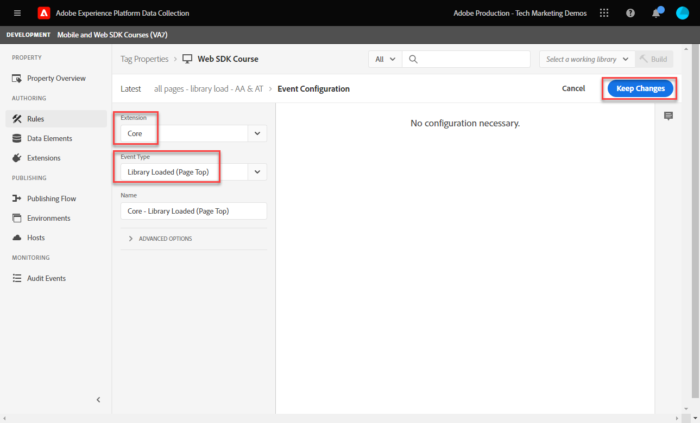
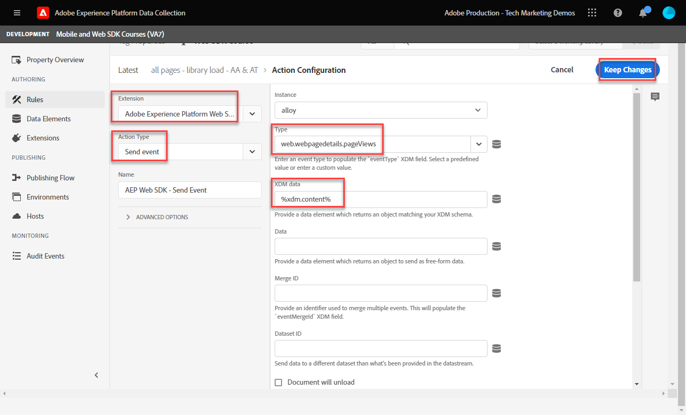

# Crear una regla de etiqueta

Obtenga información sobre cómo enviar un evento a la red perimetral de plataforma con el objeto XDM mediante una regla de etiqueta. Una regla de etiqueta es una combinación de eventos, condiciones y acciones que indica a la propiedad de la etiqueta que haga algo.

>[!NOTE]
>
> Para fines de demostración, los ejercicios de esta lección se basan en el ejemplo utilizado durante la [Creación de elementos de datos](create-data-elements.md) paso; envío de una acción de evento XDM para capturar contenido e identidades de usuarios en la variable [Sitio de demostración de Luma](https://luma.enablementadobe.com/content/luma/us/en.html).

## Objetivos de aprendizaje

Al final de esta lección, debe poder:

* Usar una convención de nombres para administrar reglas dentro de etiquetas
* Creación de una regla de etiqueta para enviar un evento XDM
* Publicación de una regla de etiqueta en una biblioteca de desarrollo

## Requisitos previos

Está familiarizado con las etiquetas de recopilación de datos y con el [Sitio de demostración de Luma](https://luma.enablementadobe.com/content/luma/us/en.html)y debe haber completado las siguientes lecciones anteriores en el tutorial:

* [Configure los permisos](configure-permissions.md)
* [Configuración de un esquema XDM](configure-schemas.md)
* [Configuración de un área de nombres de identidad](configure-identities.md)
* [Configurar un conjunto de datos](configure-datastream.md)
* [Extensión del SDK web instalada en la propiedad tag](install-web-sdk.md)
* [Creación de elementos de datos](create-data-elements.md)

## Convenciones de nomenclatura

Para administrar mejor las reglas en las etiquetas, se recomienda seguir una convención de nombres estándar. Este tutorial utiliza una convención de nomenclatura de tres partes:

* [ubicación] - [evento] - [herramienta]

donde;

1. ubicación es la página o páginas del sitio donde se activa la regla
1. es el déclencheur que activa la señalización
1. herramienta es la aplicación o aplicaciones específicas utilizadas en el paso de acción para esa regla

## Crear regla de etiqueta

En las etiquetas , las reglas se utilizan para ejecutar acciones (llamadas de activación) bajo distintas condiciones. Utilizará esta primera regla para enviar el objeto XDM a la red perimetral mediante el SDK web [!UICONTROL Enviar evento] acción. Más adelante en este tutorial, enviará diferentes versiones del objeto XDM en función del tipo de página en la que se encuentre el visitante. Por ese motivo, utilizará condiciones de regla para excluir esos otros tipos de páginas.

Para crear una regla de etiqueta:

1. Abra la propiedad tag que esté utilizando para este tutorial.
1. Vaya a **[!UICONTROL Reglas]** en la navegación izquierda
1. Seleccione el **[!UICONTROL Crear nueva regla]** botón
   
1. Asigne un nombre a la regla `all pages - library load - AA & AT`.

   >[!NOTE]
   >
   > Adobe Analytics y Target utilizarán esta regla de forma específica en una lección futura, por lo que `AA & AT` se utiliza al final del nombre.

1. En el **[!UICONTROL Eventos]** , seleccione **[!UICONTROL Agregar]**

   
1. Utilice la variable **[!UICONTROL Extensión principal]** y seleccione `Library Loaded (Page Top)` como el **[!UICONTROL Tipo de evento]**.

   Esta configuración significa que la regla se activa cada vez que la biblioteca de etiquetas se carga en una página.
1. Select **[!UICONTROL Conservar cambios]** para volver a la pantalla de regla principal
   
1. En el **[!UICONTROL Condiciones]** seleccione **[!UICONTROL Agregar]** botón
   
1. Select **[!UICONTROL Tipo de lógica]** `Exception`, **[!UICONTROL Extensión]** `Core`y **[!UICONTROL Tipo de condición]** `Path Without Query String`
1. Especifique la ruta de URL `/content/luma/us/en/user/cart.html` en el **[!UICONTROL path es igual que]** y **[!UICONTROL name]** it `Core - cart page`
1. Seleccione **[!UICONTROL Conservar cambios]**

   
1. Añada tres excepciones más para las siguientes rutas URL

   * **`Core - checkout page`** for `/content/luma/us/en/user/checkout.html`
   * **`Core - thank you page`** for `/content/luma/us/en/user/checkout/order/thank-you.html`
   * **`Core - product page`** para `/products/` con el interruptor Regex activado

   

1. En el **[!UICONTROL Acciones]** , seleccione **[!UICONTROL Agregar]**
1. Select **[!UICONTROL SDK web de Adobe Experience Platform]** como el **[!UICONTROL Extensión]**
1. Select **[!UICONTROL Enviar evento]** como el **[!UICONTROL Tipo de acción]**
1. Select **[!UICONTROL web.webpagedetails.pageViews]** como el **[!UICONTROL Tipo]**.

   >[!WARNING]
   >
   > Esta lista desplegable rellena la variable **`xdm.eventType`** en el objeto XDM. Aunque también puede escribir etiquetas de forma libre en este campo, es muy recomendable que **no** ya que tendrá efectos adversos con Platform.

1. Como **[!UICONTROL Datos XDM]**, seleccione `xdm.content` elemento de datos creado en la lección anterior
1. Select **[!UICONTROL Conservar cambios]** para volver a la pantalla de regla principal

   
1. Select **[!UICONTROL Guardar]** para guardar la regla

   

## Publicar la regla en una biblioteca

A continuación, publique la regla en su entorno de desarrollo para que podamos verificar que funciona.

Para crear una biblioteca:

1. Vaya a **[!UICONTROL Flujo de publicación]** en la navegación izquierda
1. Select **[!UICONTROL Agregar biblioteca]**

   
1. Para la variable **[!UICONTROL Nombre]**, introduzca `Luma Web SDK Tutorial`
1. Para la variable **[!UICONTROL Entorno]**, seleccione `Development`
1. Select  **[!UICONTROL Agregar todos los recursos modificados]**

   >[!NOTE]
   >
   >    Además de la extensión web SDK de Adobe Experience Platform y el `all pages - library load - AA & AT` , verá los componentes de etiqueta creados en lecciones anteriores. La extensión principal contiene el JavaScript base requerido por todas las propiedades de etiquetas web.

1. Select **[!UICONTROL Guardar y generar para desarrollo]**

   

La biblioteca puede tardar unos minutos en crearse y, cuando se completa, muestra un punto verde a la izquierda del nombre de la biblioteca:

Como puede ver en la sección [!UICONTROL Flujo de publicación] , hay mucho más en el proceso de publicación que está fuera del alcance de este tutorial. Este tutorial solo utiliza una biblioteca en su entorno de desarrollo.

Ahora está listo para validar los datos en la solicitud mediante Adobe Experience Platform Debugger.

[Siguiente ](validate-with-debugger.md)

>[!NOTE]
>
>Gracias por invertir su tiempo en obtener información sobre el SDK web de Adobe Experience Platform. Si tiene alguna pregunta, desea compartir comentarios generales o tiene sugerencias sobre contenido futuro, compártalas en este [Experience League de debate de la comunidad](https://experienceleaguecommunities.adobe.com/t5/adobe-experience-platform-launch/tutorial-discussion-implement-adobe-experience-cloud-with-web/td-p/444996)
