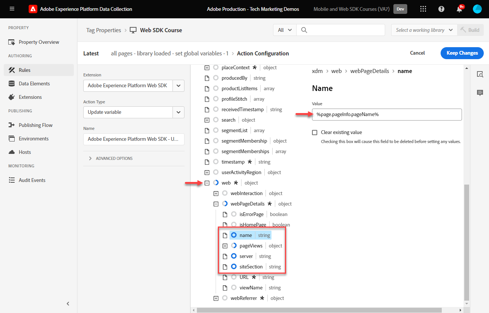

# Creación de reglas de etiquetas

Obtenga información sobre cómo enviar eventos al Edge Network de Adobe Experience Platform con el objeto XDM mediante reglas de etiquetas. Una regla de etiqueta es una combinación de eventos, condiciones y acciones que indica a la propiedad de etiqueta que haga algo. Con Platform Web SDK, las reglas se utilizan para enviar eventos a Platform Edge Network con los datos adecuados.

## Objetivos de aprendizaje

Al final de esta lección, puede hacer lo siguiente:

* Utilice una convención de nombres para administrar reglas dentro de las etiquetas
* Envío de un evento con campos XDM mediante las acciones Actualizar variable y Enviar evento
* Apilar varios conjuntos de campos XDM en varias reglas
* Asignar elementos de datos de matriz individuales o completos al objeto XDM
* Publicación de una regla de etiqueta en una biblioteca de desarrollo

## Requisitos previos

Está familiarizado con las etiquetas de recopilación de datos y con el [sitio de demostración de Luma](https://luma.enablementadobe.com/content/luma/us/en.html), y ha completado las lecciones anteriores en el tutorial:

* [Configuración de un esquema XDM](configure-schemas.md)
* [Configuración de un área de nombres de identidad](configure-identities.md)
* [Configuración de una secuencia de datos](configure-datastream.md)
* [Instalar extensión de SDK web](install-web-sdk.md)
* [Creación de elementos de datos](create-data-elements.md)
* [Creación de identidades](create-identities.md)

## Convenciones de nomenclatura

Para administrar reglas en etiquetas, se recomienda seguir una convención de nombres estándar. Este tutorial utiliza una convención de nombres de cinco partes:

* [**ubicación**] - [**evento**] - [**propósito**] - [**pedido**]

donde;

1. **ubicación** es la página o páginas del sitio donde se activa la regla
1. **event** es el déclencheur de la regla
1. **propósito** es la acción principal realizada por la regla
1. **order** es el orden en el que la regla debe activarse en relación con otras reglas
<!-- minor update -->

## Creación de reglas de etiquetas

En las etiquetas, las reglas se utilizan para ejecutar acciones (llamadas de activación) bajo varias condiciones. La extensión de etiquetas de Platform Web SDK incluye dos acciones que se utilizan en esta lección:

* **[!UICONTROL Variable de actualización]** asigna elementos de datos a propiedades en un objeto XDM
* **[!UICONTROL Enviar evento]** envía el objeto XDM a Experience Platform Edge Network

En el resto de esta lección:

1. Cree una regla con la acción **[!UICONTROL Actualizar variable]** para definir una &quot;configuración global&quot; de campos XDM.

1. Cree reglas adicionales con la acción **[!UICONTROL Actualizar variable]** que anulen nuestra &quot;configuración global&quot; y contribuyan con campos XDM adicionales en ciertas condiciones (por ejemplo, al agregar detalles del producto en páginas de productos).

1. Cree otra regla con la acción **[!UICONTROL Enviar evento]**, que enviará el objeto XDM completo a Adobe Experience Platform Edge Network.

Todas estas reglas se secuenciarán correctamente usando la opción &quot;[!UICONTROL order]&quot;.

Este vídeo ofrece información general del proceso:

>[!VIDEO](https://video.tv.adobe.com/v/3454030/?learn=on&enablevpops&captions=spa)

### Campos de configuración global

Para crear una regla de etiqueta para los campos XDM globales:

1. Abra la propiedad de etiqueta que está utilizando para este tutorial.

1. Vaya a **[!UICONTROL Reglas]** en el panel de navegación izquierdo

1. Seleccione el botón **[!UICONTROL Crear nueva regla]**

   

1. Asigne un nombre a la regla `all pages - library loaded - set global variables - 1`.

1. En la sección **[!UICONTROL Eventos]**, seleccione **[!UICONTROL Agregar]**

   

1. Use la **[!UICONTROL Extensión principal]** y seleccione **[!UICONTROL Biblioteca cargada (Principio de página)]** como **[!UICONTROL Tipo de evento]**

1. Seleccione el menú desplegable **[!UICONTROL Avanzado]** e introduzca `1` como **[!UICONTROL Pedido]**

   >[!NOTE]
   >
   > Cuanto más bajo sea el número de pedido, más pronto se ejecutará. Por lo tanto, le damos a nuestra &quot;configuración global&quot; un número de pedido bajo.

1. Seleccione **[!UICONTROL Conservar cambios]** para volver a la pantalla de regla principal
   

1. En la sección **[!UICONTROL Acciones]**, seleccione **[!UICONTROL Agregar]**

1. Como la **[!UICONTROL extensión]**, seleccione **[!UICONTROL Adobe Experience Platform Web SDK]**

1. Como **[!UICONTROL Tipo de acción]**, seleccione **[!UICONTROL Actualizar variable]**

1. Como **[!UICONTROL elemento de datos]**, seleccione `xdm.variable.content` que creó en la lección [Crear elementos de datos](create-data-elements.md)

   

Ahora, asigne los [!UICONTROL elementos de datos] al [!UICONTROL esquema] que usa su objeto XDM. Puede asignar a propiedades individuales u objetos completos. En este ejemplo, se asigna a propiedades individuales:

1. Busque el campo eventType y selecciónelo

1. Escriba el valor `web.webpagedetails.pageViews`

   >[!TIP]
   >
   > Para saber qué valores rellenar en el campo `eventType`, debe ir a la página de esquema y seleccionar el campo `eventType` para ver los valores sugeridos en el carril derecho. También puede introducir un nuevo valor, si es necesario.
   > 

1. A continuación, busque el objeto `identityMap` en el esquema y selecciónelo

1. Asignar al elemento de datos `identityMap.loginID`

   

   >[!TIP]
   >
   > Los campos XDM no se incluirán en la solicitud de red si el elemento de datos es nulo. Por lo tanto, cuando el usuario no está autenticado y el elemento de datos `identityMap.loginID` es nulo, no se enviará el objeto `identityMap`. Por eso podemos definirlo en nuestra &quot;configuración global&quot;.

1. Desplácese hacia abajo hasta que llegue al objeto **`web`**

1. Seleccione para abrirlo

1. Asigne los siguientes elementos de datos a las variables XDM `web` correspondientes

   * **`web.webPageDetials.name`** a `%page.pageInfo.pageName%`
   * **`web.webPageDetials.server`** a `%page.pageInfo.server%`
   * **`web.webPageDetials.siteSection`** a `%page.pageInfo.hierarchie1%`

1. Configure `web.webPageDetials.pageViews.value` como `1`.

   

   >[!TIP]
   >
   > Aunque ni `eventType` establecido en `web.webpagedetails.pageViews` ni `web.webPageDetails.pageViews.value` son necesarios para que Adobe Analytics procese una señalización como vista de página, es útil disponer de una forma estándar de indicar una vista de página para otras aplicaciones de flujo descendente.

1. Seleccione **[!UICONTROL Conservar cambios]** y, a continuación, **[!UICONTROL Guardar]** la regla en la siguiente pantalla para terminar de crearla

### Campos de página de producto

Ahora, empiece a usar **[!UICONTROL Actualizar variable]** en reglas adicionales secuenciadas para enriquecer el objeto XDM antes de enviarlo a [!UICONTROL Platform Edge Network].

>[!TIP]
>
>El orden de las reglas determina qué regla se ejecuta primero cuando se activa un evento. Si dos reglas tienen el mismo tipo de evento, se ejecuta primero la que tenga el número más bajo.
> 

Comience por rastrear las vistas de productos en la página de detalles del producto de Luma:

1. Seleccionar **[!UICONTROL Agregar regla]**
1. Asigne un nombre [!UICONTROL `ecommerce - library loaded - set product details variables - 20`]
1. Seleccione el  en Evento para agregar un nuevo déclencheur
1. En **[!UICONTROL Extensión]**, seleccione **[!UICONTROL Principal]**
1. En **[!UICONTROL Tipo de evento]**, seleccione **[!UICONTROL Biblioteca cargada (Principio de página)]**
1. Seleccione para abrir **[!UICONTROL Opciones avanzadas]**, escriba `20`. Este valor de orden garantiza que la regla se ejecute _después de_ el `all pages - library loaded - set global variables - 1` que establece la configuración global.
1. Seleccionar **[!UICONTROL Conservar cambios]**

   

1. En **[!UICONTROL condiciones]**, seleccione para **[!UICONTROL agregar]**
1. Dejar **[!UICONTROL Tipo de lógica]** como **[!UICONTROL Normal]**
1. Dejar **[!UICONTROL Extensión]** como **[!UICONTROL Principal]**
1. Seleccione **[!UICONTROL Tipo de condición]** como **[!UICONTROL Ruta sin cadena de consulta]**
1. A la derecha, habilite la opción **[!UICONTROL Regex]**
1. En **[!UICONTROL ruta igual a]**, conjunto `/products/`. Para el sitio de demostración de Luma, garantiza que la regla solo incluya déclencheur en las páginas de productos
1. Seleccionar **[!UICONTROL Conservar cambios]**

   

1. En **[!UICONTROL Acciones]**, seleccione **[!UICONTROL Agregar]**
1. Seleccione la extensión **[!UICONTROL Adobe Experience Platform Web SDK]**
1. Seleccione **[!UICONTROL Tipo de acción]** como **[!UICONTROL variable de actualización]**
1. Seleccione `xdm.variable.content` como **[!UICONTROL elemento de datos]**
1. Desplazarse hacia abajo hasta el objeto `commerce`
1. Abra el objeto **[!UICONTROL productViews]** y establezca **[!UICONTROL value]** en `1`

   

   >[!TIP]
   >
   >La configuración de commerce.productViews.value=1 en XDM se asigna automáticamente al evento `prodView` en Analytics

1. Desplácese hacia abajo hasta `eventType` y configúrelo en `commerce.productViews`

   >[!NOTE]
   >
   >Debido a que esta regla tiene un orden superior, sobrescribirá el conjunto `eventType` en la regla de &quot;configuración global&quot;. `eventType` solo puede contener un valor y se recomienda configurarlo con el evento más valioso.

1. Desplácese hacia abajo y seleccione la matriz `productListItems`
1. Seleccionar **[!UICONTROL Proporcionar elementos individuales]**
1. Seleccionar **[!UICONTROL Agregar elemento]**

   

   >[!CAUTION]
   >
   >**`productListItems`** es un tipo de datos `array`, por lo que espera que los datos se incluyan como una colección de elementos. Debido a la estructura de capas de datos del sitio de demostración de Luma y a que solo es posible ver un producto a la vez en el sitio de Luma, los elementos se agregan de forma individual. Al implementar en su propio sitio web, en función de la estructura de la capa de datos, puede proporcionar una matriz completa.

1. Seleccione para abrir **[!UICONTROL Elemento 1]**
1. Asignar **`productListItems.item1.SKU`** a `%product.productInfo.sku%`

   

1. Seleccionar **[!UICONTROL Conservar cambios]**

1. Seleccione **[!UICONTROL Guardar]** para guardar la regla

### Campos del carro de compras

Puede asignar toda la matriz a un objeto XDM, siempre que la matriz coincida con el formato del esquema XDM. El elemento de datos de código personalizado `cart.productInfo` que creó anteriormente recorre el objeto de capa de datos `digitalData.cart.cartEntries` en Luma y lo traduce al formato requerido del objeto `productListItems` del esquema XDM.

Para ilustrarlo, consulte la comparación a continuación de la capa de datos del sitio de Luma (izquierda) con el elemento de datos traducido (derecha):

Comparar el elemento de datos con la estructura de `productListItems` (sugerencia, debe coincidir).

>[!IMPORTANT]
>
>Observe cómo se traducen las variables numéricas, con valores de cadena en la capa de datos como `price` y `qty` reformateados a números en el elemento de datos. Estos requisitos de formato son importantes para la integridad de los datos en Platform y se determinan durante el paso [configurar esquemas](configure-schemas.md). En el ejemplo, **[!UICONTROL quantity]** usa el tipo de datos **[!UICONTROL Integer]**.
>&#x200B;> 

Ahora, asignemos la matriz al objeto XDM:

1. Cree una nueva regla con el nombre `ecommerce - library loaded - set shopping cart variables - 20`
1. Seleccione el  en Evento para agregar un nuevo déclencheur
1. En **[!UICONTROL Extensión]**, seleccione **[!UICONTROL Principal]**
1. En **[!UICONTROL Tipo de evento]**, seleccione **[!UICONTROL Biblioteca cargada (Principio de página)]**
1. Seleccione para abrir **[!UICONTROL Opciones avanzadas]**, escriba `20`
1. Seleccionar **[!UICONTROL Conservar cambios]**

   

1. En **[!UICONTROL condiciones]**, seleccione para **[!UICONTROL agregar]**
1. Dejar **[!UICONTROL Tipo de lógica]** como **[!UICONTROL Normal]**
1. Dejar **[!UICONTROL Extensiones]** como **[!UICONTROL Core]**
1. Seleccione **[!UICONTROL Tipo de condición]** como **[!UICONTROL Ruta sin cadena de consulta]**
1. A la derecha, **no** habilita la opción **[!UICONTROL Regex]**
1. En **[!UICONTROL ruta igual a]**, conjunto `/content/luma/us/en/user/cart.html`. Para el sitio de demostración de Luma, garantiza que la regla solo contenga déclencheur en la página del carro de compras
1. Seleccionar **[!UICONTROL Conservar cambios]**

   

1. En **[!UICONTROL Acciones]**, seleccione **[!UICONTROL Agregar]**
1. Seleccione la extensión **[!UICONTROL Adobe Experience Platform Web SDK]**
1. Seleccione **[!UICONTROL Tipo de acción]** como **[!UICONTROL variable de actualización]**
1. Seleccione `xdm.variable.content` como **[!UICONTROL elemento de datos]**
1. Desplácese hacia abajo hasta el objeto `commerce` y seleccione para abrirlo.
1. Abra el objeto **[!UICONTROL productListViews]** y establezca **[!UICONTROL value]** en `1`

   

   >[!TIP]
   >
   >La configuración de commerce.productListViews.value=1 en XDM se asigna automáticamente al evento `scView` en Analytics

1. Seleccione `eventType` y establezca en `commerce.productListViews`

1. Desplácese hacia abajo y seleccione la matriz **[!UICONTROL productListItems]**

1. Seleccionar **[!UICONTROL Proporcionar toda la matriz]**

1. Asignar a **`cart.productInfo`** elemento de datos

1. Seleccionar **[!UICONTROL Conservar cambios]**

1. Seleccione **[!UICONTROL Guardar]** para guardar la regla

Cree otras dos reglas para el cierre de compra y la compra siguiendo el mismo patrón con las siguientes diferencias:

**Nombre de regla**: `ecommerce  - library loaded - set checkout variables - 20`

1. **[!UICONTROL Condición]**: /content/luma/us/en/user/checkout.html
1. Configure `eventType` como `commerce.checkouts`.
1. Configure `commerce.checkout.value` como `1`.

   >[!TIP]
   >
   >Esto equivale a establecer el evento `scCheckout` en Analytics

**Nombre de regla**: `ecommerce - library loaded - set purchase variables -  20`

1. **[!UICONTROL Condición]**: /content/luma/us/en/user/checkout/order/thank-you.html
1. Configure `eventType` como `commerce.purchases`.
1. Configure `commerce.purchases.value` como `1`.

   >[!TIP]
   >
   >Esto equivale a establecer el evento `purchase` en Analytics

1. Establecer `commerce.order.purchaseID` en el elemento de datos `cart.orderId`
1. Establecer `commerce.order.currencyCode` en el valor codificado `USD`

   

   >[!TIP]
   >
   >Esto equivale a establecer las variables `s.purchaseID` y `s.currencyCode` en Analytics

1. Desplácese hacia abajo y seleccione la matriz **[!UICONTROL productListItems]**
1. Seleccionar **[!UICONTROL Proporcionar toda la matriz]**
1. Asignar a **`cart.productInfo.purchase`** elemento de datos
1. Seleccionar **[!UICONTROL Conservar cambios]**
1. Seleccionar **[!UICONTROL Guardar]**

Cuando haya terminado, debería ver las siguientes reglas creadas.

### Enviar regla de evento

Ahora que ha establecido las variables, puede crear la regla para enviar el objeto XDM completo a Platform Edge Network con la acción **[!UICONTROL Enviar evento]**.

1. A la derecha, seleccione **[!UICONTROL Agregar regla]** para crear otra regla

1. Asigne un nombre a la regla `all pages - library loaded - send event - 50`.

1. En la sección **[!UICONTROL Eventos]**, seleccione **[!UICONTROL Agregar]**

1. Use la **[!UICONTROL Extensión principal]** y seleccione `Library Loaded (Page Top)` como **[!UICONTROL Tipo de evento]**

1. Seleccione el menú desplegable **[!UICONTROL Avanzado]** e indique `50` en **[!UICONTROL Pedido]**. Esto garantizará que esta regla se active después de todas las demás reglas que haya configurado (que tenían `1` o `20` como su [!UICONTROL Pedido]).

1. Seleccione **[!UICONTROL Conservar cambios]** para volver a la pantalla de regla principal
   

1. En la sección **[!UICONTROL Acciones]**, seleccione **[!UICONTROL Agregar]**

1. Como la **[!UICONTROL extensión]**, seleccione **[!UICONTROL Adobe Experience Platform Web SDK]**

1. Como **[!UICONTROL Tipo de acción]**, seleccione **[!UICONTROL Enviar evento]**

1. Como **[!UICONTROL XDM]**, seleccione el elemento de datos `xdm.variable.content` creado en la lección anterior

1. Seleccione **[!UICONTROL Conservar cambios]** para volver a la pantalla de regla principal

   
1. Seleccione **[!UICONTROL Guardar]** para guardar la regla

   

## Publicación de las reglas en una biblioteca

A continuación, publique la regla en el entorno de desarrollo para poder verificar si funciona.

Para crear una biblioteca:

1. Vaya a **[!UICONTROL Flujo de publicación]** en el panel de navegación izquierdo

1. Seleccionar **[!UICONTROL Agregar biblioteca]**

   
1. Para **[!UICONTROL Name]**, escriba `Luma Web SDK Tutorial`
1. Para el **[!UICONTROL entorno]**, seleccione `Development`
1. Seleccionar **[!UICONTROL Añadir todos los recursos modificados]**

   >[!NOTE]
   >
   >    Debería ver todos los componentes de etiquetas creados en lecciones anteriores. La extensión Core contiene la JavaScript base requerida por todas las propiedades de etiquetas web.

1. Seleccione **[!UICONTROL Guardar y generar para desarrollo]**

   

La biblioteca puede tardar unos minutos en crearse y, cuando se completa, muestra un punto verde a la izquierda del nombre de la biblioteca:

Como puede ver en la pantalla [!UICONTROL Flujo de publicación], hay mucho más en el proceso de publicación, que está fuera del ámbito de este tutorial. Este tutorial solo utiliza una biblioteca en el entorno de desarrollo.

Ahora está listo para validar los datos de la solicitud mediante Adobe Experience Platform Debugger.

>[!NOTE]
>
>Gracias por dedicar su tiempo a conocer Adobe Experience Platform Web SDK. Si tiene preguntas, desea compartir comentarios generales o tiene sugerencias sobre contenido futuro, compártalas en esta [publicación de debate de la comunidad de Experience League](https://experienceleaguecommunities.adobe.com/t5/adobe-experience-platform-data/tutorial-discussion-implement-adobe-experience-cloud-with-web/td-p/444996?profile.language=es)
