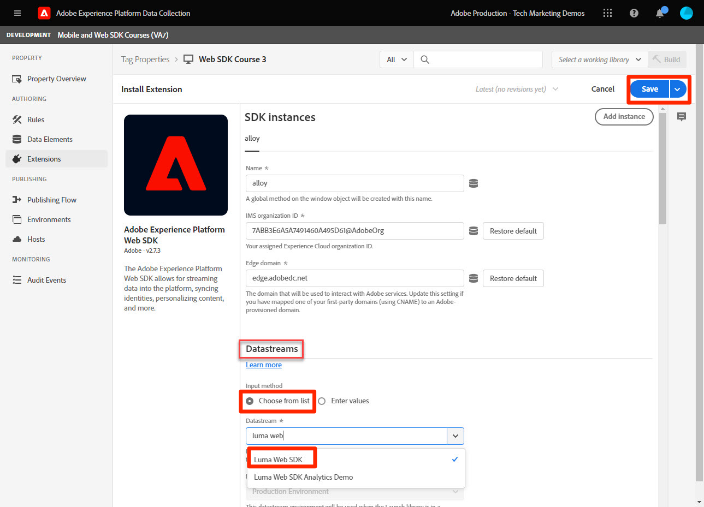

# Instalación de la extensión de etiquetas del SDK web de Adobe Experience Platform

Obtenga información sobre cómo instalar y configurar la extensión de etiqueta del SDK web de plataforma en la interfaz de recopilación de datos. Esta extensión de etiqueta es la _solo extensión de etiqueta_ requerido para enviar datos a _todas las aplicaciones de Adobe Experience Cloud_, incluyendo [Analytics](setup-analytics.md), [Target](setup-target.md), [Audience Manager](setup-audience-manager.md), Real-time Customer Data Platform y Journey Optimizer!

## Objetivos de aprendizaje

Al final de esta lección, debe poder:

* Creación de una propiedad de etiqueta en la interfaz de recopilación de datos
* Instalación de la extensión de etiqueta del SDK web de Platform
* Asigne el conjunto de datos creado anteriormente a la extensión

## Requisitos previos

Debe haber completado las lecciones anteriores en este tutorial:

* [Configure los permisos](configure-permissions.md)
* [Configuración de un esquema XDM](configure-schemas.md)
* [Configuración de un área de nombres de identidad](configure-identities.md)
* [Configurar un conjunto de datos](configure-datastream.md)

## Instalación de la extensión del SDK web de Experience Platform

### Agregar una propiedad

Primero debe tener una propiedad tag . Una propiedad es un contenedor de todas las funciones, reglas y demás funciones de JavaScript necesarias para recopilar detalles de una página web y enviarlos a varias ubicaciones.

Cree una nueva propiedad de etiqueta para el tutorial:

1. Abra el [Interfaz de recopilación de datos](https://launch.adobe.com/){target=&quot;_blank&quot;}
1. Select **[!UICONTROL Etiquetas]** en la navegación izquierda
1. Seleccione el botón **[!UICONTROL Nueva propiedad]**
   
1. Como **[!UICONTROL Nombre]**, introduzca `Web SDK Course` (añada su nombre al final, si varias personas de su empresa están tomando este tutorial)
1. Como **[!UICONTROL Dominios]**, introduzca `enablementadobe.com` (explicado más tarde)
1. Seleccione **[!UICONTROL Guardar]**
   

## Añadir la extensión del SDK web

Con el esquema XDM, el conjunto de datos y la propiedad tag ahora creados, está listo para instalar la extensión del SDK web de Platform:

1. Abra la nueva propiedad de etiqueta
1. Vaya a **[!UICONTROL Extensiones]** > **[!UICONTROL Catálogo]**
1. Buscar `Adobe Experience Platform Web SDK`
1. Select **[!UICONTROL Instalar]**

   

## Vincular el SDK web de Platform a su almacén de datos

Deje la mayoría de los ajustes predeterminados y actualícelos más adelante, según sea necesario. Lo único que debe hacer ahora es vincular la extensión al conjunto de datos:

1. En **[!UICONTROL Datastreams]**, seleccione **[!UICONTROL Elegir de la lista]** método de entrada
1. Seleccione el conjunto de datos creado anteriormente, `Luma Web SDK`
1. Seleccione **[!UICONTROL Guardar]**
   >[!NOTE]
   >
   > Si no encuentra el conjunto de datos, vaya a la [Configurar un conjunto de datos](configure-datastream.md) y siga los pasos para crear una

   

Ahora que ha instalado el SDK web de Platform y lo ha asociado al conjunto de datos, está listo para empezar a asignar elementos de datos a un objeto XDM con el esquema que ha creado.

>[!NOTE]
>
>Durante este tutorial, puede configurar solo un conjunto de datos y asociarlo a todos los entornos de etiquetas (desarrollo, fase y producción). Al implementar el SDK web de Platform en su propio sitio web, debe configurar un conjunto de datos independiente para cada entorno y asignarlo a los entornos de etiquetas mediante el complemento **[!UICONTROL Método de entrada]** > **[!UICONTROL Introducir valores]**
>
>

>[!NOTE]
>
>Aunque no configuró un CNAME en la variable [!UICONTROL Dominio perimetral] en esta lección, Adobe recomienda utilizar un CNAME cuando implemente el SDK web de Platform en su propio sitio web. Aunque la implementación de CNAME no proporciona ningún beneficio en términos de vida útil de las cookies, puede haber otros beneficios. Estos beneficios incluyen bloqueadores de anuncios y exploradores menos comunes que impiden que se envíen datos a dominios que clasifican como rastreadores. En estos casos, el uso de un CNAME puede impedir que la recopilación de datos se interrumpa para los usuarios que utilizan estas herramientas.

Para obtener más información sobre cada sección de la extensión, consulte [Configurar la extensión del SDK web de Adobe Experience Platform](https://experienceleague.adobe.com/docs/experience-platform/edge/extension/web-sdk-extension-configuration.html)

[Siguiente: ](create-data-elements.md)

>[!NOTE]
>
>Gracias por invertir su tiempo en obtener información sobre el SDK web de Adobe Experience Platform. Si tiene alguna pregunta, desea compartir comentarios generales o tiene sugerencias sobre contenido futuro, compártalas en este [Experience League de debate de la comunidad](https://experienceleaguecommunities.adobe.com/t5/adobe-experience-platform-launch/tutorial-discussion-implement-adobe-experience-cloud-with-web/td-p/444996)
