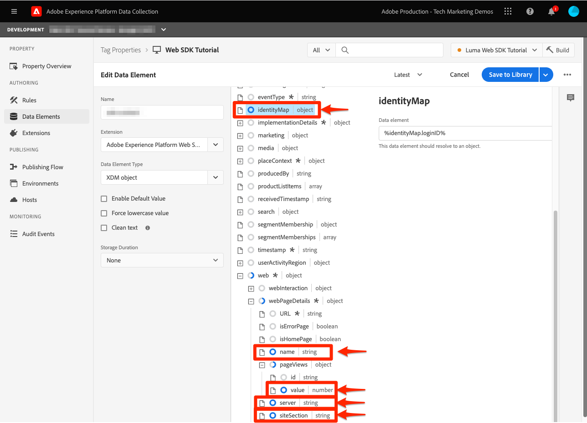

# Configuración de Adobe Analytics con el SDK web de Platform


>[!CAUTION]
>
>Esperamos publicar cambios importantes en este tutorial el viernes 15 de marzo de 2024. Después de ese punto, muchos ejercicios cambiarán y es posible que tenga que reiniciar el tutorial desde el principio para completar todas las lecciones.

Obtenga información sobre cómo configurar Adobe Analytics mediante [SDK web de Experience Platform](https://experienceleague.adobe.com/docs/platform-learn/data-collection/web-sdk/overview.html), cree reglas de etiquetas para enviar datos a Adobe Analytics y valide que Analytics está capturando los datos según lo esperado.

[Adobe Analytics](https://experienceleague.adobe.com/docs/analytics.html?lang=es) es una aplicación líder del sector que le permite comprender a sus clientes como personas y dirigir su negocio con inteligencia de clientes.

## Objetivos de aprendizaje

Al final de esta lección, debe poder:

* Configure un esquema XDM para Adobe Analytics y comprenda la diferencia entre las variables XDM asignadas automáticamente y las asignadas manualmente para Analytics
* Configuración de una secuencia de datos para habilitar Adobe Analytics
* Asignar elementos de datos de matriz individuales o completos al objeto XDM
* Captura de vistas de página en Adobe Analytics con el objeto XDM
* Captura de datos de comercio electrónico con el objeto XDM para la cadena de producto de Adobe Analytics
* Validar si las variables de Adobe Analytics se establecen con el objeto XDM mediante Experience Platform Debugger
* Usar reglas de procesamiento de Adobe Analytics para establecer variables personalizadas
* Adobe Analytics captura los datos validados mediante informes en tiempo real

## Requisitos previos

Está familiarizado con las etiquetas, Adobe Analytics y [Sitio de demostración de Luma](https://luma.enablementadobe.com/content/luma/us/en.html){target="_blank"} funcionalidad de inicio de sesión y compras.

Necesita al menos un ID de grupo de informes de prueba o desarrollo. Si no dispone de un grupo de informes de prueba o desarrollo que pueda utilizar para este tutorial, [cree uno](https://experienceleague.adobe.com/docs/analytics/admin/manage-report-suites/new-report-suite/t-create-a-report-suite.html?lang=es).

Debe haber completado todos los pasos de las secciones anteriores del tutorial:

* Configuración inicial
   * [Configure los permisos](configure-permissions.md)
   * [Configuración de un esquema XDM](configure-schemas.md)
   * [Configuración de un área de nombres de identidad](configure-identities.md)
   * [Configuración de una secuencia de datos](configure-datastream.md)
* Configuración de etiquetas
   * [Instalar extensión de SDK web](install-web-sdk.md)
   * [Creación de elementos de datos](create-data-elements.md)
   * [Creación de una regla de etiqueta](create-tag-rule.md)
   * [Validar con Adobe Experience Platform Debugger](validate-with-debugger.md)

## Esquemas XDM y variables de Analytics

¡Felicidades! Ya ha configurado un esquema compatible con Adobe Analytics en la [Configuración de un esquema](configure-schemas.md) ¡lección!

La implementación del SDK web de Platform debe ser lo más independiente posible del producto. Para Adobe Analytics, la asignación de eVars, props y eventos no se produce durante la creación del esquema ni durante la configuración de las reglas de etiquetas, como se ha hecho tradicionalmente. En su lugar, cada par clave-valor de XDM se convierte en una variable de datos de contexto que se asigna a una variable de Analytics de una de las dos maneras siguientes:

1. Variables asignadas automáticamente mediante campos XDM reservados
1. Variables asignadas manualmente mediante reglas de procesamiento de Analytics

Para comprender qué variables XDM se asignan automáticamente a Adobe Analytics, consulte [Variables asignadas automáticamente en Analytics](https://experienceleague.adobe.com/docs/experience-platform/edge/data-collection/adobe-analytics/automatically-mapped-vars.html?lang=en). Cualquier variable que no se asigne automáticamente debe asignarse manualmente.

El esquema creado en [Configuración de un esquema](configure-schemas.md) Esta lección contiene algunas variables asignadas automáticamente a Analytics, como se describe en esta tabla:

| Variables asignadas automáticamente de XDM a Analytics | variable de Adobe Analytics |
|-------|---------|
| `identitymap.ecid.[0].id` | mid |
| `web.webPageDetails.pageViews.value` | una llamada a la vista de página s.t() |
| `web.webPageDetails.name` | s.pageName |
| `web.webPageDetails.server` | s.server |
| `web.webPageDetails.siteSection` | s.channel |
| `commerce.productViews.value` | prodView |
| `commerce.productListViews.value` | scView |
| `commerce.checkouts.value` | scCheckout |
| `commerce.purchases.value` | compra |
| `commerce.order.currencyCode` | s.currencyCode |
| `commerce.order.purchaseID` | s.purchaseID |
| `productListItems[].SKU` | s.products=;product name;;;; (primary; consulte la nota más abajo) |
| `productListItems[].name` | s.products=;product name;;;; (reserva: consulte la nota más abajo) |
| `productListItems[].quantity` | s.products=;;product quantity;;; |
| `productListItems[].priceTotal` | s.product=;;;product price;; |

>[!NOTE]
>
>Las secciones individuales de la cadena de producto de Analytics se configuran mediante diferentes variables XDM en la variable `productListItems` objeto.
>El 18 de agosto de 2022, `productListItems[].SKU` tiene prioridad para la asignación al nombre del producto en la variable s.products.
>El valor establecido en `productListItems[].name` se asigna al nombre del producto solo si `productListItems[].SKU` no existe. De lo contrario, no está asignado y disponible en los datos de contexto.
>No establezca una cadena vacía o nulo como  `productListItems[].SKU`. Esto tiene el efecto no deseado de asignar al nombre del producto en la variable s.products.


## Configuración de la secuencia de datos

El SDK web de Platform envía datos del sitio web a Platform Edge Network. A continuación, la secuencia de datos indica a Platform Edge Network dónde reenviar esos datos, en este caso, cuál de los grupos de informes de Adobe Analytics.

1. Ir a [Recopilación de datos](https://experience.adobe.com/#/data-collection){target="blank"} interfaz
1. En el panel de navegación izquierdo, seleccione **[!UICONTROL Datastreams]**
1. Seleccione el creado anteriormente `Luma Web SDK` secuencia de datos

   

1. Seleccionar **[!UICONTROL Añadir servicio]**
   
1. Seleccionar **[!UICONTROL Adobe Analytics]** como el **[!UICONTROL Servicio]**
1. Introduzca el  **[!UICONTROL ID del grupo de informes]** del grupo de informes de desarrollo
1. Seleccionar **[!UICONTROL Guardar]**

   

   >[!TIP]
   >
   >Agregar más grupos de informes seleccionando **[!UICONTROL Agregar grupo de informes]** es equivalente al etiquetado de grupos múltiples.

>[!WARNING]
>
>En este tutorial, solo puede configurar el grupo de informes de desarrollo de Adobe Analytics. Al crear flujos de datos para su propio sitio web, crearía flujos de datos y grupos de informes adicionales para los entornos de ensayo y producción.


## Creación de elementos de datos adicionales

A continuación, capture datos adicionales de la capa de datos de Luma y envíelos a Platform Edge Network. Aunque la lección se centra en los requisitos comunes de Adobe Analytics, todos los datos capturados se pueden enviar fácilmente a otros destinos en función de la configuración del flujo de datos. Por ejemplo, si completa la lección de Adobe Experience Platform, los datos adicionales que capture en esta lección también se enviarán a Platform.

### Creación de elementos de datos de comercio electrónico

Durante la lección Crear elementos de datos, debe [elementos de datos de JavaScript creados](create-data-elements.md#create-data-elements-to-capture-the-data-layer) que capturó contenido y detalles de identidad. Ahora creará elementos de datos adicionales para capturar datos de comercio electrónico. Debido a que el [Sitio de demostración de Luma](https://luma.enablementadobe.com/content/luma/us/en.html){target="_blank"} utiliza diferentes estructuras de capa de datos para las páginas de detalles del producto y los productos del carro de compras. Debe crear elementos de datos para cada escenario. Tendrá que crear algunos elementos de datos de código personalizados para obtener lo que necesita de la capa de datos de Luma, que puede ser necesario o no al implementar en su propio sitio. En este caso, debe recorrer una matriz de artículos del carro de compras para obtener detalles específicos de cada producto. Utilice los siguientes fragmentos de código proporcionados:

1. Abra la propiedad de etiqueta que está utilizando para el tutorial.
1. Ir a **[!UICONTROL Elementos de datos]**
1. Seleccionar **[!UICONTROL Añadir elemento de datos]**
1. Asígnele un nombre **`product.productInfo.sku`**
1. Utilice el **[!UICONTROL Código personalizado]** **[!UICONTROL Tipo de elemento de datos]**
1. Deje las casillas de verificación para **[!UICONTROL Forzar valor de minúsculas]** y **[!UICONTROL Limpiar texto]** desenfrenado
1. Salir `None` como el **[!UICONTROL Duración del almacenamiento]** ya que este valor es diferente en cada página
1. Seleccionar **[!UICONTROL Abrir editor]**

   

1. Copie y pegue el siguiente código

   ```javascript
   var cart = digitalData.product;
   var cartItem;
   cart.forEach(function(item){
   cartItem = item.productInfo.sku;
   });
   return cartItem;
   ```

1. Seleccionar **[!UICONTROL Guardar]** para guardar el código personalizado

   

1. Seleccionar **[!UICONTROL Guardar]** para guardar el elemento de datos

Siga los mismos pasos para crear estos elementos de datos adicionales:

* **`product.productInfo.title`**

  ```javascript
  var cart = digitalData.product;
  var cartItem;
  cart.forEach(function(item){
  cartItem = item.productInfo.title;
  });
  return cartItem;
  ```

* **`cart.productInfo`**

  ```javascript
  var cart = digitalData.cart.cartEntries;
  var cartItem = [];
  cart.forEach(function(item, index, array){
  var qty = parseInt(item.qty);
  var price = parseInt(item.price);
  cartItem.push({
  "SKU": item.sku,
  "name":item.title,
  "quantity":qty,
  "priceTotal":price
  });
  });
  return cartItem;
  ```

Después de añadir estos elementos de datos y de haber creado los anteriores en el [Crear elementos de datos](create-data-elements.md) En esta lección, debe tener los siguientes elementos de datos:

| Elementos de datos |
-----------------------------|
| `cart.orderId` |
| `cart.productInfo` |
| `identityMap.loginID` |
| `page.pageInfo.hierarchie1` |
| `page.pageInfo.pageName` |
| `page.pageInfo.server` |
| `product.productInfo.sku` |
| `product.productInfo.title` |
| `user.profile.attributes.loggedIn` |
| `user.profile.attributes.username` |
| `xdm.content` |

>[!IMPORTANT]
>
>En este tutorial, creará un objeto XDM diferente para cada evento. Esto significa que debe reasignar variables que se considerarían &quot;globales&quot; disponibles en cada visita, como nombre de página e identityMap. Sin embargo, puede [Combinar objetos](https://experienceleague.adobe.com/docs/experience-platform/tags/extensions/adobe/core/overview.html#merged-objects) o use [Tablas de asignación](https://exchange.adobe.com/experiencecloud.details.103136.mapping-table.html) para administrar los objetos XDM de forma más eficaz en una situación real. Para esta lección, las variables globales se consideran como:
>
>* **[!UICONTROL identityMap]** para recopilar el ID autenticado según el [Crear elemento de datos del mapa de identidad](create-data-elements.md#create-identity-map-data-element) ejercicio en la [Crear elementos de datos](create-data-elements.md) lección.
>* **[!UICONTROL web]** objeto para capturar contenido según el [objeto XDM de contenido](create-data-elements.md#map-content-data-elements-to-XDM-Schema-individually) ejercicio en la [Crear elementos de datos](create-data-elements.md) lección sobre cada elemento de datos anterior.

### Incremento de vistas de página

En la lección Crear elementos de datos, debe [creó un `xdm.content` elemento de datos](create-data-elements.md#map-content-data-elements-to-xdm-schema-individually) para capturar dimensiones de contenido. Dado que ahora está enviando datos a Adobe Analytics, también debe asignar un campo XDM adicional para indicar que una señalización debe procesarse como una vista de página de Analytics.

1. Abra su `xdm.content` elemento de datos
1. Desplácese hacia abajo y seleccione para abrir hasta `web.webPageDetails`
1. Seleccione para abrir **[!UICONTROL pageViews]** objeto
1. Establecer **[!UICONTROL valor]** hasta `1`
1. Seleccionar [!UICONTROL **Guardar**]

   

>[!TIP]
>
>Este campo equivale a enviar un **`s.t()`** señalización de vista de página para Analytics con `AppMeasurement.js`. Para una señalización de clic en vínculo, establezca el `webInteraction.linkClicks.value` hasta `1`


### Configuración de la cadena de producto

Antes de asignar a la cadena de producto, es importante comprender que hay dos objetos principales dentro del esquema XDM que se utilizan para capturar datos de comercio electrónico que tienen relaciones especiales con Adobe Analytics:

1. El `commerce` conjuntos de objetos eventos de Analytics como `prodView`, `scView`, y `purchase`
1. El `productListItems` conjuntos de objetos dimensiones de Analytics como `productID`.

Consulte [Recopilación de datos de Commerce y productos](https://experienceleague.adobe.com/docs/experience-platform/edge/data-collection/collect-commerce-data.html?lang=en) para obtener más información.

También es importante comprender que puede hacer lo siguiente **[!UICONTROL proporcionar atributos individuales]** a campos XDM individuales o **[!UICONTROL proporcionar una matriz completa]** a un objeto XDM.


### Asignación de atributos individuales a un objeto XDM

Puede asignarse a variables individuales para capturar datos en la página de detalles del producto del sitio de demostración de Luma:

1. Crear un **[!UICONTROL Objeto XDM]** **[!UICONTROL Tipo de elemento de datos]** nombrado **`xdm.commerce.prodView`**
1. Seleccione el mismo entorno limitado de Platform y esquema XDM utilizados en lecciones anteriores
1. Abra el **[!UICONTROL comercio]** objeto
1. Abra el **[!UICONTROL productViews]** objeto y conjunto **[!UICONTROL valor]** hasta `1`

   

   >[!TIP]
   >
   >Este paso equivale a configurar `prodView` evento en Analytics


1. Desplácese hacia abajo hasta y seleccione `productListItems` matriz
1. Seleccionar **[!UICONTROL Proporcionar elementos individuales]**
1. Seleccionar **[!UICONTROL Agregar elemento]**

   

   >[!CAUTION]
   >
   >El **`productListItems`** es un `array` tipo de datos, de modo que espera que los datos se incluyan como una colección de elementos. Debido a la estructura de capas de datos del sitio de demostración de Luma y a que solo es posible ver un producto a la vez en el sitio de Luma, agregará elementos individualmente. Al implementar en su propio sitio web, en función de la estructura de la capa de datos, puede proporcionar una matriz completa.

1. Seleccionar para abrir **[!UICONTROL Elemento 1]**
1. Asigne las siguientes variables XDM a elementos de datos

   * **`productListItems.item1.SKU`** hasta `%product.productInfo.sku%`
   * **`productListItems.item1.name`** hasta `%product.productInfo.title%`

   

   >[!IMPORTANT]
   >
   >Antes de guardar este objeto XDM, asegúrese de establecer también las variables &quot;globales&quot; y el incrementador de vista de página:
   >

1. Seleccionar **[!UICONTROL Guardar]**

### Asignar una matriz completa a un objeto XDM

Como se ha indicado anteriormente, el sitio de demostración de Luma utiliza una estructura de capas de datos diferente para los productos del carro de compras. El elemento de datos de código personalizado `cart.productInfo` El elemento de datos que ha creado anteriormente recorre el `digitalData.cart.cartEntries` objeto de capa de datos y lo traduce al esquema de objeto XDM requerido requerido. El nuevo formato **debe coincidir exactamente** el esquema definido por el `productListItems` del esquema XDM.

Para ilustrarlo, consulte la comparación a continuación de la capa de datos del sitio de Luma (izquierda) con el elemento de datos traducido (derecha):


Comparar el elemento de datos con `productListItems` estructura (sugerencia, debe coincidir).

>[!IMPORTANT]
>
>Observe cómo se traducen las variables numéricas, con valores de cadena en la capa de datos como `price` y `qty` se ha cambiado el formato a números en el elemento de datos. Estos requisitos de formato son importantes para la integridad de los datos en Platform y se determinan durante la [configuración de esquemas](configure-schemas.md) paso. En el ejemplo, **[!UICONTROL cantidad]** utiliza el **[!UICONTROL Entero]** tipo de datos.
> 

Ahora, vuelva a asignar el objeto XDM a una matriz completa. Cree un elemento de datos de objeto XDM para capturar productos en la página del carro de compras:

1. Crear un **[!UICONTROL Objeto XDM]** **[!UICONTROL Tipo de elemento de datos]** nombrado **`xdm.commerce.cartView`**
1. Seleccione el mismo entorno limitado de Platform y esquema XDM que está utilizando para este tutorial.
1. Abra el **[!UICONTROL comercio]** objeto
1. Abra el **[!UICONTROL productListViews]** objeto y conjunto `value` hasta `1`

   >[!TIP]
   >
   >Este paso equivale a configurar `scView` evento en Analytics

1. Desplácese hacia abajo hasta y seleccione **[!UICONTROL productListItems]** matriz
1. Seleccionar **[!UICONTROL Proporcionar toda la matriz]**
1. Mapa a **`cart.productInfo`** elemento de datos

   

   >[!IMPORTANT]
   >
   >Antes de guardar este objeto XDM, asegúrese de establecer también las variables &quot;globales&quot; y el incrementador de vista de página:
   >

1. Seleccionar **[!UICONTROL Guardar]**

Crear otro **[!UICONTROL Objeto XDM]**  **[!UICONTROL Tipo de elemento de datos]** para cierres de compra llamados `xdm.commerce.checkout`. Esta vez establezca el **[!UICONTROL commerce.checkouts.value]** hasta `1`, mapa **[!UICONTROL productListItems]** hasta **`cart.productInfo`** como acaba de hacer, y agregue las variables &quot;globales&quot; y el contador de vista de página.

>[!TIP]
>
>Este paso equivale a configurar `scCheckout` evento en Analytics


Hay pasos adicionales para capturar la variable `purchase` evento:

1. Crear otro  **[!UICONTROL Objeto XDM]**  **[!UICONTROL Tipo de elemento de datos]** para compras invocadas `xdm.commerce.purchase`
1. Abrir **[!UICONTROL comercio]** objeto
1. Abra el **[!UICONTROL pedido]** objeto
1. Mapa **[!UICONTROL purchaseID]** a la `cart.orderId` elemento de datos
1. Establecer **[!UICONTROL currencyCode]** al valor codificado `USD`

   

   >[!TIP]
   >
   >Esto equivale a configurar `s.purcahseID` y `s.currencyCode` variables en Analytics

1. Seleccione para abrir `purchases` objeto y conjunto `value` hasta `1`
   >[!TIP]
   >
   >Esto equivale a configurar `purchase` evento en Analytics

   >[!IMPORTANT]
   >
   >Antes de guardar este objeto XDM, asegúrese de establecer también las variables &quot;globales&quot; y el incrementador de vista de página:
   >

1. Seleccionar **[!UICONTROL Guardar]**

Al final de estos pasos, debe tener los siguientes cinco elementos de datos de objeto XDM creados:

| Elementos de datos de objeto XDM |
-----------------------------|
| `xdm.commerce.cartView` |
| `xdm.commerce.checkout` |
| `xdm.commerce.prodView` |
| `xdm.commerce.purchase` |
| `xdm.content` |


## Creación de reglas adicionales para el SDK web de Platform

Con los varios elementos de datos de objeto XDM creados, ya puede establecer las señalizaciones mediante reglas. En este ejercicio, se crean reglas individuales por evento de comercio electrónico y se utilizan condiciones para que las reglas se activen en las páginas correctas. Empecemos con un evento de Vista de producto.

1. En el panel de navegación izquierdo, seleccione **[!UICONTROL Reglas]** y luego seleccione **[!UICONTROL Agregar regla]**
1. Asígnele un nombre  [!UICONTROL `product view - library load - AA`]
1. En **[!UICONTROL Eventos]**, seleccione **[!UICONTROL Library Loaded (Page Top)]**
1. En **[!UICONTROL Condiciones]**, seleccione para **[!UICONTROL Añadir]**

   

1. Salir **[!UICONTROL Tipo de lógica]** as **[!UICONTROL Normal]**
1. Salir **[!UICONTROL Extensiones]** as **[!UICONTROL Núcleo]**
1. Seleccionar **[!UICONTROL Tipo de condición]** as **[!UICONTROL Ruta sin cadena de consulta]**
1. A la derecha, habilite la **[!UICONTROL Regex]** alternar
1. En **[!UICONTROL ruta igual a]** set `/products/`. Para el sitio de demostración de Luma, garantiza que la regla solo incluya déclencheur en las páginas de productos
1. Seleccionar **[!UICONTROL Conservar cambios]**

   

1. En **[!UICONTROL Acciones]** select **[!UICONTROL Añadir]**
1. Seleccionar **[!UICONTROL SDK web de Adobe Experience Platform]** extensión
1. Seleccionar **[!UICONTROL Tipo de acción]** as **[!UICONTROL Enviar evento]**
1. El **[!UICONTROL Tipo]** tiene una lista desplegable de valores para elegir. Seleccionar `[!UICONTROL commerce.productViews]`

   >[!TIP]
   >
   >El valor seleccionado aquí no afecta a la forma en que se asignan los datos a Analytics, pero se recomienda aplicar cuidadosamente esta variable, ya que se utiliza en la interfaz del generador de segmentos de Adobe Experience Platform. El valor seleccionado está disponible para usar en `[!UICONTROL c.a.x.eventtype]` variable de datos de contexto descendente.

1. En **[!UICONTROL Datos XDM]**, seleccione la `[!UICONTROL xdm.commerce.prodView]` Elemento de datos del objeto XDM
1. Seleccionar **[!UICONTROL Conservar cambios]**

   

1. La regla debe ser similar a la siguiente. Seleccionar **[!UICONTROL Guardar]**

   


Repita el mismo proceso para todos los demás eventos de comercio electrónico con los parámetros siguientes:

**Nombre de regla**: vista de carro de compras, carga de biblioteca, AA

* **[!UICONTROL Tipo de evento]**: Biblioteca cargada (Principio de página)
* **[!UICONTROL Condición]**: /content/luma/us/en/user/cart.html
* **Valor de tipo en SDK web: Acción de envío**: commerce.productListViews
* **Datos XDM para el SDK web: Acción de envío:** `%xdm.commerce.cartView%`

**Nombre de regla**: cierre de compra, carga de biblioteca, AA

* **[!UICONTROL Tipo de evento]**: Biblioteca cargada (Principio de página)
* **[!UICONTROL Condición]** /content/luma/us/en/user/checkout.html
* **Tipo de SDK web: acción de envío**: commerce.checkouts
* **Datos XDM para el SDK web: Acción de envío:** `%xdm.commerce.checkout%`

**Nombre de regla**: compra - carga de biblioteca - AA

* **[!UICONTROL Tipo de evento]**: Biblioteca cargada (Principio de página)
* **[!UICONTROL Condición]** /content/luma/us/en/user/checkout/order/thank-you.html
* **Tipo de SDK web: acción de envío**: commerce.purchases
* **Datos XDM para el SDK web: Acción de envío:** `%xdm.commerce.purchase%`

Cuando haya terminado, debería ver las siguientes reglas creadas.


## Cree su entorno de desarrollo

Añada los nuevos elementos de datos y reglas a su `Luma Web SDK Tutorial` y reconstruya su entorno de desarrollo.


## Validar Adobe Analytics para el SDK web de Platform

En el [Depurador](validate-with-debugger.md) En esta lección, ha aprendido a inspeccionar la señalización de objetos XDM del lado del cliente con Platform Debugger y la consola de desarrollador del explorador, que es similar a cómo depurar un `AppMeasurement.js` Implementación de Analytics. Para validar que Analytics captura correctamente los datos mediante el SDK web de Platform, debe ir dos pasos más allá para:

1. Valide cómo procesa los datos el objeto XDM en la red perimetral de Platform, utilizando la función de seguimiento de Edge de Experience Platform Debugger
1. Valide cómo Analytics procesa los datos mediante reglas de procesamiento e informes en tiempo real.

### Usar seguimiento de borde

Obtenga información sobre cómo validar que Adobe Analytics está capturando el ECID, las vistas de página, la cadena de producto y los eventos de comercio electrónico con la función Edge Trace de Experience Platform Debugger.

### Validación de ID de Experience Cloud

1. Vaya a la [Sitio de demostración de Luma](https://luma.enablementadobe.com/content/luma/us/en.html){target="_blank"} y use Experience Platform Debugger para lo siguiente [cambie la propiedad de etiquetas del sitio a su propia propiedad de desarrollo](validate-with-debugger.md#use-the-experience-platform-debugger-to-map-to-your-tags-property)

   >[!WARNING]
   >
   >Antes de continuar, asegúrese de haber iniciado sesión en el sitio de Luma.  Si no ha iniciado sesión, el sitio de Luma no le permite cerrar la compra.
   >
   > 1. En Luma, seleccione el botón de inicio de sesión en la parte superior derecha y utilice las credenciales **u: test@adobe.com p: test** para autenticarse
   >
   > 1. Se le redirigirá automáticamente a [Página de productos de Didi Sport Watch](https://luma.enablementadobe.com/content/luma/us/en/products/gear/watches/didi-sport-watch.html#24-WG02) al cargar la página siguiente

1. Para habilitar el seguimiento de Edge, vaya a Experience Platform Debugger, en el panel de navegación izquierdo, seleccione **[!UICONTROL Registros]**, luego seleccione la **[!UICONTROL Edge]** y seleccione. **[!UICONTROL Connect]**

   

1. Estará vacío por ahora

   

1. Actualice la [Página de productos de Didi Sport Watch](https://luma.enablementadobe.com/content/luma/us/en/products/gear/watches/didi-sport-watch.html#24-WG02) y vuelva a comprobar Experience Platform Debugger, debería ver los datos que llegan. La fila que empieza por **[!UICONTROL RSID de asignación automática de Analytics]** es la señalización de Adobe Analytics
1. Seleccione para abrir ambos `[!UICONTROL mappedQueryParams]` y la segunda lista desplegable para ver las variables de Analytics

   

   >[!TIP]
   >
   >La segunda lista desplegable corresponde al ID del grupo de informes de Analytics al que está enviando los datos. Debe coincidir con su propio grupo de informes, no con el de la captura de pantalla.

1. Desplazarse hacia abajo para buscar `[!UICONTROL c.a.x.identitymap.ecid.[0].id]`. Es una variable de datos de contexto que captura el ECID
1. Desplácese hacia abajo hasta que vea el informe de Analytics. `[!UICONTROL mid]` variable. Ambos ID coinciden con el Experience Cloud ID del dispositivo.

   

   >[!NOTE]
   >
   >Como ha iniciado sesión, dedique un momento a validar el ID autenticado `112ca06ed53d3db37e4cea49cc45b71e` para el usuario **test@adobe.com** también se captura en el `[!UICONTROL c.a.x.identitymap.lumacrmid.[0].id]`


### Vistas de página de contenido

Utilice la misma señalización para validar que Analytics captura las vistas de página de contenido.

1. Buscar: `[!UICONTROL c.a.x.web.webpagedetails.pageviews.value]=1`. Le dice un `s.t()` La señalización de vista de página se está enviando a Analytics.
1. Desplácese hacia abajo para ver el `[!UICONTROL gn]` variable. Es la sintaxis dinámica de Analytics para `[!UICONTROL s.pageName]` variable. Captura el nombre de página de la capa de datos.

   

### Eventos de cadena de producto y comercio electrónico

Dado que ya se encuentra en una página de producto, este ejercicio sigue utilizando el mismo seguimiento de Edge para validar que Analytics capture los datos del producto. Tanto la cadena de producto como los eventos de comercio electrónico se asignan automáticamente a variables XDM de Analytics. Siempre y cuando haya asignado a la aplicación adecuada `productListItem` Variable XDM al [configuración de un esquema XDM para Adobe Analytics](setup-analytics.md#configure-an-xdm-schema-for-adobe-analytics), la red perimetral de plataforma se encarga de asignar los datos a las variables de análisis adecuadas.

1. En primer lugar, valide que la variable `Product String` se ha establecido
1. Buscar: `[!UICONTROL c.a.x.productlistitems.][0].[!UICONTROL sku]`. La variable captura el valor del elemento de datos asignado al `productListItems.item1.sku` anteriormente en esta lección
1. Desplácese hacia abajo para ver el `[!UICONTROL pl]` variable. Es la sintaxis dinámica de la variable de cadena de producto de Analytics
1. Ambos valores coinciden con el nombre del producto disponible en la capa de datos

   

El seguimiento de Edge trata `commerce` eventos de forma ligeramente diferente a `productList` dimensiones. No ve una variable de datos de contexto asignada de la misma manera que ve el nombre del producto asignado a `[!UICONTROL c.a.x.productlistitem.[0].name]` arriba. En su lugar, el seguimiento de Edge muestra la asignación automática del evento final en Analytics `event` variable. Platform Edge Network lo asigna en consecuencia, siempre y cuando se asigne al XDM adecuado `commerce` mientras que [configuración del esquema para Adobe Analytics](setup-analytics.md#configure-an-xdm-schema-for-adobe-analytics); en este caso, la variable `commerce.productViews.value=1`.

1. Vuelva a la ventana de Experience Platform Debugger y desplácese hacia abajo hasta el `[!UICONTROL event]` se establece en. `[!UICONTROL prodView]`

   

Valide el resto de los eventos de comercio electrónico y las cadenas de producto que están configuradas para Analytics.

1. Añadir [Reloj Didi Sport](https://luma.enablementadobe.com/content/luma/us/en/products/gear/watches/didi-sport-watch.html#24-WG02) al carro
1. Vaya a la [Página de carrito](https://luma.enablementadobe.com/content/luma/us/en/user/cart.html), compruebe el seguimiento de Edge para `[!UICONTROL events: "scView"]` y la cadena de producto

   

1. Continúe con el cierre de compra, compruebe el seguimiento de Edge para `[!UICONTROL events: "scCheckout"]` y la cadena de producto

   

1. Rellene solo el **Nombre** y **Apellidos** en el formulario de envío y seleccione **Continuar**. En la página siguiente, seleccione **Realizar pedido**
1. En la página de confirmación, marque Rastro de Edge para

   * Evento de compra configurado `[!UICONTROL events: "purchase"]`
   * Variable de código de moneda establecida `[!UICONTROL cc: "USD"]`
   * ID de compra configurado en `[!UICONTROL pi]`
   * Cadena de producto `[!UICONTROL pl]` definición del nombre, cantidad y precio del producto

   

## Reglas de procesamiento e informes en tiempo real

Ahora que ha validado las señalizaciones de Analytics con el seguimiento de Edge, también puede validar que Analytics procese los datos mediante los informes en tiempo real. Antes de comprobar los informes en tiempo real, debe configurar Reglas de procesamiento para Analytics `props` según sea necesario.

### Reglas de procesamiento para asignaciones de Analytics personalizadas

En este ejercicio, se asigna una variable XDM a una propiedad para poder verla en los informes en tiempo real. Siga estos mismos pasos para cualquier asignación personalizada que deba realizar para cualquier `eVar`, `prop`, `event`, o variable accesible a través de Reglas de procesamiento.

1. En la IU de Analytics, vaya a [!UICONTROL Administrador] > [!UICONTROL Herramientas de administración] > [!UICONTROL Grupos de informes]
1. Seleccione el grupo de informes de desarrollo/prueba que está utilizando para el tutorial > [!UICONTROL Editar configuración] > [!UICONTROL General] > [!UICONTROL Reglas de procesamiento]

   

1. Cree una regla para **[!UICONTROL Sobrescribir el valor de]** `[!UICONTROL Product Name (prop1)]` hasta `a.x.productlistitems.0.name`. Recuerde añadir la nota sobre por qué crea la regla y asignar un nombre al título de la misma. Seleccionar **[!UICONTROL Guardar]**

   

   >[!IMPORTANT]
   >
   >La primera vez que se asigna a una regla de procesamiento, la interfaz de usuario no muestra las variables de datos de contexto del objeto XDM. Para corregir que, seleccione cualquier valor, haga clic en Guardar y vuelva a editar. Ahora deberían aparecer todas las variables XDM.

1. Ir a [!UICONTROL Editar configuración] >  [!UICONTROL Tiempo real]. Configure las tres con los siguientes parámetros, que se muestran a continuación, para poder validar las vistas de página de contenido, las vistas de producto y las compras

   

1. Repita los pasos de validación y verá que los informes en tiempo real rellenan los datos según corresponda.

   **Vistas de páginas**
   

   **Vistas del producto**
   

   **Compras**
   

1. En la interfaz de usuario del espacio de trabajo, cree una tabla para ver el flujo de comercio electrónico completo del producto que ha adquirido

   

Para obtener más información sobre la asignación de campos XDM a variables de Analytics, consulte el vídeo [Asignación de variables de SDK web a Adobe Analytics](https://experienceleague.adobe.com/docs/analytics-learn/tutorials/analysis-use-cases/internal-site-search/map-web-sdk-variables-into-adobe-analytics.html).

¡Felicidades! Este es el final de la lección y ahora está listo para implementar Adobe Analytics con el SDK web de Platform para su propio sitio web.

[Siguiente: ](setup-audience-manager.md)

>[!NOTE]
>
>Gracias por dedicar su tiempo a conocer el SDK web de Adobe Experience Platform. Si tiene preguntas, desea compartir comentarios generales o tiene sugerencias sobre contenido futuro, compártalas en este [Entrada de discusión de la comunidad Experience League](https://experienceleaguecommunities.adobe.com/t5/adobe-experience-platform-launch/tutorial-discussion-implement-adobe-experience-cloud-with-web/td-p/444996)
