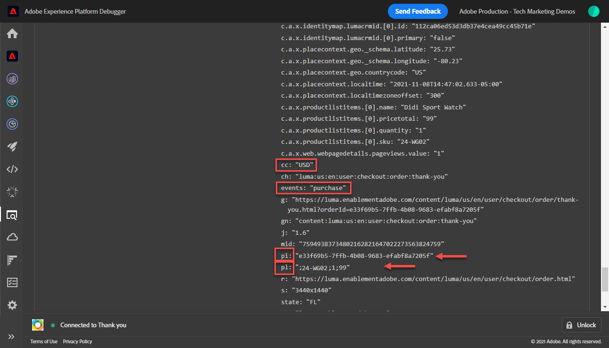
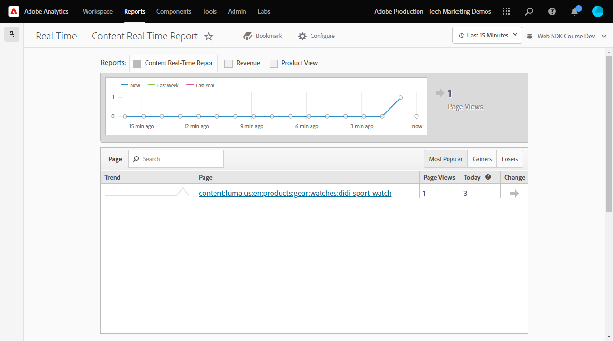
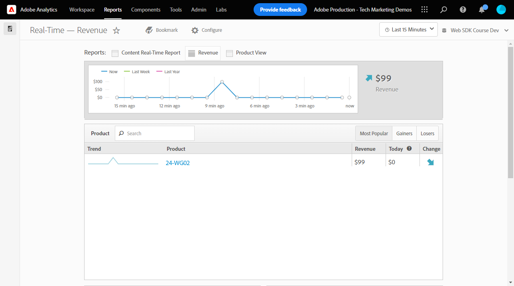
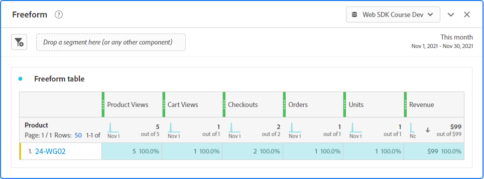

# Configuración de Adobe Analytics con el SDK web de Platform

Obtenga información sobre cómo configurar Adobe Analytics mediante [SDK web de Experience Platform](https://experienceleague.adobe.com/docs/platform-learn/data-collection/web-sdk/overview.html), cree reglas de etiquetas para enviar datos a Adobe Analytics y valide que Analytics está capturando los datos según lo esperado.

[Adobe Analytics](https://experienceleague.adobe.com/docs/analytics.html?lang=es) es una aplicación líder del sector que le permite comprender a sus clientes como personas y dirigir su negocio con inteligencia de clientes.

## Objetivos de aprendizaje

Al final de esta lección, debe poder:

* Configure un esquema XDM para Adobe Analytics y comprenda la diferencia entre variables XDM asignadas automáticamente y asignadas manualmente para Analytics
* Configuración de un conjunto de datos para habilitar Adobe Analytics
* Asignación de elementos de datos de matriz individuales o completos al objeto XDM
* Captura de vistas de página en Adobe Analytics con el objeto XDM
* Capturar datos de comercio electrónico con el objeto XDM para la cadena de producto de Adobe Analytics
* Validar que las variables de Adobe Analytics se establecen con el objeto XDM mediante Experience Platform Debugger
* Usar reglas de procesamiento de Adobe Analytics para establecer variables personalizadas
* Validar que Adobe Analytics capture los datos mediante los informes en tiempo real

## Requisitos previos

Está familiarizado con las etiquetas , Adobe Analytics y [Sitio de demostración de Luma](https://luma.enablementadobe.com/content/luma/us/en.html){target=&quot;_blank&quot;} inicio de sesión y funcionalidad de compra.

Necesita al menos un ID de grupo de informes de prueba o desarrollo. Si no dispone de un grupo de informes de prueba o desarrollo que pueda utilizar para este tutorial, [cree uno](https://experienceleague.adobe.com/docs/analytics/admin/manage-report-suites/new-report-suite/t-create-a-report-suite.html?lang=es).

Debe haber completado todos los pasos de las secciones anteriores en el tutorial:

* Configuración inicial
   * [Configure los permisos](configure-permissions.md)
   * [Configuración de un esquema XDM](configure-schemas.md)
   * [Configuración de un área de nombres de identidad](configure-identities.md)
   * [Configurar un conjunto de datos](configure-datastream.md)
* Configuración de etiquetas
   * [Instalación de la extensión del SDK web](install-web-sdk.md)
   * [Creación de elementos de datos](create-data-elements.md)
   * [Crear una regla de etiqueta](create-tag-rule.md)
   * [Validación con Adobe Experience Platform Debugger](validate-with-debugger.md)

## Esquemas XDM y variables de Analytics

¡Felicidades! Ya ha configurado un esquema compatible con Adobe Analytics en la variable [Configuración de un esquema](configure-schemas.md) lección!

La implementación del SDK web de Platform debe ser lo más independiente posible del producto. Para Adobe Analytics, la asignación de eVars, props y eventos no se produce durante la creación del esquema ni durante la configuración de las reglas de etiquetas, como se ha hecho tradicionalmente. En su lugar, cada par de clave-valor XDM se convierte en una variable de datos de contexto que se asigna a una variable de Analytics de una de las dos maneras siguientes:

1. Variables asignadas automáticamente mediante campos XDM reservados
1. Variables asignadas manualmente mediante reglas de procesamiento de Analytics

Para comprender qué variables XDM se asignan automáticamente a Adobe Analytics, consulte [Variables asignadas automáticamente en Analytics](https://experienceleague.adobe.com/docs/experience-platform/edge/data-collection/adobe-analytics/automatically-mapped-vars.html?lang=en). Cualquier variable que no se asigne automáticamente debe asignarse manualmente.

El esquema creado en la variable [Configuración de un esquema](configure-schemas.md) La lección contiene algunas métricas que se asignan automáticamente a variables de Analytics, como se describe en esta tabla:

| XDM a variables de asignación automática de Analytics | Variable Adobe Analytics |
|-------|---------|
| `identitymap.ecid.[0].id` | mid |
| `web.webPageDetails.pageViews.value` | una llamada s.t() de vista de página |
| `web.webPageDetails.name` | s.pageName |
| `web.webPageDetails.server` | s.server |
| `web.webPageDetails.siteSection` | s.channel |
| `commerce.productViews.value` | prodView |
| `commerce.productListViews.value` | scView |
| `commerce.checkouts.value` | scCheckout |
| `commerce.purchases.value` | compra |
| `commerce.order.currencyCode` | s.currencyCode |
| `commerce.order.purchaseID` | s.purchaseID |
| `productListItems[].SKU` | s.products=;nombre del producto;;; (principal: consulte la Nota siguiente) |
| `productListItems[].name` | s.products=;nombre del producto;;; (reserva - consulte la Nota a continuación) |
| `productListItems[].quantity` | s.products=;;cantidad de producto;; |
| `productListItems[].priceTotal` | s.product=;;;precio del producto;; |

>[!NOTE]
>
>Las secciones individuales de la cadena de producto de Analytics se configuran mediante distintas variables XDM en la variable `productListItems` objeto.
>A partir del 18 de agosto de 2022, `productListItems[].SKU` tiene prioridad para la asignación al nombre del producto en la variable s.products .
>El valor establecido en `productListItems[].name` solo se asigna al nombre del producto si `productListItems[].SKU` no existe. De lo contrario, no está asignado y está disponible en los datos de contexto.
>No configure una cadena vacía o null como  `productListItems[].SKU`. Esto tiene el efecto no deseado de asignar al nombre del producto en la variable s.products .


## Configuración del conjunto de datos

El SDK web de plataforma envía datos del sitio web a Platform Edge Network. A continuación, el conjunto de datos indica a Platform Edge Network dónde reenviar esos datos, en este caso, cuál de sus grupos de informes de Adobe Analytics.

1. Vaya a [Recopilación de datos](https://experience.adobe.com/#/data-collection)Interfaz de {target=&quot;blank&quot;}
1. En el panel de navegación izquierdo, seleccione **[!UICONTROL Datastreams]**
1. Seleccione el `Luma Web SDK` datastream

   

1. Select **[!UICONTROL Añadir servicio]**

   
1. Select **[!UICONTROL Adobe Analytics]** como el **[!UICONTROL Servicio]**
1. Introduzca la variable  **[!UICONTROL ID del grupo de informes]** del grupo de informes de desarrollo
1. Seleccione **[!UICONTROL Guardar]**

   

   >[!TIP]
   >
   >Adición de más grupos de informes seleccionando **[!UICONTROL Agregar grupo de informes]** equivale al etiquetado de grupos múltiples.

>[!WARNING]
>
>En este tutorial, solo puede configurar el grupo de informes de desarrollo de Adobe Analytics. Al crear conjuntos de datos para su propio sitio web, crearía conjuntos de datos y conjuntos de informes adicionales para los entornos de ensayo y producción.


## Crear elementos de datos adicionales

A continuación, capture datos adicionales de la capa de datos de Luma y envíelos a Platform Edge Network. Aunque la lección se centra en los requisitos comunes de Adobe Analytics, todos los datos capturados se pueden enviar fácilmente a otros destinos según la configuración del conjunto de datos. Por ejemplo, si ha completado la lección de Adobe Experience Platform, los datos adicionales que capture en esta lección también se envían a Platform.

### Creación de elementos de datos de comercio electrónico

Durante la lección Crear elementos de datos, usted [creación de elementos de datos de JavaScript](create-data-elements.md#create-data-elements-to-capture-the-data-layer) que capturaron detalles de contenido e identidad. Ahora creará elementos de datos adicionales para capturar datos de comercio electrónico. Porque la variable [Sitio de demostración de Luma](https://luma.enablementadobe.com/content/luma/us/en.html){target=&quot;_blank&quot;} utiliza diferentes estructuras de capa de datos para las páginas de detalles del producto y los productos del carro de compras. Debe crear elementos de datos para cada escenario. Tendrá que crear algunos elementos de datos de código personalizado para obtener lo que necesita de la capa de datos de Luma, lo que puede ser o no necesario al implementar en su propio sitio. En este caso, debe recorrer en bucle una matriz de artículos del carro de compras para obtener detalles específicos de cada producto. Utilice los siguientes fragmentos de código:

1. Abra la propiedad tag que esté utilizando para el tutorial.
1. Vaya a **[!UICONTROL Elementos de datos]**
1. Seleccione **[!UICONTROL Agregar elemento de datos]**
1. Asigne un nombre **`product.productInfo.sku`**
1. Utilice la variable **[!UICONTROL Código personalizado]** **[!UICONTROL Tipo de elemento de datos]**
1. Deje casillas de verificación para **[!UICONTROL Forzar valor de minúsculas]** y **[!UICONTROL Limpiar texto]** sin marcar
1. Leave `None` como el **[!UICONTROL Duración del almacenamiento]** ya que este valor es diferente en cada página
1. Seleccione **[!UICONTROL Abrir editor]**

   

1. Copie y pegue el siguiente código

   ```javascript
   var cart = digitalData.product;
   var cartItem;
   cart.forEach(function(item){
   cartItem = item.productInfo.sku;
   });
   return cartItem;
   ```

1. Select **[!UICONTROL Guardar]** para guardar el código personalizado

   

1. Select **[!UICONTROL Guardar]** para guardar el elemento de datos

Siga los mismos pasos para crear estos elementos de datos adicionales:

* **`product.productInfo.title`**

   ```javascript
   var cart = digitalData.product;
   var cartItem;
   cart.forEach(function(item){
   cartItem = item.productInfo.title;
   });
   return cartItem;
   ```

* **`cart.productInfo`**

   ```javascript
   var cart = digitalData.cart.cartEntries;
   var cartItem = [];
   cart.forEach(function(item, index, array){
   var qty = parseInt(item.qty);
   var price = parseInt(item.price);
   cartItem.push({
   "SKU": item.sku,
   "name":item.title,
   "quantity":qty,
   "priceTotal":price
   });
   });
   return cartItem;
   ```

Después de agregar estos elementos de datos y de crear los anteriores en la variable [Crear elementos de datos](create-data-elements.md) debe tener los siguientes elementos de datos:

| Elementos de datos |
-----------------------------|
| `cart.orderId` |
| `cart.productInfo` |
| `identityMap.loginID` |
| `page.pageInfo.hierarchie1` |
| `page.pageInfo.pageName` |
| `page.pageInfo.server` |
| `product.productInfo.sku` |
| `product.productInfo.title` |
| `user.profile.attributes.loggedIn` |
| `user.profile.attributes.username` |
| `xdm.content` |

>[!IMPORTANT]
>
>En este tutorial, creará un objeto XDM diferente para cada evento. Esto significa que debe reasignar variables que se consideren &quot;globalmente&quot; disponibles en cada visita, como el nombre de página y el mapa de identidad. Sin embargo, puede [Combinar objetos](https://experienceleague.adobe.com/docs/experience-platform/tags/extensions/adobe/core/overview.html#merged-objects) o use [Asignación de tablas](https://exchange.adobe.com/experiencecloud.details.103136.mapping-table.html) para administrar los objetos XDM de forma más eficaz en una situación real. Para esta lección, las variables globales se consideran como:
>
>* **[!UICONTROL identityMap]** para capturar el ID autenticado según la variable [Crear elemento de datos de mapa de identidad](create-data-elements.md#create-identity-map-data-element) en [Crear elementos de datos](create-data-elements.md) lección.
>* **[!UICONTROL web]** para capturar contenido según el [objeto XDM de contenido](create-data-elements.md#map-content-data-elements-to-XDM-Schema-individually) en [Crear elementos de datos](create-data-elements.md) sobre cada elemento de datos anterior.


### Incrementar vistas de página

En la lección Crear elementos de datos , puede [creado un `xdm.content` elemento de datos](create-data-elements.md#map-content-data-elements-to-xdm-schema-individually) para capturar dimensiones de contenido. Dado que ahora está enviando datos a Adobe Analytics, también debe asignar un campo XDM adicional para indicar que una señalización debe procesarse como una vista de página de Analytics.

1. Abra su `xdm.content` elemento de datos
1. Desplácese hacia abajo y seleccione para abrir hasta `web.webPageDetails`
1. Seleccione para abrir el **[!UICONTROL pageViews]** object
1. Establezca **[!UICONTROL value]** a `1`
1. Seleccione [!UICONTROL **Guardar**]

   

>[!TIP]
>
>Este campo equivale a enviar una **`s.t()`** señalización de vista de página para Analytics mediante `AppMeasurement.js`. Para una señalización de clic en un vínculo, establezca la variable `webInteraction.linkClicks.value` a `1`


### Configurar la cadena de producto

Antes de asignar a la cadena de producto, es importante comprender que hay dos objetos principales dentro del esquema XDM que se utilizan para capturar datos de comercio electrónico que tienen relaciones especiales con Adobe Analytics:

1. La variable `commerce` conjuntos de objetos de eventos de Analytics como `prodView`, `scView`y `purchase`
1. La variable `productListItems` conjuntos de objetos dimensiones de Analytics como `productID`.

Consulte [Recopilar datos de productos y comercio](https://experienceleague.adobe.com/docs/experience-platform/edge/data-collection/collect-commerce-data.html?lang=en) para obtener más información.

También es importante comprender que puede **[!UICONTROL proporcionar atributos individuales]** a campos XDM individuales o **[!UICONTROL proporcionar una matriz completa]** a un objeto XDM.


### Asignación de atributos individuales a un objeto XDM

Puede asignar variables individuales para capturar datos en la página de detalles del producto del sitio de demostración de Luma:

1. Cree un **[!UICONTROL Objeto XDM]** **[!UICONTROL Tipo de elemento de datos]** named **`xdm.commerce.prodView`**
1. Seleccione el mismo entorno limitado de Platform y esquema XDM utilizado en lecciones anteriores
1. Abra el **[!UICONTROL comercio]** object
1. Abra el **[!UICONTROL productViews]** objeto y conjunto **[!UICONTROL value]** a `1`

   

   >[!TIP]
   >
   >Este paso equivale a configurar `prodView` en Analytics


1. Desplácese hacia abajo hasta y seleccione `productListItems` matriz
1. Select **[!UICONTROL Proporcionar elementos individuales]**
1. Select **[!UICONTROL Agregar elemento]**

   

   >[!CAUTION]
   >
   >La variable **`productListItems`** es un `array` tipo de datos para que los datos entren como una recopilación de elementos. Debido a la estructura de capa de datos del sitio de demostración de Luma y a que solo es posible ver un producto a la vez en el sitio de Luma, puede agregar elementos individualmente. Al implementar en su propio sitio web, según la estructura de la capa de datos, puede proporcionar una matriz completa.

1. Seleccione para abrir **[!UICONTROL Elemento 1]**
1. Asignación de las siguientes variables XDM a elementos de datos

   * **`productListItems.item1.SKU`** a `%product.productInfo.sku%`
   * **`productListItems.item1.name`** a `%product.productInfo.title%`

   

   >[!IMPORTANT]
   >
   >Antes de guardar este objeto XDM, asegúrese de establecer también las variables &quot;globales&quot; y el incrementador de vistas de página:
   >

1. Seleccione **[!UICONTROL Guardar]**

### Asignación de toda una matriz a un objeto XDM

Como se ha señalado anteriormente, el sitio de demostración de Luma utiliza una estructura de capa de datos diferente para los productos del carro de compras. El elemento de datos de código personalizado `cart.productInfo` elemento de datos que ha creado bucles anteriores a través de `digitalData.cart.cartEntries` el objeto de capa de datos y lo traduce al esquema de objeto XDM requerido. El nuevo formato **debe coincidir exactamente** el esquema definido por la variable `productListItems` del esquema XDM.

Para ilustrarlo, consulte la comparación a continuación de la capa de datos del sitio de Luma (izquierda) con el elemento de datos traducido (derecha):


Compare el elemento de datos con el `productListItems` estructura (sugerencia, debe coincidir).

>[!IMPORTANT]
>
>Tenga en cuenta cómo se traducen las variables numéricas, con valores de cadena en la capa de datos como `price` y `qty` se ha cambiado el formato a números en el elemento de datos. Estos requisitos de formato son importantes para la integridad de los datos en Platform y se determinan durante la [configurar esquemas](configure-schemas.md) paso a paso. En el ejemplo, **[!UICONTROL cantidad]** utiliza la variable **[!UICONTROL Número entero]** tipo de datos.
> 

Ahora vuelva a asignar el objeto XDM a una matriz completa. Cree un elemento de datos de objeto XDM para capturar productos en la página del carro de compras:

1. Cree un **[!UICONTROL Objeto XDM]** **[!UICONTROL Tipo de elemento de datos]** named **`xdm.commerce.cartView`**
1. Seleccione el mismo entorno limitado de Platform y el mismo esquema XDM que utiliza para este tutorial.
1. Abra el **[!UICONTROL comercio]** object
1. Abra el **[!UICONTROL productListViews]** objeto y conjunto `value` a `1`

   >[!TIP]
   >
   >Este paso equivale a configurar `scView` en Analytics

1. Desplácese hacia abajo hasta y seleccione **[!UICONTROL productListItems]** matriz
1. Select **[!UICONTROL Proporcionar toda la matriz]**
1. Asignar a **`cart.productInfo`** elemento de datos

   

   >[!IMPORTANT]
   >
   >Antes de guardar este objeto XDM, asegúrese de establecer también las variables &quot;globales&quot; y el incrementador de vistas de página:
   >

1. Seleccione **[!UICONTROL Guardar]**

Crear otro **[!UICONTROL Objeto XDM]**  **[!UICONTROL Tipo de elemento de datos]** para cierres de compra llamados `xdm.commerce.checkout`. Esta vez, establezca la variable **[!UICONTROL commerce.checkouts.value]** a `1`, mapa **[!UICONTROL productListItems]** a **`cart.productInfo`** como acaba de hacer y añada las variables &quot;globales&quot; y el contador de vistas de página.

>[!TIP]
>
>Este paso equivale a configurar `scCheckout` en Analytics


Hay pasos adicionales para capturar el `purchase` evento:

1. Crear otro  **[!UICONTROL Objeto XDM]**  **[!UICONTROL Tipo de elemento de datos]** para compras llamadas `xdm.commerce.purchase`
1. Apertura **[!UICONTROL comercio]** object
1. Abra el **[!UICONTROL pedido]** object
1. Mapa **[!UICONTROL purchaseID]** a `cart.orderId` elemento de datos
1. Establezca **[!UICONTROL currencyCode]** al valor codificado `USD`

   

   >[!TIP]
   >
   >Esto equivale a configurar `s.purcahseID` y `s.currencyCode` variables en Analytics

1. Seleccione para abrir el `purchases` objeto y conjunto `value` a `1`
   >[!TIP]
   >
   >Esto equivale a configurar `purchase` en Analytics

   >[!IMPORTANT]
   >
   >Antes de guardar este objeto XDM, asegúrese de establecer también las variables &quot;globales&quot; y el incrementador de vistas de página:
   >

1. Seleccione **[!UICONTROL Guardar]**

Al final de estos pasos, debe tener creados los siguientes cinco elementos de datos de objeto XDM:

| Elementos de datos de objeto XDM |
-----------------------------|
| `xdm.commerce.cartView` |
| `xdm.commerce.checkout` |
| `xdm.commerce.prodView` |
| `xdm.commerce.purchase` |
| `xdm.content` |


## Creación de reglas adicionales para el SDK web de Platform

Con la creación de varios elementos de datos de objeto XDM, está listo para establecer las señalizaciones mediante reglas. En este ejercicio, se crean reglas individuales por evento de comercio electrónico y se utilizan condiciones para que las reglas se activen en las páginas correctas. Comencemos con un evento de vista de producto.

1. En el panel de navegación izquierdo, seleccione **[!UICONTROL Reglas]** y, a continuación, seleccione **[!UICONTROL Agregar regla]**
1. Asigne un nombre  [!UICONTROL `product view - library load - AA`]
1. En **[!UICONTROL Eventos]**, seleccione **[!UICONTROL Biblioteca cargada (Principio de página)]**
1. En **[!UICONTROL Condiciones]**, seleccione **[!UICONTROL Agregar]**

   

1. Leave **[!UICONTROL Tipo de lógica]** como **[!UICONTROL Regular]**
1. Leave **[!UICONTROL Extensiones]** como **[!UICONTROL Principal]**
1. Select **[!UICONTROL Tipo de condición]** como **[!UICONTROL Ruta sin cadena de consulta]**
1. A la derecha, habilite el **[!UICONTROL Regex]** alternar
1. En **[!UICONTROL path es igual que]** set `/products/`. Para el sitio de demostración de Luma, garantiza que la regla solo tenga déclencheur en las páginas de producto
1. Seleccione **[!UICONTROL Conservar cambios]**

   

1. En **[!UICONTROL Acciones]** select **[!UICONTROL Agregar]**
1. Select **[!UICONTROL SDK web de Adobe Experience Platform]** Extensión
1. Select **[!UICONTROL Tipo de acción]** como **[!UICONTROL Enviar evento]**
1. La variable **[!UICONTROL Tipo]** tiene una lista desplegable de valores para elegir. Seleccione `[!UICONTROL commerce.productViews]`

   >[!TIP]
   >
   >El valor seleccionado aquí no afecta a cómo se asignan los datos a Analytics, pero se recomienda aplicar esta variable con cuidado, ya que se utiliza en la interfaz del generador de segmentos de Adobe Experience Platform. El valor seleccionado está disponible para su uso en la variable `[!UICONTROL c.a.x.eventtype]` variable de datos de contexto descendente.

1. En **[!UICONTROL Datos XDM]**, seleccione `[!UICONTROL xdm.commerce.prodView]` Elemento de datos de objeto XDM
1. Seleccione **[!UICONTROL Conservar cambios]**

   

1. La regla debe tener un aspecto similar al que se muestra a continuación. Seleccione **[!UICONTROL Guardar]**

   


Repita el mismo proceso para todos los demás eventos de comercio electrónico utilizando los parámetros siguientes:

**Nombre de la regla**: vista del carro de compras - carga de biblioteca - AA

* **[!UICONTROL Tipo de evento]**: Biblioteca cargada (Principio de página)
* **[!UICONTROL Condición]**: /content/luma/us/en/user/cart.html
* **Valor de tipo en SDK web - Enviar acción**: commerce.productListViews
* **Datos XDM para el SDK web: Enviar acción:** `%xdm.commerce.cartView%`

**Nombre de la regla**: cierre de compra - carga de biblioteca - AA

* **[!UICONTROL Tipo de evento]**: Biblioteca cargada (Principio de página)
* **[!UICONTROL Condición]** /content/luma/us/en/user/checkout.html
* **Tipo de SDK web: Enviar acción**: commerce.checkouts
* **Datos XDM para el SDK web: Enviar acción:** `%xdm.commerce.checkout%`

**Nombre de la regla**: purchase - library load - AA

* **[!UICONTROL Tipo de evento]**: Biblioteca cargada (Principio de página)
* **[!UICONTROL Condición]** /content/luma/us/en/user/checkout/order/thank-you.html
* **Tipo de SDK web: Enviar acción**: commerce.purchases
* **Datos XDM para el SDK web: Enviar acción:** `%xdm.commerce.purchase%`

Cuando haya terminado, debería ver las siguientes reglas creadas.


## Cree su entorno de desarrollo

Agregue los nuevos elementos de datos y las reglas a su `Luma Web SDK Tutorial` biblioteca de etiquetas y reconstruya su entorno de desarrollo.


## Validación de Adobe Analytics para el SDK web de Platform

En el [Debugger](validate-with-debugger.md) Aprenda a inspeccionar la señalización del objeto XDM del lado del cliente con Platform Debugger y la consola del desarrollador del explorador, que es similar a cómo depura un `AppMeasurement.js` Implementación de Analytics. Para validar que Analytics captura los datos correctamente mediante el SDK web de Platform, debe seguir dos pasos para:

1. Valide cómo el objeto XDM procesa los datos en la red perimetral de plataforma, utilizando la función de seguimiento perimetral de Experience Platform Debugger
1. Valide cómo Analytics procesa los datos mediante reglas de procesamiento e informes en tiempo real.

### Usar seguimiento de borde

Obtenga información sobre cómo validar que Adobe Analytics está capturando el ECID, las vistas de página, la cadena de producto y los eventos de comercio electrónico con la función Rastreo de Edge de Experience Platform Debugger.

### Validación de ID de Experience Cloud

1. Vaya a la [Sitio de demostración de Luma](https://luma.enablementadobe.com/content/luma/us/en.html){target=&quot;_blank&quot;} y use el Experience Platform Debugger para [cambie la propiedad tag del sitio a su propia propiedad de desarrollo](validate-with-debugger.md#use-the-experience-platform-debugger-to-map-to-your-tags-property)

   >[!WARNING]
   >
   >Antes de continuar, asegúrese de haber iniciado sesión en el sitio de Luma.  Si no ha iniciado sesión, el sitio de Luma no le permite cerrar la sesión.
   >
   > 1. En Luma, seleccione el botón de inicio de sesión en la parte superior derecha y utilice las credenciales **u: test@adobe.com p: prueba** para autenticarse
   >
   > 1. Se le redirigirá automáticamente al [Página de producto de Didi Sport Watch](https://luma.enablementadobe.com/content/luma/us/en/products/gear/watches/didi-sport-watch.html#24-WG02) en la siguiente carga de página


1. Para habilitar el seguimiento de Edge, vaya a Experience Platform Debugger y, en el panel de navegación izquierdo, seleccione **[!UICONTROL Registros]** y, a continuación, seleccione **[!UICONTROL Edge]** y seleccione **[!UICONTROL Connect]**

   

1. Por ahora, estará vacío

   

1. Actualice el [Página de producto de Didi Sport Watch](https://luma.enablementadobe.com/content/luma/us/en/products/gear/watches/didi-sport-watch.html#24-WG02) y vuelva a comprobar Experience Platform Debugger, debería ver los datos que pasan. La fila que comienza con **[!UICONTROL RSID de asignación automática de Analytics]** es la señalización de Adobe Analytics
1. Seleccione para abrir ambas `[!UICONTROL mappedQueryParams]` y el segundo menú desplegable para ver las variables de Analytics

   

   >[!TIP]
   >
   >La segunda lista desplegable corresponde al ID del grupo de informes de Analytics al que está enviando los datos. Debe coincidir con su propio grupo de informes, no con el de la captura de pantalla.

1. Desplácese hacia abajo para buscar `[!UICONTROL c.a.x.identitymap.ecid.[0].id]`. Es una variable de datos de contexto que captura ECID
1. Continúe desplazándose hacia abajo hasta que vea Analytics `[!UICONTROL mid]` variable. Ambos ID coinciden con el ID de Experience Cloud de su dispositivo.

   

   >[!NOTE]
   >
   >Como ha iniciado sesión, dedique un momento a validar el ID autenticado `112ca06ed53d3db37e4cea49cc45b71e` para el usuario **test@adobe.com** también se captura en la variable `[!UICONTROL c.a.x.identitymap.lumacrmid.[0].id]`


### Vistas de páginas de contenido

Analytics utiliza la misma señalización para validar que las vistas de páginas de contenido se capturan.

1. Buscar `[!UICONTROL c.a.x.web.webpagedetails.pageviews.value]=1`. Indica que `s.t()` la señalización de vista de página se envía a Analytics
1. Desplácese hacia abajo para ver la `[!UICONTROL gn]` variable. Es la sintaxis dinámica de Analytics para la variable `[!UICONTROL s.pageName]` variable. Captura el nombre de la página de la capa de datos.

   

### Cadena de producto y eventos de comercio electrónico

Como ya está en una página de productos, este ejercicio sigue utilizando el mismo Edge Trace para validar que Analytics captura los datos del producto. Tanto la cadena de producto como los eventos de comercio electrónico se asignan automáticamente a las variables XDM de Analytics. Siempre y cuando se haya asignado a la `productListItem` Variable XDM al [configuración de un esquema XDM para Adobe Analytics](setup-analytics.md#configure-an-xdm-schema-for-adobe-analytics), Platform Edge Network se encarga de asignar los datos a las variables de análisis adecuadas.

1. Primero valide que la variable `Product String` está configurado
1. Buscar `[!UICONTROL c.a.x.productlistitems.][0].[!UICONTROL sku]`. La variable captura el valor del elemento de datos asignado al `productListItems.item1.sku` más temprano en esta lección
1. Desplácese hacia abajo para ver la `[!UICONTROL pl]` variable. Es la sintaxis dinámica de la variable de cadena de producto de Analytics
1. Ambos valores coinciden con el nombre del producto disponible en la capa de datos

   

El seguimiento de Edge trata `commerce` eventos ligeramente diferentes a `productList` dimensiones. No ve una variable de datos de contexto asignada del mismo modo que ve el nombre del producto asignado a `[!UICONTROL c.a.x.productlistitem.[0].name]` arriba. En su lugar, el seguimiento de Edge muestra la asignación automática del evento final en Analytics `event` variable. Platform Edge Network lo asigna en consecuencia siempre y cuando se asigne al XDM adecuado `commerce` variable while [configuración del esquema para Adobe Analytics](setup-analytics.md#configure-an-xdm-schema-for-adobe-analytics); en este caso, la variable `commerce.productViews.value=1`.

1. Vuelva a la ventana de Experience Platform Debugger y desplácese hacia abajo hasta el `[!UICONTROL event]` , se configura como `[!UICONTROL prodView]`

   

Valide que el resto de eventos de comercio electrónico y las cadenas de producto estén configuradas para Analytics.

1. Agregar [Didi Sport Watch](https://luma.enablementadobe.com/content/luma/us/en/products/gear/watches/didi-sport-watch.html#24-WG02) al carro
1. Vaya a la [Página del carro de compras](https://luma.enablementadobe.com/content/luma/us/en/user/cart.html), marque la opción Rastreo de borde . `[!UICONTROL events: "scView"]` y la cadena de producto

   

1. Continúe con el cierre de compra y marque Rastreo de Edge para `[!UICONTROL events: "scCheckout"]` y la cadena de producto

   

1. Rellene solo el **Nombre** y **Apellidos** campos del formulario de envío y seleccione **Continuar**. En la página siguiente, seleccione **Realizar pedido**
1. En la página de confirmación, marque Rastreo de borde para

   * Evento de compra que se está configurando `[!UICONTROL events: "purchase"]`
   * Variable de código de moneda que se está configurando `[!UICONTROL cc: "USD"]`
   * El ID de compra se establece en `[!UICONTROL pi]`
   * Cadena de productos `[!UICONTROL pl]` configuración del nombre, la cantidad y el precio del producto

   

## Reglas de procesamiento e informes en tiempo real

Ahora que ha validado las señalizaciones de Analytics con Edge Trace, también puede validar que Analytics procese los datos mediante los informes en tiempo real. Antes de comprobar los informes en tiempo real, debe configurar las reglas de procesamiento para Analytics `props` según sea necesario.

### Reglas de procesamiento para asignaciones de Analytics personalizadas

En este ejercicio, se asigna una variable XDM a una prop para que se pueda ver en los informes en tiempo real. Siga estos mismos pasos para cualquier asignación personalizada que deba hacer para cualquier `eVar`, `prop`, `event`o variable accesible mediante reglas de procesamiento.

1. En la interfaz de usuario de Analytics, vaya a [!UICONTROL Administrador] > [!UICONTROL Herramientas de administración] > [!UICONTROL Grupos de informes ]
1. Seleccione el grupo de informes dev/test que está utilizando para el tutorial > [!UICONTROL Editar configuración] > [!UICONTROL General] > [!UICONTROL Reglas de procesamiento]

   

1. Cree una regla para **[!UICONTROL Sobrescribir el valor de]** `[!UICONTROL Product Name (prop1)]` a `a.x.productlistitems.0.name`. Recuerde añadir la nota por la que está creando la regla y asigne un nombre al título de la regla. Seleccione **[!UICONTROL Guardar]**

   

   >[!IMPORTANT]
   >
   >La primera vez que se asigna a una regla de procesamiento, la interfaz de usuario no muestra las variables de datos de contexto del objeto XDM. Para solucionar este problema, seleccione cualquier valor, haga clic en Guardar y vuelva a editarlo. Ahora deben aparecer todas las variables XDM.

1. Vaya a [!UICONTROL Editar configuración] >  [!UICONTROL Tiempo real]. Configure las tres con los siguientes parámetros que se muestran a continuación para que pueda validar las vistas de páginas de contenido, las vistas de productos y las compras

   

1. Repita los pasos de validación y debe ver que los informes en tiempo real rellenan los datos según corresponda.

   **Page Views**
   

   **Vistas del producto**
   

   **Compras**
   

1. En la interfaz de usuario de Workspace, cree una tabla para ver el flujo de comercio electrónico completo del producto que ha comprado

   

Para obtener más información sobre la asignación de campos XDM a variables de Analytics, consulte el vídeo [Asignación de variables de SDK web a Adobe Analytics](https://experienceleague.adobe.com/docs/analytics-learn/tutorials/analysis-use-cases/internal-site-search/map-web-sdk-variables-into-adobe-analytics.html).

¡Felicidades! Este es el final de la lección y ahora está listo para implementar Adobe Analytics con Platform Web SDK para su propio sitio web.

[Siguiente: ](setup-audience-manager.md)

>[!NOTE]
>
>Gracias por invertir su tiempo en obtener información sobre el SDK web de Adobe Experience Platform. Si tiene alguna pregunta, desea compartir comentarios generales o tiene sugerencias sobre contenido futuro, compártalas en este [Experience League de debate de la comunidad](https://experienceleaguecommunities.adobe.com/t5/adobe-experience-platform-launch/tutorial-discussion-implement-adobe-experience-cloud-with-web/td-p/444996)
