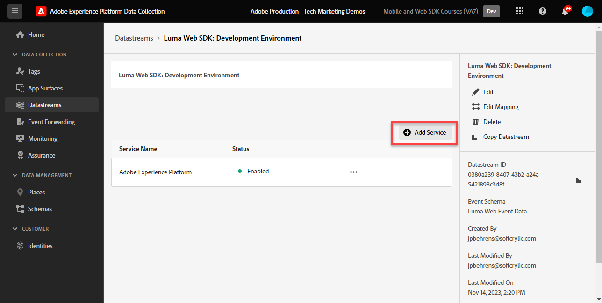

# Configuración de Adobe Analytics con el SDK web de Adobe Experience Platform

Obtenga información sobre cómo configurar Adobe Analytics mediante [Adobe Experience Platform Web SDK](https://experienceleague.adobe.com/es/docs/platform-learn/data-collection/web-sdk/overview), crear reglas de etiquetas para enviar datos a Adobe Analytics y validar que Analytics está capturando los datos según lo esperado.

[Adobe Analytics](https://experienceleague.adobe.com/es/docs/analytics) es una aplicación líder del sector que te permite entender a tus clientes como personas y dirigir tu negocio con inteligencia de clientes.

## Objetivos de aprendizaje

Al final de esta lección, debe poder:

* Configuración de una secuencia de datos para habilitar Adobe Analytics
* Saber qué campos XDM estándar se asignan automáticamente a variables de Analytics
* Establecer variables de Analytics en el objeto de datos
* Enviar datos a otro grupo de informes anulando el conjunto de datos
* Validar variables de Adobe Analytics mediante Debugger y Assurance

## Requisitos previos

Para completar esta lección, primero debe:

* Estar familiarizado con Adobe Analytics y tener acceso a él.

* Tener al menos un ID de grupo de informes de prueba o desarrollo. Si no dispone de un grupo de informes de prueba o desarrollo que pueda usar para este tutorial, [cree uno](https://experienceleague.adobe.com/es/docs/analytics/admin/admin-tools/manage-report-suites/c-new-report-suite/t-create-a-report-suite).

* Complete las lecciones anteriores de las secciones Configuración inicial y Configuración de etiquetas de este tutorial.

## Configuración de la secuencia de datos

El SDK web de Platform envía datos del sitio web al Edge Network de Platform. A continuación, la secuencia de datos indica al Edge Network de Platform a qué grupos de informes de Adobe Analytics se deben enviar los datos.

1. Ir a la interfaz de [recopilación de datos](https://experience.adobe.com/#/data-collection){target="blank"}
1. En el panel de navegación izquierdo, seleccione **[!UICONTROL Datastreams]**
1. Seleccione la secuencia de datos `Luma Web SDK: Development Environment` creada anteriormente

   

1. Seleccionar **[!UICONTROL Agregar servicio]**
   
1. Seleccione **[!UICONTROL Adobe Analytics]** como **[!UICONTROL servicio]**
1. Introduzca la **[!UICONTROL ID del grupo de informes]** de su grupo de informes de desarrollo
1. Seleccionar **[!UICONTROL Guardar]**

   

   >[!TIP]
   >
   >Agregar más grupos de informes seleccionando **[!UICONTROL Agregar grupo de informes]** equivale a un etiquetado de grupos múltiples.

>[!WARNING]
>
>En este tutorial, solo puede configurar el grupo de informes de Adobe Analytics para su entorno de desarrollo. Al crear flujos de datos para su propio sitio web, debe crear flujos de datos y grupos de informes adicionales para los entornos de ensayo y producción.

## Establecer variables de Analytics

Existen varias formas de establecer variables de Analytics en una implementación de SDK web:

1. Asignación automática de campos XDM a variables de Analytics (automática).
1. Establecer campos en el objeto `data` (recomendado).
1. Asigne campos XDM a variables de Analytics en reglas de procesamiento de Analytics (ya no se recomienda).
1. Asigne a variables de Analytics directamente en el esquema XDM (ya no se recomienda).

A partir de mayo de 2024, ya no necesita crear un esquema XDM para implementar Adobe Analytics con el SDK web de Platform. El objeto `data` (y el elemento de datos `data.variable` que creó en la lección [Crear elementos de datos](create-data-elements.md)) se puede usar para establecer todas las variables de Analytics personalizadas. La configuración de estas variables en el objeto de datos resultará familiar a los clientes de Analytics existentes, es más eficaz que el uso de la interfaz de reglas de procesamiento y evita que datos innecesarios ocupen espacio en los perfiles de cliente en tiempo real (importante si tiene Real-time Customer Data Platform o Journey Optimizer).

### Campos asignados automáticamente

Muchos campos XDM se asignan automáticamente a variables de Analytics. Para obtener la lista más actualizada de asignaciones, consulte [Asignación de variables de Analytics en Adobe Experience Edge](https://experienceleague.adobe.com/es/docs/experience-platform/edge/data-collection/adobe-analytics/automatically-mapped-vars).

Esto ocurre si _aunque no haya definido un esquema personalizado_. El SDK web de Experience Platform recopila automáticamente algunos datos y los envía al Edge Network de Platform como campos XDM. Por ejemplo, el SDK web lee la dirección URL de la página actual y la envía como campo XDM `web.webPageDetails.URL`. Este campo se reenvía a Adobe Analytics y rellena automáticamente los informes de URL de la página en Adobe Analytics.

Si implementa un SDK web para Adobe Analytics con un esquema XDM, como ha hecho en este tutorial, algunos de los campos XDM que ha implementado se asignan automáticamente a variables de Analytics, como se describe en esta tabla:

| Variables asignadas automáticamente de XDM a Analytics | variable de Adobe Analytics |
|-------|---------|
| `identitymap.ecid.[0].id` | mid |
| `web.webPageDetails.name` | s.pageName |
| `web.webPageDetails.server` | s.server |
| `web.webPageDetails.siteSection` | s.channel |
| `commerce.productViews.value` | prodView |
| `commerce.productListViews.value` | scView |
| `commerce.checkouts.value` | scCheckout |
| `commerce.purchases.value` | compra |
| `commerce.order.currencyCode` | s.currencyCode |
| `commerce.order.purchaseID` | s.purchaseID |
| `productListItems[].SKU` | s.products=;product name;;;; (primary; consulte la nota más abajo) |
| `productListItems[].name` | s.products=;product name;;;; (reserva: consulte la nota más abajo) |
| `productListItems[].quantity` | s.products=;;product quantity;;; |
| `productListItems[].priceTotal` | s.product=;;;product price;; |

Las secciones individuales de la cadena de producto de Analytics se establecen a través de diferentes variables XDM en el objeto `productListItems`.

>[!NOTE]
>
>A partir del 18 de agosto de 2022, `productListItems[].SKU` tiene prioridad para la asignación al nombre del producto en la variable s.products.
>El valor establecido en `productListItems[].name` se asigna al nombre del producto solamente si `productListItems[].SKU` no existe. De lo contrario, no está asignado y disponible en los datos de contexto.
>No establezca una cadena vacía o nula en `productListItems[].SKU`. Esto tiene el efecto no deseado de asignar al nombre del producto en la variable s.products.

### Establecer variables en el objeto de datos

Pero, ¿qué sucede con las eVars, las props y los eventos? La manera recomendada de establecer estas variables de Analytics con el SDK web es establecer variables en el objeto `data`. La configuración de variables en el objeto de datos también puede sobrescribir cualquiera de las variables asignadas automáticamente.

En primer lugar, ¿qué es el objeto `data`? En cualquier evento del SDK web puede enviar dos objetos con datos personalizados, el objeto `xdm` y el objeto `data`. Ambos se envían al Edge Network de Platform, pero solo el objeto `xdm` se envía al conjunto de datos del Experience Platform. Las propiedades del objeto `data` se pueden asignar en Edge a `xdm` campos mediante la característica Preparación de datos para la recopilación de datos, pero de lo contrario no se enviarán al Experience Platform. Esto lo convierte en una forma ideal de enviar datos a aplicaciones como Analytics, que no están creadas de forma nativa en Experience Platform.

Estos son los dos objetos de una llamada genérica del SDK web:

Adobe Analytics está configurado para buscar cualquier propiedad en el objeto `data.__adobe.analytics` y utilizarla para variables de Analytics.

Ahora veamos cómo funciona esto. Vamos a establecer `eVar1` y `prop1` con nuestro nombre de página y ver cómo se puede sobrescribir el valor asignado a XDM

1. Abrir la regla de etiqueta `all pages - library loaded - set global variables - 1`
1. Agregar nueva **[!UICONTROL acción]**
1. Seleccione la extensión **[!UICONTROL Adobe Experience Platform Web SDK]**
1. Seleccione **[!UICONTROL Tipo de acción]** como **[!UICONTROL variable de actualización]**
1. Seleccione `data.variable` como **[!UICONTROL elemento de datos]**
1. Seleccione el objeto **[!UICONTROL analytics]**
1. Establecer `eVar1` como el elemento de datos `page.pageInfo.pageName`
1. Establezca `prop1` para copiar el valor de `eVar1`
1. Para probar la sobrescritura de valores asignados por XDM, en la sección **[!UICONTROL Propiedad adicional]** establezca el nombre de la página como un valor estático `test`
1. Guarde la regla

Ahora, es necesario incluir el objeto de datos en la regla de evento de envío.

1. Abrir la regla de etiqueta `all pages - library loaded - send event - 50`
1. Abrir la acción **[!UICONTROL Enviar evento]**
1. Seleccionar `data.variable` como **[!UICONTROL datos]**
1. Seleccionar **[!UICONTROL Conservar cambios]**
1. Seleccionar **[!UICONTROL Guardar]**

<!--

### Map to Analytics variables with processing rules

All fields in the XDM schema become available to Adobe Analytics as Context Data Variables with the following prefix `a.x.`. For example, `a.x.web.webinteraction.region`

In this exercise, you map one XDM variable to a prop. Follow these same steps for any custom mapping that you must do for any `eVar`, `prop`, `event`, or variable accessible via Processing Rules.

1. Go to the Analytics interface
1. Go to [!UICONTROL Admin] > [!UICONTROL Admin Tools] > [!UICONTROL Report Suites ]
1. Select the dev/test report suite that you are using for the tutorial > [!UICONTROL Edit Settings] > [!UICONTROL General] > [!UICONTROL Processing Rules]

       

1. Create a rule to **[!UICONTROL Overwrite value of]** `[!UICONTROL Product SKU (prop1)]` to `a.x.productlistitems.0.sku`. Remember to add a note about why you are creating the rule and name your rule title. Select **[!UICONTROL Save]**

       

    >[!IMPORTANT]
    >
    >The first time you map to a processing rule, the UI does not show you the context data variables from the XDM object. To fix that select any value, Save, and come back to edit. All XDM variables should now appear.

### Map to Analytics variables using the Adobe Analytics field group

An alternative to processing rules is to map to Analytics variables in the XDM schema using the `Adobe Analytics ExperienceEvent Template` field group. This approach has gained popularity because many users find it simpler than configuring processing rules, however, by increasing the size of the XDM payload it could in turn increase the profile size in other applications like Real-Time CDP.

To add the `Adobe Analytics ExperienceEvent Template` field group to your schema:

1. Open the [Data Collection](https://experience.adobe.com/#/data-collection){target="blank"} interface
1. Select **[!UICONTROL Schemas]** from the left navigation
1. Make sure you are in the sandbox you are using from the tutorial
1. Open your `Luma Web Event Data` schema
1. In the **[!UICONTROL Field Groups]** section, select **[!UICONTROL Add]**
1. Find the `Adobe Analytics ExperienceEvent Template` field group and add it to your schema

Now, set a merchandising eVar in the product string. With the `Adobe Analytics ExperienceEvent Template` field group, you are able to map variables to merchandising eVars or events within the product string. This is also known as setting **Product Syntax Merchandising**. 

1. Go back to your tag property

1. Open the rule `ecommerce - library loaded - set product details variables - 20`

1. Open the **[!UICONTROL Set Variable]** action

1. Select to open `_experience > analytics > customDimensions > eVars > eVar1`

1. Set the **[!UICONTROL Value]** to `%product.productInfo.title%`

1. Select **[!UICONTROL Keep Changes]**

    

1. Select **[!UICONTROL Save]** to save the rule

As you just saw, basically all of the Analytics variables can be set in the `Adobe Analytics ExperienceEvent Template` field group.

>[!NOTE]
>
> Notice the `_experience` object under `productListItems` > `Item 1`. Setting any variable under this [!UICONTROL object] sets Product Syntax eVars or Events.

-->

## Envío de datos a otro grupo de informes

Es posible que desee cambiar a qué grupos de informes de Adobe Analytics se envían los datos cuando los visitantes se encuentran en determinadas páginas. Esto requiere una configuración tanto en el conjunto de datos como en una regla.

### Configuración de la secuencia de datos para la anulación de un grupo de informes

Para configurar la configuración de anulación de grupos de informes de Adobe Analytics en el conjunto de datos:

1. Abra su secuencia de datos
1. Edite la configuración de **[!UICONTROL Adobe Analytics]** abriendo el menú  y seleccionando **[!UICONTROL Editar]**

   

1. Seleccione **[!UICONTROL Opciones avanzadas]** para abrir **[!UICONTROL Anulaciones de grupos de informes]**

1. Seleccione los grupos de informes que desee anular. En este caso, `Web SDK Course Dev` y `Web SDK Course Stg`

1. Seleccionar **[!UICONTROL Guardar]**

   

### Configuración de una regla para una anulación de grupo de informes

Vamos a crear una regla para enviar una llamada de vista de página adicional a un grupo de informes diferente. Utilice la función de anulación de la secuencia de datos para cambiar el grupo de informes de una página mediante la acción **[!UICONTROL Enviar evento]**.

1. Cree una nueva regla, asígnele el nombre `homepage - library loaded - AA report suite override - 51`

1. Seleccione el signo más bajo **[!UICONTROL Evento]** para agregar un nuevo déclencheur

1. En **[!UICONTROL Extensión]**, seleccione **[!UICONTROL Principal]**

1. En **[!UICONTROL Tipo de evento]**, seleccione **[!UICONTROL Biblioteca cargada (Principio de página)]**

1. Seleccione para abrir **[!UICONTROL Opciones avanzadas]**, escriba `51`. Esto garantiza que la regla se ejecute después de `all pages - library loaded - send event - 50` que establece el XDM de línea de base con el tipo de acción **[!UICONTROL Actualizar variable]**.
1. Seleccionar **[!UICONTROL Conservar cambios]**

   

1. En **[!UICONTROL condiciones]**, seleccione para **[!UICONTROL agregar]**

1. Dejar **[!UICONTROL Tipo de lógica]** como **[!UICONTROL Normal]**

1. Dejar **[!UICONTROL Extensiones]** como **[!UICONTROL Core]**

1. Seleccione **[!UICONTROL Tipo de condición]** como **[!UICONTROL Ruta sin cadena de consulta]**

1. A la derecha, deje deshabilitada la opción **[!UICONTROL Regex]**

1. En **[!UICONTROL ruta igual a]**, conjunto `/content/luma/us/en.html`. Para el sitio de demostración de Luma, garantiza que la regla solo contenga déclencheur en la página principal

1. Seleccionar **[!UICONTROL Conservar cambios]**

   

1. En **[!UICONTROL Acciones]**, seleccione **[!UICONTROL Agregar]**

1. Como la **[!UICONTROL extensión]**, seleccione **[!UICONTROL SDK web de Adobe Experience Platform]**

1. Como **[!UICONTROL Tipo de acción]**, seleccione **[!UICONTROL Enviar evento]**

1. Como **[!UICONTROL datos XDM]**, seleccione el elemento de datos `xdm.variable.content` que creó en la lección [Crear elementos de datos](create-data-elements.md)

1. Como **[!UICONTROL Data]**, seleccione el elemento de datos `data.variable` que creó en la lección [Crear elementos de datos](create-data-elements.md)

   

1. Desplácese hacia abajo hasta la sección **[!UICONTROL Anulaciones de configuraciones de flujo de datos]**

1. Deje seleccionada la ficha **[!UICONTROL Desarrollo]**.

   >[!TIP]
   >
   >    Esta pestaña determina en qué entorno de etiquetas se produce la anulación. Para este ejercicio, solo debe especificar el entorno de desarrollo, pero cuando implemente esto en producción, recuerde hacerlo también en el entorno **[!UICONTROL Production]**.

1. Seleccione la **[!UICONTROL zona protegida]** que está utilizando para el tutorial.
1. Seleccione la **[!UICONTROL secuencia de datos]**, en este caso `Luma Web SDK: Development Environment`

1. En **[!UICONTROL Grupos de informes]**, seleccione el grupo de informes para el que desee anular la selección. En este caso, `tmd-websdk-course-stg`.

1. Seleccionar **[!UICONTROL Conservar cambios]**

1. Y **[!UICONTROL guarda]** tu regla

   

## Cree su entorno de desarrollo

Agregue las reglas actualizadas a la biblioteca de etiquetas `Luma Web SDK Tutorial` y reconstruya el entorno de desarrollo.

¡Felicidades! El siguiente paso es validar la implementación de Adobe Analytics mediante el SDK web de Experience Platform.

## Validar Adobe Analytics con Debugger

Obtenga información sobre cómo validar que Adobe Analytics está capturando los eventos de ECID, vistas de página, la cadena de producto y comercio electrónico con la función Edge Trace de Experience Platform Debugger.

En la lección de [Debugger](validate-with-debugger.md), ha aprendido a inspeccionar la solicitud XDM del lado del cliente con Platform Debugger y la consola para desarrolladores de explorador, algo similar a cómo depurar una implementación de Analytics `AppMeasurement.js`. También ha aprendido a validar las solicitudes del lado del servidor de Platform Edge Network enviadas a aplicaciones de Adobe y a ver una carga útil completamente procesada mediante Assurance.

Para validar que Analytics captura correctamente los datos mediante el SDK web de Experience Platform, debe ir dos pasos más allá para:

1. Valide cómo procesa los datos el objeto XDM en el Edge Network de Platform mediante la función Edge Trace de Experience Platform Debugger
1. Validar cómo Analytics procesa completamente los datos mediante Adobe Experience Platform Assurance

### Validación de ID de Experience Cloud

1. Vaya al [sitio de muestra de Luma](https://luma.enablementadobe.com/content/luma/us/en.html){target="_blank"}
1. Seleccione el botón de inicio de sesión en la parte superior derecha y utilice las credenciales u: test@adobe.com p: test para autenticarse
1. Abra Experience Platform Debugger y [cambie la propiedad de etiquetas del sitio a su propia propiedad de desarrollo](validate-with-debugger.md#use-the-experience-platform-debugger-to-map-to-your-tags-property)

1. Para habilitar el seguimiento de Edge, vaya a Experience Platform Debugger, en el panel de navegación izquierdo, seleccione **[!UICONTROL Registros]**, luego seleccione la pestaña **[!UICONTROL Edge]** y seleccione **[!UICONTROL Conectar]**

   

1. Estará vacío por ahora

   

1. Actualice la página de Luma y vuelva a comprobar Experience Platform Debugger. Debería ver los datos que llegan. La fila que comienza con **[!UICONTROL Asignación automática de Analytics]** es la señalización de Adobe Analytics
1. Seleccione para abrir el menú desplegable `[!UICONTROL mappedQueryParams]` y el segundo menú desplegable para ver las variables de Analytics

   

   >[!TIP]
   >
   >La segunda lista desplegable corresponde al ID del grupo de informes de Analytics al que está enviando los datos. Debe coincidir con su propio grupo de informes, no con el de la captura de pantalla.

1. Desplácese hacia abajo para buscar `[!UICONTROL c.a.x.identitymap.ecid.[0].id]`. Es una variable de datos de contexto que captura el ECID
1. Desplácese hacia abajo hasta que vea la variable `[!UICONTROL mid]` de Analytics. Ambos ID coinciden con el ID de Experience Cloud del dispositivo.
1. En el sitio de Luma,

   

   >[!NOTE]
   >
   >Como ha iniciado sesión, dedique un momento a validar que el identificador autenticado `112ca06ed53d3db37e4cea49cc45b71e` para el usuario **`test@adobe.com`** también se captura en `[!UICONTROL c.a.x.identitymap.lumacrmid.[0].id]`

### Validación de anulación de grupo de informes

Arriba configuró un reemplazo de secuencia de datos para la [página principal de Luma](https://luma.enablementadobe.com/content/luma/us/en.html).  Para validar esta configuración

1. Busque una fila con la configuración de flujo de datos **[!UICONTROL después de aplicar la invalidación]**. Aquí encontrará el grupo de informes principal y los grupos de informes adicionales que se configuraron para las anulaciones del grupo de informes.

   

1. Desplácese hacia abajo hasta la fila que comienza con **[!UICONTROL Asignación automática de Analytics]** y compruebe que `[!UICONTROL reportSuiteIds]` muestra el grupo de informes que especificó en las configuraciones de invalidación

   

### Validación de vistas de página de contenido

Vaya a una página de producto como la [página de productos Didi Sport Watch](https://luma.enablementadobe.com/content/luma/us/en/products/gear/watches/didi-sport-watch.html#24-WG02).  Compruebe que Analytics captura las vistas de páginas de contenido.

1. Busque `[!UICONTROL c.a.x.web.webpagedetails.pageviews.value]=1`.
1. Desplácese hacia abajo para ver la variable `[!UICONTROL gn]`. Es la sintaxis dinámica de Analytics para la variable `[!UICONTROL s.pageName]`. Captura el nombre de página de la capa de datos.

   

### Validación de eventos de cadena de producto y comercio electrónico

Como ya está en una página de producto, este ejercicio sigue utilizando el mismo seguimiento de Edge para validar que Analytics capture los datos del producto. Tanto la cadena de producto como los eventos de comercio electrónico se asignan automáticamente a variables XDM de Analytics. Siempre que haya asignado la variable XDM `productListItem` adecuada al [configurar un esquema XDM para Adobe Analytics](setup-analytics.md#configure-an-xdm-schema-for-adobe-analytics), el Edge Network de Platform se encarga de asignar los datos a las variables de análisis adecuadas.

**Primero valide que `Product String` está establecido**

1. Busque `[!UICONTROL c.a.x.productlistitems.][0].[!UICONTROL sku]`. La variable captura el valor del elemento de datos que asignó a `productListItems.item1.sku` anteriormente en esta lección
1. Busque también `[!UICONTROL c.a.x.productlistitems.][0].[!UICONTROL _experience.analytics.customdimensions.evars.evar1]`. La variable captura el valor del elemento de datos que asignó a `productListItems.item1._experience.analytics.customdimensions.evars.evar1`
1. Desplácese hacia abajo para ver la variable `[!UICONTROL pl]`. Es la sintaxis dinámica de la variable de cadena de producto de Analytics
1. Tenga en cuenta que el nombre de producto de la capa de datos está asignado tanto al parámetro `[!UICONTROL c.a.x.productlistitems.][0].[!UICONTROL sku]` como al parámetro `[!UICONTROL product]` de la cadena de productos.  Además, el título de producto de la capa de datos se asigna a la evar1 de comercialización en la cadena de productos.

   

   El seguimiento de Edge trata los eventos de `commerce` de manera ligeramente diferente que las dimensiones de `productList`. No ve una variable de datos de contexto asignada de la misma manera que ve el nombre del producto asignado a `[!UICONTROL c.a.x.productlistitem.[0].name]` más arriba. En su lugar, el seguimiento de Edge muestra la asignación automática del evento final en la variable `event` de Analytics. El Edge Network de la plataforma lo asigna en consecuencia, siempre y cuando se asigne a la variable XDM `commerce` adecuada al [configurar el esquema para Adobe Analytics](setup-analytics.md#configure-an-xdm-schema-for-adobe-analytics); en este caso, `commerce.productViews.value=1`.

1. Cuando vuelva a la ventana de Experience Platform Debugger, desplácese hacia abajo hasta la variable `[!UICONTROL events]` y establezca su valor en `[!UICONTROL prodView]`

1. Tenga en cuenta también que `[!UICONTROL c.a.x.eventType]` está establecido en `commerce.productViews`, ya que se encuentra en una página de producto.

   >[!TIP]
   >
   > La regla `ecommerce - pdp library loaded - AA (order 20)` está sobrescribiendo el valor de `eventType` establecido por la regla `all pages global content variables - library loaded - AA (order 1)`, ya que se establece en déclencheur más adelante en la secuencia

   

**Validar el resto de los eventos de comercio electrónico y las cadenas de producto establecidos para Analytics**

1. Añadir [Reloj Didi Sport](https://luma.enablementadobe.com/content/luma/us/en/products/gear/watches/didi-sport-watch.html#24-WG02) al carro de compras
1. Vaya a la [página del carro](https://luma.enablementadobe.com/content/luma/us/en/user/cart.html) y busque el seguimiento de Edge

   * `eventType` se estableció en `commerce.productListViews`
   * `[!UICONTROL events: "scView"]` y
   * se establece la cadena de producto

   

1. Continúe con el cierre de compra y compruebe Edge Trace para

   * `eventType` se estableció en `commerce.checkouts`
   * `[!UICONTROL events: "scCheckout"]` y
   * se establece la cadena de producto

   

1. Rellene solo los campos **Nombre** y **Apellido** del formulario de envío y seleccione **Continuar**. En la página siguiente, seleccione **Realizar pedido**
1. En la página de confirmación, compruebe el seguimiento de Edge para

   * `eventType` se estableció en `commerce.purchases`
   * Evento de compra establecido `[!UICONTROL events: "purchase"]`
   * Variable de código de moneda establecida `[!UICONTROL cc: "USD"]`
   * ID de compra establecido en `[!UICONTROL pi]`
   * Cadena de producto `[!UICONTROL pl]` que establece el nombre, la cantidad y el precio del producto

   

## Validar Adobe Analytics con Assurance

Adobe Experience Platform Assurance le ayuda a inspeccionar, probar, simular y validar la forma en que recopila datos o sirve las experiencias con su sitio web y aplicación móvil.

En el ejercicio anterior validó que Adobe Analytics está capturando los eventos de ECID, vistas de página, la cadena de producto y comercio electrónico con la función Edge Trace de Experience Platform Debugger.  A continuación, valide esos mismos eventos mediante Adobe Experience Platform Assurance, una interfaz alternativa para acceder a los mismos datos en Edge Trace.

Como aprendió en la lección de [Assurance](validate-with-assurance.md), hay varias formas de iniciar una sesión de Assurance. Dado que ya tiene abierto el Adobe Experience Platform Debugger con una sesión de seguimiento de Edge iniciada desde el último ejercicio, le recomendamos que acceda a Assurance a través de Debugger:

En la sesión de garantía **[!UICONTROL &quot;Tutorial de SDK web 3&quot;]**&quot;, escriba **[!UICONTROL &quot;hitdebugger&quot;]** en la barra de búsqueda de eventos para filtrar los resultados a los datos procesados de Adobe Analytics Post.

### Validación de ID de Experience Cloud

Para validar que Adobe Analytics está capturando el ECID, seleccione una señalización y abra la carga útil.  El proveedor de esta señalización debe ser **[!UICONTROL com.adobe.analytics.hitdebugger]**

A continuación, desplácese hacia abajo hasta **[!UICONTROL mcvisId]** para validar que el ECID se captura correctamente

### Validación de vistas de página de contenido

Con la misma señalización, compruebe que las vistas de página de contenido estén asignadas a la variable de Adobe Analytics correcta.
Desplácese hacia abajo hasta **[!UICONTROL pageName]** para comprobar que `Page Name` se ha capturado correctamente

### Validación de eventos de cadena de producto y comercio electrónico

Siguiendo los mismos casos de uso de validación utilizados al validar con Experience Platform Debugger anteriormente, siga utilizando la misma señalización para validar `Ecommerce Events` y `Product String`.

1. Busque carga útil donde los **[!UICONTROL eventos]** contienen `prodView`
   
1. Desplácese hasta **[!UICONTROL product-string]** para validar `Product String`.
   * Observe `Product SKU` y `Merchandizing eVar1`.
1. Desplácese hacia abajo y valide que `prop1`, que configuró mediante las reglas de procesamiento de la sección anterior, contiene `Product SKU`\
   

Siga validando la implementación revisando el carro de compras, el cierre de compra y los eventos de compra.

1. Busque la carga donde **[!UICONTROL events]** contienen `scView` y valide la cadena de producto.
   
1. Busque la carga donde **[!UICONTROL events]** contienen `scCheckout` y valide la cadena de producto.
   
1. Busque carga útil donde los **[!UICONTROL eventos]** contienen `purchase`
   
1. Al validar el evento `purchase`, tenga en cuenta que `Product String` debe contener `Product SKU`, `Product Quantity` y `Product Total Price`.
1. Además, para `purchase`, valide que `purchase-id` y/o `purchaseId` están establecidos

¡Felicidades! ¡Tú lo hiciste! Este es el final de la lección y ahora está listo para implementar Adobe Analytics con el SDK web de Platform para su propio sitio web.

[Siguiente: ](setup-audience-manager.md)

>[!NOTE]
>
>Gracias por dedicar su tiempo a conocer el SDK web de Adobe Experience Platform. Si tiene preguntas, desea compartir comentarios generales o tiene sugerencias sobre contenido futuro, compártalas en esta [publicación de debate de la comunidad de Experience League](https://experienceleaguecommunities.adobe.com/t5/adobe-experience-platform-data/tutorial-discussion-implement-adobe-experience-cloud-with-web/td-p/444996?profile.language=es)
