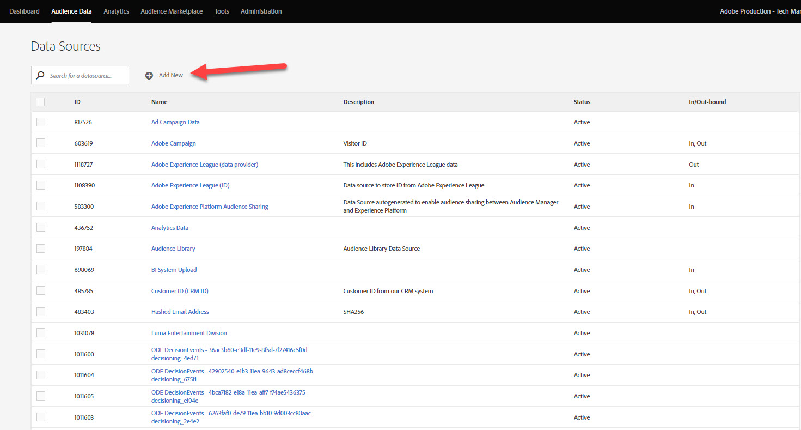
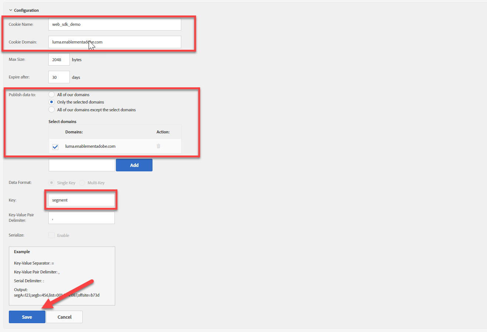

# Configuración del Audience Manager con el SDK web de Platform

Obtenga información sobre cómo configurar Adobe Audience Manager mediante el SDK web de Platform y validar la implementación mediante un destino de cookie.

[Adobe Audience Manager](https://experienceleague.adobe.com/en/docs/audience-manager) es la solución de Adobe Experience Cloud que proporciona todo lo necesario para recopilar información relevante desde el punto de vista comercial acerca de los visitantes del sitio, crear segmentos comercializables y ofrecer contenido y publicidad segmentada a la audiencia adecuada.

## Objetivos de aprendizaje

Al final de esta lección, debe poder:

* Configuración de una secuencia de datos para habilitar Audience Manager
* Habilitar un destino de cookie en Audience Manager
* Valide la implementación del Audience Manager confirmando la calificación de la audiencia con el Adobe Experience Platform Debugger.

## Requisitos previos

Para completar esta lección, primero debe:

* Complete las lecciones anteriores de las secciones Configuración inicial y Configuración de etiquetas de este tutorial.
* Tener acceso a Adobe Audience Manager y los permisos adecuados para crear, leer y escribir características, segmentos y destinos. Para obtener más información, consulte [Control de acceso basado en roles de Audience Manager](https://experienceleague.adobe.com/en/docs/audience-manager-learn/tutorials/setup-and-admin/user-management/setting-permissions-with-role-based-access-control).

## Configuración de la secuencia de datos

La implementación del Audience Manager mediante el SDK web de Platform difiere de la implementación mediante [reenvío del lado del servidor (SSF)](https://experienceleague.adobe.com/en/docs/analytics/admin/admin-tools/server-side-forwarding/ssf). El reenvío del lado del servidor pasa los datos de solicitud de Adobe Analytics al Audience Manager. Una implementación del SDK web de Platform pasa los datos XDM enviados al Edge Network de Platform al Audience Manager. El Audience Manager está habilitado en el conjunto de datos:

1. Ir a [Recopilación de datos](https://experience.adobe.com/#/data-collection){target="blank"} interfaz
1. En el panel de navegación izquierdo, seleccione **[!UICONTROL Datastreams]**
1. Seleccione el creado anteriormente `Luma Web SDK: Development Environment` secuencia de datos

   

1. Seleccionar **[!UICONTROL Añadir servicio]**
   
1. Seleccionar **[!UICONTROL Adobe Audience Manager]** como el **[!UICONTROL Servicio]**
1. Confirme que **[!UICONTROL Destinos de cookies habilitados]** y **[!UICONTROL Destinos URL habilitados]** están seleccionados
1. Seleccionar **[!UICONTROL Guardar]**
   

## Crear una fuente de datos

A continuación, cree un [Fuente de datos](https://experienceleague.adobe.com/en/docs/audience-manager/user-guide/features/data-sources/datasources-list-and-settings), una herramienta fundamental para organizar los datos en Audience Manager:

1. Vaya a la [Audience Manager](https://experience.adobe.com/#/audience-manager/) interfaz
1. Seleccionar **[!UICONTROL Datos de audiencia]** desde la barra de navegación superior
1. Seleccione el **[!UICONTROL Fuentes de datos]** en el menú desplegable
1. Seleccione el **[!UICONTROL Añadir nuevo]** de la parte superior de la página Fuentes de datos

   

1. Asigne a la fuente de datos un nombre descriptivo y una descripción. Para la configuración inicial, puede nombrar esto `Platform Web SDK tutorial`.
1. Establecer **[!UICONTROL Tipo de ID]** hasta **[!UICONTROL Cookie]**
1. En el **[!UICONTROL Controles de exportación de datos]** , seleccione **[!UICONTROL Sin restricciones]**

   

1. **[!UICONTROL Guardar]** la fuente de datos

## Crear un rasgo

Una vez guardada la fuente de datos, configure un [rasgo](https://experienceleague.adobe.com/en/docs/audience-manager/user-guide/features/traits/traits-overview). Los rasgos son una combinación de una o más señales en Audience Manager. Cree una característica para los visitantes de la página principal.

>[!NOTE]
>
>Todos los datos XDM se envían al Audience Manager si están habilitados en el conjunto de datos, pero los datos pueden tardar 24 horas hasta que estén disponibles en el informe Señales no utilizadas. Cree rasgos explícitos para los datos XDM que desee utilizar inmediatamente en Audience Manager, tal como se describe en este ejercicio.

1. Seleccionar **[!UICONTROL Datos de audiencia]** >  **[!UICONTROL Características]**
1. Seleccionar **[!UICONTROL Añadir nuevo]** >  **[!UICONTROL Basado en reglas]** rasgo

   

1. Asigne un nombre y una descripción descriptivos a su rasgo, `Luma homepage view`
1. Seleccione el **[!UICONTROL Fuente de datos]** que creó en la sección anterior.
1. **[!UICONTROL Seleccionar una carpeta]** en el que se guarda el rasgo en el panel de la derecha. Es posible que desee crear una carpeta **selección del icono +** junto a una carpeta principal existente. Puede asignar un nombre a esta nueva carpeta `Platform Web SDK tutorial`.
1. Expanda el **[!UICONTROL Expresión de rasgo]** y seleccione. **[!UICONTROL Generador de expresiones]** Debe proporcionar un par de valor clave que signifique una visita a la página principal.
1. Abra el [Página principal de Luma](https://luma.enablementadobe.com/content/luma/us/en.html) (asignado a su propiedad de etiquetas) y el **Adobe Experience Platform Debugger** y actualice la página.
1. Consulte las Solicitudes de red y los detalles del evento para el SDK web de Platform para encontrar la clave y el valor del nombre para la página principal.
   
1. Vuelva al Generador de expresiones en la interfaz de usuario de Audience Manager e introduzca la clave como **`web.webPageDetails.name`** y el valor de **`content:luma:us:en`**. Este paso garantiza que active una característica cada vez que cargue la página principal.
1. **[!UICONTROL Guardar]** el rasgo.

## Crear un segmento

El siguiente paso es crear una **segmento** y asigne el rasgo recién definido a este segmento.

1. Seleccionar **[!UICONTROL Datos de audiencia]** en la barra de navegación superior y seleccione **[!UICONTROL Segmentos]**
1. Seleccionar **[!UICONTROL Añadir nuevo]** en la parte superior izquierda de la página para abrir el generador de segmentos
1. Asigne a su segmento un nombre descriptivo y una descripción, como `Platform Web SDK - Homepage visitors`
1. **[!UICONTROL Seleccionar una carpeta]** dónde se guardará el segmento en el panel situado a la derecha. Es posible que desee crear una carpeta **selección del icono +** junto a una carpeta principal existente. Puede asignar un nombre a esta nueva carpeta `Platform Web SDK tutorial`.
1. Añada un código de integración, que en este caso es un conjunto aleatorio de números.
1. En el **[!UICONTROL Fuente de datos]** , seleccione **[!UICONTROL Audience Manager]** y la fuente de datos que creó anteriormente
1. Expanda el **[!UICONTROL Características]** y busque el rasgo que ha creado
1. Seleccionar **[!UICONTROL Agregar característica]**.
1. Seleccionar **[!UICONTROL Guardar]** al final de la página

   

   

## Crear un destino

A continuación, cree un **Destino basado en cookies** uso del **Generador de destino**. El Generador de destinos permite crear y administrar destinos de servidor a servidor, direcciones URL y cookies.

1. Abra el Generador de destinos seleccionando **[!UICONTROL Destinos]** dentro de **Datos de audiencia** menú en la barra de navegación superior
1. Seleccionar **[!UICONTROL Crear destino]**
1. Introduzca un nombre y una descripción, `Platform Web SDK tutorial`
1. Como el **[!UICONTROL Categoría]**, seleccione **[!UICONTROL Personalizado]**
1. Como el **[!UICONTROL Tipo]**, seleccione **[!UICONTROL Cookie]**

   

1. Abra el **[!UICONTROL Configuración]** para introducir los detalles sobre el destino de la cookie
1. Asigne un nombre descriptivo a la cookie, `platform_web_sdk_tutorial`
1. Como el **[!UICONTROL Dominio de cookie]**, añada el dominio del sitio donde planea la integración, para la entrada del tutorial el dominio de Luma, `luma.enablementadobe.com`
1. Como el **[!UICONTROL Publicación de datos en]** , seleccione **[!UICONTROL Solo los dominios seleccionados]**
1. Seleccione su dominio si aún no lo ha agregado
1. Como el **[!UICONTROL Formato de datos]**, seleccione **[!UICONTROL Clave única]** y proporcione una clave a su cookie. Para este tutorial, utilice `segment` como valor clave.
1. Finalmente, seleccione **[!UICONTROL Guardar]** para guardar los detalles de configuración de destino.

   

<!--
   

   
-->

1. En el **[!UICONTROL Asignaciones de segmentos]** , utilice la sección **[!UICONTROL Buscar y agregar segmentos]** función para buscar la creada anteriormente `Platform Web SDK - Homepage visitors` y seleccione **[!UICONTROL Añadir]**.

1. Una vez que agregue el segmento, se abrirá una ventana emergente en la que debe proporcionar un valor esperado para la cookie. Para este ejercicio, introduzca el valor &quot;visitante&quot;.

1. Seleccionar **[!UICONTROL Guardar]**

1. Seleccionar **[!UICONTROL Listo]**
   

El periodo de asignación de segmentos requiere que se activen unas horas. Una vez finalizada, puede actualizar la interfaz de Audience Manager y ver que la variable **Segmentos asignados** lista actualizada.

## Validación del segmento

Unas horas después de la creación inicial del segmento, puede validar que funciona correctamente.

En primer lugar, confirme que puede optar al segmento

1. Abra el [Página principal del sitio de demostración de Luma](https://luma.enablementadobe.com/content/luma/us/en.html) con él asignado a su propiedad de etiquetas para cumplir los requisitos del segmento recién creado.
1. Abra el del explorador **herramientas para desarrolladores**  > **Red** pestaña
1. Filtre por la solicitud del SDK web de Platform usando `interact` como filtro de texto
1. Seleccione una llamada y abra el **Previsualizar** para ver los detalles de la respuesta
1. Expanda el **carga útil** para ver los detalles de la cookie esperados, tal como se configuró anteriormente en Audience Manager. En este ejemplo, verá el nombre de cookie esperado `platform_web_sdk_tutorial`.

   

1. Abra el **Aplicación** y abra. **Cookies** desde el **Almacenamiento** menú.
1. Seleccione el **`https://luma.enablementadobe.com`** y confirme que su cookie está escrita correctamente en la lista

   

Por último, debe abrir el segmento en la interfaz de Audience Manager y asegurarse de que la variable **Poblaciones de segmentos** ha incrementado:

Ahora que ha completado esta lección, debe poder ver cómo el SDK web de Platform pasa datos a Audience Manager y puede establecer una cookie de origen específica de un segmento con un destino de cookie.

[Siguiente: ](setup-target.md)

>[!NOTE]
>
>Gracias por dedicar su tiempo a conocer el SDK web de Adobe Experience Platform. Si tiene preguntas, desea compartir comentarios generales o tiene sugerencias sobre contenido futuro, compártalas en este [Entrada de discusión de la comunidad Experience League](https://experienceleaguecommunities.adobe.com/t5/adobe-experience-platform-launch/tutorial-discussion-implement-adobe-experience-cloud-with-web/td-p/444996)
