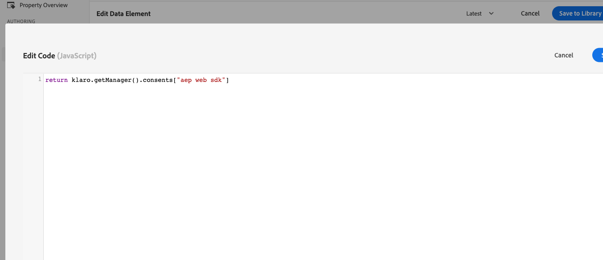

# Configuración del consentimiento con Platform Web SDK

Obtenga información sobre cómo configurar la privacidad de la extensión de etiquetas Adobe Experience Platform Web SDK. Establezca el consentimiento en función de la interacción del visitante con un titular de una plataforma de administración de consentimiento (CMP).

>[!NOTE]
> 
>Para fines de demostración, este tutorial utiliza [Klaro](https://klaro.org/) como CMP. Puede seguir a través de Klaro o el CMP que use con su sitio web.


## Objetivos de aprendizaje

Al final de esta lección, puede hacer lo siguiente:

* Carga de una CMP mediante etiquetas
* Configuración de la privacidad en la extensión de etiquetas Experience Platform Web SDK
* Establezca el consentimiento para Experience Platform Web SDK según la acción del visitante

## Requisitos previos

Debe estar familiarizado con las etiquetas y los pasos para crear reglas, elementos de datos, crear bibliotecas en entornos y cambiar de bibliotecas de etiquetas con Experience Platform Debugger.

Antes de empezar a configurar la configuración de privacidad y a crear las reglas para configurar el consentimiento, asegúrese de haber insertado el script de la plataforma de administración de consentimiento en el sitio web y de que funcione correctamente. Una CMP se puede cargar directamente en el código fuente con la ayuda de los desarrolladores del sitio o cargarse a través de las etiquetas. Esta lección demuestra este último enfoque.

>[!NOTE]
> 
>1. Las organizaciones utilizan una plataforma de administración de consentimiento (o CMP) para documentar y administrar legalmente las opciones de consentimiento de un visitante antes de recopilar, compartir o vender datos de visitantes de fuentes en línea como sitios web y aplicaciones.
>
>2. El método recomendado para insertar una CMP es directamente a través del código fuente antes del script del administrador de etiquetas.

### Configuración de Klaro

Antes de ir a las configuraciones de etiquetas, obtenga más información acerca de la plataforma de administración de consentimiento utilizada en este tutorial de Klaro.

1. Visita [Klaro](https://klaro.org/) y configura una cuenta.
1. Vaya a **Administrador de privacidad** y cree una instancia de acuerdo con las instrucciones.
1. Use el **Código de integración** para insertar Klaro en su propiedad de etiquetas (las instrucciones se encuentran en el siguiente ejercicio).
1. Omita la sección **Análisis**, ya que detecta la propiedad de etiqueta codificada en el sitio web de demostración de Luma y no la que creó para este tutorial.
1. Agregue un servicio llamado `aep web sdk` y active **Estado predeterminado del servicio**. Cuando está activado, el valor de consentimiento predeterminado es `true`; de lo contrario, es `false`. Esta configuración es útil cuando desea decidir cuál va a ser el estado de consentimiento predeterminado (antes del consentimiento del visitante) para la aplicación web. Por ejemplo:
   * Para la CCPA, el consentimiento predeterminado suele establecerse en `true`. Va a hacer referencia a este escenario como **inclusión implícita** en todo este tutorial
   * Para el RGPD, el consentimiento predeterminado suele establecerse en `false`. Va a hacer referencia a este escenario como **exclusión implícita** a lo largo de este tutorial.

<!--
    This consent value can be verified by returning the JavaScript object ```klaro.getManager().consents``` in the browser's developer console.
-->
    >[!NOTE]
    >
    >En general, los pasos mencionados anteriormente los realiza y se encargan el equipo o la persona responsable de administrar la CMP, como OneTrust o TrustArc.

## Inyectar una CMP

>[!WARNING]
>
>La práctica recomendada para implementar una plataforma de administración de consentimiento es cargar la CMP _antes de_ cargar el administrador de etiquetas. Para facilitar este tutorial, cargará la CMP _con_ el administrador de etiquetas. Esta lección está diseñada para mostrarle cómo utilizar las funciones de consentimiento de Platform Web SDK y no debe utilizarse como guía para configurar correctamente Klaro o cualquier otra CMP.


Ahora, una vez que haya terminado con las configuraciones de Klaro, cree reglas de etiquetas con las siguientes configuraciones:

* [!UICONTROL Nombre]: `all pages - library load - Klaro`
* [!UICONTROL Evento]: [!UICONTROL Biblioteca cargada (Principio de página)] con [!UICONTROL Opciones avanzadas] > [!UICONTROL Pedido] establecido en 1
* [!UICONTROL Acción]: [!UICONTROL Código personalizado], [!UICONTROL Idioma]: HTML para cargar el script CMP.


El bloque de código personalizado debe ser similar al siguiente:


Ahora guarde y cree esta regla en su biblioteca de desarrollo y valide que se muestra el banner de consentimiento cambiando la biblioteca de etiquetas del sitio de Luma por la suya propia. Debería ver un banner de CMP en el sitio web, como se muestra a continuación. Y para comprobar el permiso de consentimiento del visitante actual, puede utilizar el siguiente fragmento en la consola del explorador.

```javascript
    klaro.getManager().consents 
```


Para entrar en modo de depuración, utilice la siguiente casilla de verificación en Adobe Experience Platform Debugger.


Además, es posible que tenga que borrar las cookies y el almacenamiento local varias veces mientras sigue este tutorial, ya que el valor de consentimiento del visitante se almacena allí. Puede hacerlo de la siguiente manera:


## Escenarios de consentimiento

Los actos de privacidad como el RGPD, la CCPA y otros desempeñan un papel vital en la forma en que crea la implementación del consentimiento. En esta lección, explora cómo un visitante puede interactuar con el banner de consentimiento en dos actos de privacidad más destacados.


### Escenario 1: inclusión implícita

La inclusión implícita significa que la empresa no necesita obtener el consentimiento del visitante (o la &quot;inclusión&quot;) antes de recopilar sus datos y, por lo tanto, todos los visitantes del sitio web se tratan como &quot;incluidos&quot; de forma predeterminada. Sin embargo, el visitante puede excluirse rechazando las cookies a través del banner de consentimiento. Este caso de uso es similar a la CCPA.

Ahora configurará e implementará el consentimiento para este escenario:

1. En la sección **[!UICONTROL Privacidad]** de la extensión de etiquetas Experience Platform Web SDK, asegúrese de que **[!UICONTROL Consentimiento predeterminado]** está establecido en **[!UICONTROL En]**:


   

   >[!NOTE]
   > 
   >Para una solución dinámica, seleccione la opción &quot;Proporcionar un elemento de datos&quot; y pase un elemento de datos que devuelva el valor de ```klaro.getManager().consents```
   >
   >Esta opción se utiliza si CMP se inserta en el código fuente *antes de* el código incrustado de etiqueta para que el consentimiento predeterminado esté disponible antes de que la extensión de Experience Platform Web SDK comience a cargarse. En este ejemplo, no se puede utilizar esta opción porque CMP se carga con etiquetas y no antes de las etiquetas.


2. Guarde y cree este cambio en la biblioteca de etiquetas
3. Cargue la biblioteca de etiquetas en el sitio de demostración de Luma.
4. Habilite la depuración de etiquetas en el sitio de Luma y vuelva a cargar la página. En la consola para desarrolladores del explorador, debería ver que defaultConsent es igual a **[!UICONTROL In]**
5. Con esta configuración, la extensión Experience Platform Web SDK sigue realizando solicitudes de red, a menos que un visitante decida rechazar las cookies y la exclusión:

   


Si un visitante decide excluirse (rechazar las cookies de seguimiento), debe cambiar el consentimiento a **[!UICONTROL Exclusión]**. Cambie la configuración de consentimiento siguiendo estos pasos:

<!--
1. Create a data element to store the consent value of the visitor. Let's call it `klaro consent value`. Use the code snippet to create a custom code type data element:
    
    ```javascript
    return klaro.getManager().consents["aep web sdk"]
    ```

    


1. Create another custom code data element, `consent confirmed`, with the following snippet which returns ```true``` only after a visitor confirms consent:

    
    ```javascript
    return klaro.getManager().confirmed
    ```

    
-->

1. Crea una regla que genere un déclencheur cuando el visitante haga clic en **Rechazo**.  Asigne un nombre a esta regla como: `all pages - click consent banner - set consent "out"`

1. Como **[!UICONTROL evento]**, use **[!UICONTROL Click]** en **[!UICONTROL elementos que coincidan con el selector de CSS]** `#klaro .cn-decline`

   

1. Ahora, use Experience Platform Web SDK, [!UICONTROL Establecer consentimiento] [!UICONTROL tipo de acción] para establecer el consentimiento como &quot;saliente&quot;:

   

1. Seleccione **[!UICONTROL Guardar en biblioteca y compilar]**:

   

Ahora, cuando un visitante se excluye, la regla configurada de la manera anterior se activaría y establecería el consentimiento de Web SDK como **[!UICONTROL Out]**.

Para validarlo, vaya al sitio de demostración de Luma, rechace las cookies y confirme que no se activa ninguna solicitud de Web SDK después de la exclusión.

### Escenario 2: exclusión implícita


La exclusión implícita significa que los visitantes deben tratarse como excluidos de forma predeterminada y no se deben configurar cookies. Las solicitudes de SDK web no se deben activar a menos que los visitantes decidan incluirse manualmente aceptando las cookies a través del banner de consentimiento. Es posible que tenga que tratar un caso de uso de este tipo en la región de la Unión Europea donde se aplique el RGPD.

A continuación se muestra cómo puede configurar la configuración para un escenario de exclusión implícito:

1. En Klaro, desactive el **Estado predeterminado del servicio** en su servicio `aep web sdk` y guarde la configuración actualizada.

1. En la sección **[!UICONTROL Privacidad]** de la extensión Experience Platform Web SDK, establezca el consentimiento predeterminado en **[!UICONTROL Fuera]** o **[!UICONTROL Pendiente]**, según sea necesario.

   

1. **Guarde** la configuración actualizada en su biblioteca de etiquetas y vuelva a compilarla.

   Con esta configuración, Experience Platform Web SDK garantiza que no se active ninguna solicitud a menos que el permiso de consentimiento cambie a **[!UICONTROL In]**. Esto puede ocurrir como resultado de la aceptación manual por parte de un visitante de las cookies mediante la inclusión.

1. En Debugger, asegúrese de que el sitio de Luma esté asignado a la propiedad de etiquetas y de que el registro de consola de etiquetas esté activado.
1. Use la consola para desarrolladores del explorador para **borrar datos del sitio** en **Aplicación** > **Almacenamiento**

1. Vuelva a cargar el sitio de Luma y verá que `defaultConsent` está establecido en **[!UICONTROL Out]** y no se han realizado solicitudes de Web SDK

   

Si un visitante decide aceptar las cookies de seguimiento, debe cambiar el consentimiento y establecerlo en **[!UICONTROL In]**. Así se puede hacer esto con una regla:

1. Cree una regla que genere déclencheur cuando el visitante haga clic en **No pasa nada**.  Asigne un nombre a esta regla como: `all pages - click consent banner - set consent "in"`

1. Como **[!UICONTROL evento]**, use **[!UICONTROL Click]** en **[!UICONTROL elementos que coincidan con el selector de CSS]** `#klaro .cm-btn-success`

   

1. Agregue una acción utilizando Experience Platform Web SDK [!UICONTROL Extension], **[!UICONTROL Tipo de acción]** de **[!UICONTROL Establecer consentimiento]**, **[!UICONTROL Consentimiento general]** como **[!UICONTROL En]**.

   

   Hay que tener en cuenta que esta acción [!UICONTROL Establecer consentimiento] va a ser la primera solicitud que se emita y establezca la identidad. Debido a esto, puede ser importante sincronizar las identidades en la primera solicitud en sí. El mapa de identidad se puede agregar a la acción [!UICONTROL Establecer consentimiento] pasando un elemento de datos de tipo de identidad.

1. Seleccione **[!UICONTROL Guardar en biblioteca y compilar]**:

   

1. **[!UICONTROL Guarde]** la regla en su biblioteca y vuelva a crearla.

Una vez que haya establecido esta regla, la recopilación de eventos debe comenzar cuando un visitante se incluye.


Para obtener más información sobre el consentimiento en Web SDK, consulte [Apoyo a las preferencias de consentimiento del cliente](https://experienceleague.adobe.com/en/docs/experience-platform/edge/consent/supporting-consent).


Para obtener más información sobre la acción [!UICONTROL Establecer consentimiento], consulte [Establecer consentimiento](https://experienceleague.adobe.com/en/docs/experience-platform/tags/extensions/client/web-sdk/action-types#set-consent).

>[!NOTE]
>
>Gracias por dedicar su tiempo a conocer Adobe Experience Platform Web SDK. Si tiene preguntas, desea compartir comentarios generales o tiene sugerencias sobre contenido futuro, compártalas en esta [publicación de debate de la comunidad de Experience League](https://experienceleaguecommunities.adobe.com/t5/adobe-experience-platform-data/tutorial-discussion-implement-adobe-experience-cloud-with-web/td-p/444996)
