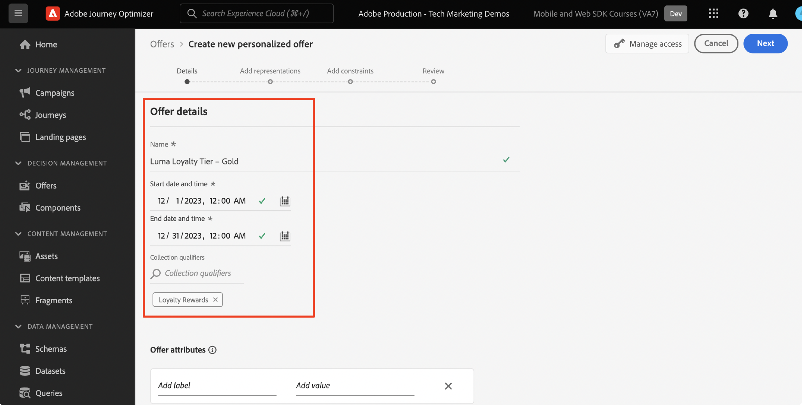

# Configuración de Administración de decisiones con Platform Web SDK

Obtenga información sobre cómo implementar la capacidad Administración de decisiones de Adobe Journey Optimizer mediante Platform Web SDK. Esta guía cubre los requisitos previos fundamentales de Administración de decisiones, los pasos detallados para la configuración y una explicación detallada de un caso de uso centrado en el estado de lealtad.

Al seguir este tutorial, los usuarios de Journey Optimizer están equipados para utilizar las funciones de Gestión de decisiones, lo que mejora la personalización y relevancia de sus interacciones con los clientes.


## Objetivos de aprendizaje

Al final de esta lección, puede hacer lo siguiente:

* Comprenda los conceptos principales de gestión de decisiones en Adobe Journey Optimizer y su integración con Adobe Experience Platform Web SDK.

* Conozca el proceso paso a paso para configurar Web SDK para Offer Decisioning, lo que garantiza una integración perfecta con Journey Optimizer.

* Explore un caso de uso detallado centrado en ofertas de estado de lealtad, obteniendo perspectivas sobre la creación y administración de ofertas, decisiones y ubicaciones de forma eficaz.

* Familiarícese con los términos esenciales y sus implicaciones dentro del marco de Gestión de decisiones.

* Comprenda la importancia de las reglas de decisión, los calificadores de recopilación y las ofertas de reserva a la hora de ofrecer la oferta correcta al usuario correcto.

* Explore temas avanzados como simulaciones y recopilación de datos de eventos personalizados, lo que le permite probar, validar y mejorar los mecanismos de envío de ofertas.

## Requisitos previos

Para completar las lecciones de esta sección, primero debe:

* Asegúrese de que su organización tenga acceso a Adobe Journey Optimizer Ultimate (Journey Optimizer y Offer Decisioning) o a Adobe Experience Platform y al complemento de Offer Decisioning.

* Completar todas las lecciones para la configuración inicial de Platform Web SDK.

* Habilite su organización para Edge Decisioning.

* Obtenga información sobre cómo configurar una ubicación e instanciar ID de ubicación y actividad dentro del JSON del ámbito de decisión.

## Limitaciones

Actualmente, Adobe Journey Optimizer no admite ofertas basadas en eventos. Si crea una regla de decisión basada en un evento, no puede aplicarla en una oferta.

## Concesión de acceso a Gestión de decisiones

Para conceder acceso a la funcionalidad de Administración de decisiones, debe crear un **perfil de producto** y asignar los permisos correspondientes a los usuarios. [Obtenga más información sobre la administración de usuarios y permisos de Journey Optimizer en esta sección](https://experienceleague.adobe.com/en/docs/journey-optimizer/using/access-control/privacy/high-low-permissions#decisions-permissions).

## Configuración de la secuencia de datos

Offer Decisioning debe estar habilitado en la configuración de **datastream** para que Platform Web SDK pueda entregar cualquier actividad de Administración de decisiones.

Para configurar Offer Decisioning en el conjunto de datos:

1. Vaya a la interfaz [Recopilación de datos](https://experience.adobe.com/#/data-collection).

1. En el panel de navegación izquierdo, seleccione **Datastreams**.

1. Seleccione el conjunto de datos de Luma Web SDK creado anteriormente.

   

1. Seleccione **Editar** dentro del **servicio Adobe Experience Platform**.

   

1. Marque la casilla **Offer Decisioning**.

   

1. Seleccione **Guardar**.

Esto garantiza que **Adobe Experience Platform Edge** gestione correctamente los eventos entrantes para Journey Optimizer.

## Configuración de SDK para la administración de decisiones

Gestión de decisiones requiere pasos adicionales de SDK, según el tipo de implementación de Web SDK. Hay dos opciones disponibles para configurar SDK para gestión de decisiones.

* Instalación independiente de SDK
   1. Configure la acción `sendEvent` con su `decisionScopes`.

      ```javascript
      alloy("sendEvent", {
         ...
         "decisionScopes": [
            "[DECISION SCOPE 1]",
            "[DECISION SCOPE 2]"
         ]
      })
      ```

* Instalación de etiquetas de SDK
   1. Vaya a la interfaz de recopilación de datos.

   1. En el panel de navegación izquierdo, seleccione **Etiquetas**.

      

   1. Seleccione la **propiedad de etiqueta**.

   1. Cree sus **reglas**.
      * Agregue una acción de Platform Web SDK **Enviar evento** y agregue la acción `decisionScopes` relevante a la configuración de dicha acción.

   1. Cree y publique una **biblioteca** que contenga todas las **reglas**, **elementos de datos** y **extensiones** relevantes que haya configurado.

## Terminología

En primer lugar, debe comprender la terminología utilizada en la interfaz de Administración de decisiones.

* **Límite**: Una restricción que dicta la frecuencia con la que aparece una oferta. Dos tipos:
   * Límites totales: Número máximo de veces que se puede mostrar una oferta en la audiencia de destino.
   * Límite de perfil: tiempos en los que se puede mostrar una oferta a un usuario en particular.
* **Colecciones**: subconjuntos de ofertas agrupadas según condiciones específicas establecidas por un experto en marketing, por ejemplo, una categoría de oferta.
* **Decisión**: Lógica que dicta la elección de una oferta.
* **Regla de decisión**: Restricciones en ofertas para averiguar la elegibilidad de un usuario.
* **Oferta elegible**: Una oferta que coincida con las restricciones preestablecidas y que se pueda mostrar a un usuario.
* **Administración de decisiones**: El sistema de creación y distribución de ofertas personalizadas mediante la lógica empresarial y las reglas de decisión.
* **Ofertas de reserva**: La oferta predeterminada que se muestra cuando un usuario no cumple los requisitos para ninguna oferta de una colección.
* **Oferta**: Un mensaje de marketing con posibles reglas de elegibilidad que determinan sus visualizadores.
* **Biblioteca de ofertas**: Repositorio central que administra ofertas, decisiones y reglas asociadas.
* **Ofertas personalizadas**: mensajes de marketing personalizados adaptados según las restricciones de elegibilidad.
* **Ubicaciones**: La configuración o el escenario donde se muestra una oferta a un usuario.
* **Prioridad**: Métrica de clasificación para ofertas que tienen en cuenta varias restricciones, como elegibilidad y límite.
* **Representaciones**: Información específica del canal, por ejemplo, ubicación o idioma, que guía la visualización de una oferta.

## Resumen de caso de uso: recompensas de fidelización

En esta lección, debe implementar un ejemplo de caso de uso de las Recompensas de fidelidad para comprender la Gestión de decisiones mediante Web SDK.

Este caso de uso le permite comprender mejor cómo Journey Optimizer puede ayudar a ofrecer la mejor oferta a sus clientes, utilizando la biblioteca de ofertas centralizada y el motor de decisión de Gestión de decisiones.

>[!NOTE]
>
> Dado que este tutorial está dirigido a los implementadores, vale la pena señalar que esta lección implica un trabajo sustancial de la interfaz en Journey Optimizer. Aunque estas tareas de interfaz suelen gestionarlas los especialistas en marketing, puede resultar beneficioso para los implementadores incorporar insight en el proceso, aunque no sean responsables de la creación de campañas de administración de decisiones a largo plazo.

## Componentes

Antes de empezar a crear las ofertas, debe definir varios componentes previos.

### Crear una ubicación para ofertas de fidelización

**Las ubicaciones** son contenedores que se usan para mostrar las ofertas. En este ejemplo, se crea una ubicación en la parte superior del sitio de Luma.

Se puede acceder a la lista de ubicaciones en el menú **Componentes**. Los filtros están disponibles para ayudarle a recuperar ubicaciones según un canal o contenido específico.


Para crear la ubicación, siga estos pasos:

1. Haga clic en **Crear ubicación**.

   

1. Defina las propiedades de la ubicación:
   * **Nombre**: El nombre de la ubicación. Llamemos a la ubicación de ejemplo *&#39;Banner de página principal&#39;*.
   * **Tipo de canal**: Canal para el que se usa la ubicación. Vamos a usar *&#39;Web&#39;* porque las ofertas se muestran en el sitio web de Luma.
   * **Tipo de contenido**: Tipo de contenido que la ubicación puede mostrar: texto, HTML, vínculo de imagen o JSON. Puede usar *&#39;HTML&#39;* para la oferta.
   * **Descripción**: Una descripción de la ubicación (opcional).

   

1. Haga clic en **Guardar**.
1. Una vez creada la ubicación, se muestra en la lista de ubicaciones.
1. Seleccione la fila que contiene la nueva ubicación y tome nota del ID de ubicación, ya que esto puede ser necesario para la configuración dentro del ámbito de decisión.

   

### Reglas de decisión para el estado de fidelización

**Las reglas de decisión** especifican las condiciones en las que se presentan las ofertas. En este ejemplo, se crean reglas de decisión para servir diferentes ofertas según el estado de Lealtad de un usuario.

Se puede acceder a la lista de reglas de decisión en el menú **Componentes**.

Para crear las reglas de decisión, siga estos pasos:

1. Vaya a la pestaña **Reglas** y haga clic en **Crear regla**.

   

1. Asignemos un nombre a la primera regla &#39;*Regla de estado de fidelidad de oro*&#39;. Puede utilizar campos XDM para definir la regla. El Adobe Experience Platform **Generador de segmentos** es una interfaz intuitiva que puede usar para generar las condiciones de regla.

   

1. Haga clic en **Guardar** para confirmar la condición de regla.
1. La &#39;*Regla de estado de fidelidad Gold*&#39; guardada recientemente se mostrará en la **lista de reglas**. Selecciónelo para mostrar sus propiedades.

   

1. Ahora cree las condiciones de regla de oferta de lealtad restantes para el caso de uso.


### Cualificadores de colección

Los **calificadores de colección** le permiten organizar y buscar fácilmente ofertas dentro de la biblioteca de ofertas. En este ejemplo, se agregan calificadores de colección a las ofertas de Recompensas de fidelidad para mejorar la organización de la oferta.

Se puede obtener acceso a la lista de calificadores de colección en el menú **Componentes**.

Para crear el calificador de la colección Loyalty Rewards, siga estos pasos:

1. Vaya a la pestaña **Calificadores de colección** y haga clic en **Crear calificador de colección**.

   

1. Asignemos un nombre al calificador de la colección &#39;*Recompensas de fidelidad*&#39;

   

1. El nuevo calificador de colección debería mostrarse ahora en la ficha **Calificador de colección**

## Ofertas

Ahora es el momento de crear las ofertas de recompensas de fidelidad.

Se puede acceder a la lista de ofertas desde el menú **Ofertas**.


### Creación de ofertas para diferentes niveles de fidelización

Comience creando ofertas personalizadas para los diferentes niveles de fidelidad de Luma.

Para crear la primera **oferta**, siga estos pasos:

1. Haga clic en **Crear oferta** y, a continuación, seleccione **Oferta personalizada**.

1. Asignemos un nombre a la primera oferta &#39;*Nivel de fidelidad de Luma: Oro*&#39;. Debe especificar una fecha y una hora de inicio/finalización para esta oferta. También debe asociar el **calificador de colección** &#39;*Recompensas de fidelidad*&#39; a la oferta, lo que le permite organizar mejor la **Biblioteca de ofertas**. Después, haga clic en **Siguiente**.

   

1. Ahora debe agregar **representaciones** para definir dónde se muestra la oferta. Vamos a elegir el **canal web**. Vamos a elegir también la *ubicación* del titular de la página principal **que configuró anteriormente.** La **ubicación** seleccionada es del tipo HTML, por lo que puede agregar contenido HTML, JSON o TEXT directamente al editor para crear la oferta con el botón de opción **Personalizado**.

   

1. Edite el contenido de la oferta directamente con el **Editor de expresiones**. Recuerde que puede agregar contenido HTML, JSON o TEXT a esta ubicación. Asegúrese de seleccionar el **modo** correcto en la parte inferior del editor, según el tipo de contenido. También puede presionar **validate** para asegurarse de que no haya errores.

   

1. Además, puede utilizar el Editor de expresiones para recuperar atributos almacenados en Adobe Experience Platform. Vamos a agregar el nombre de un perfil al contenido de la oferta para personalizar mejor a los miembros socio en un nivel de 1:1.

   

1. Agregue restricciones para mostrar únicamente la oferta a los perfiles que cumplen los requisitos para la &#39;*Regla de estado de fidelidad de oro*&#39;.

   

1. Una vez que hayas terminado de revisar tu oferta, haz clic en **Finalizar**. Seleccione **Guardar y aprobar**.

Ahora cree el resto de las ofertas para los distintos niveles de Fidelidad de Luma

### Ofertas de reserva

Aún desea ofrecer una oferta a los visitantes que no sean fieles a Luma del sitio de Luma. Para ello, puede configurar una **oferta de reserva** para la campaña.

Para crear la oferta de reserva, siga estos pasos:

1. Haga clic en **Crear oferta** y luego seleccione **Oferta de reserva**.
   <!--
      
   -->
1. Asignemos un nombre a la oferta de reserva &#39;*Fidelidad que no sea de Luma*&#39;. También puede asociar el **calificador de colección** creado anteriormente, &#39;*Recompensas de fidelidad*&#39; a la oferta de reserva para facilitar la organización de la oferta.
   <!--
      
   -->
1. Agregar el contenido de la oferta de reserva al **Editor de expresiones**. Recuerde que puede agregar contenido HTML, JSON o TEXT a esta ubicación. Asegúrese de seleccionar el **modo** correcto en la parte inferior del editor, según el tipo de contenido. También puede presionar **validate** para asegurarse de que no haya errores.
   <!--
      
   -->
1. Si todo está configurado correctamente, presione **Finalizar** y luego **Guardar y aprobar**.
<!--
   
-->

## Decisiones

**Decisions** son contenedores para ofertas que eligen la mejor oferta disponible para un cliente, según el destino.

La lista de decisiones está disponible en la pestaña **Decisiones** del menú **Ofertas**.
<!--
   
-->

### Creación de una decisión para ofertas de fidelización

Vamos a crear una decisión para el caso de uso de las Recompensas de fidelidad de Luma.

Para crear la decisión, siga estos pasos:

1. Haga clic en **Crear decisión**.
   <!--
      
   -->
1. Llamemos a la decisión: &#39;*Ofertas de fidelidad de Luma de diciembre*&#39;. Las ofertas deben ejecutarse durante 1 mes, por lo que vamos a especificarlo aquí.
   <!--
      
   -->
1. Ahora debe definir los **ámbitos de decisión**. Primero seleccione una ubicación. Puede usar el titular de la página principal *creado anteriormente*.
   <!--
      
   -->
1. A continuación, debe agregar **criterios de evaluación** para el ámbito de decisión. Haga clic en **Agregar** y elija la colección de ** &#39;*Recompensas de fidelidad*&#39; creada anteriormente, que contiene todas las ofertas de fidelidad que deben tenerse en cuenta.
   <!--
      
   -->
1. Dentro de la colección &#39;*Recompensas por fidelidad*&#39;, puede utilizar el campo de idoneidad para restringir la entrega de ofertas a un subconjunto de visitantes de Luma. Sin embargo, en este caso de uso, desea que todos los visitantes reciban una de las ofertas. Recuerde, ha configurado una **oferta de reserva** para todos los visitantes que no sean fieles. Establezca la idoneidad en &quot;Ninguno&quot;.
   <!--
      
   -->
1. Además, puede usar el campo **método de clasificación** para seleccionar la mejor oferta para cada visitante de Luma si varias ofertas cumplen los requisitos para la combinación de usuario y ubicación. Para este caso de uso, puede usar el método **Prioridad de oferta**, que usa los valores definidos en las ofertas para ofrecer la mejor oferta.
   <!--
      
   -->
1. Ahora agregue la **oferta de reserva** a la decisión. Recordatorio de que la oferta de reserva es la oferta predeterminada que se muestra a los visitantes de Luma si no entran en ninguna de las audiencias de Fidelidad de Luma. Seleccione &#39;*Fidelidad que no es de Luma*&#39; de la lista de ofertas de reserva disponibles para la ubicación &#39;*Banner de página principal*&#39;.
   <!--
      
   -->
1. Antes de activar la decisión, vamos a revisar el ámbito de decisión, la oferta de reserva, la vista previa de las ofertas disponibles y estimar los perfiles cualificados. Una vez que todo esté bien, puedes hacer clic en **Finalizar** y **Guardar y activar**.
<!--
   
-->

## Simulaciones

Como práctica recomendada, debe validar la lógica de Luma Loyalty Decisioning para garantizar que las ofertas correctas se envíen a las audiencias de fidelidad correctas. Puede realizar esta validación utilizando **perfiles de prueba**. También es aconsejable probar los cambios en las ofertas mediante perfiles de prueba antes de llevar las nuevas versiones de oferta a producción.

Para comenzar la prueba, seleccione la ficha **Simulaciones** en el menú **Ofertas**.

### Prueba de ofertas de fidelización

1. Seleccione un perfil de prueba para utilizarlo en la simulación. Haga clic en **Administrar perfil**. [Para crear o designar un nuevo perfil de prueba para la prueba de ofertas, siga esta guía](https://experienceleague.adobe.com/en/docs/journeys/using/building-journeys/about-journey-building/creating-test-profiles#create-test-profiles-csv).
   <!--
      
   -->
1. Añada uno o más perfiles de prueba a la simulación y guarde la selección. Para la prueba de casos de uso, debe asegurarse de tener perfiles de prueba configurados para cada audiencia de recompensas de fidelidad de Luma.
   <!--
      
   -->
1. Seleccione el ámbito de decisión que desea probar. Seleccione **Agregar ámbito de decisión**.
   <!--
      
   -->
1. Seleccione la ubicación &#39;*Banner de página principal*&#39; creada anteriormente.
   <!--
      
   -->
1. Se muestran las decisiones disponibles, seleccione la decisión &#39;*Ofertas de fidelidad de Luma de diciembre*&#39; creada anteriormente y haga clic en **Agregar**.
   <!--
      
   -->
1. Una vez que seleccione un perfil de prueba, haga clic en **Ver resultados**. La mejor oferta disponible se muestra al perfil de prueba seleccionado para la decisión &#39;*Ofertas de fidelidad de Luma de diciembre*&#39;.
   <!--
      
   -->
1. Seleccione un perfil de prueba diferente y haga clic en **Ver resultados**. Lo ideal es que vea una oferta simulada diferente, que se corresponda con el nivel de lealtad del perfil de prueba.

## Validación de gestión de decisiones mediante Adobe Experience Platform Debugger

La extensión **Adobe Experience Platform Debugger**, disponible tanto para Chrome como para Firefox, analiza sus páginas web para identificar problemas en la implementación de soluciones de Adobe Experience Cloud.

Puede utilizar el depurador del sitio de Luma para validar la lógica de toma de decisiones en producción. Esta validación es una buena práctica una vez que el caso de uso de las Recompensas de fidelidad está en funcionamiento, para garantizar que todo esté configurado correctamente.

[Aprenda a configurar el depurador en su explorador con la guía aquí](https://experienceleague.adobe.com/en/docs/platform-learn/data-collection/debugger/overview).

Para iniciar la validación con el depurador:

1. Vaya a la página web de Luma con la ubicación de la oferta.
   <!--
      
   -->
1. En la página web, abre **Adobe Experience Platform Debugger**.
   <!--
      
   -->
1. Vaya a **Resumen**. Compruebe que el **ID de secuencia de datos** coincide con la **secuencia de datos** en la **recopilación de datos de Adobe** para la cual habilitó Offer Decisioning.
   <!--
      
   -->
1. En **Soluciones**, vaya a **Experience Platform Web SDK**.
   <!--
      
   -->
1. En la ficha **Configuración**, active **Habilitar depuración**. Esto habilita el registro de la sesión en una sesión de **Adobe Experience Platform Assurance**.
   <!--
      
   -->
1. A continuación, puede iniciar sesión en el sitio con varias cuentas de fidelidad de Luma y utilizar el depurador para validar las solicitudes enviadas a la **red de Adobe Experience Platform Edge**. Todas estas solicitudes deben capturarse en **Assurance** para el seguimiento del registro.
<!--
   
-->

>[!NOTE]
>
>Gracias por dedicar su tiempo a conocer Adobe Experience Platform Web SDK. Si tiene preguntas, desea compartir comentarios generales o tiene sugerencias sobre contenido futuro, compártalas en esta [publicación de debate de la comunidad de Experience League](https://experienceleaguecommunities.adobe.com/t5/adobe-experience-platform-data/tutorial-discussion-implement-adobe-experience-cloud-with-web/td-p/444996)
