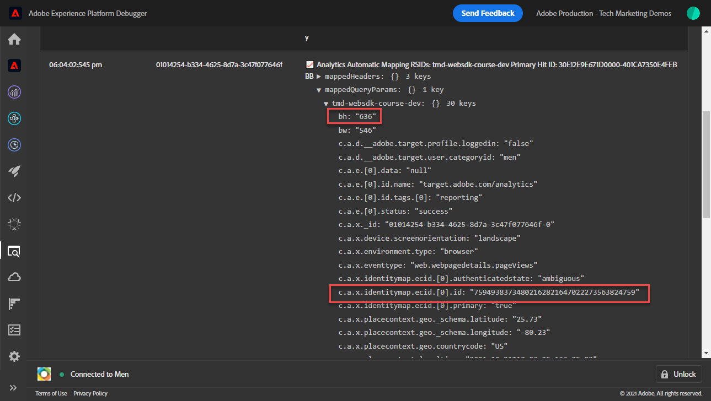

# Configuración de una propiedad de reenvío de eventos

Aprenda a utilizar la propiedad de reenvío de eventos mediante datos del SDK web del Experience Platform.

El reenvío de eventos es un nuevo tipo de propiedad disponible en la recopilación de datos. El reenvío de eventos le permite enviar datos a proveedores de terceros que no sean de Adobe directamente desde la red perimetral de Adobe Experience Platform en lugar del navegador tradicional del lado del cliente. Obtenga más información sobre las ventajas del reenvío de eventos en la [Resumen del reenvío de eventos](https://experienceleague.adobe.com/docs/experience-platform/tags/event-forwarding/overview.html?lang=en).

Para utilizar el reenvío de eventos en Adobe Experience Platform, los datos deben enviarse primero a Adobe Experience Platform Edge Network mediante una o varias de las tres opciones siguientes:

* [SDK web de Adobe Experience Platform](overview.md)
* [SDK móvil de Adobe Experience Platform](https://aep-sdks.gitbook.io/docs/)
<!--* [Server-to-Server API](https://experienceleague.adobe.com/docs/audience-manager/user-guide/api-and-sdk-code/dcs/dcs-apis/dcs-s2s.html?lang=en)-->

>[!NOTE]
>El SDK web de Platform y el SDK de Platform Mobile no requieren implementación mediante etiquetas, pero se recomienda utilizar etiquetas para implementar estos SDK.

Después de completar las lecciones anteriores de este tutorial, debe enviar datos a Platform Edge Network mediante el SDK web. Una vez que los datos se encuentran en Platform Edge Network, puede habilitar el reenvío de eventos y utilizar una propiedad de reenvío de eventos para enviar datos a soluciones que no sean de Adobe.

## Objetivos de aprendizaje

Al final de esta lección, podrá:

* Crear una propiedad de reenvío de eventos
* Vincular una propiedad de reenvío de eventos a un conjunto de datos del SDK web de Platform
* Comprender las diferencias entre los elementos de datos y las reglas de la propiedad de etiquetas y los elementos de datos y las reglas de la propiedad de reenvío de eventos
* Creación de un elemento de datos de reenvío de eventos
* Configuración de una regla de reenvío de eventos
* Validar que una propiedad de reenvío de eventos envía datos correctamente

## Requisitos previos

* Licencia de software que incluye el reenvío de eventos. El reenvío de eventos es una función de pago de la recopilación de datos. Póngase en contacto con su equipo de cuentas de Adobe para obtener más información.
* El reenvío de eventos está habilitado en la organización del Experience Cloud.
* Permiso de usuario para el reenvío de eventos. (En [Admin Console](https://adminconsole.adobe.com/), en el producto Adobe Experience Platform Launch, elementos de permiso para[!UICONTROL Plataformas] > [!UICONTROL Edge] y todo [!UICONTROL Derechos de propiedad]). Una vez concedido, debería ver [!UICONTROL Reenvío de eventos] en la navegación izquierda de la interfaz de recopilación de datos:
   

* SDK web o móvil de Adobe Experience Platform configurado para enviar datos a la red perimetral. Debe haber completado las siguientes lecciones de este tutorial:

   * Configuración inicial

      * [Configure los permisos](configure-permissions.md)
      * [Configuración de un esquema XDM](configure-schemas.md)
      * [Configuración de un área de nombres de identidad](configure-identities.md)
      * [Configurar un conjunto de datos](configure-datastream.md)
   * Configuración de etiquetas

      * [Instalación de la extensión del SDK web](install-web-sdk.md)
      * [Creación de elementos de datos](create-data-elements.md)
      * [Crear una regla de etiqueta](create-tag-rule.md)
      * [Validación con Adobe Experience Platform Debugger](validate-with-debugger.md)

## Crear una propiedad de reenvío de eventos

Comience creando una propiedad de reenvío de eventos:

1. Abra el [Interfaz de recopilación de datos](https://experience.adobe.com/#/data-collection)
1. Select **[!UICONTROL Reenvío de eventos]** desde la navegación izquierda
1. Seleccione **[!UICONTROL Nueva propiedad]**.
   

1. Asigne un nombre a la propiedad. En este caso `Server-Side - Web SDK Course`

1. Seleccione **[!UICONTROL Guardar]**.
   

## Configuración del conjunto de datos

Para que el reenvío de eventos utilice los datos que envía a la red de Edge, debe vincular la propiedad de reenvío de eventos recién creada al mismo conjunto de datos utilizado para enviar datos a las soluciones de Adobe.

Para configurar Target en el conjunto de datos:

1. Vaya a [Recopilación de datos](https://experience.adobe.com/#/data-collection)Interfaz de {target=&quot;blank&quot;}
1. En el panel de navegación izquierdo, seleccione **[!UICONTROL Datastreams]**
1. Seleccione el `Luma Web SDK` datastream

   

1. Select **[!UICONTROL Añadir servicio]**

   
1. Select **[!UICONTROL Reenvío de eventos]** como el **[!UICONTROL Servicio]**

1. En el **[!UICONTROL ID de propiedad]** menú desplegable, seleccione el nombre que dio a su propiedad de reenvío de eventos, en este caso `Server-Side - Web SDK Course`

1. En el **[!UICONTROL ID de entorno]** menú desplegable, seleccione el entorno de etiquetas al que está vinculando el entorno de reenvío de eventos, en este caso `Development`

   >[!TIP]
   >
   >    Para enviar datos a un entorno de reenvío de eventos fuera de la organización de Adobe, seleccione **[!UICONTROL Introducir ID manualmente]** y pegar en un ID. El ID se proporciona al crear una propiedad de reenvío de eventos.

1. Seleccione **[!UICONTROL Guardar]**.

   

Repita estos pasos para los conjuntos de datos de ensayo y producción cuando esté listo para promocionar los cambios a través del flujo de publicación.

## Reenviar datos de Platform Edge Network a una solución que no sea de Adobe

En este ejercicio, aprenderá a configurar un elemento de datos de reenvío de eventos, configurar una regla de reenvío de eventos y validar con una herramienta de terceros denominada [Sitio web.sitio](https://webhook.site/).

>[!NOTE]
>
>Un enlace web es una forma de integrar diferentes sistemas en tiempo semireal. [Sitio web.sitio](https://webhook.site/) es una herramienta de terceros que le permite inspeccionar, probar y automatizar fácilmente (con el generador visual de acciones personalizadas o WeblockScript) cualquier solicitud HTTP o correo electrónico entrante.

>[!IMPORTANT]
>
>Para continuar, ya debe haber creado y asignado elementos de datos a un objeto XDM, así como reglas de etiquetas configuradas y haber creado esos cambios dentro de una biblioteca en un entorno de etiquetas. Si no lo ha hecho, consulte la **Configuración de etiquetas** en la sección [requisitos previos](setup-event-forwarding.md#prerequisites) para obtener más información. Estos pasos garantizan que los datos se envíen a la red perimetral de plataforma y, desde allí, puede configurar una propiedad de reenvío de eventos para reenviar datos a una solución que no sea de Adobe.

### Creación de un elemento de datos de reenvío de eventos

El objeto XDM que configuró anteriormente con la extensión de etiqueta del SDK web de Platform se convierte en la fuente de datos para elementos de datos en una propiedad de reenvío de eventos. Se utilizan los mismos datos que ya se han configurado en la propiedad tag como fuente de datos para el reenvío de eventos.

>[!IMPORTANT]
>
>Hay una diferencia clave en la sintaxis al hacer referencia a campos XDM en el reenvío de eventos en comparación con otros contextos. Para hacer referencia a los datos en una propiedad de reenvío de eventos, la ruta del elemento de datos debe incluir la variable `arc.event` prefijo:
>
> * `arc` significa contexto de respuesta de Adobe.
> * Por ejemplo: `arc.event.xdm.web.webPageDetails.URL`
>
>Si esta ruta de acceso no se especifica correctamente, no se recopilarán datos.

En este ejercicio, reenviará la altura de la ventanilla del navegador y el ID de Experience Cloud del objeto XDM a un enlace web. La ruta del campo XDM la determina el esquema XDM creado durante el [Configuración de un esquema XDM](configure-schemas.md) lección.

>[!TIP]
>
>También puede encontrar la ruta del objeto XDM utilizando las herramientas de red del explorador web, filtrando para `/ee` solicitudes, abrir la señalización [!UICONTROL **Carga útil**] y explorar en profundidad la variable que está buscando. A continuación, haga clic con el botón derecho del ratón y seleccione &quot;Copiar ruta de acceso a la propiedad&quot;. Este es un ejemplo de la altura de las ventanillas del explorador:
> 

1. Vaya a la **[!UICONTROL Reenvío de eventos]** propiedad creada recientemente

1. En el panel de navegación izquierdo, seleccione **[!UICONTROL Elementos de datos]**

1. Seleccione **[!UICONTROL Crear nuevo elemento de datos]**

   

1. **** Asigne un nombre al elemento de datos . `environment.browserDetails.viewportHeight`

1. En **[!UICONTROL Extensión]**, salir `CORE`

1. En **[!UICONTROL Tipo de elemento de datos]**, seleccione `Path`

1. Escriba la ruta del objeto XDM que contiene la altura de la ventanilla del explorador `arc.event.xdm.environment.browserDetails.viewportHeight`

1. Seleccione **[!UICONTROL Guardar]**

   

1. Crear otro elemento de datos

1. **[!UICONTROL Nombre]** it `ecid`

1. En **[!UICONTROL Extensión]**, salir `CORE`

1. En **[!UICONTROL Tipo de elemento de datos]**, seleccione `Path`

1. Escriba la ruta del objeto XDM que contiene el ID de Experience Cloud `arc.event.xdm.identityMap.ECID.0.id`

1. Seleccione **[!UICONTROL Guardar]**

   

   >[!CAUTION]
   >
   > Asegúrese de incluir la variable `arc.event.` en la ruta. Además, asegúrese de seguir las mayúsculas y minúsculas exactas como el nombre del campo de objeto XDM: el espacio de nombres ECID debe estar en mayúsculas.

   >[!TIP]
   Al trabajar con su propio sitio web, puede encontrar la ruta del objeto XDM con las herramientas de red del explorador web, filtrando para `/ee` solicitudes, abrir la señalización [!UICONTROL **Carga útil**] y explorar en profundidad la variable que está buscando. A continuación, haga clic con el botón derecho del ratón y seleccione &quot;Copiar ruta de acceso a la propiedad&quot;. Este es un ejemplo de la altura de las ventanillas del explorador:
   

### Instalación de la extensión del conector de Adobe Cloud

Para enviar datos a ubicaciones de terceros, primero debe instalar la variable [!UICONTROL Conector de Adobe Cloud] extensión.

1. Select **[!UICONTROL Extensiones]** en la navegación izquierda

1. Seleccione el **[!UICONTROL Catálogo]** ficha

1. Busque la variable **[!UICONTROL Conector de Adobe Cloud]**, seleccione **[!UICONTROL Instalar]**

   

No se necesita ninguna configuración de extensión. Con esta extensión, ahora puede reenviar datos a una solución que no sea de Adobe.

### Crear una regla de reenvío de eventos

Existen algunas diferencias principales entre la configuración de reglas en una propiedad de etiqueta y una regla en una propiedad de reenvío de eventos:

* **[!UICONTROL Eventos] &amp; [!UICONTROL Condiciones]**:

   * **Etiquetas**: Todas las reglas se activan mediante un Evento que debe especificarse en la regla, por ejemplo, `Library Loaded - Page Top`. Las condiciones son opcionales.
   * **Reenvío de eventos**: Se da por hecho que cada evento enviado a Platform Edge Network es un déclencheur para reenviar datos. Por lo tanto, no hay [!UICONTROL Eventos] que debe seleccionarse en las reglas de reenvío de eventos. Para administrar qué eventos déclencheur a una regla de reenvío de eventos, debe configurar las condiciones.

* **Tokenización de elementos de datos**:

   * **Etiquetas**: Los nombres de los elementos de datos están marcados con un `%` al principio y al final del nombre del elemento de datos cuando se utiliza en una regla. Por ejemplo, `%viewportHeight%`.

   * **Reenvío de eventos**: Los nombres de los elementos de datos están marcados con `{{` al principio y `}}` al final del nombre del elemento de datos cuando se utiliza en una regla. Por ejemplo, `{{viewportHeight}}`.

* **Secuencia de acciones de regla**:

   * La sección Actions de una regla de reenvío de eventos siempre se ejecuta secuencialmente. Asegúrese de que el orden de las acciones es correcto al guardar una regla. Esta secuencia de ejecución no se puede ejecutar de forma asíncrona como con las etiquetas .

<!--
  * **Tags**: Rule actions can easily be reordered using drag-and-drop functionality.
  * **Event forwarding**: Rule actions are always executed sequentially. Make sure the order of actions is correct when you save a rule.
-->

Para configurar una regla para reenviar datos a su enlace web, primero debe obtener su enlace web personal:

1. Vaya a [Sitio web.sitio](https://webhook.site)

1. Buscar **Su dirección URL única**, lo usará como solicitud de URL en su regla de reenvío de eventos

1. Select **[!UICONTROL Copiar al portapapeles]**

1. Deje esta ventana abierta ya que podrá validar los datos de reenvío de eventos en tiempo real capturados por Weblock

   

1. Volver **[!UICONTROL Recopilación de datos]** > **[!UICONTROL Reenvío de eventos]** > **[!UICONTROL Reglas]** desde la navegación izquierda

1. Select **[!UICONTROL Crear nueva regla]**

   

1. Asigne un nombre `all events - ad cloud connector - webhook`

1. Añadir una acción

1. En **[!UICONTROL Extensión]**, seleccione **[!UICONTROL Conector de Adobe Cloud]**

1. En **[!UICONTROL Tipo de acción]**, seleccione **[!UICONTROL Llamada de recuperación]**

1. Pegue la dirección URL de vínculo web en **[!UICONTROL URL]** field

   

1. En **[Parámetros de consulta]**, agregará ambos elementos de datos que creó anteriormente.

1. En el **[!UICONTROL Clave]** tipo de columna en `viewPortHeight`. En el **[!UICONTROL Valor]** , introduzca el `{{environment.browserDetails.viewportHeight}}` elemento de datos escribiéndolo en o seleccionándolo del icono de selector de elemento de datos

1. Select [!UICONTROL **+ Agregar otro**] para agregar otro parámetro de consulta

1. En el **[!UICONTROL Clave]** tipo de columna en `ecid`. En la columna Value , introduzca la variable `{{ecid}}` elemento de datos

1. Seleccione **[!UICONTROL Conservar cambios]**

   

1. La regla debería ser como se muestra a continuación

1. Seleccione **[!UICONTROL Guardar]**

   

### Crear y crear la biblioteca

Cree una biblioteca y cree todos los cambios en el entorno de desarrollo de reenvío de eventos como lo haría normalmente en una propiedad de etiqueta.

>[!NOTE]
Si no ha vinculado las propiedades de reenvío de eventos de ensayo y producción a su conjunto de datos, verá Entorno de desarrollo como la única opción a la que crear una biblioteca.

## Validar regla de reenvío de eventos

Ahora puede validar la propiedad de reenvío de eventos con Platform Debugger y Weblock.site:

1. Siga los pasos para [cambiar la biblioteca de etiquetas](validate-with-debugger.md#use-the-experience-platform-debugger-to-map-to-your-tag-property) en el [Sitio de la demostración de Luma](https://luma.enablementadobe.com/content/luma/us/en/men.html) a la propiedad de etiqueta del SDK web a la que asignó la propiedad de reenvío de eventos en el conjunto de datos.

1. Antes de volver a cargar la página, abra Experience Platform Debugger . **[!UICONTROL Registros]** desde la navegación izquierda

1. Seleccione el **[!UICONTROL Edge]** y, a continuación, seleccione **[!UICONTROL Connect]** para ver las solicitudes de red de Platform Edge

   

1. Vuelva a cargar la página

1. Verá solicitudes adicionales que le darán visibilidad a las solicitudes del lado del servidor que envía Platform Edge Network al WebHook

1. La solicitud para centrar la validación es la que muestra la URL completamente construida que envía la red de Edge

   

1. Tenga en cuenta los parámetros de cadena de consulta viewPortHeight y ecid

   

1. Coinciden con los datos vistos en el objeto XDM

   

1. Por último, valide los datos que coincidan en [Sitio web.sitio](https://webhook.site) también visualizando la ventana de Weblock abierta

   

¡Felicidades! Ha configurado el reenvío de eventos.

[Siguiente: ](conclusion.md)

>[!NOTE]
Gracias por invertir su tiempo en obtener información sobre el SDK web de Adobe Experience Platform. Si tiene alguna pregunta, desea compartir comentarios generales o tiene sugerencias sobre contenido futuro, compártalas en este [Experience League de debate de la comunidad](https://experienceleaguecommunities.adobe.com/t5/adobe-experience-platform-launch/tutorial-discussion-implement-adobe-experience-cloud-with-web/td-p/444996)