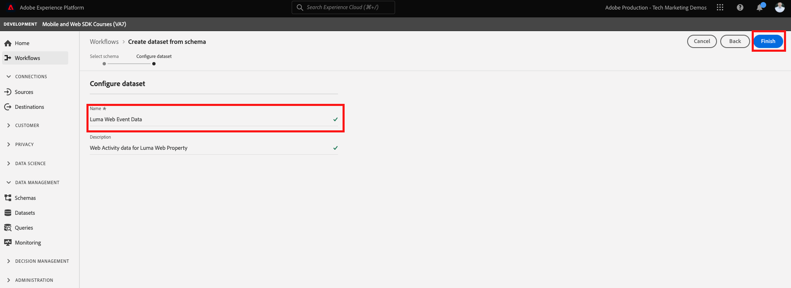
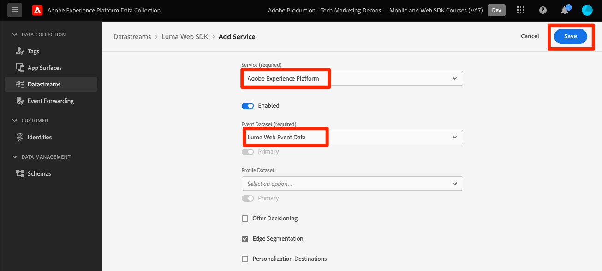
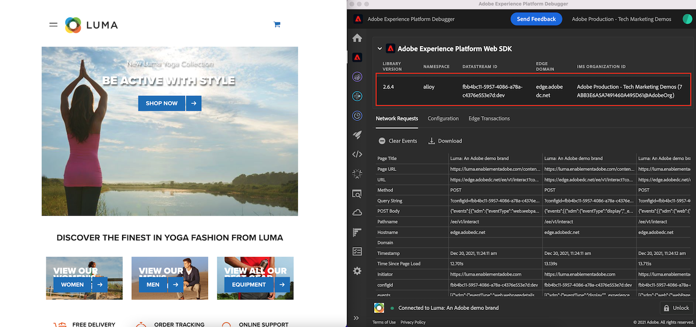
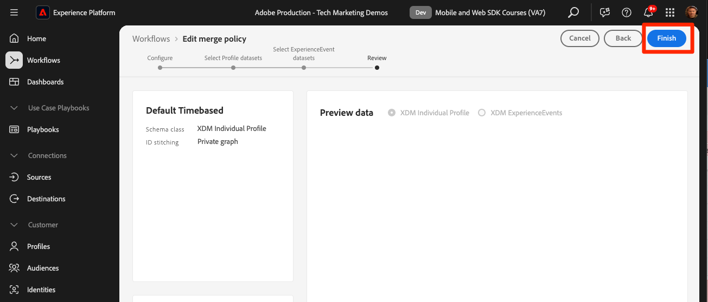

# Transmitir datos a Experience Platform con Web SDK

Obtenga información sobre cómo transmitir datos web a Adobe Experience Platform con SDK web de Platform.

Experience Platform es la columna vertebral de todas las nuevas aplicaciones de Experience Cloud, como Adobe Real-Time Customer Data Platform, Adobe Customer Journey Analytics y Adobe Journey Optimizer. Estas aplicaciones están diseñadas para utilizar Platform Web SDK como el método óptimo de recopilación de datos web.

Experience Platform utiliza el mismo esquema de XDM que creó anteriormente para capturar datos de evento del sitio web de Luma. Cuando esos datos se envían a Platform Edge Network, la configuración del conjunto de datos puede reenviarlos a Experience Platform.

## Objetivos de aprendizaje

Al final de esta lección, debe poder:

* Crear un conjunto de datos en Adobe Experience Platform
* Configuración de la secuencia de datos para enviar datos de Web SDK a Adobe Experience Platform
* Habilitar el streaming de datos web para el perfil del cliente en tiempo real
* Validar que los datos hayan llegado tanto al conjunto de datos de Platform como al Perfil del cliente en tiempo real
* Ingesta de datos de programa de fidelización de muestra en Platform
* Crear una audiencia de Platform simple

## Requisitos previos

Para completar esta lección, primero debe:

* Tener acceso a una aplicación de Adobe Experience Platform como Real-Time Customer Data Platform, Journey Optimizer o Customer Journey Analytics
* Complete las lecciones anteriores de las secciones Configuración inicial y Configuración de etiquetas de este tutorial.

>[!NOTE]
>
>Si no tiene ninguna aplicación de Platform, puede omitir esta lección o continuar leyendo.

## Crear un conjunto de datos

Todos los datos que se incorporan correctamente a Adobe Experience Platform se conservan dentro del lago de datos como conjuntos de datos. Un [conjunto de datos](https://experienceleague.adobe.com/es/docs/experience-platform/catalog/datasets/overview) es una construcción de almacenamiento y administración para una colección de datos, normalmente una tabla que contiene un esquema (columnas) y campos (filas). Los conjuntos de datos también contienen metadatos que describen varios aspectos de los datos que almacenan.

Vamos a configurar un conjunto de datos para los datos de evento web de Luma:

1. Vaya a la interfaz de [Experience Platform](https://experience.adobe.com/platform/) o [Journey Optimizer](https://experience.adobe.com/journey-optimizer/)
1. Confirme que se encuentra en el entorno limitado de desarrollo que utiliza para este tutorial.
1. Abra **[!UICONTROL Administración de datos > Conjuntos de datos]** desde el panel de navegación izquierdo
1. Seleccionar **[!UICONTROL Crear conjunto de datos]**

   

1. Seleccione la opción **[!UICONTROL Crear conjunto de datos a partir del esquema]**

   

1. Seleccione el esquema `Luma Web Event Data` creado en [lección anterior](configure-schemas.md) y, a continuación, seleccione **[!UICONTROL Siguiente]**

   

1. Proporcione un **[!UICONTROL Nombre]** y una **[!UICONTROL Descripción]** opcionales para el conjunto de datos. Para este ejercicio, use `Luma Web Event Data` y luego seleccione **[!UICONTROL Finalizar]**

   

Ahora hay configurado un conjunto de datos para empezar a recopilar datos de su implementación de Platform Web SDK.

## Configuración de la secuencia de datos

Ahora puede configurar su [!UICONTROL secuencia de datos] para enviar datos a [!UICONTROL Adobe Experience Platform]. La secuencia de datos es el vínculo entre la propiedad de etiquetas, Platform Edge Network y el conjunto de datos de Experience Platform.

1. Abrir la interfaz de [recopilación de datos](https://experience.adobe.com/#/data-collection){target="blank"}
1. Seleccione **[!UICONTROL Datastreams]** en el panel de navegación izquierdo
1. Abra la secuencia de datos que creó en la lección [Configurar una secuencia de datos](configure-datastream.md), `Luma Web SDK`

   

1. Seleccionar **[!UICONTROL Agregar servicio]**
   
1. Seleccione **[!UICONTROL Adobe Experience Platform]** como **[!UICONTROL servicio]**
1. Seleccione `Luma Web Event Data` como **[!UICONTROL Conjunto de datos de evento]**

1. Seleccione **[!UICONTROL Guardar]**.

   

A medida que genera tráfico en el [sitio de demostración de Luma](https://luma.enablementadobe.com/content/luma/us/en.html) asignado a su propiedad de etiquetas, los datos rellenan el conjunto de datos en Experience Platform.

## Validación del conjunto de datos

Este paso es fundamental para asegurarse de que los datos hayan llegado al conjunto de datos. Existen dos aspectos para validar los datos enviados al conjunto de datos.

* Validar mediante [!UICONTROL Experience Platform Debugger]
* Validar mediante [!UICONTROL vista previa del conjunto de datos]
* Validar mediante [!UICONTROL servicio de consultas]

### Experience Platform Debugger

Estos pasos son más o menos los mismos que realizó en la [lección de Debugger](validate-with-debugger.md). Sin embargo, como los datos solo se enviarán a Platform después de haberlos habilitado en el conjunto de datos, debe generar algunos datos de ejemplo más:

1. Abra el [sitio de demostración de Luma](https://luma.enablementadobe.com/content/luma/us/en.html) y seleccione el icono de extensión [!UICONTROL Experience Platform Debugger]

1. Configure Debugger para que asigne la propiedad de etiqueta a *su entorno de desarrollo*, tal como se describe en la lección [Validar con Debugger](validate-with-debugger.md)

   

1. Inicie sesión en el sitio de Luma con las credenciales `test@test.com`/`test`

1. Vuelva a la [página principal de Luma](https://luma.enablementadobe.com/content/luma/us/en.html)

1. En las señalizaciones de red de Platform Web SDK que muestra Debugger, seleccione la fila &quot;events&quot; para ampliar los detalles en una ventana emergente

   

1. Busque el &quot;identityMap&quot; en la ventana emergente. Aquí debe ver lumaCrmId con tres claves authenticationState, id y primary
   

Ahora, los datos deben rellenarse en el conjunto de datos `Luma Web Event Data` y estar listos para la validación de &#39;Previsualizar conjunto de datos&#39;.

### Previsualización del conjunto de datos

Para confirmar que los datos han llegado al lago de datos de Platform, una opción rápida es usar la característica **[!UICONTROL Vista previa del conjunto de datos]**. Los datos de Web SDK se envían en microlotes al lago de datos y se actualizan en la interfaz de Platform periódicamente. Los datos generados pueden tardar entre 10 y 15 minutos en mostrarse.

1. En la interfaz de [Experience Platform](https://experience.adobe.com/platform/), seleccione **[!UICONTROL Administración de datos > Conjuntos de datos]** en el panel de navegación izquierdo para abrir el panel **[!UICONTROL Conjuntos de datos]**.

   El panel enumera todos los conjuntos de datos disponibles para su organización. Se muestran los detalles de cada conjunto de datos enumerado, incluido su nombre, el esquema al que se adhiere el conjunto de datos y el estado de la ejecución de ingesta más reciente.

1. Seleccione el conjunto de datos `Luma Web Event Data` para abrir la pantalla **[!UICONTROL Actividad del conjunto de datos]**.

   

   La pantalla de actividad incluye un gráfico que visualiza la tasa de mensajes que se consumen, así como una lista de lotes correctos y fallidos.

1. En la pantalla **[!UICONTROL Actividad del conjunto de datos]**, seleccione **[!UICONTROL Previsualizar conjunto de datos]** cerca de la esquina superior derecha de la pantalla para obtener una vista previa de hasta 100 filas de datos. Si el conjunto de datos está vacío, se desactiva el vínculo de vista previa.

   

   En la ventana de vista previa, la vista jerárquica del esquema para el conjunto de datos se muestra a la derecha.

   

### Consulta de los datos

1. En la interfaz de [Experience Platform](https://experience.adobe.com/platform/), seleccione **[!UICONTROL Administración de datos > Consultas]** en el panel de navegación izquierdo para abrir la pantalla **[!UICONTROL Consultas]**.
1. Seleccionar **[!UICONTROL Crear consulta]**
1. En primer lugar, ejecute una consulta para ver todos los nombres de las tablas del lago de datos. Escriba `SHOW TABLES` en el editor de consultas y haga clic en el icono de reproducción para ejecutar la consulta.
1. En los resultados, observe cómo el nombre de la tabla es similar a `luma_web_event_data`
1. Ahora consulte la tabla con una consulta simple que haga referencia a la tabla (tenga en cuenta que, de forma predeterminada, la consulta estará limitada a 100 resultados): `SELECT * FROM "luma_web_event_data"`
1. Después de unos momentos, debería ver registros de muestra de sus datos web.

>[!ERROR]
>
>Si aparece el error &quot;Tabla no aprovisionada&quot;, vuelva a comprobar el nombre de la tabla. También podría ser que el microlote de datos aún no haya aterrizado en el lago de datos. Vuelva a intentarlo en 10-15 minutos.

>[!INFO]
>
>  Para obtener más información acerca del servicio de consultas de Adobe Experience Platform, consulte [Explorar datos](https://experienceleague.adobe.com/es/docs/platform-learn/tutorials/queries/explore-data) en la sección Tutoriales de Platform.

## Habilitar el conjunto de datos y el esquema para el perfil del cliente en tiempo real

Para los clientes de Real-Time Customer Data Platform y Journey Optimizer, el siguiente paso es habilitar el conjunto de datos y el esquema para el perfil del cliente en tiempo real. La transmisión de datos desde Web SDK será una de las muchas fuentes de datos que fluirán a Platform y desea unir los datos web con otras fuentes de datos para crear perfiles de clientes de 360 grados. Para obtener más información sobre el Perfil del cliente en tiempo real, vea este breve vídeo:

>[!VIDEO](https://video.tv.adobe.com/v/31833?learn=on&captions=spa)

>[!CAUTION]
>
>Al trabajar con su propio sitio web y datos de, recomendamos una validación de datos más sólida antes de habilitarla para el perfil del cliente en tiempo real.

**Para habilitar el conjunto de datos:**

1. Abra el conjunto de datos que creó, `Luma Web Event Data`

1. Seleccione **[!UICONTROL Alternancia de perfil]** para activarla

   

1. Confirme que quiere **[!UICONTROL habilitar]** el conjunto de datos

   

**Para habilitar el esquema:**

1. Abra el esquema que creó, `Luma Web Event Data`

1. Seleccione **[!UICONTROL Alternancia de perfil]** para activarla

   

1. Seleccione **[!UICONTROL Los datos de este esquema contendrán una identidad principal en el campo identityMap.]**

   >[!IMPORTANT]
   >
   >    Las identidades principales son necesarias en cada registro enviado al Perfil del cliente en tiempo real. Normalmente, los campos de identidad se etiquetan dentro del esquema. Sin embargo, al utilizar mapas de identidad, los campos de identidad no son visibles dentro del esquema. Este cuadro de diálogo sirve para confirmar que tiene en mente una identidad principal y que la especificará en un mapa de identidad al enviar los datos. Como ya sabe, Web SDK utiliza un mapa de identidad con el ID de Experience Cloud (ECID) como identidad principal predeterminada y un ID autenticado como identidad principal cuando está disponible.

1. Seleccionar **[!UICONTROL Habilitar]**

   

1. Seleccione **[!UICONTROL Guardar]** para guardar el esquema actualizado

Ahora el esquema también está habilitado para el perfil.

>[!IMPORTANT]
>
>    Una vez que un esquema está habilitado para el perfil, no se puede deshabilitar ni eliminar sin restablecer o eliminar toda la zona protegida. Además, los campos no se pueden eliminar del esquema después de este punto.
>
>   
> Al trabajar con sus propios datos, le recomendamos que haga las cosas en el siguiente orden:
> 
> * En primer lugar, introduzca algunos datos en los conjuntos de datos.
> * Solucionar cualquier problema que surja durante el proceso de ingesta de datos (por ejemplo, problemas de validación o asignación de datos).
> * Habilitar los conjuntos de datos y esquemas para el perfil
> * Vuelva a ingerir los datos si es necesario

### Validación de un perfil

Puede buscar un perfil de cliente en la interfaz de Platform (o de Journey Optimizer) para confirmar que los datos han llegado al Perfil del cliente en tiempo real. Como su nombre sugiere, los perfiles se rellenan en tiempo real, por lo que no hay retraso como con la validación de datos en el conjunto de datos.

Primero debe generar más datos de ejemplo. Repita los pasos anteriores de esta lección para iniciar sesión en el sitio web de Luma cuando esté asignado a la propiedad de etiquetas. Inspeccione la solicitud de Platform Web SDK para asegurarse de que envía datos con `lumaCRMId`.

1. En la interfaz de [Experience Platform](https://experience.adobe.com/platform/), seleccione **[!UICONTROL Cliente]** > **[!UICONTROL Perfiles]** en el panel de navegación izquierdo

1. Como el **[!UICONTROL área de nombres de identidad]**, use `lumaCRMId`
1. Copie y pegue el valor de `lumaCRMId` pasado en la llamada que inspeccionó en Experience Platform Debugger, en este caso `b642b4217b34b1e8d3bd915fc65c4452`.

   

1. Si hay un valor válido en el perfil para `lumaCRMId`, se rellena un identificador de perfil en la consola:

   

1. Para ver el **[!UICONTROL perfil del cliente]** completo para cada ID, seleccione el **[!UICONTROL ID de perfil]** en la ventana principal.

   >[!NOTE]
   >
   >Nota: puede seleccionar el hipervínculo del ID de perfil o, si selecciona la fila, se abrirá un menú de la derecha en el que podrá seleccionar el hipervínculo ID de perfil
   > 

   Aquí puede ver todas las identidades vinculadas a `lumaCRMId`, como `ECID`.

   

Ahora ha habilitado Platform Web SDK para Experience Platform (y Real-Time CDP! ¡Y Journey Optimizer! Y Customer Journey Analytics!).

## Crear una audiencia evaluada por Edge

Se recomienda completar este ejercicio para los clientes de Real-Time Customer Data Platform y Journey Optimizer.

Cuando los datos de Web SDK se incorporan en Adobe Experience Platform, se pueden ampliar con otras fuentes de datos que haya introducido en Platform. Por ejemplo, cuando un usuario inicia sesión en el sitio de Luma, se construye un gráfico de identidades en Experience Platform y todos los demás conjuntos de datos con perfil habilitado pueden unirse para crear perfiles de cliente en tiempo real. Para ver esto en acción, creará rápidamente otro conjunto de datos en Adobe Experience Platform con algunos datos de fidelidad de ejemplo para que pueda utilizar Perfiles del cliente en tiempo real con Real-Time Customer Data Platform y Journey Optimizer. A continuación, creará una audiencia basada en estos datos.

### Crear un esquema de fidelización e introducir datos de ejemplo

Dado que ya ha realizado ejercicios similares, las instrucciones serán breves.

Cree el esquema de fidelización:

1. Creación de un nuevo esquema
1. Elija **[!UICONTROL Perfil individual]** como [!UICONTROL clase base]
1. Asigne un nombre al esquema `Luma Loyalty Schema`
1. Agregar el grupo de campos [!UICONTROL Detalles de fidelización]
1. Agregar el grupo de campos [!UICONTROL Detalles demográficos]
1. Seleccione el campo `Person ID` y márquelo como [!UICONTROL Identidad] e [!UICONTROL Identidad principal] con el área de nombres `Luma CRM Id` [!UICONTROL Identidad].
1. Habilite el esquema para [!UICONTROL Profile]. Si no encuentra la opción Perfil, intente hacer clic en el nombre del esquema en la parte superior izquierda.
1. Guardar el esquema

   

Para crear el conjunto de datos e introducir los datos de ejemplo:

1. Crear un nuevo conjunto de datos a partir de `Luma Loyalty Schema`
1. Asigne un nombre al conjunto de datos `Luma Loyalty Dataset`
1. Habilitar el conjunto de datos para [!UICONTROL Perfil]
1. Descargar el archivo de muestra [luma-loyalty-forWeb.json](assets/luma-loyalty-forWeb.json)
1. Arrastre y suelte el archivo en el conjunto de datos
1. Confirme que los datos se han introducido correctamente.

   

### Definir una política de combinación activa en Edge

Todas las audiencias se crean con una política de combinación. Las políticas de combinación crean diferentes &quot;vistas&quot; de un perfil, pueden contener un subconjunto de conjuntos de datos y prescriben un orden de prioridad cuando diferentes conjuntos de datos aportan los mismos atributos de perfil. Para ser evaluada en el perímetro de, una audiencia debe usar una política de combinación con que tenga la configuración **[!UICONTROL Política de combinación activa en Edge]**.

>[!IMPORTANT]
>
>Solo una política de combinación por zona protegida puede tener la configuración **[!UICONTROL Política de combinación activa en Edge]**

1. Abra la interfaz de Experience Platform o Journey Optimizer y asegúrese de que está en el entorno de desarrollo que utiliza para el tutorial.
1. Vaya a la página **[!UICONTROL Cliente]** > **[!UICONTROL Perfiles]** > **[!UICONTROL Políticas de combinación]**
1. Abrir la **[!UICONTROL política de combinación predeterminada]** (probablemente denominada `Default Timebased`)
   
1. Habilitar la configuración **[!UICONTROL Política de combinación activa en Edge]**
1. Seleccionar **[!UICONTROL Siguiente]**

   
1. Sigue seleccionando **[!UICONTROL Siguiente]** para continuar con los otros pasos del flujo de trabajo y selecciona **[!UICONTROL Finalizar]** para guardar la configuración
   

Ahora puede crear audiencias que se evaluarán en Edge.

### Crear un público

Las audiencias agrupan perfiles en torno a rasgos comunes. Cree una audiencia sencilla que pueda utilizar en Real-Time CDP o Journey Optimizer:

1. En la interfaz de Experience Platform o Journey Optimizer, vaya a **[!UICONTROL Cliente]** > **[!UICONTROL Audiencias]** en el panel de navegación izquierdo
1. Seleccionar **[!UICONTROL Crear audiencia]**
1. Seleccionar **[!UICONTROL regla de compilación]**
1. Seleccionar **[!UICONTROL Crear]**

   

1. Seleccionar **[!UICONTROL atributos]**
1. Busque el campo **[!UICONTROL Fidelidad]** > **[!UICONTROL Nivel]** y arrástrelo a la sección **[!UICONTROL Atributos]**
1. Defina la audiencia como usuarios cuyo `tier` es `gold`
1. Asigne un nombre a la audiencia `Luma Loyalty Rewards – Gold Status`
1. Seleccione **[!UICONTROL Edge]** como **[!UICONTROL método de evaluación]**
1. Seleccionar **[!UICONTROL Guardar]**

   

>[!NOTE]
>
> Dado que establecemos la política de combinación predeterminada como **[!UICONTROL Política de combinación activa en Edge]**, la audiencia que creó se asocia automáticamente a esta política de combinación.

Como se trata de una audiencia muy sencilla, podemos utilizar el método de evaluación de Edge. Las audiencias de Edge se evalúan en el perímetro, por lo que en la misma solicitud realizada por Web SDK a Platform Edge Network, podemos evaluar la definición de la audiencia y confirmar inmediatamente si el usuario cumple los requisitos.

>[!NOTE]
>
>Gracias por dedicar su tiempo a conocer Adobe Experience Platform Web SDK. Si tiene preguntas, desea compartir comentarios generales o tiene sugerencias sobre contenido futuro, compártalas en esta [publicación de debate de la comunidad de Experience League](https://experienceleaguecommunities.adobe.com/t5/adobe-experience-platform-data/tutorial-discussion-implement-adobe-experience-cloud-with-web/td-p/444996?profile.language=es)
