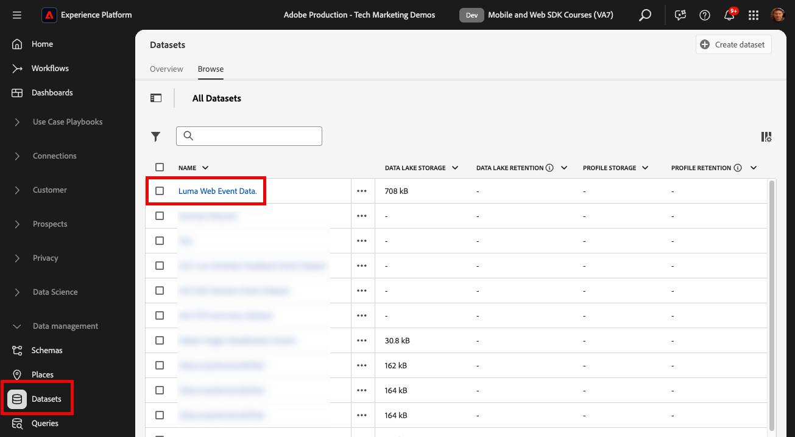

# Transmitir datos a Experience Platform con Web SDK

Obtenga información sobre cómo transmitir datos web a Adobe Experience Platform con SDK web de Platform.

Experience Platform es la columna vertebral de todas las nuevas aplicaciones de Experience Cloud, como Adobe Real-Time Customer Data Platform, Adobe Customer Journey Analytics y Adobe Journey Optimizer. Estas aplicaciones están diseñadas para utilizar Platform Web SDK como el método óptimo de recopilación de datos web.

Experience Platform utiliza el mismo esquema de XDM que creó anteriormente para capturar datos de evento del sitio web de Luma. Cuando esos datos se envían a Platform Edge Network, la configuración del conjunto de datos puede reenviarlos a Experience Platform.

## Objetivos de aprendizaje

Al final de esta lección, debe poder:

* Crear un conjunto de datos en Adobe Experience Platform
* Configuración de la secuencia de datos para enviar datos de Web SDK a Adobe Experience Platform
* Habilitar el streaming de datos web para el perfil del cliente en tiempo real
* Validar que los datos hayan llegado tanto al conjunto de datos de Platform como al Perfil del cliente en tiempo real
* Ingesta de datos de programa de fidelización de muestra en Platform
* Crear una audiencia de Platform simple

## Requisitos previos

Para completar esta lección, primero debe:

* Tener acceso a una aplicación de Adobe Experience Platform como Real-Time Customer Data Platform, Journey Optimizer o Customer Journey Analytics
* Complete las lecciones anteriores de las secciones Configuración inicial y Configuración de etiquetas de este tutorial.

>[!NOTE]
>
>Si no tiene ninguna aplicación de Platform, puede omitir esta lección o continuar leyendo.

## Crear un conjunto de datos

Todos los datos que se incorporan correctamente a Adobe Experience Platform se conservan dentro del lago de datos como conjuntos de datos. Un [conjunto de datos](https://experienceleague.adobe.com/en/docs/experience-platform/catalog/datasets/overview) es una construcción de almacenamiento y administración para una colección de datos, normalmente una tabla que contiene un esquema (columnas) y campos (filas). Los conjuntos de datos también contienen metadatos que describen varios aspectos de los datos que almacenan.

Vamos a configurar un conjunto de datos para los datos de evento web de Luma:

1. Vaya a la interfaz de [Experience Platform](https://experience.adobe.com/platform/) o [Journey Optimizer](https://experience.adobe.com/journey-optimizer/)
1. Confirme que se encuentra en el entorno limitado de desarrollo que utiliza para este tutorial.
1. Abra **[!UICONTROL Administración de datos > Conjuntos de datos]** desde el panel de navegación izquierdo
1. Seleccionar **[!UICONTROL Crear conjunto de datos]**

   

1. Seleccione la opción **[!UICONTROL Crear conjunto de datos a partir del esquema]**

   

1. Seleccione el esquema `Luma Web Event Data` creado en [lección anterior](configure-schemas.md) y, a continuación, seleccione **[!UICONTROL Siguiente]**

   

1. Proporcione un **[!UICONTROL Nombre]** y una **[!UICONTROL Descripción]** opcionales para el conjunto de datos. Para este ejercicio, use `Luma Web Event Data` y luego seleccione **[!UICONTROL Finalizar]**

   

Ahora hay configurado un conjunto de datos para empezar a recopilar datos de su implementación de Platform Web SDK.

## Configuración de la secuencia de datos

Ahora puede configurar su [!UICONTROL secuencia de datos] para enviar datos a [!UICONTROL Adobe Experience Platform]. La secuencia de datos es el vínculo entre la propiedad de etiquetas, Platform Edge Network y el conjunto de datos de Experience Platform.

1. Abrir la interfaz de [recopilación de datos](https://experience.adobe.com/#/data-collection){target="blank"}
1. Seleccione **[!UICONTROL Datastreams]** en el panel de navegación izquierdo
1. Abra la secuencia de datos que creó en la lección [Configurar una secuencia de datos](configure-datastream.md), `Luma Web SDK: Development Environment`

   

1. Seleccionar **[!UICONTROL Agregar servicio]**
   
1. Seleccione **[!UICONTROL Adobe Experience Platform]** como **[!UICONTROL servicio]**
1. Seleccionar **[!UICONTROL Habilitado]**
1. Seleccione `Luma Web Event Data` como **[!UICONTROL Conjunto de datos de evento]**

1. Seleccionar **[!UICONTROL Guardar]**

   

A medida que genera tráfico en el [sitio web de demostración de Luma](https://luma.enablementadobe.com) asignado a su propiedad de etiquetas, los datos rellenan el conjunto de datos en Experience Platform.

## Validación del conjunto de datos

Este paso es fundamental para asegurarse de que los datos hayan llegado al conjunto de datos. Existen varias formas de validar la ruta de los datos enviados al conjunto de datos.

* Validar mediante [!UICONTROL Experience Platform Debugger]
* Validar con [!UICONTROL Experience Platform Assurance]
* Validar mediante [!UICONTROL vista previa del conjunto de datos]
* Validar mediante [!UICONTROL servicio de consultas]

### Debugger

Estos pasos son más o menos los mismos que realizó en la [lección de Debugger](validate-with-debugger.md). Sin embargo, como los datos solo se enviarán a Platform después de haberlos habilitado en el conjunto de datos, debe generar algunos datos de ejemplo más:

1. Abra el [sitio web de demostración de Luma](https://luma.enablementadobe.com) y seleccione el icono de extensión [!UICONTROL Experience Platform Debugger]

1. Configure Debugger para que asigne la propiedad de etiqueta a *su entorno de desarrollo*, tal como se describe en la lección [Validar con Debugger](validate-with-debugger.md)

   

1. Examine el sitio web. Ver algunos productos y añadirlos al carro de compras

1. En Debugger, abra la fila &quot;events&quot; para buscar algunas de las variables XDM.

Ha validado que los datos han salido del explorador y se han enviado al conjunto de datos.

### Assurance

Dado que ahora hemos habilitado un servicio en el conjunto de datos, hay más que podemos ver en Assurance:

1. Abra la sesión de Assurance o inicie una nueva
1. Abra el evento **[!UICONTROL datastream]**
1. Aquí puede ver la configuración del servicio de Platform, incluido el ID del conjunto de datos que creó anteriormente en esta lección.

   

1. Abra el evento **[!UICONTROL generic]** que pertenece al proveedor **[!UICONTROL com.adobe.streaming.validation]**. Esto muestra que la solicitud se ha enviado al conjunto de datos con los datos XDM adjuntos

   

Ha validado que Platform Edge Network recibió la solicitud y la reenvió al conjunto de datos de Platform.

### Previsualización del conjunto de datos

Ahora, vamos a buscar en el conjunto de datos. Una opción rápida es usar la característica **[!UICONTROL Vista previa del conjunto de datos]**. Los datos de Web SDK se envían en microlotes al lago de datos y se actualizan en la interfaz de Platform periódicamente. Los datos generados pueden tardar entre 10 y 15 minutos en mostrarse.

1. En la interfaz de [Experience Platform](https://experience.adobe.com/platform/), seleccione **[!UICONTROL Administración de datos > Conjuntos de datos]** en el panel de navegación izquierdo para abrir el panel **[!UICONTROL Conjuntos de datos]**.

   El panel enumera todos los conjuntos de datos disponibles para su organización. Se muestran los detalles de cada conjunto de datos enumerado, incluido su nombre, el esquema al que se adhiere el conjunto de datos y el estado de la ejecución de ingesta más reciente.

1. Seleccione el conjunto de datos `Luma Web Event Data` para abrir la pantalla **[!UICONTROL Actividad del conjunto de datos]**.

   

   La pantalla de actividad incluye un gráfico que visualiza la tasa de mensajes que se consumen, así como una lista de lotes correctos y fallidos.
1. Dado que este es un nuevo conjunto de datos, si ve incluso un lote con registros ingeridos, eso es un signo positivo:

1. En la pantalla **[!UICONTROL Actividad del conjunto de datos]**, seleccione **[!UICONTROL Previsualizar conjunto de datos]** cerca de la esquina superior derecha de la pantalla para obtener una vista previa de hasta 100 filas de datos. Si el conjunto de datos está vacío, se desactiva el vínculo de vista previa.

   

1. Se ejecutará una consulta para extraer 100 filas de datos recientes del conjunto de datos. Puede explorar en profundidad campos XDM individuales, como web.webPageDetails.name:

   

### Consulta de los datos

También puede ejecutar consultas personalizadas sobre los datos para validar la ingesta de datos:

1. En la interfaz de [Experience Platform](https://experience.adobe.com/platform/), seleccione **[!UICONTROL Administración de datos > Consultas]** en el panel de navegación izquierdo para abrir la pantalla **[!UICONTROL Consultas]**.
1. Seleccionar **[!UICONTROL Crear consulta]**
1. En primer lugar, ejecute una consulta para ver todos los nombres de las tablas del lago de datos. Escriba `SHOW TABLES` en el editor de consultas y haga clic en el icono de reproducción para ejecutar la consulta.
1. En los resultados, observe cómo el nombre de la tabla es `luma_web_event_data`
1. Ahora consulte la tabla con una consulta simple que haga referencia a la tabla (tenga en cuenta que, de forma predeterminada, la consulta estará limitada a 100 resultados): `SELECT * FROM "luma_web_event_data"`
1. Después de unos momentos, debería ver registros de muestra de sus datos web.

   

>[!ERROR]
>
>Si aparece el error &quot;Tabla no aprovisionada&quot;, vuelva a comprobar el nombre de la tabla. También podría ser que el microlote de datos aún no haya aterrizado en el lago de datos. Vuelva a intentarlo en 10-15 minutos.

>[!INFO]
>
>  El servicio de consultas es una herramienta muy potente para ingenieros y analistas de datos. Para obtener más información acerca del servicio de consultas de Adobe Experience Platform, consulte [Explorar datos](https://experienceleague.adobe.com/en/docs/platform-learn/tutorials/queries/explore-data) en la sección Tutoriales de Platform.

>[!NOTE]
>
>Gracias por dedicar su tiempo a conocer Adobe Experience Platform Web SDK. Si tiene preguntas, desea compartir comentarios generales o tiene sugerencias sobre contenido futuro, compártalas en esta [publicación de debate de la comunidad de Experience League](https://experienceleaguecommunities.adobe.com/adobe-experience-platform-18/tutorial-discussion-implement-adobe-experience-cloud-with-web-sdk-tutorial-248848)
