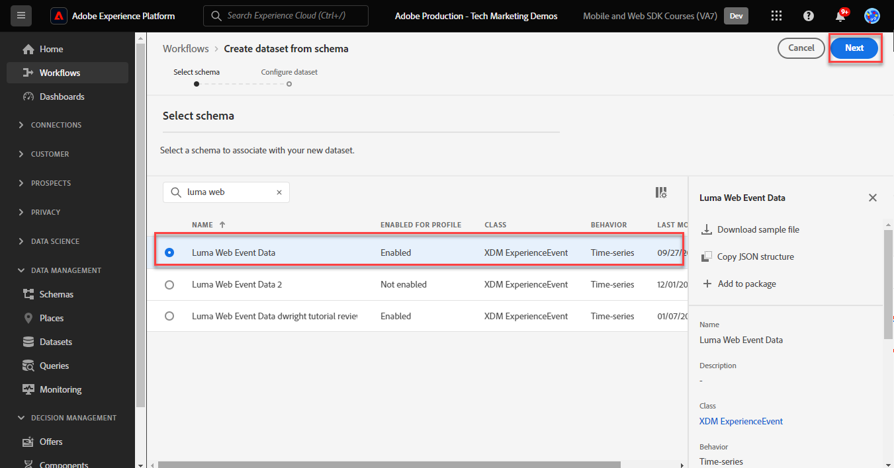
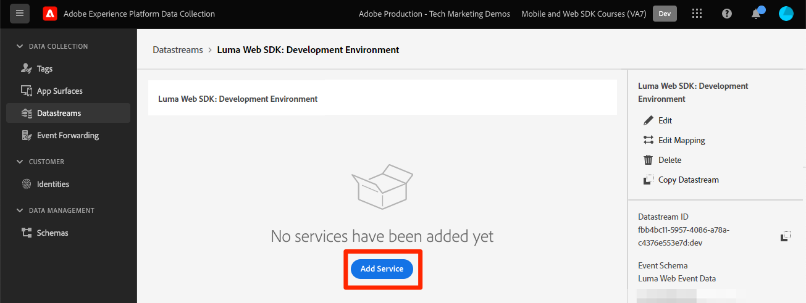

# Transmitir datos al Experience Platform con SDK web

Obtenga información sobre cómo transmitir datos web a Adobe Experience Platform con el SDK web de Platform.

Experience Platform es la columna vertebral de todas las nuevas aplicaciones de Experience Cloud, como Adobe Real-time Customer Data Platform, Adobe Customer Journey Analytics y Adobe Journey Optimizer. Estas aplicaciones están diseñadas para utilizar el SDK web de Platform como método óptimo de recopilación de datos web.

Experience Platform utiliza el mismo esquema XDM creado anteriormente para capturar datos de evento del sitio web de Luma. Cuando esos datos se envían al Edge Network de Platform, la configuración del conjunto de datos puede reenviarlos al Experience Platform.

## Objetivos de aprendizaje

Al final de esta lección, debe poder:

* Crear un conjunto de datos en Adobe Experience Platform
* Configuración de la secuencia de datos para enviar datos del SDK web a Adobe Experience Platform
* Habilitar el streaming de datos web para el perfil del cliente en tiempo real
* Validar que los datos hayan llegado tanto al conjunto de datos de Platform como al Perfil del cliente en tiempo real

## Requisitos previos

Para completar esta lección, primero debe:

* Tener acceso a una aplicación de Adobe Experience Platform como Real-time Customer Data Platform, Journey Optimizer o Customer Journey Analytics.
* Complete las lecciones anteriores de las secciones Configuración inicial y Configuración de etiquetas de este tutorial.

## Crear un conjunto de datos

Todos los datos que se incorporan correctamente a Adobe Experience Platform se conservan dentro del lago de datos como conjuntos de datos. A [conjunto de datos](https://experienceleague.adobe.com/en/docs/experience-platform/catalog/datasets/overview) es una construcción de almacenamiento y administración para una colección de datos, normalmente una tabla, que contiene un esquema (columnas) y campos (filas). Los conjuntos de datos también contienen metadatos que describen varios aspectos de los datos que almacenan.

Vamos a configurar un conjunto de datos para los datos de evento web de Luma:

1. Vaya a la [interfaz de Experience Platform](https://experience.adobe.com/platform/)
1. Confirme que se encuentra en el entorno limitado de desarrollo que utiliza para este tutorial.
1. Abrir **[!UICONTROL Administración de datos > Conjuntos de datos]** desde la navegación izquierda
1. Seleccionar **[!UICONTROL Crear conjunto de datos]**

   

1. Seleccione el **[!UICONTROL Crear conjunto de datos a partir de esquema]** opción

   

1. Seleccione el `Luma Web Event Data` esquema creado en [lección anterior](configure-schemas.md) y luego seleccione **[!UICONTROL Siguiente]**

   

1. Proporcione un **[!UICONTROL Nombre]** y opcional **[!UICONTROL Descripción]** para el conjunto de datos. Para este ejercicio, utilice `Luma Web Event Data`, luego seleccione **[!UICONTROL Finalizar]**

   

Ahora hay configurado un conjunto de datos para empezar a recopilar datos de su implementación del SDK web de Platform.

## Configuración de la secuencia de datos

Ahora puede configurar los [!UICONTROL secuencia de datos] para enviar datos a [!UICONTROL Adobe Experience Platform]. La secuencia de datos es el vínculo entre la propiedad de etiquetas, el Edge Network de Platform y el conjunto de datos del Experience Platform.

1. Abra el [Recopilación de datos](https://experience.adobe.com/#/data-collection){target="blank"} interfaz
1. Seleccionar **[!UICONTROL Datastreams]** desde la navegación izquierda
1. Abra la secuencia de datos que creó en la [Configuración de una secuencia de datos](configure-datastream.md) lección, `Luma Web SDK`

   

1. Seleccionar **[!UICONTROL Añadir servicio]**
   
1. Seleccionar **[!UICONTROL Adobe Experience Platform]** como el **[!UICONTROL Servicio]**
1. Seleccionar `Luma Web Event Data` como el **[!UICONTROL Conjunto de datos de evento]**

1. Seleccione **[!UICONTROL Guardar]**.

   

A medida que genera tráfico en [Sitio de demostración de Luma](https://luma.enablementadobe.com/content/luma/us/en.html) asignado a la propiedad tag, los datos rellenarán el conjunto de datos en Experience Platform.

## Validación del conjunto de datos

Este paso es fundamental para asegurarse de que los datos hayan llegado al conjunto de datos. Existen dos aspectos para validar los datos enviados al conjunto de datos.

* Validar mediante [!UICONTROL Experience Platform Debugger]
* Validar mediante [!UICONTROL Previsualizar conjunto de datos]
* Validar mediante [!UICONTROL Servicio de consultas]

### Experience Platform Debugger

Estos pasos son más o menos los mismos que realizó en el [Lección de Debugger](validate-with-debugger.md). Sin embargo, como los datos solo se enviarán a Platform después de haberlos habilitado en el conjunto de datos, debe generar algunos datos de ejemplo más:

1. Abra el [Sitio de demostración de Luma](https://luma.enablementadobe.com/content/luma/us/en.html) y seleccione la [!UICONTROL Experience Platform Debugger] icono de extensión

1. Configure Debugger para asignar la propiedad de etiqueta a *su* Entorno de desarrollo, tal como se describe en la sección [Validar con Debugger](validate-with-debugger.md) lección

   

1. Inicie sesión en el sitio de Luma con las credenciales `test@adobe.com`/`test`

1. Vuelva a la [página principal de Luma](https://luma.enablementadobe.com/content/luma/us/en.html)

1. En las señalizaciones de red del SDK web de Platform que muestra Debugger, seleccione la fila &quot;events&quot; para expandir los detalles en una ventana emergente

   

1. Busque el &quot;identityMap&quot; en la ventana emergente. Aquí debe ver lumaCrmId con tres claves authenticationState, id y primary
   

Ahora los datos deben rellenarse en la variable `Luma Web Event Data` conjunto de datos y listo para la validación &#39;Previsualizar conjunto de datos&#39;.

### Previsualización del conjunto de datos

Para confirmar que los datos han aterrizado en el lago de datos de Platform, una opción rápida es utilizar **[!UICONTROL Previsualizar conjunto de datos]** función. Los datos del SDK web se envían en microlotes al lago de datos y se actualizan en la interfaz de Platform periódicamente. Los datos generados pueden tardar entre 10 y 15 minutos en mostrarse.

1. En el [Experience Platform](https://experience.adobe.com/platform/) interfaz, seleccione **[!UICONTROL Administración de datos > Conjuntos de datos]** en el panel de navegación izquierdo para abrir **[!UICONTROL Conjuntos de datos]** panel.

   El panel enumera todos los conjuntos de datos disponibles para su organización. Se muestran los detalles de cada conjunto de datos enumerado, incluido su nombre, el esquema al que se adhiere el conjunto de datos y el estado de la ejecución de ingesta más reciente.

1. Seleccione su `Luma Web Event Data` conjunto de datos para abrir **[!UICONTROL Actividad de conjunto de datos]** pantalla.

   

   La pantalla de actividad incluye un gráfico que visualiza la tasa de mensajes que se consumen, así como una lista de lotes correctos y fallidos.

1. Desde el **[!UICONTROL Actividad de conjunto de datos]** pantalla, seleccione **[!UICONTROL Previsualizar conjunto de datos]** cerca de la esquina superior derecha de la pantalla para obtener una vista previa de hasta 100 filas de datos. Si el conjunto de datos está vacío, se desactiva el vínculo de vista previa.

   

   En la ventana de vista previa, la vista jerárquica del esquema para el conjunto de datos se muestra a la derecha.

   

>[!INFO]
>
>El servicio de consultas de Adobe Experience Platform es un método más robusto para validar datos en el lago, pero está fuera del ámbito de este tutorial. Para obtener más información, consulte [Exploración de datos](https://experienceleague.adobe.com/en/docs/platform-learn/tutorials/queries/explore-data) en la sección Tutoriales de Platform.

## Habilitar el conjunto de datos y el esquema para el perfil del cliente en tiempo real

El siguiente paso es habilitar el conjunto de datos y el esquema para el perfil del cliente en tiempo real. La transmisión de datos desde el SDK web será una de las muchas fuentes de datos que fluirán a Platform y desea unir los datos web con otras fuentes de datos para crear perfiles de clientes de 360 grados. Para obtener más información sobre el Perfil del cliente en tiempo real, vea este breve vídeo:

>[!VIDEO](https://video.tv.adobe.com/v/27251?learn=on&captions=eng)

>[!CAUTION]
>
>Al trabajar con su propio sitio web y datos de, recomendamos una validación de datos más sólida antes de habilitarla para el perfil del cliente en tiempo real.

**Para habilitar el conjunto de datos:**

1. Abra el conjunto de datos que ha creado, `Luma Web Event Data`

1. Seleccione el **[!UICONTROL Alternancia de perfil]** para activarlo.

   

1. Confirme que desea **[!UICONTROL Activar]** el conjunto de datos

   

**Para habilitar el esquema:**

1. Abra el esquema que ha creado, `Luma Web Event Data`

1. Seleccione el **[!UICONTROL Alternancia de perfil]** para activarlo.

   

1. Seleccionar **[!UICONTROL Los datos de este esquema contienen una identidad principal en el campo identityMap.]**

   >[!IMPORTANT]
   >
   >    Las identidades principales son necesarias en cada registro enviado al Perfil del cliente en tiempo real. Normalmente, los campos de identidad se etiquetan dentro del esquema. Sin embargo, al utilizar mapas de identidad, los campos de identidad no son visibles dentro del esquema. Este cuadro de diálogo sirve para confirmar que tiene en mente una identidad principal y que la especificará en un mapa de identidad al enviar los datos. Como ya sabe, el SDK web utiliza un mapa de identidad y el ID de Experience Cloud (ECID) es la identidad principal predeterminada.

1. Seleccionar **[!UICONTROL Activar]**

   

1. Seleccionar **[!UICONTROL Guardar]** para guardar el esquema actualizado

Ahora el esquema también está habilitado para el perfil.

>[!IMPORTANT]
>
>    Una vez que un esquema está habilitado para el perfil, no se puede deshabilitar ni eliminar. Además, los campos no se pueden eliminar del esquema después de este punto. Estas implicaciones son importantes que se deben tener en cuenta más adelante cuando trabaje con sus propios datos en el entorno de producción. Debe utilizar una zona protegida de desarrollo en este tutorial, que se puede eliminar en cualquier momento.
>
>   
> Al trabajar con sus propios datos, le recomendamos que haga las cosas en el siguiente orden:
> 
> * En primer lugar, introduzca algunos datos en los conjuntos de datos.
> * Solucionar cualquier problema que surja durante el proceso de ingesta de datos (por ejemplo, problemas de validación o asignación de datos).
> * Habilitar los conjuntos de datos y esquemas para el perfil
> * Vuelva a ingerir los datos si es necesario

### Validación de un perfil

Puede buscar un perfil de cliente en la interfaz de Platform (o de Journey Optimizer) para confirmar que los datos han llegado al Perfil del cliente en tiempo real. Como su nombre sugiere, los perfiles se rellenan en tiempo real, por lo que no hay retraso como con la validación de datos en el conjunto de datos.

Primero debe generar más datos de ejemplo. Repita los pasos anteriores de esta lección para iniciar sesión en el sitio web de Luma cuando esté asignado a la propiedad de etiquetas. Inspect utiliza la solicitud del SDK web de Platform para asegurarse de que envía datos con la variable `lumaCRMId`.

1. En el [Experience Platform](https://experience.adobe.com/platform/) interfaz, seleccione **[!UICONTROL Perfiles]** en el panel de navegación izquierdo

1. Como el **[!UICONTROL Área de nombres de identidad]** use `lumaCRMId`
1. Copie y pegue el valor de `lumaCRMId` pasó la llamada que inspeccionó en Experience Platform Debugger, en este caso `112ca06ed53d3db37e4cea49cc45b71e`.

   

1. Si hay un valor válido en el perfil para `lumaCRMId`, un ID de perfil se rellena en la consola:

   

1. Para ver la información completa **[!UICONTROL Perfil del cliente]** para cada ID, seleccione la **[!UICONTROL ID de perfil]** en la ventana principal.

   >[!NOTE]
   >
   >Nota: puede seleccionar el hipervínculo del ID de perfil o, si selecciona la fila, se abrirá un menú de la derecha en el que podrá seleccionar el hipervínculo ID de perfil
   > 

   Aquí puede ver todas las identidades vinculadas a `lumaCRMId`, como el `ECID`.

   

Ahora ha habilitado el SDK web de Platform para Experience Platform (y Real-Time CDP! ¡Y Journey Optimizer! ¡Y Customer Journey Analytics!).

[Siguiente: ](setup-analytics.md)

>[!NOTE]
>
>Gracias por dedicar su tiempo a conocer el SDK web de Adobe Experience Platform. Si tiene preguntas, desea compartir comentarios generales o tiene sugerencias sobre contenido futuro, compártalas en este [Entrada de discusión de la comunidad Experience League](https://experienceleaguecommunities.adobe.com/t5/adobe-experience-platform-launch/tutorial-discussion-implement-adobe-experience-cloud-with-web/td-p/444996)
