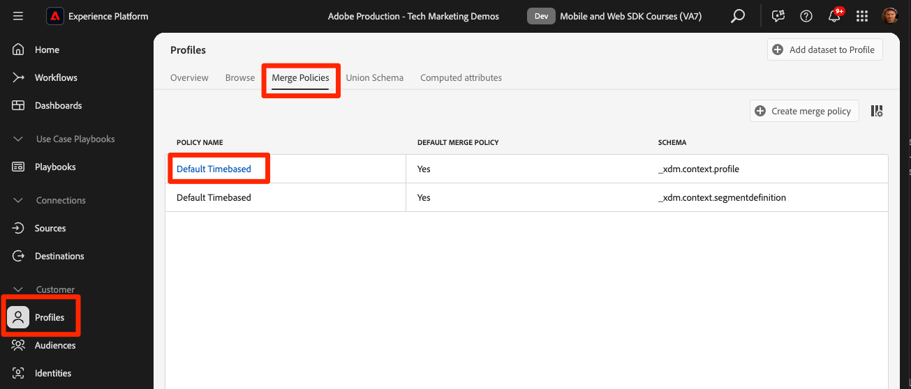

# Segmentación de Real-time Customer Profiles y Edge

## Habilitar el conjunto de datos y el esquema para el perfil del cliente en tiempo real

Para los clientes de Real-Time Customer Data Platform y Journey Optimizer, el siguiente paso es habilitar el conjunto de datos y el esquema para el perfil del cliente en tiempo real. La transmisión de datos desde Web SDK será una de las muchas fuentes de datos que fluirán a Platform y desea unir los datos web con otras fuentes de datos para crear perfiles de clientes de 360 grados. Para obtener más información sobre el Perfil del cliente en tiempo real, vea este breve vídeo:

>[!VIDEO](https://video.tv.adobe.com/v/27251?learn=on&captions=eng)

>[!CAUTION]
>
>Al trabajar con su propio sitio web y datos de, recomendamos una validación de datos más sólida antes de habilitarla para el perfil del cliente en tiempo real.

### Habilitar el esquema

Para habilitar el esquema para el perfil:

1. Abra el esquema que creó, `Luma Web Event Data`

1. Seleccione **[!UICONTROL Alternancia de perfil]** para activarla

   

1. Seleccione **[!UICONTROL Los datos de este esquema contendrán una identidad principal en el campo identityMap.]**

1. Seleccionar **[!UICONTROL Habilitar]**

   

   >[!IMPORTANT]
   >
   >    Las identidades principales son necesarias en cada registro enviado al Perfil del cliente en tiempo real. Cada registro se convierte en un &quot;fragmento de perfil&quot; y las identidades principales son las claves para buscar esos fragmentos.
   > 
   > Con algunos tipos de datos, los campos de identidad se etiquetan dentro del esquema. Sin embargo, con los datos de evento capturados por los SDK de Experience Platform, los mapas de identidad son típicos y los campos de identidad no son visibles dentro del esquema.
   >
   > Este cuadro de diálogo sirve para confirmar que tiene en mente una identidad principal y que la especificará en un mapa de identidad al enviar los datos, configurarla con reglas de vinculación de gráficos de identidad o ambas cosas. Le recomendamos que haga ambas cosas.
   >
   > Como ya sabe, nuestra implementación de Luma utiliza un mapa de identidad con el lumaCrmId autenticado como identidad principal cuando está disponible; de lo contrario, el valor predeterminado será el Experience Cloud ID (ECID).

1. Seleccione **[!UICONTROL Guardar]** para guardar el esquema actualizado

Ahora el esquema está habilitado para el perfil.

### Habilitar el conjunto de datos

Para habilitar el conjunto de datos:

1. Abra el conjunto de datos que creó, `Luma Web Event Data`

1. Seleccione **[!UICONTROL Alternancia de perfil]** para activarla

   

1. Confirme que quiere **[!UICONTROL habilitar]** el conjunto de datos

>[!IMPORTANT]
>
>  Una vez que un esquema está habilitado para el perfil y los datos se incorporan al conjunto de datos, no se puede deshabilitar ni eliminar sin restablecer o eliminar todo el entorno limitado. Además, los campos que han recibido datos no se pueden eliminar del esquema después de este punto.
>
>   
> Al trabajar con sus propios datos, le recomendamos que haga las cosas en el siguiente orden:
> 
> * En primer lugar, introduzca algunos datos en los conjuntos de datos.
> * Solucionar cualquier problema que surja durante el proceso de ingesta de datos (por ejemplo, problemas de validación o asignación de datos).
> * Habilitar los conjuntos de datos y esquemas para el perfil
> * Vuelva a ingerir los datos si es necesario

### Validación de un perfil

Puede buscar un perfil de cliente en la interfaz de Platform (o de Journey Optimizer) para confirmar que los datos han llegado al Perfil del cliente en tiempo real. Como su nombre sugiere, los perfiles se rellenan en tiempo real, por lo que no hay retraso como con la validación de datos en el conjunto de datos.

En primer lugar, debe generar más datos de ejemplo en el conjunto de datos con perfil habilitado:

1. Abra el [sitio web de demostración de Luma](https://luma.enablementadobe.com) y seleccione el icono de extensión [!UICONTROL Experience Platform Debugger]

1. Configure Debugger para que asigne la propiedad de etiqueta a *su entorno de desarrollo*, tal como se describe en la lección [Validar con Debugger](validate-with-debugger.md)

   

1. Examine el sitio web. Vea algunos productos y agréguelos a su carro de compras.

1. Inicie sesión en el sitio de Luma con las credenciales `test@test.com`/`test` (si recibe el mensaje &quot;Correo electrónico o contraseña no válidos&quot;, cree una cuenta con esas credenciales)

1. Abra la fila &quot;events&quot; para buscar algunas de las variables XDM.
1. Busque el &quot;identityMap&quot; en la ventana emergente. Aquí debe ver lumaCrmId con tres claves authenticationState, id y primary. Observe cómo el valor lumaCrmId para este inicio de sesión es `f660ab912ec121d1b1e928a0bb4bc61b`.

   

Ahora vamos a buscar nuestro perfil en Experience Platform:

1. En la interfaz de [Experience Platform](https://experience.adobe.com/platform/), seleccione **[!UICONTROL Cliente]** > **[!UICONTROL Perfiles]** en el panel de navegación izquierdo

1. Como el **[!UICONTROL área de nombres de identidad]**, use `Luma CRM ID`
1. Copie y pegue el valor de `lumaCrmId` pasado en la llamada que inspeccionó en Experience Platform Debugger, en este caso `f660ab912ec121d1b1e928a0bb4bc61b`

1. Si hay un valor válido en el perfil para `lumaCRMId`, se rellena un identificador de perfil en la consola

1. Para ver el **[!UICONTROL perfil del cliente]** completo, seleccione **[!UICONTROL Ver]**:

   

1. Primero verá un resumen del perfil. Todavía no hay mucho en este perfil, pero aquí están las identidades vinculadas en el perfil, `lumaCRMId` y `ECID`:

   

1. En este punto, la mayoría de los datos de perfil disponibles son datos de evento de la actividad web. Seleccione **[!UICONTROL Eventos]** para ver los datos del flujo de navegación:

   

## Evitar el colapso de perfiles

Ahora veamos algo que nunca querrá que ocurra en su propia implementación: colapsos de gráficos.

### Comprender el problema

En primer lugar, vamos a generar más datos de muestra para que podamos ver el problema:

1. Sin eliminar ninguna cookie u objeto localStorage, abra el [sitio web de demostración de Luma](https://luma.enablementadobe.com) y seleccione el icono de extensión [!UICONTROL Experience Platform Debugger]

1. Configure Debugger para que asigne la propiedad de etiqueta a *su entorno de desarrollo*, tal como se describe en la lección [Validar con Debugger](validate-with-debugger.md)

   

1. Esperamos que aún haya iniciado sesión en el sitio de Luma con las credenciales `test@test.com`/`test`. Si no es así, vuelva a iniciar sesión.

1. Examine el sitio web. Vea algunos productos y agréguelos a su carro de compras.

1. Ahora, cierre la sesión.

1. Ahora inicie sesión de nuevo y cree una cuenta como otro usuario (`spouse@test.com/test`). Lo que intentamos hacer es replicar un escenario de &quot;dispositivo compartido&quot;, en el que dos usuarios compartan el mismo explorador web, se autentiquen en el mismo sitio web y compartan el mismo valor `ECID`.
1. Confirme en Debugger que tiene un lumaCrmId diferente, `98d73957f59c67617611d56ba7e8dbaa` para `spouse@test.com/test`.

   

1. Ver algunos productos adicionales

Ahora, vuelva a buscar el perfil:

1. Volver a buscar `Luma CRM ID` igual a `f660ab912ec121d1b1e928a0bb4bc61b`
1. Tenga en cuenta que el perfil ahora está vinculado a dos ID de Luma CRM diferentes

1. Seleccionar **[!UICONTROL Ver gráfico de identidad]**

   

1. El gráfico de identidad ayuda a visualizar este perfil en el que, debido al uso compartido del dispositivo, dos valores `lumaCrmId` se unen mediante un valor `ECID` común.

   

Esto puede suponer un gran problema para una implementación de Experience Platform. No solo los datos de evento de ambos usuarios se unen en un único perfil, sino que también se combinarán otros tipos de datos ingeridos en Platform que use estos `lumaCrmId` valores.

### Arreglarlo con reglas de vinculación de gráficos de identidad

Para solucionar de forma preventiva el problema del colapso del gráfico, utilice la función reglas de vinculación de gráficos de identidad en Adobe Experience Platform antes de habilitar la implementación de Web SDK.

>[!WARNING]
>
> Estos pasos los suele configurar un arquitecto de datos que administra toda la implementación de Platform. La función tiene mucho más que lo que se muestra aquí y muchos escenarios complejos que primero deben simularse cuidadosamente.
>
> Complete estos pasos únicamente si va a completar este tutorial en una zona protegida de desarrollo dedicada que se puede eliminar después de completar este tutorial. Estos cambios en la zona protegida no se pueden revertir. Consulte los [tutoriales de reglas de vinculación de gráficos de identidad](https://experienceleague.adobe.com/es/docs/platform-learn/tutorials/identities/graph-linking-rules/overview) para obtener más información.

Para habilitar las reglas de vinculación de gráficos de identidad:

1. En cualquier pantalla Identidades, abra **[!UICONTROL Configuración]**:

   

1. Revise las advertencias del modal y seleccione **[!UICONTROL Continuar]**
1. Arrastre `Luma CRM ID` para que sea el área de nombres de mayor prioridad en la lista
1. Compruebe la configuración **[!UICONTROL Único por gráfico]** para `Luma CRM ID`
1. Seleccionar **[!UICONTROL Siguiente]**
   
1. Revise el modal y **[!UICONTROL Confirmar]**
1. Seleccione **[!UICONTROL Siguiente]** para omitir el paso de simulación

   >[!WARNING]
   >
   > De nuevo, no complete este flujo de trabajo para habilitar esta configuración de identidad si no está trabajando en su propia zona protegida de desarrollo dedicada.

1. Escriba el nombre de la zona protegida y seleccione **[!UICONTROL Confirmar]**

   

Vuelva al sitio en 24 horas, inicie sesión como `test@test.com` o `spouse@test.com` y vea si sus perfiles se han separado.

## Crear una audiencia evaluada por Edge

Se recomienda completar este ejercicio para los clientes de Real-Time Customer Data Platform y Journey Optimizer.

Cuando los datos de Web SDK se incorporan en Adobe Experience Platform, se pueden ampliar con otras fuentes de datos que haya introducido en Platform. Por ejemplo, cuando un usuario inicia sesión en el sitio de Luma, se construye un gráfico de identidades en Experience Platform y todos los demás conjuntos de datos con perfil habilitado pueden unirse para crear perfiles de cliente en tiempo real. Para ver esto en acción, creará rápidamente otro conjunto de datos en Adobe Experience Platform con algunos datos de fidelidad de ejemplo para que pueda utilizar Perfiles del cliente en tiempo real con Real-Time Customer Data Platform y Journey Optimizer. A continuación, creará una audiencia basada en estos datos.

### Crear un esquema de fidelización e introducir datos de ejemplo

Dado que ya ha realizado ejercicios similares, las instrucciones serán breves.

Cree el esquema de fidelización:

1. Creación de un nuevo esquema
1. Elija **[!UICONTROL Perfil individual]** como [!UICONTROL clase base]
1. Asigne un nombre al esquema `Luma Loyalty Schema`
1. Agregar el grupo de campos [!UICONTROL Detalles de fidelización]
1. Agregar el grupo de campos [!UICONTROL Detalles demográficos]
1. Seleccione el campo `Person ID` y márquelo como [!UICONTROL Identidad] e [!UICONTROL Identidad principal] con el área de nombres `Luma CRM Id` [!UICONTROL Identidad].
1. Habilite el esquema para [!UICONTROL Profile]. Si no encuentra la opción Perfil, intente hacer clic en el nombre del esquema en la parte superior izquierda.
1. Guardar el esquema

   

Para crear el conjunto de datos e introducir los datos de ejemplo:

1. Crear un nuevo conjunto de datos a partir de `Luma Loyalty Schema`
1. Asigne un nombre al conjunto de datos `Luma Loyalty Dataset`
1. Habilitar el conjunto de datos para [!UICONTROL Perfil]
1. Descargar el archivo de muestra [luma-loyalty-forWeb.json](assets/luma-loyalty-forWeb.json)
1. Arrastre y suelte el archivo en el conjunto de datos
1. Confirme que los datos se han introducido correctamente.

   

### Definir una política de combinación activa en Edge

Todas las audiencias se crean con una política de combinación. Las políticas de combinación crean diferentes &quot;vistas&quot; de un perfil, pueden contener un subconjunto de conjuntos de datos y prescriben un orden de prioridad cuando diferentes conjuntos de datos aportan los mismos atributos de perfil. Para ser evaluada en el perímetro de, una audiencia debe usar una política de combinación con que tenga la configuración **[!UICONTROL Política de combinación activa en Edge]**.

>[!IMPORTANT]
>
>Solo una política de combinación por zona protegida puede tener la configuración **[!UICONTROL Política de combinación activa en Edge]**

1. Abra la interfaz de Experience Platform o Journey Optimizer y asegúrese de que está en el entorno de desarrollo que utiliza para el tutorial.
1. Vaya a la página **[!UICONTROL Cliente]** > **[!UICONTROL Perfiles]** > **[!UICONTROL Políticas de combinación]**
1. Abrir la **[!UICONTROL política de combinación predeterminada]** (probablemente denominada `Default Timebased`)
   
1. Habilitar la configuración **[!UICONTROL Política de combinación activa en Edge]**
1. Seleccionar **[!UICONTROL Siguiente]**

   
1. Sigue seleccionando **[!UICONTROL Siguiente]** para continuar con los otros pasos del flujo de trabajo y selecciona **[!UICONTROL Finalizar]** para guardar la configuración
   

Ahora puede crear audiencias que se evaluarán en Edge.

### Crear un público

Las audiencias agrupan perfiles en torno a rasgos comunes. Cree una audiencia sencilla que pueda utilizar en Real-Time CDP o Journey Optimizer:

1. En la interfaz de Experience Platform o Journey Optimizer, vaya a **[!UICONTROL Cliente]** > **[!UICONTROL Audiencias]** en el panel de navegación izquierdo
1. Seleccionar **[!UICONTROL Crear audiencia]**
1. Seleccionar **[!UICONTROL regla de compilación]**
1. Seleccionar **[!UICONTROL Crear]**

   

1. Seleccionar **[!UICONTROL atributos]**
1. Busque el campo **[!UICONTROL Fidelidad]** > **[!UICONTROL Nivel]** y arrástrelo a la sección **[!UICONTROL Atributos]**
1. Defina la audiencia como usuarios cuyo `tier` es `gold`
1. Asigne un nombre a la audiencia `Luma Loyalty Rewards – Gold Status`
1. Seleccione **[!UICONTROL Edge]** como **[!UICONTROL método de evaluación]**
1. Seleccionar **[!UICONTROL Guardar]**

   

>[!NOTE]
>
> Dado que establecemos la política de combinación predeterminada como **[!UICONTROL Política de combinación activa en Edge]**, la audiencia que creó se asocia automáticamente a esta política de combinación.

Como se trata de una audiencia muy sencilla, podemos utilizar el método de evaluación de Edge. Las audiencias de Edge se evalúan en el perímetro, por lo que en la misma solicitud realizada por Web SDK a Platform Edge Network, podemos evaluar la definición de la audiencia y confirmar inmediatamente si el usuario cumple los requisitos.

>[!NOTE]
>
>Gracias por dedicar su tiempo a conocer Adobe Experience Platform Web SDK. Si tiene preguntas, desea compartir comentarios generales o tiene sugerencias sobre contenido futuro, compártalas en esta [publicación de debate de la comunidad de Experience League](https://experienceleaguecommunities.adobe.com/adobe-experience-platform-18/tutorial-discussion-implement-adobe-experience-cloud-with-web-sdk-tutorial-248848)
