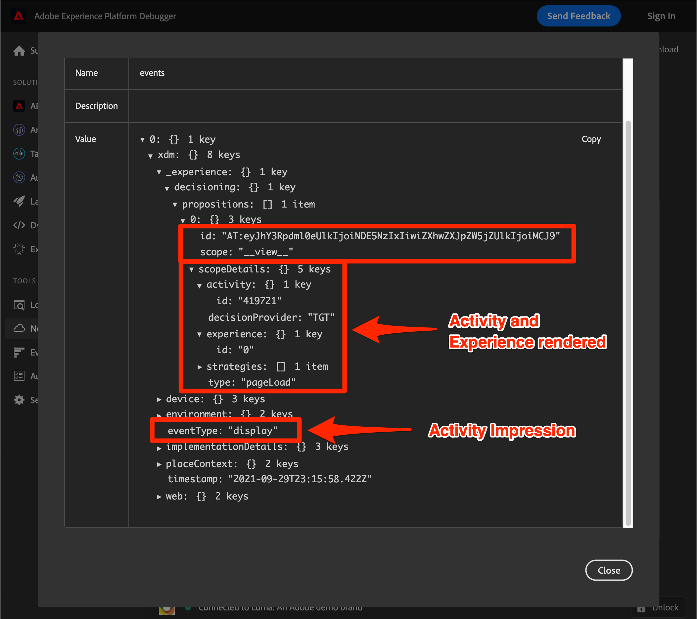
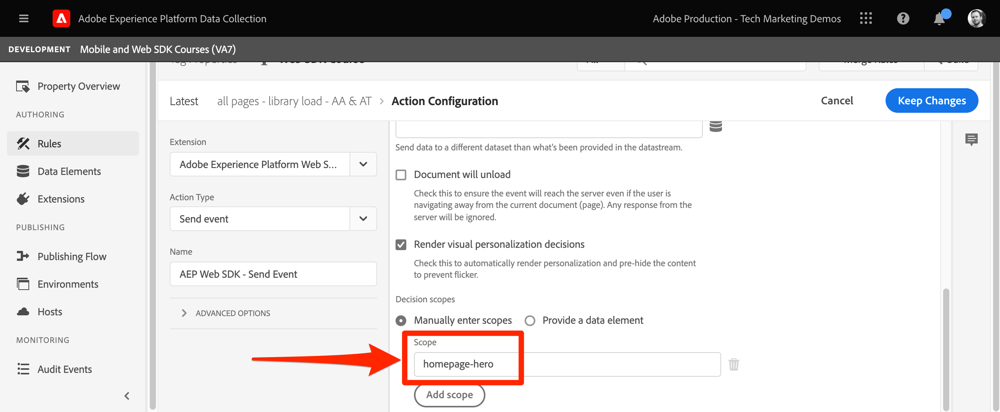
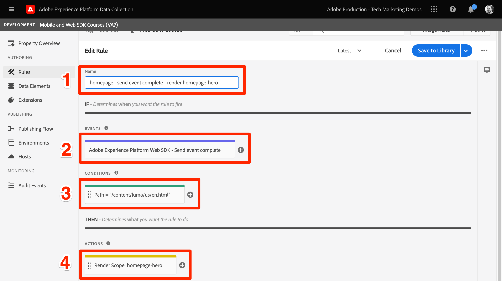
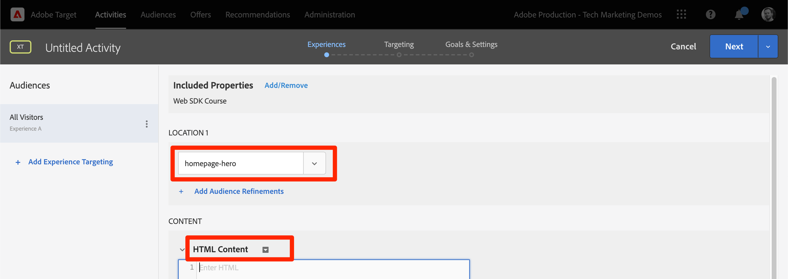

# Configuración de Adobe Target con el SDK web de Platform

Obtenga información sobre cómo implementar Adobe Target mediante el SDK web de Adobe Experience Platform. Obtenga información sobre cómo ofrecer experiencias y cómo pasar los parámetros adicionales a Target.

[Adobe Target](https://experienceleague.adobe.com/en/docs/target/using/target-home) es la aplicación de Adobe Experience Cloud que proporciona todo lo necesario para adaptar y personalizar la experiencia de sus clientes con el fin de maximizar los ingresos de sus sitios web y móviles, aplicaciones y otros canales digitales.


## Objetivos de aprendizaje

Al final de esta lección, puede hacer lo siguiente con una implementación del SDK web de Target:

* Añada el fragmento preocultado para evitar el parpadeo
* Configuración de una secuencia de datos para habilitar la funcionalidad de Target
* Procesar actividades del compositor de experiencias visuales
* Procesar actividades del compositor de formularios
* Pasar datos XDM a Target y comprender la asignación a parámetros de Target
* Pasar datos personalizados a Target, como parámetros de perfil y de entidad
* Validar una implementación de Target.
* Separar solicitudes de personalización de solicitudes de análisis

>[!TIP]
>
>Consulte nuestro tutorial [Migrar Target de at.js 2.x al SDK web de Platform](/help/tutorial-migrate-target-websdk/introduction.md) para obtener una guía paso a paso sobre cómo migrar su implementación de at.js existente.


## Requisitos previos

Para completar las lecciones de esta sección, primero debe:

* Completar todas las lecciones para la configuración inicial del SDK web de Platform, incluida la configuración de elementos de datos y reglas.
* Asegúrese de que tiene un [rol de Editor o Aprobador](https://experienceleague.adobe.com/en/docs/target/using/administer/manage-users/enterprise/properties-overview#section_8C425E43E5DD4111BBFC734A2B7ABC80) en Adobe Target.
* Instale la [extensión de ayuda del Compositor de experiencias visuales](https://experienceleague.adobe.com/en/docs/target/using/experiences/vec/troubleshoot-composer/vec-helper-browser-extension) si utiliza el explorador Google Chrome.
* Saber cómo configurar actividades en Target. Si necesita un actualizador, los siguientes tutoriales y guías le resultarán útiles para esta lección:
   * [Usar la extensión de ayuda del Compositor de experiencias visuales (VEC)](https://experienceleague.adobe.com/en/docs/target/using/experiences/vec/troubleshoot-composer/vec-helper-browser-extension)
   * [Usar el Compositor de experiencias visuales](https://experienceleague.adobe.com/en/docs/target-learn/tutorials/experiences/use-the-visual-experience-composer)
   * [Usar el Compositor de experiencias basadas en formularios](https://experienceleague.adobe.com/en/docs/target-learn/tutorials/experiences/use-the-form-based-experience-composer)
   * [Crear actividades de segmentación de experiencias](https://experienceleague.adobe.com/en/docs/target-learn/tutorials/activities/create-experience-targeting-activities)

## Agregar control de parpadeo

Antes de empezar, determine si se requiere una solución adicional de control de parpadeos en función de cómo se cargue la biblioteca de etiquetas.

>[!NOTE]
>
>Este tutorial utiliza el [sitio web de Luma](https://luma.enablementadobe.com/content/luma/us/en.html){target=_blank}, que cuenta con una implementación asíncrona de etiquetas y una mitigación de parpadeo. Esta sección es una referencia para comprender cómo funciona la mitigación de parpadeo con el SDK web de Platform.


### Implementación asincrónica

Cuando una biblioteca de etiquetas se carga de forma asíncrona, es posible que la página termine de procesarse antes de que Target haya reemplazado el contenido predeterminado por contenido personalizado. Este comportamiento puede llevar a lo que se conoce como &quot;parpadeo&quot;, en el que el contenido predeterminado aparece brevemente antes de ser reemplazado por el contenido personalizado. Si desea evitar este parpadeo, Adobe recomienda añadir un fragmento preocultado especial inmediatamente antes del código incrustado de etiqueta asincrónico de.

Este fragmento ya está presente en el sitio de Luma, pero echemos un vistazo más de cerca para comprender lo que hace este código:

```html
<script>
  !function(e,a,n,t){var i=e.head;if(i){
  if (a) return;
  var o=e.createElement("style");
  o.id="alloy-prehiding",o.innerText=n,i.appendChild(o),setTimeout(function(){o.parentNode&&o.parentNode.removeChild(o)},t)}}
  (document, document.location.href.indexOf("adobe_authoring_enabled") !== -1, ".personalization-container { opacity: 0 !important }", 3000);
</script>
```

El fragmento de preocultación crea una etiqueta de estilo en el encabezado de la página con la definición CSS que elija. Esta etiqueta de estilo se elimina cuando se recibe una respuesta de Target o se alcanza el tiempo de espera.

El comportamiento de preocultación se controla mediante dos configuraciones al final del fragmento.

* `body { opacity: 0 !important }` especifica la definición de CSS que se utilizará para la preocultación hasta que se cargue Target. De forma predeterminada, toda la página está oculta. Puede actualizar esta definición a los selectores que desea ocultar previamente junto con cómo desea ocultarlos. Puede incluir varias definiciones, ya que este valor es simplemente lo que se inserta en la etiqueta de estilo de ocultamiento previo. Si tiene un elemento contenedor fácil de identificar que incluya el contenido debajo de su navegación, puede utilizar este ajuste para limitar la preocultación a ese elemento contenedor.
* `3000` especifica el tiempo de espera en milisegundos para la preocultación. Si no se recibe una respuesta de Target antes del tiempo de espera, se elimina la etiqueta de estilo de ocultamiento previo. No es habitual alcanzar este tiempo de espera.

>[!NOTE]
>
>El fragmento de preocultación para el SDK web de Platform es ligeramente diferente del utilizado con la biblioteca at.js de Target. Asegúrese de utilizar el fragmento correcto para el SDK web de Platform, ya que utiliza un ID de estilo diferente de `alloy-prehiding`. Si se utiliza el fragmento de ocultamiento previo para at.js, es posible que no funcione correctamente.

El fragmento de ocultamiento previo también está disponible en las etiquetas:

1. Vaya a la sección de etiquetas **[!UICONTROL Extensions]**
1. Seleccione **[!UICONTROL Configurar]** para la extensión del SDK web de Adobe Experience Platform
1. Seleccione el botón **[!UICONTROL Copiar fragmento de ocultamiento previo en el portapapeles]**

   

   >[!NOTE]
   >
   >El fragmento de ocultamiento previo predeterminado copiado de la extensión del SDK web de Platform puede incluir una definición de CSS que no existe en el sitio, como `.personalization-container { opacity: 0 !important }`. Asegúrese de comprobar y modificar correctamente el fragmento de preocultación para su sitio.

### Implementación sincrónica

El Adobe recomienda implementar las etiquetas de forma asíncrona, tal como se muestra en el sitio de Luma. Sin embargo, si la biblioteca de etiquetas se carga sincrónicamente, el fragmento de ocultamiento previo no es necesario. En su lugar, el estilo de ocultamiento previo se especifica en la configuración de la extensión del SDK web de Platform.

El estilo de preocultación para implementaciones sincrónicas se puede configurar de la siguiente manera:

1. Vaya a la sección de etiquetas **[!UICONTROL Extensions]**
1. Seleccione el botón **[!UICONTROL Configurar]** para la extensión del SDK web de Platform
1. Seleccione el botón **[!UICONTROL Editar estilo de ocultamiento previo]**

   

1. Modifique la CSS para incluir los selectores y los métodos de ocultación que desee utilizar, por ejemplo: `body { opacity: 0 !important }` si desea ocultar previamente todo el cuerpo de la página.
1. Guarde los cambios y cree una biblioteca

>[!NOTE]
>
>La configuración de estilo de preocultación solo está pensada para utilizarse en implementaciones sincrónicas. Este estilo debe estar en blanco o comentado si utiliza una implementación asíncrona de etiquetas.

Para obtener más información sobre cómo el SDK web de Platform puede administrar el parpadeo, puede consultar la sección de guías: [administración del parpadeo para experiencias personalizadas](https://experienceleague.adobe.com/en/docs/experience-platform/edge/personalization/manage-flicker).


## Configuración de la secuencia de datos

Target debe estar habilitado en la configuración de la secuencia de datos para que el SDK web de Platform pueda entregar cualquier actividad de Target.

Para configurar Target en el conjunto de datos:

1. Vaya a la interfaz de [recopilación de datos](https://experience.adobe.com/#/data-collection){target="blank"}
1. En el panel de navegación izquierdo, seleccione **[!UICONTROL Datastreams]**
1. Seleccione la secuencia de datos `Luma Web SDK: Development Environment` creada anteriormente

   

1. Seleccionar **[!UICONTROL Agregar servicio]**
   
1. Seleccione **[!UICONTROL Adobe Target]** como **[!UICONTROL servicio]**
1. Introduzca los detalles opcionales sobre la implementación de Target, si lo desea, siguiendo las directrices que se indican a continuación.
1. Seleccionar **[!UICONTROL Guardar]**

   

### Token de propiedad

Los clientes de Target Premium tienen la opción de administrar permisos de usuario con propiedades. Las propiedades de Target le permiten establecer límites alrededor de donde los usuarios pueden ejecutar actividades de Target. Consulte la sección [Permisos de empresa](https://experienceleague.adobe.com/en/docs/target/using/administer/manage-users/enterprise/properties-overview) de la documentación de Target para obtener más información.

Para configurar o buscar tokens de propiedad, vaya a **Adobe Target** > **[!UICONTROL Administración]** > **[!UICONTROL Propiedades]**. El icono `</>` muestra el código de implementación. El valor `at_property` es el token de propiedad que se usaría en el conjunto de datos.


<a id="advanced-pto"></a>

Solo se puede especificar un token de propiedad por flujo de datos, pero las anulaciones de token de propiedad le permiten especificar tokens de propiedad alternativos para reemplazar el token de propiedad principal definido en el flujo de datos. También se necesita una actualización de la acción `sendEvent` para anular el conjunto de datos.


### ID del entorno de destino

Los [entornos](https://experienceleague.adobe.com/en/docs/target/using/administer/environments) de Target le ayudan a administrar la implementación en todas las etapas de desarrollo. Esta configuración opcional especifica qué entorno de Target va a utilizar con cada conjunto de datos.

El Adobe recomienda configurar el ID de entorno de Target de forma diferente para cada uno de los flujos de datos de desarrollo, ensayo y producción para que las cosas sean sencillas. También puede organizar sus entornos en la interfaz de Target mediante la función [hosts](https://experienceleague.adobe.com/en/docs/target/using/administer/hosts).

Para configurar o encontrar los ID de entorno, vaya a **Adobe Target** > **[!UICONTROL Administración]** > **[!UICONTROL Entornos]**.


>[!NOTE]
>
>Si no se especifica ningún ID de entorno de destino, se asume el entorno de destino de producción.

### Área de nombres de ID de terceros de Target

Esta configuración opcional le permite especificar qué símbolo de identidad utilizar para el ID de terceros de Target. Target solo admite la sincronización de perfiles en un único símbolo de identidad o área de nombres. Para obtener más información, consulte la sección [Sincronización de perfiles en tiempo real para mbox3rdPartyId](https://experienceleague.adobe.com/en/docs/target/using/audiences/visitor-profiles/3rd-party-id) de la guía de Target.

Los símbolos de identidad se encuentran en la lista de identidades en **Recopilación de datos** > **[!UICONTROL Cliente]** > **[!UICONTROL Identidades]**.


Para los fines de este tutorial utilizando el sitio de Luma, utilice el símbolo de identidad `lumaCrmId` configurado durante la lección acerca de [Identidades](configure-identities.md).


## Procesar decisiones de personalización visuales

Las decisiones de personalización visual hacen referencia a las experiencias creadas en el Compositor de experiencias visuales de Adobe Target. En primer lugar, debe comprender la terminología utilizada en las interfaces de Target y de etiquetas:

* **Actividad**: Un conjunto de experiencias dirigidas a una o más audiencias. Por ejemplo, una prueba A/B simple podría ser una actividad con dos experiencias.
* **Experiencia**: Un conjunto de acciones dirigidas a una o más ubicaciones o ámbitos de decisión.
* **Ámbito de decisión**: Ubicación a la que se entrega una experiencia de Target. Los ámbitos de decisión son equivalentes a los &quot;mboxes&quot; si está familiarizado con el uso de versiones anteriores de Target.
* **Decisión de Personalization**: Se debe aplicar una acción que el servidor determina. Estas decisiones pueden basarse en los criterios de audiencia y en la priorización de actividades de Target.
* **Propuesta**: El resultado de las decisiones tomadas por el servidor, que se entregan en la respuesta del SDK web de Platform. Por ejemplo, intercambiar una imagen de titular sería una propuesta.

### Actualice la acción [!UICONTROL Enviar evento]

Las decisiones de personalización visual de Target las entrega el SDK web de Platform, si Target está habilitado en la secuencia de datos. Sin embargo, _no se representan automáticamente_. Debe actualizar la acción [!UICONTROL Enviar evento] para habilitar el procesamiento automático.

1. En la interfaz [Recopilación de datos](https://experience.adobe.com/#/data-collection){target="blank"}, abra la propiedad de etiqueta que está utilizando para este tutorial.
1. Abrir la regla `all pages - library loaded - send event - 50`
1. Seleccione la acción `Adobe Experience Platform Web SDK - Send event`
1. Habilitar **[!UICONTROL Procesar decisiones de personalización visuales]** con la casilla de verificación

   

<!--
1. In the **[!UICONTROL Datastream configuration overrides**] the **[!UICONTROL Target Property Token]** can be overridden either as a static value or with a data element. Only property tokens defined in the [**Advanced Property Token Overrides**](#advanced-pto) section in **Datastream Configuration** will return results.
   
   
   -->

1. Guarde los cambios y cree en la biblioteca.

La configuración de decisiones de personalización visual de procesamiento hace que el SDK web de Platform aplique automáticamente cualquier modificación especificada mediante el Compositor de experiencias visuales de Target o &quot;mbox global&quot;.

>[!NOTE]
>
>Normalmente, la configuración [!UICONTROL Procesar decisiones de personalización visuales] solo debe habilitarse para una única acción Enviar evento por carga de página completa. Si varias acciones Enviar evento tienen esta configuración habilitada, las solicitudes de procesamiento posteriores se omiten.

Si prefiere procesar o actuar sobre estas decisiones por su cuenta utilizando código personalizado, puede dejar deshabilitada la configuración [!UICONTROL Procesar decisiones de personalización visual]. El SDK web de Platform es flexible y proporciona esta capacidad para ofrecerle un control completo. Puede consultar la guía para obtener más información sobre [el procesamiento manual del contenido personalizado](https://experienceleague.adobe.com/en/docs/experience-platform/edge/personalization/rendering-personalization-content).


### Configurar una actividad de Target con el Compositor de experiencias visuales

Ahora que la parte de implementación básica ha finalizado, cree una actividad de segmentación de experiencias (XT) en Target para comprobar que todo funciona correctamente. Puede consultar el tutorial de Target para [crear actividades de segmentación de experiencias](https://experienceleague.adobe.com/en/docs/target-learn/tutorials/activities/create-experience-targeting-activities) si necesita ayuda.

>[!NOTE]
>
>Si usa Google Chrome como explorador, se necesita la extensión de ayuda del [Compositor de experiencias visuales (VEC)](https://experienceleague.adobe.com/en/docs/target/using/experiences/vec/troubleshoot-composer/vec-helper-browser-extension) para cargar el sitio correctamente y poder editarlo en el VEC.

1. Vaya a la interfaz de Adobe Target.
1. Cree una actividad de segmentación de experiencias (XT) usando la página de inicio de Luma para la URL de la actividad

   

1. Modifique la página, por ejemplo, cambie el texto del banner a pantalla completa de la página de inicio.  Cuando termine, selecciona **[!UICONTROL Guardar]** y después **[!UICONTROL Siguiente]**.

   

1. Actualice el nombre del evento y, a continuación, seleccione **[!UICONTROL Siguiente]**.

   

1. Elija Adobe Analytics como fuente de informes, con el grupo de informes adecuado y la métrica Pedidos como objetivo

   

   >[!NOTE]
   >
   >Si no usa Adobe Analytics, seleccione Target como fuente de informes y elija una métrica diferente como **Participación > Vistas de página**. Se requiere una métrica de objetivo para guardar y previsualizar la actividad.

1. Guarde la actividad
1. Si se siente cómodo con los cambios, puede activar su actividad. De lo contrario, si desea obtener una vista previa de la experiencia sin activarla, puede copiar la [URL de vista previa de control de calidad](https://experienceleague.adobe.com/en/docs/target/using/activities/activity-qa/activity-qa).
1. Cargue la página principal de Luma y debería ver los cambios aplicados
1. Después de unas horas, debería poder ver los datos de actividad de Target y las conversiones en Adobe Analytics. Consulte la Guía de Target para obtener información detallada sobre los informes de [Analytics for Target (A4T)](https://experienceleague.adobe.com/en/docs/target/using/integrate/a4t/reporting).


### Validación con Debugger

Si configura una actividad de, debería ver el contenido representado en la página. Sin embargo, aunque no haya actividades activas, también puede consultar la llamada de red Enviar evento para confirmar que Target está configurado correctamente.

>[!CAUTION]
>
>Si usa Google Chrome y tiene instalada la extensión de ayuda [Compositor de experiencias visuales (VEC)](https://experienceleague.adobe.com/en/docs/target/using/experiences/vec/troubleshoot-composer/vec-helper-browser-extension), asegúrese de que la configuración **Inyectar bibliotecas de Target** esté deshabilitada. Si habilita esta configuración, se generarán solicitudes de Target adicionales.

1. Abra la extensión del explorador de Adobe Experience Platform Debugger
1. Vaya al [sitio de demostración de Luma](https://luma.enablementadobe.com/content/luma/us/en.html) y use el depurador para [cambiar la propiedad de etiquetas del sitio a su propia propiedad de desarrollo](validate-with-debugger.md#use-the-experience-platform-debugger-to-map-to-your-tags-property)
1. Volver a cargar la página
1. Seleccione la herramienta **[!UICONTROL Red]** en Debugger
1. Filtrar por **[!UICONTROL SDK web de Experience Platform]**
1. Seleccione el valor en la fila de eventos para la primera llamada

   

1. Observe que hay claves en `query` > `personalization` y `decisionScopes` tiene un valor de `__view__`. Este ámbito es equivalente a `target-global-mbox`. Esta llamada del SDK web de Platform solicitó decisiones a Target.

   

1. Cierre la superposición y seleccione los detalles del evento para la segunda llamada de red. Esta llamada solo está presente si Target devolvió una actividad.
1. Tenga en cuenta que Target devuelve detalles sobre la actividad y la experiencia. Esta llamada del SDK web de Platform envía una notificación de que se ha procesado una actividad de Target para el usuario e incrementa una impresión.

   

## Configurar y procesar un ámbito de decisión personalizado

Los ámbitos de decisión personalizados (anteriormente conocidos como &quot;mboxes&quot;) se pueden utilizar para entregar contenido de HTML o JSON de forma estructurada mediante el Compositor de experiencias basadas en formularios de Target. El SDK web de Platform no procesa automáticamente el contenido entregado a uno de estos ámbitos personalizados. Se puede procesar con una acción en Etiquetas.

### Agregar un ámbito a la [!UICONTROL acción Enviar evento]

Modifique la regla de carga de página para agregar un ámbito de decisión personalizado:

1. Abrir la regla `all pages - library loaded - send event - 50`
1. Seleccione la acción `Adobe Experience Platform Web SDK - Send Event`
1. Agregue uno o varios ámbitos que desee utilizar. Para este ejemplo, use `homepage-hero`.

   

1. Guarde los cambios y cree en la biblioteca.

>[!TIP]
>
>Para este tutorial, utilizará un único ámbito definido manualmente para fines de demostración. Si decide utilizar varios ámbitos de decisión destinados a páginas específicas, debe considerar la posibilidad de utilizar un elemento de datos que devuelva una matriz de ámbitos condicionalmente en función de la ruta de página. Este método ayuda a que la implementación sea sencilla y escalable.

### Procesar la respuesta de Target

Ahora que ha configurado el SDK web de Platform para solicitar contenido para el ámbito `homepage-hero`, debe hacer algo con la respuesta. La extensión de etiquetas del SDK web de Platform proporciona un evento [!UICONTROL Enviar evento completado], que se puede usar para almacenar en déclencheur inmediatamente una nueva regla cuando se recibe una respuesta de una acción [!UICONTROL Enviar evento].

1. Cree una regla llamada `homepage - send event complete - render homepage-hero`.
1. Añada un evento a la regla. Utilice la extensión **Adobe Experience Platform Web SDK** y el tipo de evento **[!UICONTROL Enviar evento completado]**.
1. Agregue una condición para restringir la regla a la página principal de Luma (la ruta sin cadena de consulta es igual a `/content/luma/us/en.html`).
1. Añada una acción a la regla. Utilice la extensión **Adobe Experience Platform Web SDK** y el tipo de acción **Aplicar propuestas**.

   

   >[!TIP]
   >
   >Asigne nombres descriptivos a los eventos, las condiciones y las acciones de la regla en lugar de utilizar los nombres predeterminados. Los nombres sólidos de los componentes de regla hacen que los resultados de búsqueda sean mucho más útiles.

1. Escriba `%event.propositions%` en el campo Propuestas, ya que estamos usando el evento &quot;Enviar evento completado&quot; como déclencheur para esta regla.
1. En la sección &quot;metadatos de propuesta&quot;, seleccione **[!UICONTROL Usar un formulario]**
1. Para la entrada de campo **[!UICONTROL Scope]** `homepage-hero`
1. Para la entrada de campo **[!UICONTROL Selector]** `div.heroimage`
1. Para **[!UICONTROL Tipo de acción]**, seleccione **[!UICONTROL Establecer HTML]**
1. Seleccionar **[!UICONTROL Conservar cambios]**

   

   Además de procesar la actividad, debe realizar una llamada adicional a Target para indicar que se ha procesado la actividad basada en Forms:

1. Añada otra acción a la regla. Utilice la extensión **Core** y el tipo de acción **[!UICONTROL Custom Code]**:
1. Pegue el siguiente código JavaScript:

   ```javascript
   var propositions = event.propositions;
   var heroProposition;
   if (propositions) {
      // Find the hero proposition, if it exists.
      for (var i = 0; i < propositions.length; i++) {
         var proposition = propositions[i];
         if (proposition.scope === "homepage-hero") {
            heroProposition = proposition;
            break;
         }xw
      }
   }
   // Send a "display" event
   if (heroProposition !== undefined){
      alloy("sendEvent", {
         xdm: {
            eventType: "display",
            _experience: {
               decisioning: {
                  propositions: [{
                     id: heroProposition.id,
                     scope: heroProposition.scope,
                     scopeDetails: heroProposition.scopeDetails
                  }]
               }
            }
         }
      });
   }
   ```

   

1. Seleccionar **[!UICONTROL Conservar cambios]**

1. Guarde los cambios y cree en la biblioteca.
1. Cargue la página principal de Luma varias veces, lo que debería bastar para registrar el nuevo ámbito de decisión `homepage-hero` en la interfaz de Target.


### Configurar una actividad de Target con el Compositor de experiencias basadas en formularios

Ahora que tiene una regla para procesar manualmente un ámbito de decisión personalizado, puede crear otra actividad de segmentación de experiencias (XT) en Target. Esta vez use el Compositor de experiencias basadas en formularios.

1. Abrir [Adobe Target](https://experience.adobe.com/target)
1. Desactivar la actividad utilizada en la lección anterior
1. Cree una actividad de segmentación de experiencias (XT) con la opción del Compositor de experiencias basadas en formularios

   

1. Seleccione la ubicación **`homepage-hero`** en el menú desplegable de ubicación y **[!UICONTROL Crear oferta de HTML]** en el menú desplegable de contenido. Si la ubicación no está disponible, puede escribirla. Target rellena periódicamente nuevos nombres de ubicación después de recibir solicitudes para esa ubicación o ámbito.

   

1. Pegue el siguiente código en el cuadro de contenido. Este código es un banner básico a pantalla completa con una imagen de fondo diferente:

   ```html
   <div class="we-HeroImage jumbotron" style="background-image: url('/content/luma/us/en/women/_jcr_content/root/hero_image.coreimg.jpeg');">
      <div class="container cq-dd-image">
         <div class="we-HeroImage-wrapper">
            <p class="h3">New Luma Yoga Collection</p>
            <strong class="we-HeroImage-title h1">Be active with style&nbsp;</strong>
            <p>
               <a class="btn btn-primary btn-action" href="/content/luma/us/en/products.html" role="button">Shop Now</a>
            </p>
         </div>
      </div>
   </div>
   ```

1. En el paso [!UICONTROL Objetivos y configuración], elija Adobe Target como fuente de informes y [!UICONTROL Participación] > [!UICONTROL Vistas de página] como objetivo
1. Guarde la actividad
1. Si se siente cómodo con los cambios, puede activar su actividad. De lo contrario, si desea obtener una vista previa de la experiencia sin activarla, puede copiar la [URL de vista previa de control de calidad](https://experienceleague.adobe.com/en/docs/target/using/activities/activity-qa/activity-qa).
1. Cargue la página principal de Luma y debería ver los cambios aplicados

>[!NOTE]
>
>El objetivo de conversión &quot;Se hizo clic en mbox&quot; no funciona automáticamente. Dado que el SDK web de Platform no procesa automáticamente ámbitos personalizados, no realiza el seguimiento de los clics a las ubicaciones que elija para aplicar el contenido. Puede crear su propio rastreo de clics para cada ámbito usando el &quot;clic&quot; `eventType` con los detalles aplicables de `_experience` mediante la acción `sendEvent`.

### Validación con Debugger

Si ha activado su actividad, debería ver el procesamiento de contenido en la página. Sin embargo, aunque no haya actividades activas, también puede consultar la llamada de red [!UICONTROL Enviar evento] para confirmar que Target está solicitando contenido para sus ámbitos personalizados.

1. Abra la extensión del explorador de Adobe Experience Platform Debugger.
1. Vaya al [sitio de demostración de Luma](https://luma.enablementadobe.com/content/luma/us/en.html) y use el depurador para [cambiar la propiedad de etiquetas del sitio a su propia propiedad de desarrollo](validate-with-debugger.md#use-the-experience-platform-debugger-to-map-to-your-tags-property)
1. Volver a cargar la página
1. Seleccione la herramienta **[!UICONTROL Red]** en Debugger
1. Filtrar por **[!UICONTROL SDK web de Adobe Experience Platform]**
1. Seleccione el valor en la fila de eventos para la primera llamada

   

1. Observe que hay claves en `query` > `personalization` y que `decisionScopes` tiene un valor de `__view__` como antes, pero ahora también se incluye un ámbito de `homepage-hero`. Esta llamada del SDK web de Platform solicitó decisiones a Target para los cambios realizados con el VEC y la ubicación `homepage-hero` específica.

   

1. Cierre la superposición y seleccione los detalles del evento para la segunda llamada de red. Esta llamada solo está presente si Target devolvió una actividad.
1. Tenga en cuenta que Target devuelve detalles sobre la actividad y la experiencia. Esta llamada del SDK web de Platform envía una notificación de que se ha procesado una actividad de Target para el usuario e incrementa una impresión. Se inició con la acción de Custom Code agregada anteriormente.

   

## Envío de parámetros a Target

En esta sección, se pasarán datos específicos de Target y se examinará más de cerca cómo se asignan los datos XDM a los parámetros de Target.

### Parámetros de página (mbox) y XDM

Todos los campos XDM se pasan automáticamente a Target como [parámetros de página](https://experienceleague.adobe.com/en/docs/target-dev/developer/implementation/methods/page-parameters) o parámetros de mbox.

Algunos de estos campos XDM se asignarán a objetos especiales en el backend de Target. Por ejemplo, `web.webPageDetails.URL` estará disponible automáticamente para generar condiciones de segmentación basadas en URL o como el objeto `page.url` al crear scripts de perfil.

También puede agregar parámetros de página mediante el objeto de datos.

### Parámetros especiales y el objeto de datos

Existen algunos puntos de datos que pueden ser útiles para Target que no están asignados desde el objeto XDM. Estos parámetros especiales de Target incluyen:

* [Atributos de perfil](https://experienceleague.adobe.com/en/docs/target-dev/developer/implementation/methods/in-page-profile-attributes)
* [Atributos de entidad de Recommendations](https://experienceleague.adobe.com/en/docs/target/using/recommendations/entities/entity-attributes)
* [Parámetros reservados de Recommendations](https://experienceleague.adobe.com/en/docs/target/using/recommendations/plan-implement#pass-behavioral)
* Valores de categoría para [afinidad de categoría](https://experienceleague.adobe.com/en/docs/target/using/audiences/visitor-profiles/category-affinity)

Estos parámetros deben enviarse en el objeto `data` en lugar de en el objeto `xdm`. Además, los parámetros de página (o mbox) también se pueden incluir en el objeto `data`.

Para rellenar el objeto de datos, cree el siguiente elemento de datos y vuelva a utilizar los elementos de datos creados en la lección [Crear elementos de datos](create-data-elements.md):

* **`data.content`** con el siguiente código personalizado:

  ```javascript
  var data = {
     __adobe: {
        target: {
           "entity.id": _satellite.getVar("product.productInfo.sku"),
           "entity.name": _satellite.getVar("product.productInfo.title"),
           "profile.loggedIn": _satellite.getVar("user.profile.attributes.loggedIn"),
           "user.categoryId": _satellite.getVar("product.category")
        }
     }
  }
  return data;
  ```


### Actualizar la regla de carga de página

Para pasar datos adicionales para Target fuera del objeto XDM, es necesario actualizar las reglas aplicables. Para este ejemplo, la única modificación que debe realizar es incluir el nuevo elemento de datos **data.content** en la regla de carga de página genérica y la regla de vista de página de producto.

1. Abrir la regla `all pages - library loaded - send event - 50`
1. Seleccione la acción `Adobe Experience Platform Web SDK - Send event`
1. Agregar el elemento de datos `data.content` al campo de datos

   

1. Guarde los cambios y cree en la biblioteca.

>[!NOTE]
>
>El ejemplo anterior usa un objeto `data` que no está completamente relleno en todos los tipos de página. Las etiquetas gestionan correctamente esta situación y omiten las claves que tienen un valor indefinido. Por ejemplo, `entity.id` y `entity.name` no se pasarían en ninguna página aparte de los detalles del producto.


## División de solicitudes de Personalization y Analytics

La capa de datos del sitio de Luma está completamente definida antes del código incrustado de etiquetas. Esto nos permite utilizar una sola llamada para recuperar contenido personalizado (por ejemplo, de Adobe Target) y enviar datos de análisis (por ejemplo, a Adobe Analytics).

Sin embargo, en muchos sitios web, la capa de datos no se puede cargar con la suficiente antelación o rapidez como para utilizar una sola llamada para ambas aplicaciones. En esas situaciones, puede usar dos acciones [!UICONTROL Enviar evento] en una sola página para cargar y usar la primera para personalización y la segunda para análisis. Dividir los eventos de esta manera permite que el evento de personalización se active lo antes posible, mientras se espera a que la capa de datos se cargue completamente antes de enviar el evento de Analytics. Esto es similar a muchas implementaciones de SDK pre-web, donde Adobe Target activaría `target-global-mbox` en la parte superior de la página y Adobe Analytics activaría la llamada `s.t()` en la parte inferior de la página

Para crear la solicitud de personalización en la parte superior:

1. Abrir la regla `all pages - library loaded - send event - 50`
1. Abrir la acción **Enviar evento**
1. Seleccione **[!UICONTROL Usar eventos guiados]** y luego seleccione **[!UICONTROL Solicitar personalización]**
1. Esto bloquea **Type** como **[!UICONTROL Recuperación de propuesta de decisión]**

   

Para crear la solicitud de análisis en la parte inferior:

1. Cree una nueva regla llamada `all pages - page bottom - send event - 50`
1. Añada un evento a la regla. Utilice la extensión **Core** y el tipo de evento **[!UICONTROL Page Bottom]**
1. Añada una acción a la regla. Utilice la extensión **Adobe Experience Platform Web SDK** y el tipo de acción **Enviar evento**
1. Seleccione **[!UICONTROL Usar eventos guiados]** y luego seleccione **[!UICONTROL Recopilar análisis]**
1. Esto bloquea la casilla de verificación **[!UICONTROL Incluir notificaciones pendientes]** seleccionada para que se envíe la notificación de visualización en cola de la solicitud de toma de decisiones.


>[!TIP]
>
>Si el evento para el que está recuperando una propuesta de toma de decisiones no tiene un evento Adobe Analytics a continuación, utilice el **estilo de evento guiado** **[!UICONTROL No guiado: mostrar todos los campos]**. Tendrás que seleccionar todas las opciones manualmente, pero se desbloquea la opción de **[!UICONTROL enviar automáticamente una notificación de visualización]** junto con tu solicitud de captura.


### Validación con Debugger

Ahora que las reglas se han actualizado, puede validar si los datos se pasan correctamente con el Adobe Debugger.

1. Vaya al [sitio de demostración de Luma](https://luma.enablementadobe.com/content/luma/us/en.html) e inicie sesión con el correo electrónico `test@adobe.com` y la contraseña `test`
1. Navegar a una página de detalles del producto
1. Abra la extensión del explorador Adobe Experience Platform Debugger y [cambie la propiedad de etiquetas a su propia propiedad de desarrollo](validate-with-debugger.md#use-the-experience-platform-debugger-to-map-to-your-tags-property)
1. Volver a cargar la página
1. Seleccione la herramienta **Network** en Debugger y filtre por **Adobe Experience Platform Web SDK**
1. Seleccione el valor en la fila de eventos para la primera llamada
1. Observe que hay claves en `data` > `__adobe` > `target` y que se rellenan con información sobre el producto, la categoría y el estado de inicio de sesión.

   

### Validación en la interfaz de Target

A continuación, consulte la interfaz de Target para confirmar que los datos se han recibido y que están disponibles para su uso en audiencias y actividades. Los datos XDM se asignan automáticamente a parámetros de Target personalizados. Puede validar que Target ha recibido los datos XDM y que están disponibles creando una audiencia.

1. Abrir [Adobe Target](https://experience.adobe.com/target)
1. Vaya a la sección **[!UICONTROL Audiencias]**
1. Cree una audiencia y elija el tipo de atributo **[!UICONTROL Custom]**
1. Busque **[!UICONTROL Parámetro]** para `web`. El menú desplegable debe rellenarse con todos los campos XDM relacionados con los detalles de la página web.

   

A continuación, compruebe que el atributo de perfil del estado de inicio de sesión se haya pasado correctamente.

1. Elija el tipo de atributo **[!UICONTROL Perfil del visitante]**
2. Busque `loggedIn`. Si el atributo está disponible en el menú desplegable, se pasó correctamente a Target. Los nuevos atributos pueden tardar varios minutos en estar disponibles en la IU de Target.

   

Si tiene Target Premium, también puede validar que los datos de entidad se hayan pasado correctamente y que los datos de producto se hayan escrito en el catálogo de productos de Recommendations.

1. Vaya a la sección **[!UICONTROL Recommendations]**
1. Seleccione **[!UICONTROL Búsqueda en el catálogo]** en la navegación del lado izquierdo
1. Busque el SKU o el nombre del producto que visitó anteriormente en el sitio de Luma. El producto debe aparecer en el catálogo de productos. Los nuevos productos pueden tardar varios minutos en buscarse en el catálogo de productos de Recommendations.

   

### Validar con Assurance

Además, puede utilizar Assurance cuando corresponda para confirmar que las solicitudes de Target Decisioning obtienen los datos correctos y que las transformaciones del lado del servidor se producen correctamente. También puede confirmar que la información de campaña y experiencia está contenida en las llamadas de Adobe Analytics incluso cuando las llamadas de Target Decisioning y Adobe Analytics se envían por separado.

1. Abrir [Garantía](https://experience.adobe.com/assurance)
1. Inicie una nueva sesión de garantía, escriba el **[!UICONTROL nombre de la sesión]** y la **[!UICONTROL dirección URL base]** para el sitio o cualquier otra página que esté probando
1. Haga clic en **[!UICONTROL Siguiente]**

   

1. Seleccione su método de conexión, en este caso utilizaremos **[!UICONTROL copiar vínculo]**
1. Copie el vínculo y péguelo en una nueva pestaña del explorador
1. Haga clic en **[!UICONTROL Listo]**

   

1. Una vez que se inicie la sesión de Assurance, verá eventos que se rellenan en la pestaña de eventos
1. Filtrar por &quot;tnta&quot;
1. Seleccione la llamada más reciente y expanda los mensajes para asegurarse de que se rellenan correctamente y anote los valores &quot;tnta&quot;

   

1. A continuación, mantenga el filtro &quot;tnta&quot; y seleccione el evento analytics.mapping que se produce después del evento de destino que acabamos de ver.
1. Examine la variable &quot;context.assignedQueryParams&quot;.\&lt;yourSchemaName\>&quot; para confirmar que contiene un atributo &quot;tnta&quot; con una cadena concatenada que coincide con los valores &quot;tnta&quot; encontrados en el evento de destino anterior.

   

Esto confirma que la información de A4T que se puso en cola para su posterior transmisión cuando realizamos la llamada de toma de decisiones de Target se envió correctamente cuando la llamada de seguimiento de Analytics se activó más adelante en la página.

Ahora que ha completado esta lección, debe tener una implementación en funcionamiento de Adobe Target mediante el SDK web de Platform.

[Siguiente: ](setup-web-channel.md)

>[!NOTE]
>
>Gracias por dedicar su tiempo a conocer el SDK web de Adobe Experience Platform. Si tiene preguntas, desea compartir comentarios generales o tiene sugerencias sobre contenido futuro, compártalas en esta [publicación de debate de la comunidad de Experience League](https://experienceleaguecommunities.adobe.com/t5/adobe-experience-platform-data/tutorial-discussion-implement-adobe-experience-cloud-with-web/td-p/444996)
