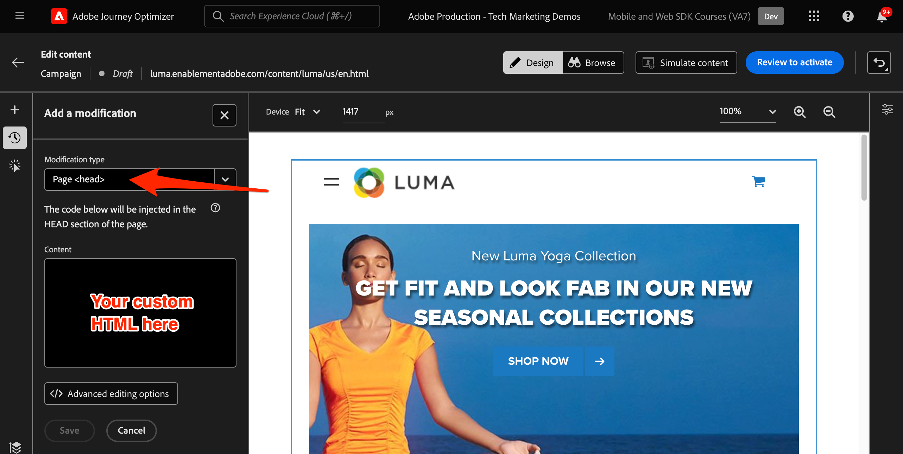

# Configuración del canal web de Journey Optimizer con Web SDK

Aprenda a implementar el [canal web](https://experienceleague.adobe.com/es/docs/journey-optimizer/using/web/get-started-web) de Adobe Journey Optimizer mediante Adobe Experience Platform Web SDK. Esta lección cubre los requisitos previos básicos del canal web, los pasos detallados para la configuración y una explicación detallada de un caso de uso centrado en el estado de lealtad.

Al seguir esta lección, los usuarios de Journey Optimizer están equipados para utilizar el canal web para una personalización en línea avanzada mediante el diseñador web de Journey Optimizer.

## Objetivos de aprendizaje

Al final de esta lección, puede hacer lo siguiente:

* Comprenda la función y la importancia de Web SDK para ofrecer la experiencia del canal web.
* Comprenda el proceso de creación de una campaña de canal web de principio a fin con el ejemplo de caso de uso de Luma Loyalty Rewards.
* Configure las propiedades, acciones y programaciones de las campañas en la interfaz de.
* Comprenda la funcionalidad y las ventajas de la extensión Ayuda de edición visual de Adobe Experience Cloud.
* Aprenda a editar contenido de páginas web, incluidas imágenes, encabezados y otros elementos, con el diseñador web.
* Obtenga información sobre cómo insertar ofertas en una página web mediante el componente Decisión de oferta.
* Familiarícese con las prácticas recomendadas para garantizar la calidad y el éxito de una campaña de canal web.

## Requisitos previos

Para completar las lecciones de esta sección, primero debe:

* Completar todas las lecciones para la configuración inicial de Platform Web SDK, incluida la configuración de elementos de datos y reglas.
* Asegúrese de que la versión de la extensión de etiquetas de Adobe Experience Platform Web SDK sea la 2.16 o una posterior.
* Si utiliza el diseñador web de Journey Optimizer para crear la experiencia del canal web, asegúrese de que utiliza los navegadores Google Chrome o Microsoft® Edge.
* Asegúrese también de haber descargado y habilitado la extensión del explorador [Ayuda de edición visual de Adobe Experience Cloud](https://chromewebstore.google.com/detail/adobe-experience-cloud-vi/kgmjjkfjacffaebgpkpcllakjifppnca).
* Asegúrese de que las cookies de terceros estén permitidas en el explorador. Puede que también sea necesario deshabilitar los bloqueadores de anuncios en el explorador.

  >[!CAUTION]
  >
  > En el diseñador web de Journey Optimizer, es posible que algunos sitios web no se abran de forma fiable debido a uno de los siguientes motivos:
  > 
  > 1. El sitio web tiene estrictas políticas de seguridad.
  > 1. El sitio web está incrustado en un iframe.
  > 1. El control de calidad o el sitio de fase del cliente no son accesibles externamente (son sitios internos).

* Al crear experiencias web e incluir contenido de la biblioteca de Adobe Experience Manager Assets Essentials, es necesario [configurar el subdominio para publicar este contenido](https://experienceleague.adobe.com/es/docs/journey-optimizer/using/web/configure-web-channel/web-delegated-subdomains).
* Si utiliza la función de experimentación de contenido, asegúrese de que el conjunto de datos web también se incluya en la configuración de creación de informes.
* Actualmente, se admiten dos tipos de implementaciones para habilitar la creación y el envío de campañas de canal web en las propiedades web:
   * Solo del lado del cliente: para modificar el sitio web, debe implementar Adobe Experience Platform Web SDK.
   * Modo híbrido: puede utilizar la API de servidor de Platform Edge Network para solicitar personalización del lado del servidor. La respuesta de la API se proporciona a continuación a Adobe Experience Platform Web SDK para procesar las modificaciones en el lado del cliente. Para obtener más información, consulte la Documentación de la API del servidor de Adobe Experience Platform Edge Network. En esta publicación de blog se pueden encontrar más detalles y ejemplos de implementación para el modo híbrido.

  >[!NOTE]
  >
  >Actualmente no se admite la implementación solo del lado del servidor.

## Terminología

En primer lugar, debe comprender la terminología utilizada en las campañas del canal Web.

* **Canal web**: Un medio para la comunicación o la entrega de contenido a través de la web. En el contexto de esta guía, se refiere al mecanismo a través del cual se entrega contenido personalizado a los visitantes del sitio web mediante Platform Web SDK, dentro de Adobe Journey Optimizer.
* **Superficie web**: Hace referencia a una propiedad web identificada por una dirección URL donde se entrega el contenido. Puede abarcar una o varias páginas web.
* **Diseñador web de Journey Optimizer**: Una herramienta o interfaz específica de Journey Optimizer en la que los usuarios pueden diseñar sus experiencias de canal web.
* **Ayuda de edición visual de Adobe Experience Cloud**: Una extensión de explorador que ayuda a editar y diseñar visualmente experiencias de canal Web.
* **Flujo de datos**: Una configuración dentro del servicio Adobe Experience Platform que garantiza que se puedan entregar las experiencias del canal web.
* **Política de combinación**: Una configuración que garantiza la activación y publicación precisas de las campañas entrantes.
* **Audiencia**: Segmento específico de usuarios o visitantes del sitio que cumplen ciertos criterios.
* **Diseñador web**: Una interfaz o herramienta que ayuda a editar y diseñar visualmente experiencias web sin profundizar en el código.
* **Editor de expresiones**: herramienta dentro del diseñador web que permite a los usuarios agregar personalización al contenido web, basada potencialmente en atributos de datos u otros criterios.
* **Componente de decisión de oferta**: Componente del diseñador web que ayuda a decidir qué oferta es la más adecuada para mostrarse a un visitante específico en función de la administración de decisiones.
* **Experimento de contenido**: método para probar diferentes variaciones de contenido y averiguar cuál de ellas tiene el mejor rendimiento en términos de la métrica deseada, como los clics entrantes.
* **Tratamiento**: En el contexto de los experimentos de contenido, un tratamiento hace referencia a una variación específica del contenido que se está probando con otra.
* **Simulación**: Un mecanismo de vista previa para visualizar la experiencia del canal web antes de activarla para audiencias en vivo.

## Configuración de la secuencia de datos

Ya ha agregado el servicio Adobe Experience Platform a su conjunto de datos. Ahora debe habilitar la opción Adobe Journey Optimizer para poder ofrecer experiencias de canal web.

Para configurar Adobe Journey Optimizer en el conjunto de datos:

1. Vaya a la interfaz [Recopilación de datos](https://experience.adobe.com/#/data-collection){target="blank"}.
1. En el panel de navegación izquierdo, seleccione **[!UICONTROL Datastreams]**.
1. Seleccione el conjunto de datos de Luma Web SDK creado anteriormente.

   

1. Seleccione **[!UICONTROL Editar]** en el servicio Adobe Experience Platform.

   

1. Marque la casilla **[!UICONTROL Adobe Journey Optimizer]**.

   

1. Seleccione **[!UICONTROL Guardar]**.

Esto garantiza que Adobe Experience Platform Edge Network gestione correctamente los eventos entrantes para Journey Optimizer.

## Configuración de la política de combinación

Asegúrese de definir una política de combinación con la opción **[!UICONTROL Active-On-Edge Merge Policy]** habilitada. Esta opción de política de combinación se emplea en los canales entrantes de Journey Optimizer para garantizar la activación y publicación precisas de las campañas entrantes en el perímetro.

Para configurar la opción en la política de combinación:

1. Vaya a la página **[!UICONTROL Cliente]** > **[!UICONTROL Perfiles]** en la interfaz de Experience Platform o Journey Optimizer.
1. Seleccione la ficha **[!UICONTROL Políticas de combinación]**.
1. Seleccione la directiva (normalmente es mejor usar la directiva [!UICONTROL Basada en tiempo predeterminado]) y alterne la opción **[!UICONTROL Política de combinación activa en Edge]** en el paso **[!UICONTROL Configurar]**.

   

## Configurar el conjunto de datos web para la experimentación de contenido

Para utilizar experimentos de contenido dentro de campañas del canal web, debe asegurarse de que el conjunto de datos web utilizado también se incluya en la configuración de informes. El sistema de informes de Journey Optimizer utiliza el conjunto de datos en modo de solo lectura para rellenar informes de experimentación de contenido listos para usar.

[En esta sección se detalla la adición de conjuntos de datos para los informes de experimentos de contenido](https://experienceleague.adobe.com/es/docs/journey-optimizer/using/reporting/channel-report/reporting-configuration#add-datasets).

## Resumen de caso de uso: recompensas de fidelización

En esta lección, se utiliza un ejemplo de caso de uso de las Recompensas de fidelidad para detallar la implementación de una experiencia de canal web mediante Web SDK.

Este caso de uso le permite comprender mejor cómo Journey Optimizer puede ayudar a ofrecer las mejores experiencias entrantes a sus clientes, mediante campañas de Journey Optimizer y el diseñador web.

Dado que este tutorial está dirigido a los implementadores, vale la pena señalar que esta lección implica un trabajo sustancial de la interfaz en Journey Optimizer. Aunque estas tareas de interfaz suelen gestionarlas los especialistas en marketing, puede resultar beneficioso para los implementadores incorporar insight en el proceso, aunque no sean los responsables habituales de la creación de campañas de canales web.

### Crear campaña de recompensas de fidelización

Ahora que ha introducido nuestros datos de fidelidad de muestra y ha creado nuestro segmento, cree la campaña de canal web Loyalty Rewards en Adobe Journey Optimizer.

Para crear la campaña de muestra:

1. Abrir la interfaz de [Journey Optimizer](https://experience.adobe.com/journey-optimizer/home){target="_blank"}

   >[!NOTE]
   >
   > Los esquemas, conjuntos de datos y audiencias también se pueden crear en la interfaz de Journey Optimizer, ya que todos son construcciones de Experience Platform comunes.

1. Vaya a **[!UICONTROL Administración de Recorrido]** > **[!UICONTROL Campañas]** en el panel de navegación izquierdo
1. Haga clic en **[!UICONTROL Crear campaña]** en la esquina superior derecha.
1. En la sección **[!UICONTROL Propiedades]**, especifique cómo desea ejecutar la campaña. En el caso de uso de las Recompensas de fidelización, elige **Programado**.

   

1. En la sección **[!UICONTROL Acciones]**, elija el **[!UICONTROL canal Web]**. Como **[!UICONTROL superficie web]**, seleccione **[!UICONTROL URL de página]**.

   >[!NOTE]
   >
   >Una superficie web hace referencia a una propiedad web identificada por una dirección URL donde se entrega el contenido. Puede corresponder a una sola dirección URL de página o abarcar varias páginas, lo que permite aplicar modificaciones en una o varias páginas web.

1. Elija la opción de superficie web **[!UICONTROL URL de página]** para implementar la experiencia en una página para esta campaña. Escriba la dirección URL de la página de Luma `https://luma.enablementadobe.com/content/luma/us/en.html`

1. Una vez definida la superficie web, seleccione **[!UICONTROL Crear]**.

   

1. Ahora añada algunos detalles adicionales a la nueva campaña del canal web. Primero asigne un nombre a la campaña. Llámelo `Luma Loyalty Rewards – Gold Status`. De forma opcional, puede añadir una descripción a la campaña. Agregue también **[!UICONTROL Etiquetas]** para mejorar la taxonomía general de la campaña.

   

1. De forma predeterminada, la campaña está activa para todos los visitantes del sitio. A los efectos de este caso de uso, solo los miembros de la recompensa por estatus oro deben ver la experiencia. Para habilitar esto, haga clic en **[!UICONTROL Seleccionar audiencia]** y elija la audiencia `Luma Loyalty Rewards – Gold Status`.

1. En el campo **[!UICONTROL Área de nombres de identidad]**, seleccione el área de nombres para identificar a los individuos dentro del segmento elegido. Dado que está implementando la campaña en el sitio de Luma, puede elegir el área de nombres ECID. Los perfiles de la audiencia `Luma Loyalty Rewards – Gold Status` que carecen del área de nombres ECID entre sus distintas identidades no están segmentados por la campaña del canal web.

   

1. Programe la campaña para que comience en la fecha de hoy con la opción **[!UICONTROL Inicio de campaña]** y finalice en una semana con la opción **[!UICONTROL Fin de campaña]**.

   

>[!NOTE]
>
>Tenga en cuenta que, para las campañas de canal web, la experiencia web se muestra cuando el visitante abre la página. Por lo tanto, a diferencia de otros tipos de campañas en Adobe Journey Optimizer, la sección **[!UICONTROL déclencheur de acción]** no se puede configurar.

### Experimente con contenido de recompensas de fidelización

Si se desplaza hacia arriba, en la sección **[!UICONTROL Acción]**, puede crear opcionalmente un experimento para probar qué contenido funciona mejor para la audiencia `Luma Loyalty Rewards – Gold Status`. Vamos a crear y probar dos tratamientos como componente de la configuración de campaña.

Para crear el experimento de contenido:

1. Haga clic en **[!UICONTROL Crear experimento]**.

   

1. Primero elija una **[!UICONTROL métrica de éxito]**. Esta es la métrica para determinar la eficacia del contenido. Elija **[!UICONTROL Clics entrantes únicos]** para ver qué tratamiento de contenido genera más clics en la experiencia web de CTA.

   

1. Al configurar un experimento mediante el canal web y elegir las métricas **[!UICONTROL Clics entrantes]**, **[!UICONTROL Clics entrantes únicos]**, **[!UICONTROL Vistas de página]** o **[!UICONTROL Vistas de página únicas]**, la lista desplegable **[!UICONTROL Acción de clic]** le permite rastrear y supervisar con precisión los clics y las vistas en páginas específicas.

1. Opcionalmente, puede designar un **[!UICONTROL Holdout]** que no reciba ninguno de los dos tratamientos. Deje esto sin marcar por ahora.

1. Opcionalmente, también puede elegir **[!UICONTROL Distribuir uniformemente]**. Marque esta opción para asegurarse de que las divisiones de tratamiento siempre se dividen uniformemente.

[Obtenga más información acerca de los experimentos de contenido en el canal web de Adobe Journey Optimizer](https://experienceleague.adobe.com/es/docs/journey-optimizer/using/content-management/content-experiment/get-started-experiment).

### Editar contenido con el Asistente visual

Ahora, vamos a crear la experiencia del canal web. Para ello, use el **[!UICONTROL Asistente visual]** de Adobe Experience Cloud. Esta herramienta es una extensión de explorador compatible con Google Chrome y Microsoft® Edge. Asegúrese de haber descargado la extensión antes de intentar crear sus experiencias. Asegúrese también de que la página web incluya Web SDK.

1. En la ficha **[!UICONTROL Acción]** de la campaña, haga clic en **[!UICONTROL Editar contenido]**. Dado que ha introducido una sola dirección URL de página como superficie, debe estar preparado para empezar a trabajar en el compositor.

   

1. Ahora, haga clic en **[!UICONTROL Editar página web]** para comenzar a crear.

   

1. Comience por editar algunos elementos con el compositor web. Utilice el menú contextual para editar el encabezado de la imagen a pantalla completa de Luma. Ajuste el estilo del panel contextual a la derecha.

   

1. Agregue también personalización al contenedor mediante el **[!UICONTROL Editor de expresiones]**.

   

1. Asegúrese de que la experiencia recibe el seguimiento adecuado de los clics. Elija **[!UICONTROL Haga clic en rastrear elemento]** en el menú contextual.

   

1. Utilice **[!UICONTROL Offer decision component]** para insertar ofertas en la página web. Este componente usa **[!UICONTROL Administración de decisiones]** para elegir la mejor oferta que se enviará a los visitantes de Luma.

### Cambios en el diseño de HTML

Hay algunos métodos disponibles si desea realizar cambios más avanzados o personalizados en el sitio como componente de la campaña de recompensas de fidelidad.

Utilice el panel **[!UICONTROL Componentes]** para agregar HTML u otro contenido directamente al sitio de Luma.

Agregue un nuevo componente HTML en la parte superior de la página. Edite el HTML dentro del componente desde la interfaz de diseño o desde el panel **[!UICONTROL Contextual]**.

También puede agregar ediciones de HTML desde el panel **[!UICONTROL Modificaciones]**. Este panel le permite seleccionar un componente de la página y editarlo desde la interfaz del diseñador.

En el editor, agregue el HTML para la audiencia `Luma Loyalty Rewards – Gold Status`. Seleccione **[!UICONTROL Validar]**.

Ahora, revise el nuevo componente personalizado de HTML para ver si encaja y se siente bien.

Edite un componente específico mediante la modificación **[!UICONTROL tipo de selector de CSS]**.

Agregue código personalizado mediante la modificación **Página `<head>` tipo**.

Las posibilidades son infinitas con **[!UICONTROL Visual Helper]**.

### Simular contenido de recompensas de fidelización

Consulte una vista previa de la página web modificada antes de activar la campaña. Tenga en cuenta que debe tener perfiles de prueba configurados para simular experiencias de canal web.

Para simular la experiencia:

1. Seleccione **[!UICONTROL Simular contenido]** dentro de la campaña.

   

1. Elija un perfil de prueba para recibir la simulación. Tenga en cuenta que el perfil de prueba debe estar en la audiencia `Luma Loyalty Rewards – Gold Status` para recibir el tratamiento adecuado.

1. Se muestra la vista previa del perfil de prueba.

### Activación de la campaña de recompensas de fidelización

Finalmente, active la campaña del canal web.

1. Seleccione **Revisar para activar**.

1. Se le pedirá que confirme los detalles de la campaña una última vez. Seleccione **[!UICONTROL Activar]**. La campaña puede tardar hasta 15 minutos en activarse en el sitio.

### QA de recompensas de fidelización

Hay algunos inicios de sesión que puede utilizar para simular usuarios con &quot;estado oro&quot; y cumplir los requisitos para su campaña:

1. `cleavlandeuler@emailsim.io`/`test`
1. `leftybeagen@emailsim.io`/`test`
1. `jenimartinho@emailsim.io`/`test`

Como práctica recomendada, supervise la pestaña **[!UICONTROL Web]** de los informes globales y en directo de la campaña para los KPI específicos de la campaña. Para esta campaña, monitorice las impresiones de experiencia y la tasa de clics.

### Validación del canal web mediante Adobe Experience Platform Debugger

La extensión de Adobe Experience Platform Debugger, disponible tanto para Chrome como para Firefox, analiza sus páginas web para identificar problemas en la implementación de soluciones de Adobe Experience Cloud.

Puede utilizar el depurador del sitio de Luma para validar la experiencia del canal web en producción. Esta es una práctica recomendada una vez que el caso de uso de las Recompensas de fidelidad está en funcionamiento, para garantizar que todo esté configurado correctamente.

[Aprenda a configurar el depurador en su explorador con la guía aquí](https://experienceleague.adobe.com/es/docs/platform-learn/data-collection/debugger/overview).

Para iniciar la validación con el depurador:

1. Vaya a la página web de Luma con la experiencia del canal web.
   <!--
    
    -->
1. En la página web, abre **[!UICONTROL Adobe Experience Platform Debugger]**.
   <!--
    
    -->
1. Vaya a **Resumen**. Compruebe que el **[!UICONTROL ID de secuencia de datos]** coincide con la **[!UICONTROL secuencia de datos]** en la **[!UICONTROL recopilación de datos de Adobe]** para la cual habilitó Adobe Journey Optimizer.
   <!--
    
    -->
1. A continuación, puede iniciar sesión en el sitio con varias cuentas de fidelidad de Luma y utilizar el depurador para validar las solicitudes enviadas a Adobe Experience Platform Edge Network.
   <!--
    
    -->
1. En **[!UICONTROL Soluciones]**, vaya a **[!UICONTROL Experience Platform Web SDK]**.
   <!--
    
    -->
1. En la ficha **Configuración**, active **[!UICONTROL Habilitar depuración]**. Esto habilita el registro de la sesión en una sesión de **[!UICONTROL Adobe Experience Platform Assurance]**.
   <!--
    
    -->
1. Inicie sesión en el sitio con varias cuentas de fidelidad de Luma y utilice el depurador para validar las solicitudes enviadas a la **[!UICONTROL red de Adobe Experience Platform Edge]**. Todas estas solicitudes deben capturarse en **[!UICONTROL Assurance]** para el seguimiento del registro.
<!--
   
-->

[Siguiente: ](setup-decision-management.md)

>[!NOTE]
>
>Gracias por dedicar su tiempo a conocer Adobe Experience Platform Web SDK. Si tiene preguntas, desea compartir comentarios generales o tiene sugerencias sobre contenido futuro, compártalas en esta [publicación de debate de la comunidad de Experience League](https://experienceleaguecommunities.adobe.com/t5/adobe-experience-platform-data/tutorial-discussion-implement-adobe-experience-cloud-with-web/td-p/444996?profile.language=es)
