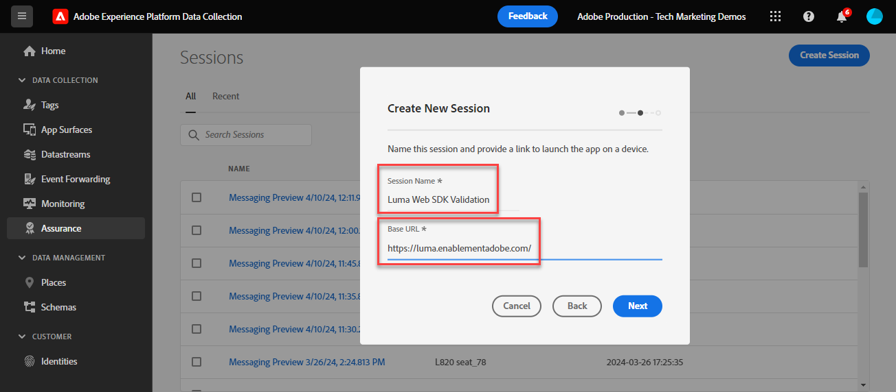

# Validación de implementaciones de Web SDK con Experience Platform Assurance

Adobe Experience Platform Assurance es una función que le ayuda a inspeccionar, probar, simular y validar la forma en que recopila datos o sirve las experiencias. Más información sobre [Adobe Assurance](https://experienceleague.adobe.com/es/docs/experience-platform/assurance/home).

## Objetivos de aprendizaje

Al final de esta lección, debe poder:

* Iniciar una sesión de Assurance
* Ver solicitudes enviadas a y desde Platform Edge Network

## Requisitos previos

Está familiarizado con las etiquetas de recopilación de datos y con el [sitio de demostración de Luma](https://luma.enablementadobe.com/content/luma/us/en.html){target="_blank"}, y ha completado las lecciones anteriores en el tutorial:

* [Configuración de un esquema XDM](configure-schemas.md)
* [Configuración de un área de nombres de identidad](configure-identities.md)
* [Configuración de una secuencia de datos](configure-datastream.md)
* [Extensión web SDK instalada en la propiedad tag](install-web-sdk.md)
* [Creación de elementos de datos](create-data-elements.md)
* [Creación de identidades](create-identities.md)
* [Creación de una regla de etiqueta](create-tag-rule.md)
* [Validar con Debugger](validate-with-debugger.md)

## Inicio y visualización de una sesión de Assurance

Existen varias formas de iniciar una sesión de Assurance.

### Iniciar una sesión de Assurance en Debugger

Cada vez que se activa el seguimiento de Edge en Adobe Experience Platform Debugger, se inicia una sesión de Assurance en segundo plano.

Consulte cómo hemos realizado esto en la lección de Debugger:

1. Vaya al [sitio de demostración de Luma](https://luma.enablementadobe.com/content/luma/us/en.html) y use el depurador para [cambiar la propiedad de etiquetas del sitio a su propia propiedad de desarrollo](validate-with-debugger.md#use-the-experience-platform-debugger-to-map-to-your-tags-property)
1. En la navegación izquierda de **[!UICONTROL Experience Platform Debugger]**, seleccione **[!UICONTROL Registros]**
1. Seleccione la ficha **[!UICONTROL Edge]** y seleccione **[!UICONTROL Conectar]**

   
1. Con el seguimiento de Edge habilitado, puede ver un icono de vínculo de salida en la parte superior. Seleccione el icono para abrir Assurance.

   

1. Se abre una nueva pestaña del explorador con la interfaz de Assurance.

### Iniciar una sesión de Assurance desde la interfaz de Assurance

1. Abrir la [interfaz de recopilación de datos](https://experience.adobe.com/#/data-collection/home){target="_blank"}
1. Seleccione Assurance en el panel de navegación izquierdo
1. Seleccione Crear sesión
   
1. Seleccione Inicio
1. Asigne un nombre a la sesión, por ejemplo, `Luma Web SDK validation`
1. Como **[!UICONTROL URL base]**, escriba `https://luma.enablementadobe.com/`
   
1. En la pantalla siguiente, seleccione **[!UICONTROL Copiar vínculo]**
1. Seleccione el icono para copiar el vínculo en el portapapeles.
1. Pegue la dirección URL en el explorador, que abrirá el sitio web de Luma con un parámetro de URL especial `adb_validation_sessionid` e iniciará la sesión
1. En la interfaz de Assurance, debería ver un mensaje que indica que se ha conectado correctamente a la sesión y que debe ver los eventos capturados en la interfaz de Assurance.
   

## Validar el estado actual de la implementación de Web SDK.

Hay información limitada para ver en esta fase de la implementación. Un valor que podemos ver es su Experience Cloud ID (ECID) que se genera en Platform Edge Network:

1. Seleccione la fila con el evento denominado `Alloy Response Handle`.
1. A la derecha aparece un menú. Seleccionar el signo `+` junto a `[!UICONTROL ACPExtensionEventData]`
1. Explorar en profundidad seleccionando `[!UICONTROL payload > 0 > payload > 0 > namespace]`. El identificador mostrado bajo los últimos `0` corresponde a `ECID`. Lo sabe por el valor que aparece en `namespace` que coincide con `ECID`

   

   >[!CAUTION]
   >
   >Es posible que vea un valor ECID truncado debido al ancho de la ventana. Simplemente, seleccione la barra de control en la interfaz y arrastre a la izquierda para ver todo el ECID.

En lecciones futuras, utilice Assurance para validar cargas útiles completamente procesadas que lleguen a una aplicación de Adobe habilitada en su conjunto de datos.

Ahora que un objeto XDM se activa en una página y con los conocimientos necesarios para validar la recopilación de datos, ya puede configurar Experience Platform y las aplicaciones de Adobe individuales mediante Platform Web SDK.

>[!NOTE]
>
>Gracias por dedicar su tiempo a conocer Adobe Experience Platform Web SDK. Si tiene preguntas, desea compartir comentarios generales o tiene sugerencias sobre contenido futuro, compártalas en esta [publicación de debate de la comunidad de Experience League](https://experienceleaguecommunities.adobe.com/t5/adobe-experience-platform-data/tutorial-discussion-implement-adobe-experience-cloud-with-web/td-p/444996)
