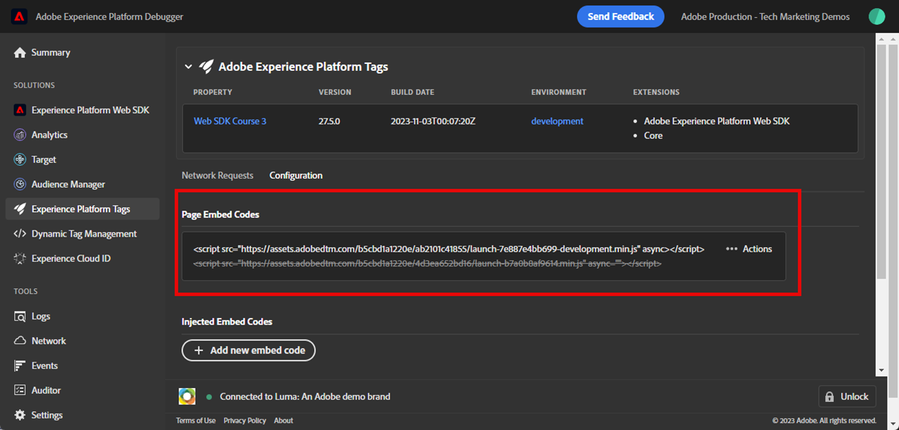

# Validación de implementaciones de Web SDK con Experience Platform Debugger

Obtenga información sobre cómo validar la implementación de SDK web de Adobe Experience Platform con Adobe Experience Platform Debugger.

Experience Platform Debugger es una extensión disponible para los navegadores Chrome y Firefox, que permite ver la tecnología de Adobe implementada en las páginas web. Descargue la versión para su navegador preferido:

* [Extensión de Firefox](https://addons.mozilla.org/es/firefox/addon/adobe-experience-platform-dbg/)
* [Extensión de Chrome](https://chromewebstore.google.com/detail/adobe-experience-platform/bfnnokhpnncpkdmbokanobigaccjkpob)

Si nunca antes ha utilizado Debugger, es posible que desee ver este vídeo de información general de cinco minutos:

>[!VIDEO](https://video.tv.adobe.com/v/35998?learn=on&enablevpops&captions=spa)

En esta lección, utiliza la [extensión de Adobe Experience Platform Debugger](https://chromewebstore.google.com/detail/adobe-experience-platform/bfnnokhpnncpkdmbokanobigaccjkpob) para reemplazar la propiedad de etiquetas codificada en el [sitio de demostración de Luma](https://luma.enablementadobe.com/content/luma/us/en.html) con su propia propiedad.

Esta técnica se denomina cambio de entorno y será útil más adelante, cuando trabaje con etiquetas en su propio sitio web. Permite cargar el sitio web de producción en el explorador, pero con la biblioteca de etiquetas *development*. Esta capacidad permite realizar y validar cambios de etiquetas con seguridad en de forma independiente de las revisiones de código normales. Después de todo, esta separación de las versiones de etiquetas de marketing de las versiones de código normal es una de las principales razones por las que los clientes utilizan etiquetas.

## Objetivos de aprendizaje

Al final de esta lección, podrá utilizar Debugger para lo siguiente:

* Cargar una biblioteca de etiquetas alternativa
* Validar que el evento XDM del lado del cliente captura y envía datos según lo esperado a Platform Edge Network.
* Habilite Edge Trace para ver las solicitudes del lado del servidor enviadas por Platform Edge Network

## Requisitos previos

Está familiarizado con las etiquetas de recopilación de datos y con el [sitio de demostración de Luma](https://luma.enablementadobe.com/content/luma/us/en.html){target="_blank"} y ha completado las lecciones anteriores en el tutorial:

* [Configuración de un esquema XDM](configure-schemas.md)
* [Configuración de un área de nombres de identidad](configure-identities.md)
* [Configuración de una secuencia de datos](configure-datastream.md)
* [Extensión web SDK instalada en la propiedad tag](install-web-sdk.md)
* [Creación de elementos de datos](create-data-elements.md)
* [Creación de identidades](create-identities.md)
* [Creación de reglas de etiquetas](create-tag-rule.md)

## Carga de bibliotecas de etiquetas alternativas con Debugger

Experience Platform Debugger tiene una característica interesante que le permite reemplazar una biblioteca de etiquetas existente por otra diferente. Esta técnica es útil para la validación y nos permite omitir muchos pasos de implementación en este tutorial.

1. Asegúrese de tener abierto el [sitio web de demostración de Luma](https://luma.enablementadobe.com/content/luma/us/en.html){target="_blank"} y seleccionar el icono de extensión de Experience Platform Debugger.
1. Debugger se abrirá y mostrará algunos detalles de la implementación codificada (es posible que tenga que volver a cargar el sitio de Luma después de abrir Debugger).
1. Confirme que Debugger está &quot;**[!UICONTROL conectado a Luma]**&quot; como se muestra a continuación y, a continuación, seleccione el icono &quot;**[!UICONTROL bloquear]**&quot; para bloquear Debugger en el sitio de Luma.
1. Seleccione el botón **[!UICONTROL Iniciar sesión]** e inicie sesión en Adobe Experience Cloud con su Adobe Id.
1. Ahora, ve a **[!UICONTROL Etiquetas Experience Platform]** en el panel de navegación izquierdo

   

1. Seleccione la ficha **[!UICONTROL Configuración]**
1. A la derecha de donde muestra los **[!UICONTROL códigos incrustados de página]**, abra el menú desplegable **[!UICONTROL Acciones]** y seleccione **[!UICONTROL Reemplazar]**

   

1. Dado que se ha autenticado, Debugger va a extraer las propiedades y entornos de etiquetas disponibles. Seleccione su propiedad
1. Seleccione su entorno `Development`
1. Seleccione el botón **[!UICONTROL Aplicar]**

   

1. El sitio web de Luma volverá a cargar _con su propia propiedad de etiquetas_.

   

A medida que continúa con el tutorial, utilizará esta técnica de asignación del sitio de Luma a su propia propiedad de etiquetas para validar la implementación de Platform Web SDK. Al utilizar etiquetas en su propio sitio web, puede utilizar esta misma técnica para validar las bibliotecas de etiquetas de desarrollo en el sitio web de producción.

## Validar solicitudes de red del lado del cliente con Experience Platform Debugger

Puede utilizar Debugger para validar las señalizaciones del lado del cliente activadas desde la implementación de Platform Web SDK para ver los datos enviados a Platform Edge Network:

1. Vaya a **[!UICONTROL Resumen]** en el panel de navegación izquierdo para ver los detalles de su propiedad de etiquetas

   

1. Ahora, ve a **[!UICONTROL Experience Platform Web SDK]** en el panel de navegación izquierdo para ver las **[!UICONTROL solicitudes de red]**
1. Abrir la fila **[!UICONTROL events]**

   

1. Observe cómo puede ver el tipo de evento `web.webpagedetails.pageView` que especificó en su acción [!UICONTROL Actualizar variable] y otras variables integradas que se adhieren al grupo de campos `AEP Web SDK ExperienceEvent`

   

1. Desplácese hacia abajo hasta el objeto `web`, seleccione para abrirlo e inspeccione `webPageDetails.name`, `webPageDetails.server` y `webPageDetails.siteSection`. Deben coincidir con las variables de capa de datos `digitalData` correspondientes de la página principal

>[!TIP]
>
> Para ver y comparar la capa de datos `digitalData` en la página principal:
>
> 1. En la página de inicio de Luma, abra las herramientas para desarrolladores de navegadores. En el caso de Chrome, seleccione el botón `F12` del teclado
> 1. Seleccione la ficha **[!UICONTROL Consola]**
> 1. Escriba `digitalData` y seleccione `Enter` en el teclado para que aparezcan los valores de la capa de datos

También puede validar los detalles del mapa de identidad:

1. Inicie sesión en el sitio de Luma con las credenciales `test@adobe.com`/`test`

1. Vuelva a la [página principal de Luma](https://luma.enablementadobe.com/content/luma/us/en.html)

1. Abra la sección **[!UICONTROL Experience Platform Web SDK]** en el panel de navegación izquierdo

   

1. Seleccione la fila **[!UICONTROL events]** para abrir los detalles en una ventana emergente

   

1. Busque **identityMap** en la ventana emergente. Aquí debería ver `lumaCrmId` con tres claves authenticatedState, id y primary:
   

### Validación de solicitudes del lado del cliente con herramientas de desarrollo del explorador

Estos tipos de detalles de solicitud también están visibles en la ficha **Red** de las herramientas para desarrolladores web del explorador (suponiendo que el sitio web esté cargando la biblioteca de etiquetas).

1. Abra la ficha **Red** de las herramientas para desarrolladores web del explorador y vuelva a cargar la página. Filtre las llamadas con `/ee` para localizar la llamada, selecciónela y, a continuación, busque en la ficha **Encabezados** y en la ficha **Carga útil**

   

1. Vaya a la pestaña **Response** y observe cómo se incluye el valor ECID en la respuesta.

   

   >[!NOTE]
   >
   > El valor ECID es visible en la respuesta de red. No se incluye en la parte `identityMap` de la solicitud de red, ni se almacena en este formato en una cookie.

## Validar solicitudes de red del lado del servidor con Experience Platform Debugger

Como aprendió en la lección [Configuración de un conjunto de datos](configure-datastream.md), Platform Web SDK envía primero datos de su propiedad digital a Platform Edge Network. A continuación, Platform Edge Network realiza solicitudes adicionales del lado del servidor a los servicios correspondientes habilitados en el conjunto de datos. Puede validar las solicitudes del lado del servidor realizadas por Platform Edge Network mediante Edge Trace en Debugger.

<!--Furthermore, you can also validate the fully processed payload after it reaches an Adobe application by using [Adobe Experience Platform Assurance](https://experienceleague.adobe.com/es/docs/experience-platform/assurance/home). -->

### Habilitar seguimiento de Edge

Para habilitar el seguimiento de Edge:

1. En la navegación izquierda de **[!UICONTROL Experience Platform Debugger]**, seleccione **[!UICONTROL Registros]**
1. Seleccione la ficha **[!UICONTROL Edge]** y seleccione **[!UICONTROL Conectar]**

   

1. Está vacío por ahora

   

1. Actualice la [página principal de Luma](https://luma.enablementadobe.com/) y vuelva a comprobar **[!UICONTROL Experience Platform Debugger]** para ver cómo llegan los datos.

   

En este punto, no puede ver ninguna solicitud de Platform Edge Network que vaya a aplicaciones de Adobe porque no ha habilitado ninguna en el conjunto de datos. En lecciones futuras, utilice el seguimiento de Edge para ver las solicitudes salientes del lado del servidor a aplicaciones de Adobe y reenvío de eventos. Pero primero, obtenga información acerca de otra herramienta para validar las solicitudes del lado del servidor realizadas por Platform Edge Network: Adobe Experience Platform Assurance.

[Siguiente: ](validate-with-assurance.md)

>[!NOTE]
>
>Gracias por dedicar su tiempo a conocer Adobe Experience Platform Web SDK. Si tiene preguntas, desea compartir comentarios generales o tiene sugerencias sobre contenido futuro, compártalas en esta [publicación de debate de la comunidad de Experience League](https://experienceleaguecommunities.adobe.com/t5/adobe-experience-platform-data/tutorial-discussion-implement-adobe-experience-cloud-with-web/td-p/444996?profile.language=es)
