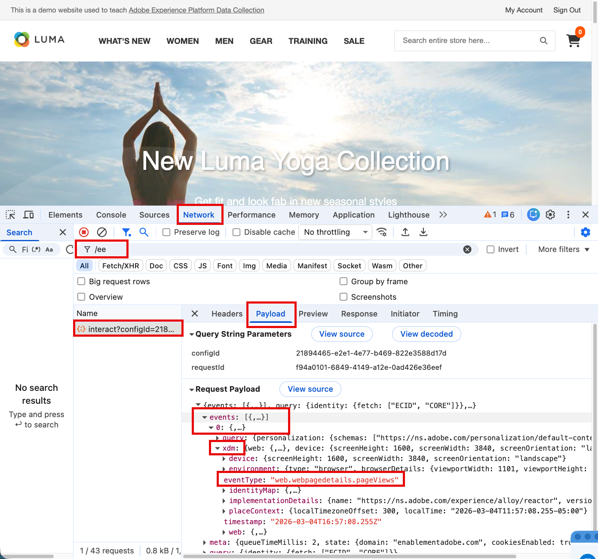

# Validación de implementaciones de Web SDK con Experience Platform Debugger

Obtenga información sobre cómo validar la implementación de SDK web de Adobe Experience Platform con Adobe Experience Platform Debugger.

Experience Platform Debugger es una [extensión de Chrome](https://chromewebstore.google.com/detail/adobe-experience-platform/bfnnokhpnncpkdmbokanobigaccjkpob) que te ayuda a ver la tecnología de Adobe implementada en tus páginas web. Experience Platform Debugger y la consola para desarrolladores del explorador son las mejores formas de validar y depurar los aspectos del lado del explorador de la implementación de Web SDK. Adobe Experience Platform Assurance, que se explica en la siguiente lección, proporciona la mejor vista de los datos a medida que entran y salen de Platform Edge Network.

Si nunca antes ha utilizado Debugger, es posible que desee ver este vídeo de información general de cinco minutos:

>[!VIDEO](https://video.tv.adobe.com/v/32156?learn=on&enablevpops)

En esta lección, utiliza la [extensión de Adobe Experience Platform Debugger](https://chromewebstore.google.com/detail/adobe-experience-platform/bfnnokhpnncpkdmbokanobigaccjkpob) para reemplazar la propiedad de etiquetas codificada en el [sitio de demostración de Luma](https://luma.enablementadobe.com) con su propia propiedad.

Esta técnica se denomina cambio de entorno y será útil más adelante, cuando trabaje con etiquetas en su propio sitio web. Permite cargar el sitio web de producción en el explorador, pero con la biblioteca de etiquetas *development*. Esta capacidad permite realizar y validar cambios de etiquetas con seguridad en de forma independiente de las revisiones de código normales. Después de todo, esta separación de las versiones de etiquetas de marketing de las versiones de código normal es una de las principales razones por las que los clientes utilizan etiquetas.

## Objetivos de aprendizaje

Al final de esta lección, podrá utilizar Debugger para lo siguiente:

* Cargar una biblioteca de etiquetas alternativa
* Validar que el evento XDM del lado del cliente captura y envía datos según lo esperado a Platform Edge Network.
* Habilite Edge Trace para ver las solicitudes del lado del servidor enviadas por Platform Edge Network

## Requisitos previos

Está familiarizado con las etiquetas de recopilación de datos y con el [sitio de demostración de Luma](https://luma.enablementadobe.com/){target="_blank"}, y ha completado las lecciones anteriores en el tutorial:

* [Configuración de un esquema XDM](configure-schemas.md)
* [Configuración de un área de nombres de identidad](configure-identities.md)
* [Configuración de una secuencia de datos](configure-datastream.md)
* [Extensión web SDK instalada en la propiedad tag](install-web-sdk.md)
* [Creación de elementos de datos](create-data-elements.md)
* [Captura de identidades](create-identities.md)
* [Creación de reglas de etiquetas](create-tag-rule.md)

## Carga de bibliotecas de etiquetas alternativas con Debugger

Experience Platform Debugger tiene una característica interesante que le permite reemplazar una biblioteca de etiquetas existente por otra diferente. Esta técnica es útil para la validación y nos permite omitir muchos pasos de implementación en este tutorial.

1. Asegúrese de tener abierto el [sitio web de demostración de Luma](https://luma.enablementadobe.com){target="_blank"} y seleccione el icono de extensión de Experience Platform Debugger
1. Debugger se abrirá y mostrará algunos detalles de la implementación codificada (es posible que tenga que volver a cargar el sitio de Luma después de abrir Debugger).
1. Confirme que Debugger está &quot;**[!UICONTROL conectado a Luma]**&quot; como se muestra a continuación y, a continuación, seleccione el icono &quot;**[!UICONTROL bloquear]**&quot; para bloquear Debugger en el sitio de Luma.
1. Seleccione el botón **[!UICONTROL Iniciar sesión]**, inicie sesión en Adobe Experience Cloud con su Adobe Id y seleccione su organización.

   >[!TIP]
   >
   > Si Debugger muestra su nombre de usuario en lugar del nombre de su organización después de iniciar sesión, cierre la sesión e inténtelo de nuevo.

   

1. Ahora, ve a **[!UICONTROL Etiquetas Experience Platform]** en el panel de navegación izquierdo
1. Seleccione la ficha **[!UICONTROL Configuración]**
1. A la derecha de donde muestra los **[!UICONTROL códigos incrustados de página]**, abra el menú desplegable **[!UICONTROL Acciones]** y seleccione **[!UICONTROL Reemplazar]**

   

1. Dado que se ha autenticado, Debugger va a extraer las propiedades y entornos de etiquetas disponibles. Seleccione su propiedad
1. Seleccione su entorno `Development`
   

   >[!TIP]
   >
   > Si no puede seleccionar su propiedad y entorno mediante los menús desplegables, vaya a [!UICONTROL Etiquetas] > [!UICONTROL Entornos] > [!UICONTROL Desarrollo] > [!UICONTROL Instalar] y seleccione el icono para copiar el código incrustado y pegarlo en Debugger:
   > 

1. Seleccione el botón **[!UICONTROL Aplicar]**

1. El sitio web de Luma volverá a cargar _con su propia propiedad de etiquetas_.

   

A medida que continúa con el tutorial, utilizará esta técnica de asignación del sitio de Luma a su propia propiedad de etiquetas para validar la implementación de Platform Web SDK. Al utilizar etiquetas en su propio sitio web, puede utilizar esta misma técnica para validar las bibliotecas de etiquetas de desarrollo en el sitio web de producción.

## Validar con Debugger

### Validar solicitudes de red y XDM

Puede utilizar Debugger para validar las señalizaciones del lado del cliente activadas desde la implementación de Platform Web SDK para ver los datos enviados a Platform Edge Network:

1. Vaya a **[!UICONTROL Resumen]** en el panel de navegación izquierdo para ver los detalles de su propiedad de etiquetas

   

1. Ahora, ve a **[!UICONTROL Experience Platform Web SDK]** en el panel de navegación izquierdo para ver las **[!UICONTROL solicitudes de red]**
1. Abrir la fila **[!UICONTROL events]**

   

1. Observe cómo puede ver el tipo de evento `web.webPageDetails.pageView` que especificó en su acción [!UICONTROL Actualizar variable] y otras variables integradas que se adhieren al grupo de campos `AEP Web SDK ExperienceEvent`

   

1. Desplácese hacia abajo hasta el objeto `web`, seleccione para abrirlo e inspeccione `webPageDetails.name`. Deben coincidir con las variables de capa de datos `adobeDataLayer` correspondientes de la página principal

>[!TIP]
>
> Para ver y comparar la capa de datos `adobeDataLayer` en la página principal:
>
> 1. En la página de inicio de Luma, abra las herramientas para desarrolladores de navegadores. En el caso de Chrome, seleccione el botón `F12` del teclado
> 1. Seleccione la ficha **[!UICONTROL Consola]**
> 1. Escriba `adobeDataLayer` y seleccione `Enter` en el teclado para que aparezcan los valores de la capa de datos

Valide los eventos y las variables establecidos en las páginas de productos, la página del carro de compras y la página de confirmación de pedidos.

### Validar mapa de identidad

También puede validar los detalles del mapa de identidad:

1. Seleccione **[!DNL Sign In]** en el [sitio web de Luma](https://luma.enablementadobe.com/){target=_blank}. Seleccione **[!DNL Create Account]** y cree una cuenta con las credenciales `test@test.com`/`test`

1. Use el acceso directo **[!UICONTROL Ir al más reciente]** en Debugger para ir rápidamente al evento de Web SDK más reciente (es la última columna). Seleccione la fila **[!UICONTROL events]** para abrir el modal de detalles.

1. Busque **identityMap** dentro del modal. Aquí debería ver `lumaCrmId` con tres claves authenticationState, id y primary:
   

## Validar con las herramientas para desarrolladores de navegadores

Es posible que muchos desarrolladores web prefieran ver la implementación en las herramientas para desarrolladores del explorador. Esto es especialmente importante, ya que no todos los exploradores admiten la extensión de Debugger. Además, debido al marco flexible, hay detalles de implementación adicionales que puede inspeccionar, como las cookies y los detalles de respuesta.

### Validar solicitudes de red

Los detalles de la solicitud de Web SDK también están visibles en la ficha **Red** de las herramientas para desarrolladores web del explorador (suponiendo que el sitio web esté cargando la biblioteca de etiquetas).

1. Abra la ficha **Red** de las herramientas para desarrolladores web del explorador y vuelva a cargar la página. Filtre las llamadas con `/ee` para localizar la llamada, selecciónela y, a continuación, busque en la ficha **Encabezados** y en la ficha **Carga útil**

   

1. Vaya a la pestaña **Preview** y observe cómo se incluye el valor ECID en la respuesta de red.

   

   >[!NOTE]
   >
   > El valor ECID es visible en la respuesta de red. No se incluye en la parte `identityMap` de la solicitud de red, ni se almacena en este formato en una cookie.

### Cookies de SDK web

Mientras estamos en las herramientas para desarrolladores, echemos un vistazo a algunas de las cookies que Web SDK establece en el navegador. Abra Aplicación > Cookies > https://luma.enablementadobe.com

Debería ver varias cookies configuradas por Web SDK:

* kndctr_[IMS_ORGID]_AdobeOrg_identity: esto almacena datos relacionados con el ECID
* kndctr_[IMS_ORGID]_AdobeOrg_cluster: almacena la ubicación del centro de datos utilizada para que las llamadas de red subsiguientes se enruten a los mismos servidores de Edge
* AMCV_[IMS_ORGID]%40AdobeOrg: esta es la cookie AMCV heredada que usan las bibliotecas Experience Cloud de SDK anteriores a la web y está establecida porque dejamos seleccionada la configuración predeterminada **[!UICONTROL Migrar ECID a VisitorAPI a la SDK web]** en la extensión de etiquetas de SDK web de Adobe Experience Platform. Es importante habilitar esta configuración cuando migre las páginas de bibliotecas antiguas a Web SDK, pero se puede deshabilitar después de haber migrado todas las páginas durante un tiempo determinado.

Si borra estas cookies y vuelve a cargar la página, es posible que observe que hay algunas cookies de terceros adicionales configuradas en el dominio `.demdex.net`. Se establecieron porque dejamos la opción predeterminada **[!UICONTROL Usar cookies de terceros]**: **[!UICONTROL Habilitado]** en la extensión de etiquetas de Adobe Experience Platform Web SDK. Si el explorador no permite cookies de terceros, se eliminarán cuando vuelva a cargar la página.

### Almacenamiento local de Luma

El sitio web de demostración de Luma utiliza estrictamente tecnologías del lado del cliente como HTML, CSS y JavaScript. No hay mecanismos de almacenamiento back-end que no sean la implementación de Experience Cloud utilizada por el estado predeterminado del sitio web. La información como los detalles del nombre de usuario solo se almacenan localmente en el navegador mediante localStorage. Por lo tanto, si elimina esta información o utiliza una ventana de incógnito, observará que es posible que tenga que volver a crear una cuenta de usuario de prueba creada anteriormente.

A continuación, aprenda a validar estas solicitudes de red cuando se reciben y transmiten desde Platform Edge Network mediante Adobe Experience Platform Assurance.

>[!NOTE]
>
>Gracias por dedicar su tiempo a conocer Adobe Experience Platform Web SDK. Si tiene preguntas, desea compartir comentarios generales o tiene sugerencias sobre contenido futuro, compártalas en esta [publicación de debate de la comunidad de Experience League](https://experienceleaguecommunities.adobe.com/adobe-experience-platform-18/tutorial-discussion-implement-adobe-experience-cloud-with-web-sdk-tutorial-248848)
