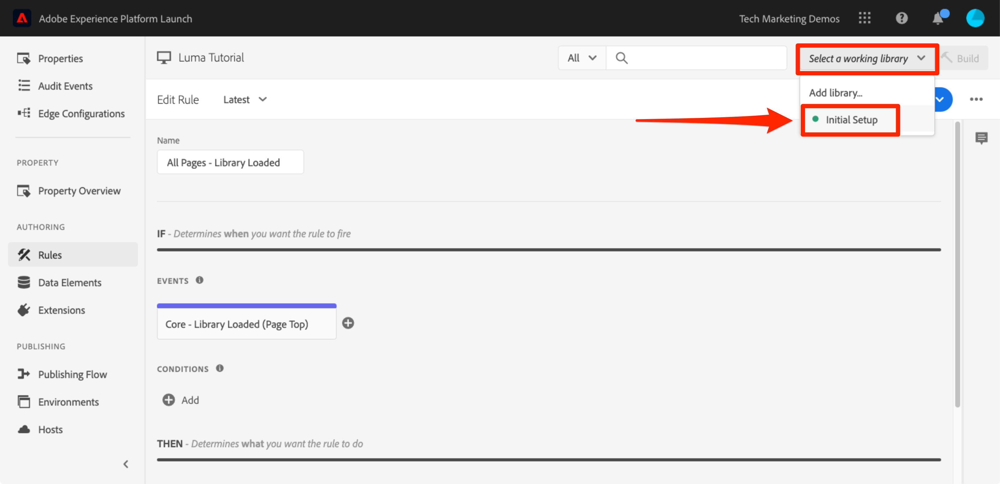

# Añadir un elemento de datos, una regla y una biblioteca

En esta lección, debe crear su primer elemento de datos, regla y biblioteca.

Los elementos de datos y las reglas son los componentes básicos de las etiquetas. Los elementos de datos almacenan los atributos que desea enviar a sus soluciones de marketing y publicidad, mientras que las reglas activan las solicitudes a dichas soluciones en las condiciones adecuadas.  Las bibliotecas son los archivos JavaScript que se cargan en la página para realizar todo el trabajo. En esta lección, debe usar los tres para hacer que nuestra página de muestra haga algo.

>[!NOTE]
>
>Adobe Experience Platform Launch se está integrando en Adobe Experience Platform como un conjunto de tecnologías de recopilación de datos. Se han implementado varios cambios terminológicos en la interfaz que debe tener en cuenta al usar este contenido:
>
> * El platform launch (lado del cliente) ya está **[[!DNL tags]](https://experienceleague.adobe.com/docs/experience-platform/tags/home.html?lang=es)**
> * El servidor de platform launch está ahora **[[!DNL event forwarding]](https://experienceleague.adobe.com/docs/experience-platform/tags/event-forwarding/overview.html)**
> * Las configuraciones de Edge ahora **[[!DNL datastreams]](https://experienceleague.adobe.com/docs/experience-platform/edge/fundamentals/datastreams.html?lang=es)**


## Objetivos de aprendizaje

Al final de esta lección, debe poder:

* Crear un elemento de datos.
* Crear una regla.
* Crear una biblioteca.
* Añadir cambios a una biblioteca.
* Validar que la biblioteca se esté cargando en el navegador web.
* Utilizar la función “Working Library” para trabajar de forma más eficiente.

## Crear elementos de datos para Nombre de página.

Los elementos de datos son la versión de etiquetas de una capa de datos. Pueden almacenar valores de su propio objeto de capa de datos, cookies, objetos de almacenamiento local, parámetros de cadena de consulta, elementos de página, etiquetas meta, etc. En este ejercicio, creará un elemento de datos para Nombre de página, que utilizará más adelante en las implementaciones de Target y Analytics.

**Para crear un elemento de datos**

1. En el panel de navegación izquierdo, haga clic en **[!UICONTROL Elementos de datos]**

1. Debido a que todavía no se ha creado ningún elemento de datos en esta propiedad, aparece un vídeo breve con información adicional sobre este tema. Si lo desea, mire este vídeo.

1. Haga clic en el botón **[!UICONTROL Crear nuevo elemento de datos]**:

   

1. Asigne un nombre al elemento de datos, como “`Page Name`”.

1. Utilice el [!UICONTROL tipo de elemento de datos de la variable JavaScript] para señalar un valor de la capa de datos de la página de muestra: `digitalData.page.pageInfo.pageName`.

1. Marque las casillas de **[!UICONTROL Forzar valor en minúsculas]** y **[!UICONTROL Limpiar texto]** para estandarizar el caso y eliminar espacios superfluos.

1. Deje **[!UICONTROL Ninguno]** como la configuración de **[!UICONTROL Duración del almacenamiento]**, ya que este valor generalmente será diferente en cada página.

1. Haga clic en el botón **[!UICONTROL Guardar]** para guardar el elemento de datos.

   .

>[!NOTE]
>
>Las capacidades de los elementos de datos _se pueden ampliar con extensiones_. Por ejemplo, la extensión de ContextHub permite agregar elementos de datos con funciones de la extensión.

## Creación de reglas

A continuación, utilizará este elemento de datos en una regla sencilla. Las reglas son una de las funciones más poderosas de las etiquetas y le permiten especificar lo que debe suceder a medida que el visitante interactúa con el sitio web. Cuando se cumplen los criterios descritos en las reglas, la regla activa la acción que haya especificado.

Va a crear una regla que envíe el valor del elemento de datos Nombre de página a la consola del navegador.

**Para crear una regla**

1. En el panel de navegación izquierdo, haga clic en **[!UICONTROL Reglas]**

1. Debido a que todavía no se ha creado ninguna regla en esta propiedad, aparece un vídeo breve con información adicional sobre el tema. Si lo desea, mire este vídeo.

1. Haga clic en el botón **[!UICONTROL Crear nueva regla]**:

   

1. Asigne un nombre a la regla `All Pages - Library Loaded`. Esta convención de nombres indica dónde y cuándo se activará la regla, lo que facilita la identificación y reutilización a medida que la propiedad de etiquetas madura.

1. En Eventos, haga clic en **[!UICONTROL Añadir]**. El evento indica a las etiquetas cuándo se debe activar la regla y puede ser muchas cosas, como una carga de página, un clic, un evento de JavaScript personalizado, etc.

   

   1. Como Tipo de evento, seleccione **[!UICONTROL Library Loaded (Page Top)]** [biblioteca cargada (principio de página)]. Tenga en cuenta que cuando seleccione el Tipo de evento, las etiquetas rellenarán previamente un nombre para el evento usando su selección. Tenga en cuenta también que el orden predeterminado para el evento es 50. La ordenación es una práctica función de las etiquetas que le proporciona un control preciso sobre la secuencia de acciones cuando tiene varias reglas activadas por el mismo evento. Esta función se utilizará más adelante en el tutorial.

   1. Haga clic en el botón **[!UICONTROL Conservar cambios]**.

   

1. Dado que esta regla debe activarse en todas las páginas, deje **[!UICONTROL Condiciones]** en blanco. Si abre el modal Conditions, verá que las condiciones pueden agregar restricciones y exclusiones en función de una gran variedad de opciones, incluidas direcciones URL, valores de elementos de datos, intervalos de fechas, etc.

1. En Acciones (Actions), haga clic en **[!UICONTROL Añadir]**

1. Seleccione **[!UICONTROL Tipo de acción > Código personalizado]**, que en este momento es la única opción. Más adelante en el tutorial, al añadir extensiones, habrá más opciones disponibles.

1. Seleccione **[!UICONTROL &lt;/> Abrir editor]** para abrir el editor de código.

   

1. Añada lo siguiente al editor de código. Este código mostrará el valor del elemento de datos Nombre de página en la consola del navegador para que pueda confirmar que funciona:

   ```javascript
   console.log('The page name is '+_satellite.getVar('Page Name'));
   ```

1. Guardar el editor de código.

   

1. En la pantalla de Configuración de acción, haga clic en **[!UICONTROL Conservar cambios]**.

1. Haga clic en **[!UICONTROL Guardar]** para guardar la regla.

En la página Reglas , debería ver la nueva regla:


## Guardar los cambios en una biblioteca

Después de configurar una colección de extensiones, elementos de datos y reglas en la interfaz de recopilación de datos, debe empaquetar estas capacidades y lógica en un conjunto de código JavaScript que puede implementar en el sitio web para que las etiquetas de marketing se activen cuando los visitantes accedan al sitio. Una biblioteca es el conjunto de código JavaScript que puede hacerlo.

En lecciones anteriores, hemos implementado el código de incrustación del entorno de desarrollo en la página de muestra. Cuando cargó la página de muestra, se devolvió un error 404 para la URL de código incrustado porque aún no se había creado ni asignado una biblioteca de etiquetas al entorno. Ahora colocará el nuevo elemento de datos y la regla en una biblioteca para que la página de muestra pueda hacer algo.

**Para añadir y crear una biblioteca**

1. En el panel de navegación izquierdo, haga clic en **[!UICONTROL Flujo de publicación]**

1. Haga clic en **[!UICONTROL Añadir nueva biblioteca]**.

   

1. Asigne un nombre a la biblioteca, por ejemplo `Initial Setup`

1. Seleccione **[!UICONTROL Entorno > Desarrollo]**.

1. Haga clic en **[!UICONTROL Añadir todos los recursos modificados]**.

   

1. Tenga en cuenta que después de hacer clic en **[!UICONTROL Agregar todos los recursos modificados]** resume los cambios que acaba de realizar.

1. Haga clic en **[!UICONTROL Guardar y generar para desarrollo]**

   

Después de unos momentos, el punto de estado cambiará a verde indicando que la biblioteca se ha creado correctamente.


## Validación del trabajo

Ahora valide que la regla funciona según lo esperado.

Vuelva a cargar la página de muestra. Si consulta la pestaña Herramientas para desarrolladores -> Red, debería ver una respuesta de 200 para su biblioteca de etiquetas.


Si consulta la Herramientas para desarrolladores -> Consola, debería ver el texto “The page name is home”.


¡Ha creado su primer elemento de datos y regla y su primera biblioteca de etiquetas!

## Uso de la función “Working Library”

Cuando se realizan muchos cambios en las etiquetas, resulta incómodo ir a la ficha Publicación, agregar cambios y crear la biblioteca cada vez que se desea ver el resultado.  Después de crear la biblioteca “Initial Setup”, puede utilizar la función “Working Library” para guardar rápidamente los cambios y reconstruir la biblioteca en un solo paso.

Realice un pequeño cambio en la regla “Todas las páginas: Carga de biblioteca”. En el panel de navegación izquierdo, haga clic en **[!UICONTROL Reglas]** y haga clic en la `All Pages - Library Loaded` para abrirla.


En la página `Edit Rule`, haga clic en el menú desplegable ***[!UICONTROL Working Library]*** y seleccione la biblioteca `Initial Setup`.



Una vez seleccionada la biblioteca, debe ver que la variable **[!UICONTROL Guardar]** ahora establece de forma predeterminada **[!UICONTROL Guardar en biblioteca]**. Cuando realice un cambio en las etiquetas, puede utilizar esta opción para agregar automáticamente el cambio directamente a la biblioteca de trabajo o reconstruirlo.

Pruébela. Abra la acción Código personalizado y agregue dos puntos después del texto “The page name is”, de modo que todo el bloque de código quede de esta manera:

```javascript
console.log('The page name is: '+_satellite.getVar('Page Name'));
```

Guarde el código, mantenga los cambios en la acción y, a continuación, haga clic en el botón **[!UICONTROL Guardar en biblioteca y crear]**.


Espere un momento hasta que el punto verde vuelva a aparecer junto al menú desplegable [!UICONTROL Working Library]. Ahora, vuelva a cargar la página de muestra y debería ver el cambio reflejado en el mensaje de la consola (puede que tenga que borrar la caché del navegador y volver a cargar, para ver el cambio en la página):


Esta es una forma mucho más rápida de trabajar y utilizará este método para el resto del tutorial.

[Siguiente: “Cambiar entornos con Experience Cloud Debugger” >](switch-environments.md)
