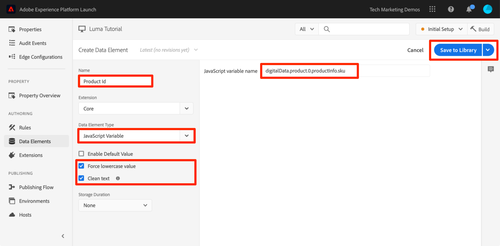
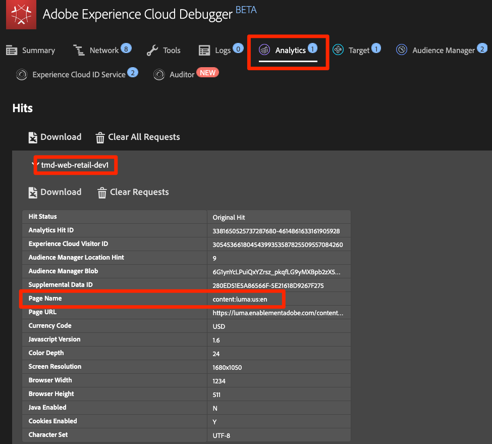
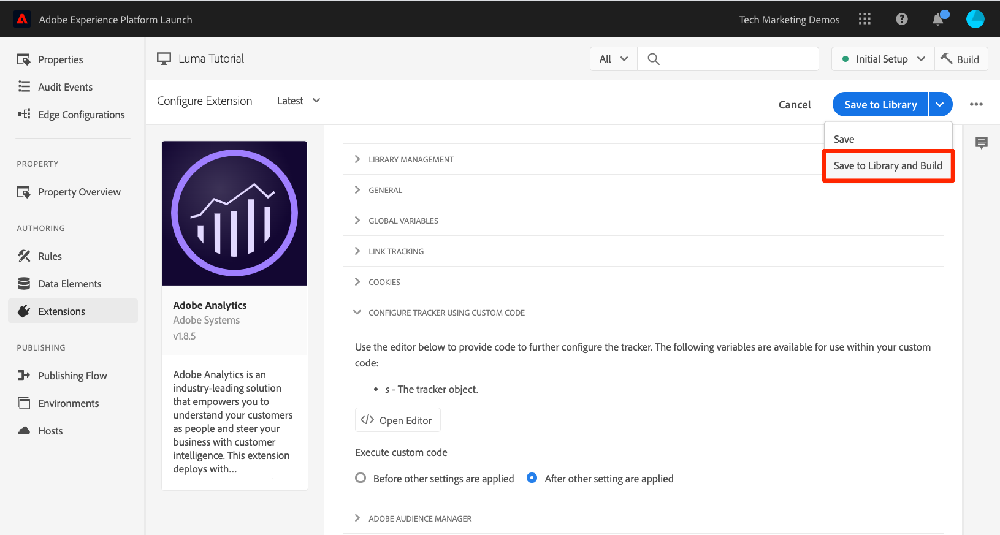
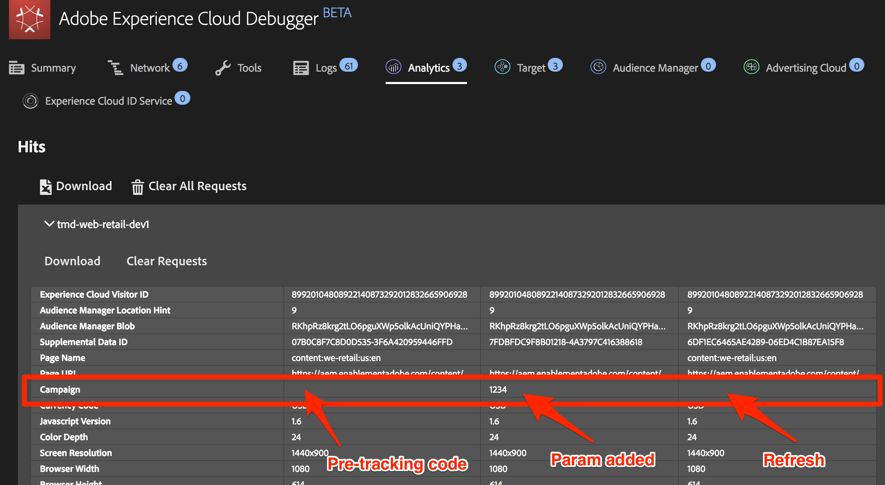

# Añadir Adobe Analytics

En esta lección, debe implementar la [extensión de Adobe Analytics](https://experienceleague.adobe.com/docs/experience-platform/tags/extensions/adobe/analytics/overview.html?lang=es) y creará reglas para enviar datos a Adobe Analytics.

[Adobe Analytics](https://experienceleague.adobe.com/docs/analytics.html?lang=es) es una solución líder del sector que le permite comprender a sus clientes como personas y dirigir su negocio con inteligencia de clientes.

>[!NOTE]
>
>Adobe Experience Platform Launch se está integrando en Adobe Experience Platform como un conjunto de tecnologías de recopilación de datos. Se han implementado varios cambios terminológicos en la interfaz que debe tener en cuenta al utilizar este contenido:
>
> * El platform launch (lado del cliente) ahora es **[[!DNL tags]](https://experienceleague.adobe.com/docs/experience-platform/tags/home.html?lang=es)**
> * El lado del servidor de platform launch ahora es **[[!DNL event forwarding]](https://experienceleague.adobe.com/docs/experience-platform/tags/event-forwarding/overview.html?lang=es)**
> * Ahora, las configuraciones de Edge son **[[!DNL datastreams]](https://experienceleague.adobe.com/docs/experience-platform/edge/fundamentals/datastreams.html?lang=es)**

## Objetivos de aprendizaje

Al final de esta lección, debe poder:

1. Añadir la extensión de Adobe Analytics
1. Configurar variables globales mediante la extensión
1. Añadir la señalización de vistas de página
1. Añadir variables adicionales mediante reglas
1. Añadir seguimiento de clics y otras señalizaciones basadas en eventos
1. Añadir complementos de Analytics

Se pueden implementar muchas cosas para Analytics en etiquetas. Esta lección no está completa, pero le ofrece una visión general fiable de las principales técnicas que necesita para implementarlo todo en su sitio.

## Requisitos previos

Ya debería haber completado las lecciones de [Configurar etiquetas](create-a-property.md) y [Agregar el servicio de identidad](id-service.md).

Además, necesita al menos un ID de grupo de informes y un servidor de seguimiento. Si no dispone de un grupo de informes de prueba o desarrollo que pueda utilizar para este tutorial, cree uno. Si no está seguro de cómo hacerlo, consulte [la documentación](https://experienceleague.adobe.com/docs/analytics/admin/manage-report-suites/new-report-suite/new-report-suite.html?lang=es). Puede obtener un servidor de seguimiento desde su implementación actual, su asesor de Adobe o su representante del servicio de atención al cliente.

## Añadir la extensión de Analytics

La extensión de Analytics consta de dos partes principales:

1. La configuración de la extensión, que administra la configuración de biblioteca principal de AppMeasurement.js y puede configurar variables globales.
1. Acciones de reglas para hacer lo siguiente:
   1. Configurar variables
   1. Borrar variables
   1. Enviar la señalización de Analytics

**Para añadir la extensión de Analytics**

1. Ir a **[!UICONTROL Extensiones > Catálogo]**
1. Localice la extensión de Adobe Analytics
1. Haga clic en **[!UICONTROL Instalar]**

   

1. En [!UICONTROL Administración de biblioteca > Grupos de informes], escriba los identificadores de los grupos de informes que desee usar en cada entorno de etiquetas. Si los usuarios tienen acceso a Adobe Analytics, tenga en cuenta que cuando empiece a escribir en el cuadro, verá una lista previamente rellenada de todos los grupos de informes. (Está bien utilizar un grupo de informes para todos los entornos en este tutorial, pero en la vida real le recomendamos utilizar grupos de informes independientes, como se muestra en la imagen siguiente)

   

   >[!TIP]
   >
   >Se recomienda usar la opción [!UICONTROL Administrar la biblioteca por mí] como la configuración de [!UICONTROL Administración de biblioteca], ya que facilita la tarea de mantener la biblioteca `AppMeasurement.js` actualizada.

1. En [!UICONTROL General > Servidor de seguimiento], ingrese su servidor de seguimiento, por ejemplo `tmd.sc.omtrdc.net`. Introduzca el servidor de seguimiento SSL si su sitio es compatible con `https://`.

   .

1. En la sección [!UICONTROL Variables globales], en [!UICONTROL Configuración adicional], establezca la variable [!UICONTROL Nombre de página] con el elemento de datos `Page Name`. Haga clic en el  para abrir el modal y elegir el elemento de datos de la página `Page Name`.

1. Haga clic en **[!UICONTROL Guardar en biblioteca]**

   .

>[!NOTE]
>
>Las variables globales se pueden configurar en la configuración de la extensión o en las acciones de reglas. Tenga en cuenta que al configurar variables en la configuración de la extensión, la capa de datos debe definirse *antes de* los códigos de incrustación de etiquetas.

## Envío de la señalización de vista de página

Ahora creará una regla para activar la señalización de Analytics, que enviará la variable [!UICONTROL Nombre de página (Page Name)] establecida en la configuración de la extensión.

Ya ha creado la regla &quot;All Pages - Library Loaded&quot; en la lección [Añadir un elemento de datos, una regla y una biblioteca](add-data-elements-rules.md) de este tutorial, que se activa en cada página cuando se carga la biblioteca de etiquetas. Usted *también podría* utilizar esta regla para Analytics, sin embargo esta configuración requiere que todos los atributos de capa de datos utilizados en la señalización de Analytics se definan antes que los códigos incrustados de etiqueta. Para permitir una mayor flexibilidad de recopilación de datos, cree una regla de “todas las páginas” nueva con DOM Ready preparado para activar la señalización de Analytics.

**Para enviar la señalización de vista de página**

1. Vaya a la sección **[!UICONTROL Reglas]** en el panel de navegación izquierdo y luego haga clic en **[!UICONTROL Agregar regla]**

   

1. Asigne un nombre a la regla `All Pages - DOM Ready`.
1. Haga clic en **[!UICONTROL Eventos > Agregar]** para abrir la pantalla de `Event Configuration`

   

1. Seleccione **[!UICONTROL Tipo de evento > DOM Ready]** (tenga en cuenta que el orden de la regla es &quot;50&quot;).
1. Haga clic en **[!UICONTROL Conservar cambios]**
   

1. En Acciones (Actions), haga clic en el  para añadir una acción nueva.

   

1. Seleccione **[!UICONTROL Extensión > Adobe Analytics]**

1. Seleccione **[!UICONTROL Tipo de acción > Enviar señalización]**

1. Deje Tracking configurado como `s.t()`. Si desea realizar una llamada a `s.tl()` en una regla de evento de clic, también puede hacerlo usando la acción “Enviar señalización”.

1. Haga clic en el botón **[!UICONTROL Conservar cambios]**

   

1. Haga clic en **[!UICONTROL Guardar en biblioteca y compilar]**

   

### Valide la señalización de vista de página.

Después de crear una regla para enviar una señalización de Analytics, debe poder ver la solicitud en Experience Cloud Debugger.

1. Abra [el sitio web de Luma](https://luma.enablementadobe.com/content/luma/us/en.html) en el explorador Chrome.
1. Haga clic en el icono de Debugger  para abrir **[!UICONTROL Adobe Experience Cloud Debugger]**
1. Asegúrese de que Debugger asigne la propiedad de etiqueta a *su entorno de desarrollo*, tal como se describe en la [lección anterior](switch-environments.md)

   

1. Haga clic para abrir la pestaña de Analytics.
1. Amplíe el nombre del grupo de informes para mostrar todas las solicitudes realizadas.
1. Confirme que la solicitud se ha activado con la variable y el valor del nombre de la página.

   

>[!NOTE]
>
>Si el nombre de la página no se muestra, vuelva a los pasos de esta página para asegurarse de que no se ha perdido nada.

## Añadir variables con reglas

Cuando configuró la extensión de Analytics, rellenó la variable `pageName` en la configuración de la extensión. Esta ubicación es perfecta para rellenar otras variables globales, como eVars y props, siempre y cuando el valor esté disponible en la página antes de que se cargue el código incrustado de etiqueta.

En las reglas que utilizan la acción `Set Variables` hay una ubicación más flexible para establecer variables (así como eventos). Las reglas permiten configurar diferentes variables y eventos de Analytics en condiciones diferentes. Por ejemplo, puede configurar `prodView` solo en las páginas de detalles del producto y el evento `purchase` solo en páginas de confirmación de pedido. Esta sección enseña cómo configurar variables mediante el uso de reglas.

### Caso de uso

Las páginas de detalles del producto (PDP) son puntos importantes para la recopilación de datos en sitios de minoristas. Normalmente, le interesa que Analytics registre que se produjo una vista de producto y qué producto se visitó. Esto resulta útil para saber qué productos son más populares entre sus clientes. En un sitio multimedia, las páginas de artículos o vídeos pueden utilizar técnicas de seguimiento similares a las que usará en esta sección.  Al cargar una página de detalles del producto, quizá quiera colocar dicho valor en un de tipo de página (“Page Type”) `eVar`, así como configurar ciertos eventos y el ID del producto. Esto nos permite ver lo siguiente en nuestro análisis:

1. ¿Cuántas veces se cargan las páginas de detalles del producto?
1. ¿Qué productos específicos se ven y cuántas veces?
1. ¿Cómo afectan otros factores (campañas, búsquedas, etc.) a la cantidad de PDP que se cargan?

### Creación de elementos de datos para el tipo de página

Primero, debe identificar qué páginas son las páginas de detalles del producto. Esto se hace con un elemento de datos.

**Para crear un elemento de datos para el tipo de página**

1. Haga clic en **[!UICONTROL Elementos de datos]** en el panel de navegación izquierdo
1. Haga clic en **[!UICONTROL Agregar elemento de datos]**

   

1. Asigne un nombre al elemento de datos `Page Type`.
1. Seleccione **[!UICONTROL Tipo de elemento de datos > Variable JavaScript]**
1. Usar `digitalData.page.category.type` como **[!UICONTROL nombre de variable de JavaScript]**
1. Compruebe las opciones **[!UICONTROL Limpiar texto]** y **[!UICONTROL Forzar minúsculas]**
1. Haga clic en **[!UICONTROL Guardar en biblioteca]**

   

### Creación de un elemento de datos para su ID de producto

A continuación, recopile el ID de producto de la PDP actual con un elemento de datos.

**Para crear el elemento de datos para el ID de producto**

1. Haga clic en **[!UICONTROL Elementos de datos]** en el panel de navegación izquierdo
1. Haga clic en **[!UICONTROL Agregar elemento de datos]**

   

1. Asigne un nombre al elemento de datos `Product Id`.
1. Seleccione **[!UICONTROL Tipo de elemento de datos > Variable JavaScript]**
1. Usar `digitalData.product.0.productInfo.sku` como **[!UICONTROL nombre de variable de JavaScript]**
1. Compruebe las opciones **[!UICONTROL Limpiar texto]** y **[!UICONTROL Forzar minúsculas]**
1. Haga clic en **[!UICONTROL Guardar en biblioteca]**

   

### Añadir la extensión Adobe Analytics Product String

Si está familiarizado con las implementaciones de Adobe Analytics, probablemente ya sepa manejar la [variable de productos](https://experienceleague.adobe.com/docs/analytics/implementation/vars/page-vars/products.html?lang=es). La variable de productos tiene una sintaxis específica y se utiliza de formas ligeramente distintas según el contexto. Para facilitar la tarea de rellenar la variable de productos en las etiquetas, ya se han creado tres extensiones adicionales en el mercado de la extensión de etiquetas. En esta sección, se añade una extensión creada por la asesoría de Adobe para usarla en la PDP.

**Para añadir la extensión `Adobe Analytics Product String`**

1. Vaya a la página [!UICONTROL Extensiones > Catálogo].
1. Busque la extensión `Adobe Analytics Product String` mediante los servicios de Adobe Consulting y haga clic en **[!UICONTROL Instalar]**
   
1. Dedique un momento a leer las instrucciones.
1. Haga clic en **[!UICONTROL Guardar en biblioteca]**

   .

### Creación de la regla para las páginas de detalles del producto

Utilice ahora los nuevos elementos de datos y la extensión para crear la regla de página de detalles del producto. Para esta funcionalidad, cree otra regla de carga de página que se active por el evento DOM Ready. Utilice una condición para que solo se active en las páginas de detalles del producto y la configuración de pedido para que se active _antes_ de la regla que envía la señalización.

**Para generar la regla de las PDP**

1. Vaya a la sección **[!UICONTROL Reglas]** en el panel de navegación izquierdo y luego haga clic en **[!UICONTROL Agregar regla]**

   

1. Asigne un nombre a la regla `Product Details - DOM Ready - 40`.
1. Haga clic en **[!UICONTROL Eventos > Agregar]** para abrir la pantalla de `Event Configuration`

   

1. Seleccione **[!UICONTROL Tipo de evento > DOM Ready]**
1. Establezca **[!UICONTROL Order]** en 40, de modo que la regla se ejecute *antes de* la regla que contiene la acción Analytics > Send Beacon
1. Haga clic en **[!UICONTROL Conservar cambios]**
   

1. En **[!UICONTROL Condiciones]**, haga clic en  para abrir la pantalla de `Condition Configuration`
   

   1. Seleccione **[!UICONTROL Tipo de condición > Comparación de valor]**
   1. Utilice el selector de elementos de datos y seleccione `Page Type` en el primer campo.
   1. Seleccione **[!UICONTROL Contiene]** de la lista desplegable de operadores de comparación
   1. En el siguiente tipo de campo `product-page` (es la parte única del valor de tipo de página extraído de la capa de datos en PDP).
   1. Haga clic en **[!UICONTROL Conservar cambios]**

      

1. En Acciones (Actions), haga clic en el  para añadir una acción nueva.

   

1. Seleccione **[!UICONTROL Extensión > Cadena de producto de Adobe Analytics]**
1. Seleccione **[!UICONTROL Tipo de acción > Definir s.products]**

1. En la sección **[!UICONTROL Evento de comercio electrónico de Analytics]**, seleccione **[!UICONTROL prodView]**

1. En la sección **[!UICONTROL Variables de capa de datos para datos de producto]**, use el selector de elementos de datos para elegir el elemento de datos `Product Id`

1. Haga clic en **[!UICONTROL Conservar cambios]**

   


1. En Acciones (Actions), haga clic en el  para añadir una acción nueva.

   

1. Seleccione **[!UICONTROL Extensión > Adobe Analytics]**
1. Seleccione **[!UICONTROL Tipo de acción > Establecer variables]**
1. Seleccione **[!UICONTROL eVar 1 > Definir como]** e introduzca `product detail page`
1. Establezca **[!UICONTROL event1]** y deje los valores opcionales en blanco.
1. En Eventos, haga clic en el botón **[!UICONTROL Agregar otro]**
1. Configure el evento **[!UICONTROL prodView]** y deje los valores opcionales en blanco
1. Haga clic en **[!UICONTROL Conservar cambios]**

   

1. Haga clic en **[!UICONTROL Guardar en biblioteca y compilar]**

   

### Validación de los datos de página de detalles del producto

Acaba de crear una regla que establece variables antes de que se envíe la señalización. Ahora debería poder ver los datos nuevos que salen en la visita en Experience Cloud Debugger.

**Para validar los datos de página de detalles del producto**

1. Abra [el sitio web de Luma](https://luma.enablementadobe.com/content/luma/us/en.html) en el explorador Chrome.
1. Vaya a cualquier página de detalles del producto.
1. Haga clic en el icono de Debugger  para abrir **[!UICONTROL Adobe Experience Cloud Debugger]**
1. Haga clic en la pestaña Analytics.
1. Amplíe su grupo de informes.
1. Observe las variables de detalles de producto que ahora se encuentran en Debugger, concretamente que se ha configurado `eVar1` en “página de detalles de producto”, que la variable `Events` se ha configurado en “event1” y “prodView”, que la variable de productos se ha configurado con el ID del producto que está viendo y que el Nombre de página (Page Name) sigue incluyendo la extensión.

   

## Envío de señalización del vínculo de seguimiento (Track Link)

Cuando se carga una página, normalmente activa una señalización de carga de página activada por la función `s.t()`. Esto aumenta automáticamente una métrica `page view` para la página enumerada en la variable `pageName`.

Sin embargo, algunas veces no se desea aumentar las vistas de página del sitio, ya que la acción que se está realizando es de menor importancia o quizás diferente de una vista de página. En este caso, utilice la función `s.tl()`, que comúnmente se denomina solicitud de “vínculo de seguimiento”. Aunque se denomina solicitud de vínculo de seguimiento, no es necesario activarla al hacer clic en un vínculo. Se puede activar mediante *cualquiera* de los eventos disponibles en el generador de reglas de etiquetas, incluido su propio JavaScript personalizado.

En este tutorial, se activará una llamada `s.tl()` mediante uno de los eventos JavaScript más interesantes, un evento `Enters Viewport`.

### El ejemplo de uso

En este caso de uso, desea saber si las personas se desplazan hacia abajo en nuestra página de inicio de Luma lo suficientemente lejos como para ver la sección *Productos destacados* de nuestra página. Hay cierta discordia interna en nuestra empresa sobre si las personas visitan esa sección o no, por lo que quiere usar Analytics para averiguarlo.

### Creación de la regla en etiquetas

1. Vaya a la sección **[!UICONTROL Reglas]** en el panel de navegación izquierdo y luego haga clic en **[!UICONTROL Agregar regla]**
   
1. Asigne un nombre a la regla `Homepage - Featured Products enters Viewport`.
1. Haga clic en **[!UICONTROL Eventos > Agregar]** para abrir la pantalla de `Event Configuration`

   

1. Seleccione **[!UICONTROL Tipo de evento > Entra a la ventanilla]**. Así se muestra un campo en el que debe introducir el selector de CSS que identificará el elemento de la página que debería activar la regla cuando entre a la vista en el navegador.
1. Vuelva a la página principal de Luma y desplácese hasta la sección Productos destacados.
1. Haga clic con el botón derecho en el espacio entre el título &quot;PRODUCTOS DESTACADOS&quot; y los elementos de esta sección y seleccione `Inspect` en el menú contextual. Así puede acercarse a lo que busca.
1. Justo por ahí, posiblemente justo debajo de la sección seleccionada, está buscando un elemento div con `class="we-productgrid aem-GridColumn aem-GridColumn--default--12"`. Busque este elemento.
1. Haga clic con el botón derecho en este elemento y seleccione **[!UICONTROL Copiar > Selector de copia]**

   

1. Vuelva a las etiquetas y pegue este valor del portapapeles en el campo denominado `Elements matching the CSS selector`.
   1. Aparte, le corresponde decidir cómo identificar los selectores de CSS. Este método es poco fiable, ya que ciertos cambios en la página podrían inhabilitar dicho selector. Tenga esto en cuenta esto cuando use cualquier selector de CSS en etiquetas.
1. Haga clic en **[!UICONTROL Conservar cambios]**
   

1. En Condiciones (Conditions), haga clic en el  para añadir una nueva condición.
1. Seleccione **[!UICONTROL Tipo de condición > Comparación de valor]**
1. Utilice el selector de elementos de datos y seleccione `Page Name` en el primer campo.
1. Seleccione **[!UICONTROL Igual a]** en la lista desplegable de operadores de comparación
1. en el siguiente tipo de campo `content:luma:us:en` (es el nombre de la página principal tal como se extrae de la capa de datos; solo queremos que esta regla se ejecute en la página principal).
1. Haga clic en **[!UICONTROL Conservar cambios]**

   

1. En Acciones (Actions), haga clic en el  para añadir una acción nueva.
1. Seleccione **[!UICONTROL Extensión > Adobe Analytics]**
1. Seleccione **[!UICONTROL Tipo de acción > Establecer variables]**
1. Configure `eVar3` como `Home Page - Featured Products`.
1. Configure `prop3` como `Home Page - Featured Products`.
1. Configure la variable `Events` como `event3`.
1. Haga clic en **[!UICONTROL Conservar cambios]**

   

1. En Acciones (Actions), haga clic en el  para añadir otra acción nueva.

1. Seleccione **[!UICONTROL Extensión > Adobe Analytics]**
1. Seleccione **[!UICONTROL Tipo de acción > Enviar señalización]**
1. Elija la opción de seguimiento **[!UICONTROL `s.tl()`]**
1. En el campo **[!UICONTROL Nombre del vínculo]**, escriba `Scrolled down to Featured Products`. Este valor se colocará en el informe de vínculos personalizados de Analytics.
1. Haga clic en **[!UICONTROL Conservar cambios]**

   

1. Haga clic en **[!UICONTROL Guardar en biblioteca y compilar]**

   

### Validación de la señalización del vínculo de seguimiento (Track Link)

Ahora debe asegurarse de que esta visita entra cuando se desplaza hacia abajo hasta la sección Productos destacados de la página principal del sitio. Cuando carga la página principal por primera vez, no debe realizarse la solicitud, pero después de desplazarse hacia abajo y de que la sección sea visible, la visita se activa con los valores nuevos.

1. Abra el [sitio de Luma](https://luma.enablementadobe.com/content/luma/us/en.html) en el navegador Chrome y asegúrese de que se encuentra en la parte superior de la página principal.
1. Haga clic en el **[!UICONTROL icono de depurador]**  para abrir [!UICONTROL Adobe Experience Cloud Debugger]
1. Haga clic en la pestaña Analytics.
1. Amplíe las visitas de su grupo de informes.
1. Observe la visita individual de vista de página normal para la página principal con el nombre de la página, etc., (pero nada en eVar3 o prop3).

   

1. Con Debugger abierto, desplácese hacia abajo por el sitio hasta que vea la sección Productos destacados
1. Vuelva a ver Debugger y debería haber aparecido otra visita de Analytics. Esta visita debe tener los parámetros asociados con la visita de “s.tl()” configurada, concretamente:
   1. `LinkType = "link_o"` (lo que significa que la visita es una visita de vínculo personalizado, no una visita de vista de página).
   1. `LinkName = "Scrolled down to Featured Products"`
   1. `prop3 = "Home Page - Featured Products"`
   1. `eVar3 = "Home Page - Featured Products"`
   1. `Events = "event3"`

      

## Añadir un complemento

Un complemento es un fragmento de código JavaScript que puede añadir a su implementación para realizar una función específica que no esté integrada en el producto. Los complementos puede haberlos creado usted, otros clientes o socios de Adobe o la asesoría de Adobe.

La implementación de complementos conlleva tres pasos:

1. Incluya la función “doPlugins”, donde se hará referencia al complemento.
1. Añada el código de función principal del complemento.
1. Incluya el código que llama a la función y configura variables, etc.

### Hacer que el objeto de Analytics sea accesible globalmente

Si va a añadir la función “doPlugins” (abajo) y utiliza complementos, debe marcar una casilla para que el objeto “s” de Analytics esté disponible globalmente durante la implementación de Analytics.

1. Vaya a **[!UICONTROL Extensiones > Instaladas]**

1. En la extensión de Adobe Analytics, haga clic en **[!UICONTROL Configurar]**

   

1. En **[!UICONTROL Administración de biblioteca]**, seleccione la casilla denominada `Make tracker globally accessible`. Como puede ver en la ventana de ayuda, esto dota al seguimiento de un alcance global en “window.s”, lo que resulta importante cuando se hace referencia a él en el JavaScript del cliente.
   

### Inclusión de la función “doPlugins”

Para añadir complementos, debe incluir una función llamada “doPlugins”. Esta función no se añade de forma predeterminada, pero una vez agregada, la administra la biblioteca AppMeasurement y se activa la última cuando se envía una visita a Adobe Analytics. Por lo tanto, puede utilizar esta función para ejecutar JavaScript para configurar variables que sean más fáciles de definir de este modo.

1. Sin salir de la extensión de Analytics, desplácese hacia abajo y amplíe la sección titulada `Configure Tracker Using Custom Code.`
1. Haga clic en **[!UICONTROL Abrir editor]**
1. Pegue el siguiente código en el editor de código:

   ```javascript
   /* Plugin Config */
   s.usePlugins=true
   s.doPlugins=function(s) {
   /* Add calls to plugins here */
   }
   ```

1. Mantenga esta ventana abierta para el paso siguiente.

### Añadir código de función para el complemento

En realidad va a llamar a dos complementos en este código, pero uno de ellos está integrado en la biblioteca de AppMeasurement, por lo que para ese complemento no hace falta añadir la función a la que llamar. Sin embargo, para el segundo, debe añadir también el código de función. Esta función se llama “getValOnce()”.

### El complemento “getValOnce()”

El objetivo de este complemento es evitar que los valores se dupliquen erróneamente en el código cuando un visitante actualiza una página o utiliza el botón Atrás del navegador para regresar a una página en la que se estableció un valor. En esta lección, se usa para evitar que el evento `clickthrough` se duplique.

El código de este complemento está disponible en la [documentación de Analytics](https://experienceleague.adobe.com/docs/analytics/implementation/vars/plugins/getvalonce.html?lang=es), pero se incluye aquí para facilitar el proceso de copiar y pegar.

1. Copie el siguiente código

   ```javascript
   /* Adobe Consulting Plugin: getValOnce v2.01 */
   s.getValOnce=function(vtc,cn,et,ep){if(vtc&&(cn=cn||"s_gvo",et=et||0,ep="m"===ep?6E4:864E5,vtc!==this.c_r(cn))){var e=new Date;e.setTime(e.getTime()+et*ep);this.c_w(cn,vtc,0===et?0:e);return vtc}return""};
   ```

1. Péguelo en la ventana de código de la extensión de Analytics (si aún no la ha abierto, vuelva a hacerlo según el paso anterior), **completamente por debajo** de la función “doPlugins” (no dentro de ella).

   

Ahora puede llamar a este complemento desde dentro de “doPlugins”.

### Llamadas a complementos desde “doPlugins”

Ahora que el código está listo y se puede hacer referencia a él, puede realizar las llamadas a los complementos dentro de la función “doPlugins”.

En primer lugar, llame a un complemento que se haya incorporado a la biblioteca AppMeasurement, denominado por tanto una “utilidad”. Se denomina `s.Util.getQueryParam` porque forma parte del objeto “s”, es una utilidad integrada y recopila valores basándose en un parámetro de la cadena de consultas de la dirección URL.

1. Copie el siguiente código:

   ```javascript
   s.campaign = s.Util.getQueryParam("cid");
   ```

1. Péguelo en la función “doPlugins”. Así se busca un parámetro llamado `cid` en la dirección URL de la página actual y se coloca en la variable “s.campaign”.
1. Para llamar a la función “getValOnce”, copie el código siguiente y péguelo justo debajo de la llamada a “getQueryParam”:

   ```javascript
   s.campaign=s.getValOnce(s.campaign,'s_cmp',30);
   ```

   Este código se asegurará de que no se envíe el mismo valor más de una vez durante 30 días (consulte la documentación para ver formas de personalizar este código según lo que necesite).

   

1. Guardar la ventana de código
1. Haga clic en **[!UICONTROL Guardar en biblioteca y compilar]**

   

### Validación de los complementos

Ahora puede asegurarse de que los complementos funcionan.

**Para validar los complementos**

1. Abra [el sitio web de Luma](https://luma.enablementadobe.com/content/luma/us/en.html) en el explorador Chrome.
1. Haga clic en el icono de Debugger  para abrir **[!UICONTROL Adobe Experience Cloud Debugger]**
1. Haga clic en la pestaña Analytics.
1. Amplíe su grupo de informes.
1. Puede ver que la visita de Analytics no tiene una variable de campaña.
1. Deje Debugger abierto, vuelva al sitio de Luma y añada `?cid=1234` a la dirección URL y, a continuación, pulse Intro para actualizar la página con esa cadena de consulta incluida.

   

1. Compruebe Debugger y confirme que hay una segunda solicitud de Analytics con una variable de campaña configurada como `1234`.

   

1. Vuelva y actualice la página de Luma con la cadena de consulta aún en la dirección URL.
1. Compruebe la siguiente visita en Debugger; la variable de campaña **no debería** estar presente, ya que el complemento “getValOnce” se ha asegurado de que no se duplique y parezca que otra persona entró desde el código de seguimiento de campaña.

   

1. ADEMÁS: Puede probar esto una y otra vez cambiando el valor del parámetro `cid` en la cadena de consulta. La variable de campaña debe estar ahí únicamente si es **la primera** vez que ejecuta la página con dicho valor. Si no ve el valor de campaña en Debugger, cambie el valor de `cid` en la cadena de consulta de la URL y pulse Enter para volver a verlo en Debugger.

   >[!NOTE]
   >
   >Existen varias formas de recuperar un parámetro fuera de la cadena de consulta de la URL, incluida a través de la configuración de la extensión de Analytics. Sin embargo, en estas otras opciones no integradas, no se permite detener la duplicación innecesaria, como se ha hecho aquí con el complemento “getValOnce”. Es un método más utilizado, pero debe determinar qué método funciona mejor para usted y sus necesidades.

¡Buen trabajo! Ha completado la lección de Analytics. Por supuesto, hay muchas otras cosas que puede hacer para mejorar la implementación de Analytics, pero esperamos que esto le haya dotado de algunas de las habilidades principales para satisfacer el resto de sus necesidades.

[Siguiente: &quot;Añadir Adobe Audience Manager&quot; >](audience-manager.md)
