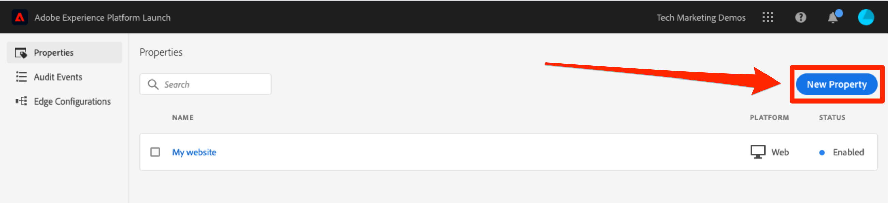

# Creación de una propiedad de etiqueta

En esta lección, debe crear su primera propiedad de etiqueta.

Una propiedad es básicamente un contenedor que se rellena con extensiones, reglas, elementos de datos y bibliotecas al implementar etiquetas en el sitio.

## Requisitos previos

Para completar las siguientes lecciones, debe tener permiso para desarrollar, aprobar, Publish, gestionar extensiones y entornos en etiquetas. Si no puede completar estos pasos porque ninguna de las opciones de la interfaz de usuario está disponible, póngase en contacto con su administrador de Experience Cloud para solicitar el acceso. Para obtener más información sobre los permisos de usuario de etiquetas, consulte [la documentación](https://experienceleague.adobe.com/docs/experience-platform/tags/admin/user-permissions.html?lang=es).

>[!NOTE]
>
>Adobe Experience Platform Launch se está integrando en Adobe Experience Platform como un conjunto de tecnologías de recopilación de datos. Se han implementado varios cambios terminológicos en la interfaz que debe tener en cuenta al utilizar este contenido:
>
> * El platform launch (lado del cliente) ahora es **[[!DNL tags]](https://experienceleague.adobe.com/docs/experience-platform/tags/home.html?lang=es)**
> * El lado del servidor de platform launch ahora es **[[!DNL event forwarding]](https://experienceleague.adobe.com/docs/experience-platform/tags/event-forwarding/overview.html?lang=es)**
> * Ahora, las configuraciones de Edge son **[[!DNL datastreams]](https://experienceleague.adobe.com/docs/experience-platform/edge/fundamentals/datastreams.html?lang=es)**

## Objetivos de aprendizaje

Al final de esta lección, debe poder:

* Inicie sesión en la interfaz de usuario de recopilación de datos
* Crear una nueva propiedad de etiqueta
* Configuración de una propiedad de etiqueta

## Vaya a la interfaz de recopilación de datos.

**Para llegar a la recopilación de datos**

1. Inicie sesión en [Adobe Experience Cloud](https://experiencecloud.adobe.com).

1. Haga clic en el icono  para abrir el conmutador de aplicaciones

1. Seleccione **[!UICONTROL Launch/Recopilación de datos]** en el menú 

Ahora debería ver la pantalla de `Tags Properties` (si nunca se han creado propiedades en la cuenta, esta pantalla puede estar vacía):

## Crear una propiedad

Una propiedad es básicamente un contenedor que se rellena con extensiones, reglas, elementos de datos y bibliotecas al implementar etiquetas en el sitio. Una propiedad puede ser cualquier conjunto de uno o varios dominios y subdominios. Puede administrar y rastrear estos recursos de manera similar. Por ejemplo, supongamos que tiene varios sitios web basados en una plantilla y quiere rastrear los mismos recursos en todos. Puede aplicar una propiedad a varios dominios. Para obtener más información sobre la creación de propiedades, consulte [“Empresas y propiedades”](https://experienceleague.adobe.com/docs/experience-platform/tags/admin/companies-and-properties.html?lang=es) en la documentación del producto.

**Para crear una propiedad**

1. Haga clic en el botón **[!UICONTROL Nueva propiedad]**:

   

1. Asigne un nombre a la propiedad (por ejemplo `Luma Tutorial` o `Luma Tutorial - Daniel`)
1. Como dominio, introduzca `enablementadobe.com` porque es el dominio en el que se aloja el sitio de demostración de Luma. Aunque el campo &quot;Dominio&quot; es obligatorio, la propiedad de etiqueta funcionará en cualquier dominio en el que esté implementada. El principal propósito de este campo es que se puedan rellenar previamente las opciones de menú en el generador de reglas.
1. Expanda la sección **[!UICONTROL Opciones avanzadas]** y marque la casilla para **[!UICONTROL Ejecutar componentes de regla en secuencia]**
1. Haga clic en el botón **[!UICONTROL Guardar]**

   

La nueva propiedad se debe mostrar en la página de Propiedades. Tenga en cuenta que si marca la casilla junto al nombre de la propiedad, las opciones **[!UICONTROL Configurar]** o **[!UICONTROL Eliminar]** de la propiedad aparecerán encima de la lista de propiedades. Haga clic en el nombre de la propiedad (p. ej. `Luma Tutorial`) para abrir la pantalla `Overview`.

[Siguiente: &quot;Añadir el código incrustado&quot; >](add-embed-code.md)
