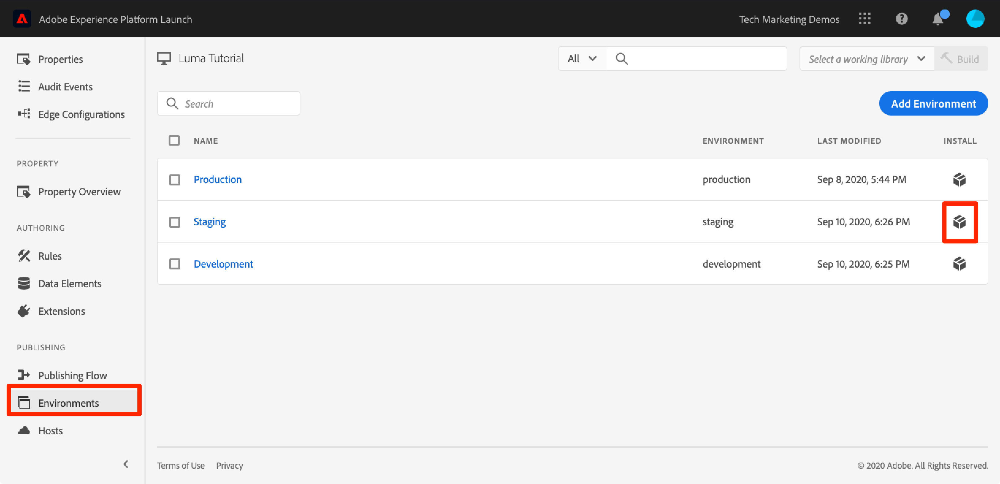
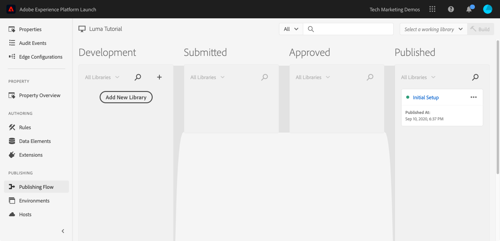

# Publish su propiedad de etiquetas

Después de haber implementado varias soluciones clave de Adobe Experience Cloud en su entorno de desarrollo, es hora de analizar el flujo de trabajo de publicación.

>[!NOTE]
>
>Adobe Experience Platform Launch se está integrando en Adobe Experience Platform como un conjunto de tecnologías de recopilación de datos. Se han implementado varios cambios terminológicos en la interfaz que debe tener en cuenta al utilizar este contenido:
>
> * El platform launch (lado del cliente) ahora es **[[!DNL tags]](https://experienceleague.adobe.com/docs/experience-platform/tags/home.html?lang=es)**
> * El lado del servidor de platform launch ahora es **[[!DNL event forwarding]](https://experienceleague.adobe.com/docs/experience-platform/tags/event-forwarding/overview.html)**
> * Ahora, las configuraciones de Edge son **[[!DNL datastreams]](https://experienceleague.adobe.com/docs/experience-platform/edge/fundamentals/datastreams.html?lang=es)**

## Objetivos de aprendizaje

Al final de esta lección, debe poder:

1. Publicar una biblioteca de desarrollo en el entorno de ensayo.
1. Asignar una biblioteca de ensayo al sitio web de producción utilizando Debugger.
1. Publicar una biblioteca de ensayo en el entorno de producción.

## Publicar en el entorno de ensayo.

Después de crear y validar la biblioteca en el entorno de desarrollo, es hora de publicarla en el entorno de ensayo.

1. Ir a la página **[!UICONTROL Flujo de publicación]**

1. Abra el menú desplegable situado junto a la biblioteca y seleccione **[!UICONTROL Enviar para aprobación]**

   

1. Haga clic en el botón **[!UICONTROL Enviar]** del cuadro de diálogo:

   

1. La biblioteca ahora aparece en la columna [!UICONTROL Enviado] en un estado sin compilar:

1. Abra el menú desplegable y seleccione **[!UICONTROL Generar para ensayo]**:

   

1. Una vez que aparece el icono del punto verde, la biblioteca se puede previsualizar en el entorno de ensayo.

En un escenario en tiempo real, el siguiente paso del proceso sería que el equipo de control de calidad validara los cambios en la biblioteca de ensayo. Pueden hacerlo usando Debugger.

**Para validar los cambios en la biblioteca de ensayo**

1. En su propiedad de etiquetas, abra la página [!UICONTROL Entornos]

1. En la fila [!UICONTROL Ensayo], haga clic en el  para abrir el modal.

   

1. Haga clic en el icono  para copiar el código de incrustación en el portapapeles.

1. Haga clic en **[!UICONTROL Cerrar]** para cerrar el modal

   

1. Abra [el sitio de ejemplo de Luma](https://luma.enablementadobe.com/content/luma/us/en.html) en el navegador Chrome.

1. Abra [Experience Platform Debugger](https://chromewebstore.google.com/detail/adobe-experience-platform/bfnnokhpnncpkdmbokanobigaccjkpob) haciendo clic en el icono 

   

1. Vaya a la pestaña Herramientas.

1. En la sección **[!UICONTROL Launch de Adobe > Reemplazar código de incrustación de Launch]**, pegue el código de incrustación de ensayo que se encuentra en el portapapeles.
1. Activar el conmutador **[!UICONTROL Aplicar en luma.enablementadobe.com]**

1. Haga clic en el icono de disco para guardar.

   

1. Vuelva a cargar y compruebe la pestaña Resumen de Debugger. En la sección de Launch, debería ver que la propiedad de ensayo está implementada y que se muestra su nombre de propiedad (por ejemplo, &quot;Tutorial de etiquetas&quot; o como haya llamado a su propiedad).

   

En realidad, una vez que el equipo de control de calidad ha cerrado sesión al revisar los cambios en el entorno de ensayo, es hora de publicar en producción.

## Publicación en producción

1. Vaya a la página [!UICONTROL Publicar].

1. En el menú desplegable, haga clic en **[!UICONTROL Aprobar para publicación]**:

   

1. Haga clic en el botón **[!UICONTROL Aprobar]** del cuadro de diálogo:

   

1. La biblioteca ahora aparece en la columna [!UICONTROL Aprobado] en el estado sin compilar (punto amarillo):

1. Abra el menú desplegable y seleccione **[!UICONTROL Generar y Publish en producción]**:

   

1. Haga clic en **[!UICONTROL Publish]** en el cuadro de diálogo:

   

1. La biblioteca ahora aparece en la columna [!UICONTROL Publicado]:

   

¡Ya está! ¡Ha completado el tutorial y ha publicado su primera propiedad en etiquetas!
