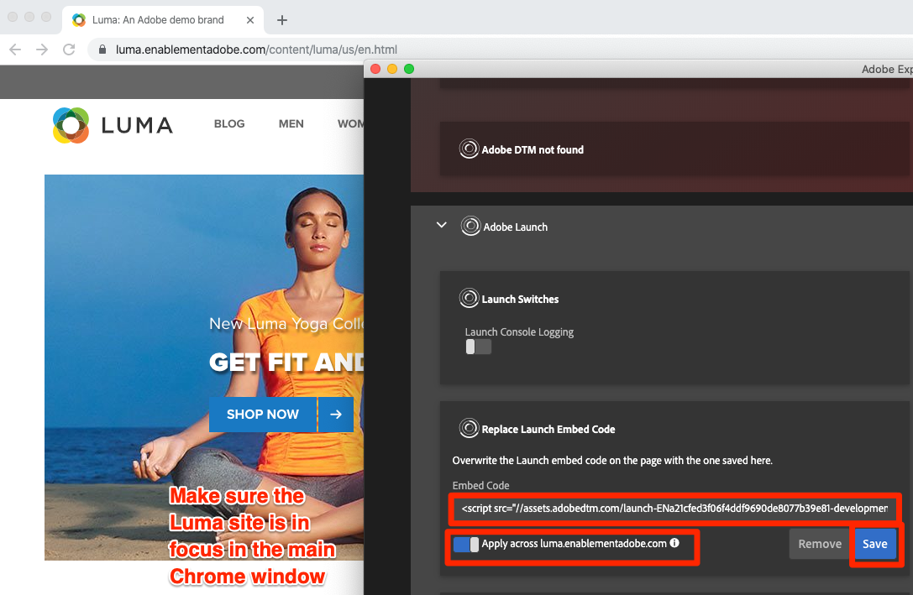

# Cambiar entornos de etiquetas con Experience Cloud Debugger

En esta lección, usará la [extensión de Adobe Experience Platform Debugger](https://chromewebstore.google.com/detail/adobe-experience-platform/bfnnokhpnncpkdmbokanobigaccjkpob) para reemplazar la propiedad de etiquetas codificada en el [sitio de demostración de Luma](https://luma.enablementadobe.com/content/luma/us/en.html) con su propia propiedad.

>[!WARNING]
>
> Este tutorial y sus ejercicios en el sitio web de Luma ya no se mantienen y dependen de bibliotecas de JavaScript más antiguas. Para conocer las prácticas recomendadas actuales, use el [tutorial Implementar Adobe Experience Cloud con Web SDK](https://experienceleague.adobe.com/es/docs/platform-learn/implement-web-sdk/overview).

Esta técnica se denomina cambio de entorno y será útil más adelante, cuando trabaje con etiquetas en su propio sitio web. Podrá cargar su sitio web de producción en su navegador, pero con su entorno de etiquetas *development*. Esto permite realizar y validar cambios de etiquetas con seguridad en de forma independiente de las revisiones de código normales.  Después de todo, esta separación de las versiones de etiquetas de marketing de las versiones de código normal es una de las principales razones por las que los clientes utilizan etiquetas.

## Objetivos de aprendizaje

Al final de esta lección, debe poder:

* Usar Debugger para cargar un entorno de etiquetas alternativo
* Use Debugger para validar que ha cargado un entorno de etiquetas alternativo

## Obtener la dirección URL del entorno de desarrollo.

1. En su propiedad de etiquetas, abra la página `Environments`

1. En la fila **[!UICONTROL Development]**, haga clic en el icono Instalar  para abrir el modal

1. Haga clic en el icono  para copiar el código incrustado en el portapapeles.

1. Haga clic en **[!UICONTROL Cerrar]** para cerrar el modal

   

## Reemplace la URL de la etiqueta en el sitio de demostración de Luma.

1. Abra [el sitio de ejemplo de Luma](https://luma.enablementadobe.com/content/luma/us/en.html) en el navegador Chrome.

1. Abra la [extensión de Experience Platform Debugger](https://chromewebstore.google.com/detail/adobe-experience-platform/bfnnokhpnncpkdmbokanobigaccjkpob) haciendo clic en el icono 

   

1. Tenga en cuenta que la propiedad de etiquetas implementada actualmente se muestra en la pestaña Resumen

   

1. Vaya a la pestaña Herramientas.
1. Desplácese a la sección **[!UICONTROL Reemplazar código de incrustación de Launch]**
1. Asegúrese de que la pestaña de Chrome con el sitio de Luma esté centrada detrás de Debugger (no la pestaña con este tutorial o con la interfaz de recopilación de datos).  Pegue el código incrustado que se encuentra en el portapapeles en el campo de entrada.
1. Active la función &quot;Aplicar en luma.enablementadobe.com&quot; para que todas las páginas del sitio de Luma se asignen a su propiedad de etiquetas
1. Haga clic en el botón **[!UICONTROL Guardar]**

   

1. Vuelva a cargar el sitio de Luma y marque la pestaña Resumen de Debugger. En la sección de Launch, debería ver que se está utilizando la propiedad Desarrollo (Development). Confirme que el nombre de la propiedad coincide con la suya y que el entorno es de “desarrollo”.

   

>[!NOTE]
>
>Debugger guarda esta configuración y reemplaza los códigos incrustados de etiqueta cada vez que vuelva al sitio de Luma. No afecta a otros sitios que visita en otras pestañas abiertas. Para evitar que Debugger reemplace el código incrustado, haga clic en el botón **[!UICONTROL Quitar]** situado junto al código incrustado en la pestaña Herramientas de Debugger.

A medida que continúe con el tutorial, utilizará esta técnica de asignación del sitio de Luma a su propia propiedad de etiquetas para validar la implementación de etiquetas. Cuando empiece a utilizar etiquetas en el sitio web de producción, puede utilizar esta misma técnica para validar los cambios.

[Siguiente: &quot;Añadir el servicio de identidad de Adobe Experience Platform&quot; >](id-service.md)
