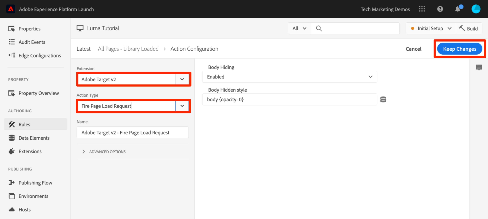
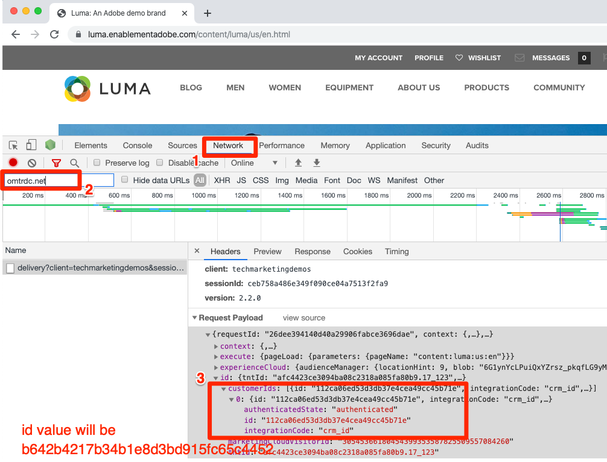

# Añadir Adobe Target

En esta lección, implementaremos la [extensión de Adobe Target](https://experienceleague.adobe.com/docs/experience-platform/tags/extensions/adobe/target/overview.html?lang=es) con una solicitud de carga de página y parámetros personalizados.

[Adobe Target](https://docs.adobe.com/content/help/es-ES/experience-cloud/user-guides/home.translate.html) es la solución de Adobe Experience Cloud que le proporciona todo lo necesario para adaptar y personalizar la experiencia de sus clientes con el fin de maximizar los ingresos de sus sitios web, aplicaciones, medios sociales y otros canales digitales, tanto para PC como para móviles.

>[!NOTE]
>
>Adobe Experience Platform Launch se está integrando en Adobe Experience Platform como un conjunto de tecnologías de recopilación de datos. Se han implementado varios cambios terminológicos en la interfaz que debe tener en cuenta al utilizar este contenido:
>
> * Platform Launch (lado del cliente) ahora es **[!DNL tags]**
> * Platform Launch Server Side ahora está **[!DNL event forwarding]**
> * Las configuraciones de Edge ahora son **[!DNL datastreams]**

## Objetivos de aprendizaje

Al final de esta lección, debe poder:

* Añada el fragmento preocultado utilizado para administrar el parpadeo al utilizar Target con los códigos incrustados de etiqueta asíncronos
* Añadir la extensión de Target v2.
* Activar la solicitud de carga de página (anteriormente denominada “mbox global”).
* Añadir parámetros a la solicitud de carga de página.
* Explicar cómo se pueden añadir parámetros de perfil y de entidad a la solicitud de carga de página.
* Activar la solicitud de confirmación de pedido con los parámetros necesarios.
* Explicar cómo añadir configuraciones avanzadas como código de Library Header (encabezado de biblioteca) y Library Footer (pie de página de biblioteca).
* Validar una implementación de Target.

## Requisitos previos

Para completar las lecciones de esta sección, primero debe completar las lecciones de [Configurar etiquetas](create-a-property.md) y [Agregar el servicio de identidad](id-service.md).

## Añadir el fragmento preocultado de Target

Antes de comenzar, debemos realizar una leve actualización de los códigos incrustados de etiqueta. Cuando los códigos incrustados de etiqueta se cargan de forma asíncrona, la página puede finalizar el renderizado antes de que la biblioteca de Target se cargue completamente y haya realizado su intercambio de contenido. Esto puede conllevar lo que se conoce como “parpadeo”, por el cual el contenido predeterminado aparece brevemente antes de ser reemplazado por el contenido personalizado especificado por Target. Si desea evitar este parpadeo, se recomienda codificar un fragmento preocultado especial inmediatamente antes de los códigos incrustados asincrónicos de las etiquetas.

Dicha práctica ya se ha llevado a cabo en el sitio de Luma, pero sigamos adelante para hacerlo en la página de muestra y que, así, entienda la implementación. Copie las siguientes líneas de código:

```html
<script>
   //prehiding snippet for Adobe Target with asynchronous tags deployment
   ;(function(win, doc, style, timeout) {
   var STYLE_ID = 'at-body-style';
   function getParent() {
      return doc.getElementsByTagName('head')[0];
   }
   function addStyle(parent, id, def) {
      if (!parent) {
      return;
      }
      var style = doc.createElement('style');
      style.id = id;
      style.innerHTML = def;
      parent.appendChild(style);
   }
   function removeStyle(parent, id) {
      if (!parent) {
      return;
      }
      var style = doc.getElementById(id);
      if (!style) {
      return;
      }
      parent.removeChild(style);
   }
   addStyle(getParent(), STYLE_ID, style);
   setTimeout(function() {
      removeStyle(getParent(), STYLE_ID);
   }, timeout);
   }(window, document, "body {opacity: 0 !important}", 3000));
</script>
```

Abra la página de muestra y péguela justo antes del código incrustado de etiqueta como se muestra a continuación (no se preocupe si los números de línea son diferentes). En esta captura de pantalla se ha minificado el fragmento de ocultamiento previo:


Vuelva a cargar la página de muestra. Notará que la página estará oculta durante tres segundos antes de que se muestre. Este comportamiento es temporal y desaparecerá después de haber implementado Target. Este comportamiento de preocultación se controla mediante dos configuraciones al final del fragmento, que se pueden personalizar, pero generalmente funcionan mejor al mantener la configuración predeterminada:

* `body {opacity: 0 !important}` especifica la definición de CSS que se utiliza para la preocultación hasta que se carga Target. De forma predeterminada, todo el cuerpo quedará oculto. Si tiene una estructura DOM coherente con un elemento contenedor fácil de identificar que incluya todo el contenido debajo de su navegación, por ejemplo, y no quiere tener que probar ni personalizar su navegación, puede utilizar este ajuste para limitar la preocultación a ese elemento contenedor.
* `3000` que especifica la configuración de tiempo de espera para la preocultación. De forma predeterminada, si Target no se ha cargado en tres segundos, se muestra la página. Esto suele ser improbable.

Para obtener más información y para obtener el fragmento de preocultación no reducido, consulte [la extensión de Adobe Target con una implementación asíncrona](https://experienceleague.adobe.com/docs/experience-platform/tags/extensions/adobe/target/overview.html?lang=es#adobe-target-extension-with-an-asynchronous-deployment).

## Añadir la extensión de Target

La extensión de Adobe Target es compatible con implementaciones del lado del cliente mediante la biblioteca JavaScript at.js de Target. Para implementaciones Web SDK de Adobe Target, consulte el [Tutorial de Experience Platform Web SDK](https://experienceleague.adobe.com/es/docs/platform-learn/implement-web-sdk/applications-setup/setup-target).

La extensión Target v2 consta de dos partes principales:

1. La configuración de la extensión, que administra la configuración de la biblioteca central
1. Acciones de reglas para hacer lo siguiente:
   1. Load Target (at.js 2.x)
   1. Añadir parámetros a las solicitudes de carga de página
   1. Añadir parámetros a todas las solicitudes
   1. Fire Page Load Request

En este primer ejercicio, añadiremos la extensión y veremos las configuraciones. En ejercicios posteriores usaremos las acciones.

**Para añadir la extensión**

1. Ir a **[!UICONTROL Extensiones > Catálogo]**
1. Escriba `target` en el filtro para localizar rápidamente las extensiones de Adobe Target. Hay dos extensiones: Adobe Target y Adobe Target v2. Este tutorial utilizará la versión 2 de la extensión que utiliza la última versión de at.js (actualmente 2.x), ideal tanto para sitios web tradicionales como para aplicaciones de una sola página (SPA).
1. Haga clic en **[!UICONTROL Instalar]**

   

1. Cuando agregue la extensión, importará muchas, pero no todas las configuraciones de at.js, de la interfaz de Target, como se muestra a continuación. La configuración del Timeout (tiempo de espera) no se importa, siempre se mantiene en 3000 ms después de añadir la extensión. Para el tutorial, mantenga la configuración predeterminada. Tenga en cuenta que en el lado izquierdo se mostrará la versión de at.js que se incluye con la versión actual de la extensión.

1. Haga clic en **[!UICONTROL Guardar en biblioteca]**

   

En este punto, Target aún no está haciendo nada, por lo que no hay nada que validar.

>[!NOTE]
>
>Cada versión de la extensión de Target viene con una versión específica de at.js que se muestra en la descripción de la extensión. Actualice la versión de at.js al actualizar la extensión de Target.

## Load Target y Activar la solicitud de carga de página

Los expertos en marketing utilizan Target para controlar la experiencia del visitante en la página al realizar pruebas y segmentar contenido. Debido a esta importante función en la presentación de la página, debe cargar Target lo antes posible para minimizar el impacto sobre la visibilidad de la página. En esta sección, se cargará la biblioteca JavaScript de Target, at.js, y se activará la solicitud de carga de página (denominada “mbox global” en versiones anteriores de at.js).

Puede utilizar la regla `All Pages - Library Loaded` que ha creado en la lección “[Añadir elementos de datos, reglas y bibliotecas](add-data-elements-rules.md)” para implementar Target porque ya se ha activado lo antes posible en las cargas de página.

**Para cargar Target**

1. Vaya a **[!UICONTROL Reglas]** en el panel de navegación izquierdo y luego haga clic en `All Pages - Library Loaded` para abrir el editor de reglas

   

1. En Acciones (Actions), haga clic en el  para añadir una acción nueva.

   

1. Seleccione **[!UICONTROL Extensión > Adobe Target v2]**

1. Seleccione **[!UICONTROL Tipo de acción > Cargar destino]**

1. Haga clic en **[!UICONTROL Conservar cambios]**

   

Con la acción `Load Target` añadida, at.js se cargará en la página. Sin embargo, ninguna solicitud de Target se activará hasta que se agregue la acción `Fire Page Load Request`.

**Para activar la solicitud de carga de página**

1. En Acciones, vuelva a hacer  para añadir otra acción

   

1. Seleccione **[!UICONTROL Extensión > Adobe Target v2]**

1. Seleccione **[!UICONTROL Tipo de acción > Fire Page Load Request]**

1. Hay varias configuraciones disponibles para la solicitud de carga de página relacionadas con ocultar o mostrar la página y el selector de CSS que se usan en la preocultación. Estos ajustes funcionan junto con el fragmento de preocultación codificado en la página. Conserve la configuración predeterminada.

1. Haga clic en **[!UICONTROL Conservar cambios]**

   

1. La nueva acción se agrega en secuencia después de la acción `Load Target` y las acciones se ejecutarán en este orden. Puede arrastrar y soltar las acciones para reorganizar el orden, pero en esta situación `Load Target` debe ir antes de `Fire Page Load Request`.

1. Haga clic en **[!UICONTROL Guardar en biblioteca y compilar]**

   

### Validar la solicitud de carga de página

Ahora que ha agregado la extensión Target v2 y ha activado las acciones `Load Target` y `Fire Page Load Request`, debe haber una solicitud de carga de página en todas las páginas donde se utilice la propiedad de etiqueta.

**Para validar las acciones Load Target y Fire Page Load Request**

1. Vuelva a cargar la página de muestra. Ya no debería ver un retraso de tres segundos antes de que la página sea visible. Si está cargando la página de muestra mediante el protocolo `file://`, debe realizar este paso en un navegador Firefox o Safari, ya que Chrome no activa una solicitud de Target al utilizar el protocolo `file://`.

1. Abra el [sitio de Luma](https://luma.enablementadobe.com/content/luma/us/en.html)

1. Asegúrese de que Debugger asigne la propiedad de etiqueta a *su entorno de desarrollo*, tal como se describe en la [lección anterior](switch-environments.md)

   

1. Vaya a la pestaña Resumen de Debugger

1. En la sección `Launch`, confirme que `Target` aparece en el encabezado `Extensions`.

1. En la sección `Target`, confirme que aparece la versión de la biblioteca at.js.

   .

1. Finalmente, vaya a la pestaña `Target`, expanda el código de cliente y confirme que aparece la solicitud de carga de página:

   .

¡Felicidades! ¡Ha implementado Target!

## Añadir parámetros

Al pasar parámetros en la solicitud de Target, se añaden potentes funciones a las actividades de segmentación, prueba y personalización. La extensión de etiqueta de proporciona dos acciones para pasar parámetros:

1. `Add Params to Page Load Request`, que agrega parámetros a las solicitudes de carga de página (equivalente al método [targetPageParams()](https://experienceleague.adobe.com/docs/target/using/implement-target/client-side/functions-overview/cmp-atjs-functions.html?lang=es)).

1. `Add Params to All Requests`, que agrega parámetros en todas las solicitudes de Target, por ejemplo: la solicitud de carga de página más las solicitudes adicionales realizadas a partir de acciones de código personalizado o codificadas en el sitio (equivalente al método [targetPageParamsAll()](https://experienceleague.adobe.com/docs/target/using/implement-target/client-side/functions-overview/cmp-atjs-functions.html?lang=es)).

Estas acciones se pueden utilizar *antes* de la acción `Load Target` y pueden configurar distintos parámetros en páginas diferentes según las configuraciones de reglas. Utilice la función de orden de reglas que utilizó al configurar los ID de cliente con el servicio de identidad para establecer parámetros adicionales en el evento `Library Loaded` antes de que la regla active la solicitud de carga de página.
>[!TIP]
>
>Dado que la mayoría de las implementaciones utiliza la solicitud de carga de página para la entrega de actividades, normalmente es suficiente para usar la acción `Add Params to Page Load Requests`.

### Parámetros de solicitud (mbox)

Los parámetros se utilizan para pasar datos personalizados a Target, lo que enriquece las capacidades de personalización. Son ideales para atributos que cambian con frecuencia durante una sesión de navegación, como el nombre de la página, la plantilla, etc. y no persisten.

Añadamos el elemento de datos `Page Name` que hemos creado anteriormente en la lección [Añadir elementos de datos, reglas y bibliotecas](add-data-elements-rules.md) como parámetro de solicitud.

**Para añadir el parámetro de solicitud**

1. Vaya a **[!UICONTROL Reglas]** en el panel de navegación izquierdo y luego haga clic en `All Pages - Library Loaded` para abrir el editor de reglas.

   

1. En Acciones (Actions), haga clic en el  para añadir una acción nueva.

   

1. Seleccione **[!UICONTROL Extensión > Adobe Target v2]**

1. Seleccione **[!UICONTROL Tipo de acción > Agregar parámetros a la solicitud de carga de página]**

1. Escriba `pageName` como **[!UICONTROL Nombre]**

1. Haga clic en el  para abrir el modal del elemento de datos.

1. Haga clic en el elemento de datos `Page Name`.

1. Haga clic en el botón **[!UICONTROL Seleccionar]**

   

1. Haga clic en **[!UICONTROL Conservar cambios]**

   

1. Haga clic y arrastre en el borde izquierdo de la acción `Add Params to Page Load Request` para reorganizar las acciones que tiene antes de la acción `Fire Page Load Request` (puede ser antes o después de `Load Target`).

1. Haga clic en **[!UICONTROL Guardar en biblioteca y compilar]**

   

#### Validar parámetros de solicitud

Por el momento, los parámetros personalizados que se pasan con solicitudes at.js 2.x no son fácilmente visibles en Debugger, por lo que utilizaremos las herramientas para desarrolladores del navegador.

**Para validar el parámetro de solicitud nombre de página (pageName)**

1. Vuelva a cargar el sitio de Luma, asegurándose de que esté asignado a su propia propiedad de etiquetas
1. Abra las herramientas para desarrolladores del navegador
1. Haga clic en la pestaña Network
1. Filtre las solicitudes a `tt.omtrdc` (o su dominio CNAME para solicitudes de Target)
1. Expanda la sección `Headers` > `Request Payload` > `execute.pageLoad.parameters` para validar el parámetro `pageName` y su valor


<!--Now go to the **[!UICONTROL Target]** tab in the Debugger. Expand your client code and look at the requests. You should see the new `pageName` parameter passed in the request:

-->

### Parámetros de perfil

De forma similar a los parámetros de solicitud, los parámetros de perfil se transmiten a través de la solicitud de Target. Sin embargo, los parámetros de perfil se almacenan en la base de datos de perfiles de visitante de Target y se conservan durante la [duración del perfil del visitante](https://experienceleague.adobe.com/docs/target/using/audiences/visitor-profiles/visitor-profile-lifetime.html?lang=es). Puede configurarlos en una página del sitio y usarlos en las actividades de Target en otra página. Este es un ejemplo de un sitio web de automóviles. Cuando un visitante llega a una página de vehículos, puede pasar un perfil de parámetro “profile.lastViewed=sportscar” para registrar su interés en un automóvil en particular. Cuando el visitante navega a otras páginas que no sean de vehículos, puede segmentar el contenido según el último vehículo visitado.  Los parámetros de perfil son ideales para atributos que cambian con poca frecuencia o que solo están disponibles en determinadas páginas

En este tutorial no se transmite ningún parámetro de perfil, pero el flujo de trabajo es casi idéntico al que realizó al transmitir el parámetro `pageName`. La diferencia es que debe dar a los parámetros de perfil un prefijo `profile.`. Este es el aspecto que tendría un parámetro de perfil denominado “userType” en la acción `Add Params to Page Load Request`:


### Parámetros de entidad

Los parámetros de entidad son parámetros especiales que se utilizan en las [implementaciones de Recommendations](https://experienceleague.adobe.com/docs/target/using/recommendations/plan-implement.html?lang=es) por tres motivos principales:

1. Como clave para activar recomendaciones de productos. Por ejemplo, al utilizar un algoritmo de recomendaciones como “Otras personas que vieron el producto X también vieron Y”, “X” es la “clave” de la recomendación. Normalmente es el SKU del producto (`entity.id`) o la categoría (`entity.categoryId`) que el visitante está viendo actualmente.
1. Para recopilar el comportamiento de los visitantes con el fin de potenciar los algoritmos de recomendaciones, como “Productos vistos recientemente” o “Productos más vistos”.
1. Para rellenar el catálogo de Recommendations. Recommendations contiene una base de datos de todos los productos o artículos del sitio web, de modo que se puedan proporcionar en la oferta recomendada. Por ejemplo, al recomendar productos, normalmente desea mostrar atributos como el nombre del producto (`entity.name`) o una imagen (`entity.thumbnailUrl`). Algunos clientes rellenan su catálogo utilizando fuentes de backend, pero también se pueden rellenar usando parámetros de entidad en solicitudes de Target.

No es necesario pasar ningún parámetro de entidad en este tutorial, pero el flujo de trabajo es idéntico al que realizó anteriormente al pasar el parámetro de solicitud `pageName`; simplemente asigne un nombre al parámetro con el prefijo &quot;entity&quot;. y asignarlo al elemento de datos pertinente. Tenga en cuenta que algunas entidades comunes tienen nombres reservados que deben utilizarse (por ejemplo, “entity.id” para el código de artículo del producto o SKU). Este es el aspecto que tendría al establecer los parámetros de entidad en la acción `Add Params to Page Load Request`:


### Añadir parámetros de ID de cliente

La recopilación de ID de cliente con el servicio de identidad de Adobe Experience Platform Cloud facilita la importación de datos CRM en Target mediante la función [Atributos del cliente](https://experienceleague.adobe.com/docs/target/using/audiences/visitor-profiles/working-with-customer-attributes.html?lang=es) de Adobe Experience Cloud. También activa la [vinculación de visitantes entre dispositivos](https://experienceleague.adobe.com/docs/target/using/integrate/experience-cloud-device-co-op.html?lang=es), lo que permite mantener una experiencia de usuario uniforme a medida que sus clientes cambian entre portátiles y dispositivos móviles.

Es imperativo configurar el ID de cliente en la acción `Set Customer IDs` del servicio de identidad antes de activar la solicitud de carga de página. Para ello, asegúrese de disponer de las siguientes capacidades en su sitio:

* El ID de cliente debe estar disponible en la página antes del código incrustado de etiquetas
* Se debe instalar la extensión del servicio de identidad de Adobe Experience Platform.
* Debe utilizar la acción `Set Customer IDs` en una regla que se active con el evento “Biblioteca cargada (Principio de la página)”.
* Utilice la acción `Fire Page Load Request` en una regla que se active *después* de la acción “Set Customer ID” (establecer ID de cliente).

En la lección anterior, [Añadir el servicio de identidad de Adobe Experience Platform](id-service.md), ha creado la regla `All Pages - Library Loaded - Authenticated - 10` para activar la acción “Set Customer ID” (establecer ID de cliente). Debido a que esta regla tiene una configuración `Order` de `10`, los ID de cliente se establecen antes de que nuestra solicitud de carga de página se active desde la regla `All Pages - Library Loaded` con su configuración `Order` de `50`. Por lo tanto, ¡ya ha implementado la recopilación de ID de cliente para Target!

#### Validación del ID de cliente

Por el momento, los parámetros personalizados que se pasan con solicitudes at.js 2.x no son fácilmente visibles en Debugger, por lo que utilizaremos las herramientas para desarrolladores del navegador.

**Para validar el ID de cliente**

1. Abra el [sitio de Luma](https://luma.enablementadobe.com/content/luma/us/en.html)

1. Asegúrese de que Debugger asigne la propiedad de etiqueta a *su entorno de desarrollo*, tal como se describe en la [lección anterior](switch-environments.md)

   

1. Inicie sesión en el sitio de Luma con las credenciales `test@test.com`/`test`
1. Vuelva a la [página principal de Luma](https://luma.enablementadobe.com/content/luma/us/en.html)

1. Abra las herramientas para desarrolladores del navegador
1. Haga clic en la pestaña Network
1. Filtre las solicitudes a `tt.omtrdc` (o su dominio CNAME para solicitudes de Target)
1. Expanda la sección `Headers` > `Request Payload` > `id.customerIds.0` para validar la configuración del ID de cliente y su valor:



<!--
1. Open the Debugger
1. Go to the Target tab
1. Expand your client code
1. You should see parameters in the latest Target request for `vst.crm_id.id` and `vst.crm_id.authState`. `vst.crm_id.id` should have a value of the hashed email address and `vst.crm_id.authState` should have a value of `1` to represent `authenticated`. Note that `crm_id` is the `Integration Code` you specified in the Identity Service configuration and must align with the key you use in your [Customer Attributes data file](https://experienceleague.adobe.com/docs/core-services/interface/customer-attributes/t-crs-usecase.html?lang=es):


-->

>[!WARNING]
>
>El servicio de identidad de Adobe Experience Platform le permitirá enviar varios ID al servicio. Sin embargo, solo el primero se enviará a Target.

### Añadir el parámetro de token de propiedad

>[!NOTE]
>
>Es un ejercicio opcional para los clientes de Target Premium.

El token de propiedad es un parámetro reservado que se utiliza con la función [Permisos de usuario de Enterprise](https://experienceleague.adobe.com/docs/target/using/administer/manage-users/enterprise/property-channel.html?lang=es) de Target Premium. Se utiliza para definir distintas propiedades digitales, de modo que a los miembros de una organización de Experience Cloud se les puedan asignar permisos diferentes para cada propiedad. Por ejemplo, es posible que desee que un grupo de usuarios pueda configurar actividades de Target en el sitio web, pero no en la aplicación móvil.

Las propiedades de Target son análogas a las propiedades de etiquetas y a los grupos de informes de Analytics. Una empresa con varias marcas, sitios web y equipos de marketing puede utilizar una propiedad de Target, una propiedad de etiquetas y un grupo de informes de Analytics diferentes para cada sitio web o aplicación móvil. Las propiedades de etiquetas se diferencian por sus códigos incrustados, los grupos de informes de Analytics se diferencian por su ID de grupo de informes y las propiedades de Target se diferencian por su parámetro de token de propiedad.


El token de propiedad debe implementarse mediante una acción de código personalizado en las etiquetas con la función `targetPageParams()`. Si va a implementar varios sitios con diferentes valores at_property diferentes con una sola propiedad de etiqueta, puede administrar el valor at_property a través de un elemento de datos.

Este es un ejercicio opcional si es usuario de Target Premium y desea implementar un token de propiedad en su propiedad Tutorial:

1. En una pestaña independiente, abra la interfaz de usuario de Target.

1. Vaya a **[!UICONTROL Administración > Propiedades]**

1. Identifique la propiedad que desee usar y haga clic en **[!UICONTROL &lt;/>]** (o cree una nueva propiedad)

1. Copie el fragmento de código dentro de `<script></script>` en el portapapeles

   

1. En la pestaña de etiquetas, ve a **[!UICONTROL Reglas]** en el panel de navegación izquierdo y luego haz clic en `All Pages - Library Loaded` para abrir el editor de reglas.

   

1. En Acciones (Actions), haga clic en la acción `Core - Custom Code` para abrir `Action Configuration`

   

1. Abra el editor de código y pegue el código de la interfaz de Target que contiene la función `targetPageParams()`
1. Haga clic en el botón **[!UICONTROL Guardar]**

   

1. Marque la casilla **[!UICONTROL Ejecutar globalmente]** para que `targetPageParams()` se declare en el ámbito global
1. Haga clic en **[!UICONTROL Conservar cambios]**

   

1. Haga clic en **[!UICONTROL Guardar en biblioteca y compilar]**
   

>[!WARNING]
>
>Si intenta agregar el parámetro `at_property` mediante la acción **[!UICONTROL Agregar parámetros a la solicitud de carga de página]**, el parámetro se rellenará en la solicitud de red, pero el Compositor de experiencias visuales (VEC) de Target no podrá detectarlo automáticamente al cargar la página. Rellene siempre `at_property` con la función `targetPageParams()` en una acción de Custom Code.

#### Validación del token de propiedad

Por el momento, los parámetros personalizados que se pasan con solicitudes at.js 2.x no son fácilmente visibles en Debugger, por lo que utilizaremos las herramientas para desarrolladores del navegador.

**Para validar el parámetro del token de propiedad**

1. Abra el [sitio de Luma](https://luma.enablementadobe.com/content/luma/us/en.html)
1. Asegúrese de que Debugger asigne la propiedad de etiqueta a *su entorno de desarrollo*, tal como se describe en la [lección anterior](switch-environments.md)

   

1. Abra las herramientas para desarrolladores del navegador
1. Haga clic en la pestaña Network
1. Filtre las solicitudes a `tt.omtrdc` (o su dominio CNAME para solicitudes de Target)
1. Expanda la sección `Headers` > `Request Payload` > `property.token` para validar el valor
   

<!--
1. Go to the `Target` tab
1. Expand your client code
1. You should see the parameter for "at_property" in every page load request request as you browse the site:

-->

## Añadir solicitudes personalizadas

### Añadir una solicitud de confirmación de pedido

La solicitud de confirmación de pedido es un tipo especial de solicitud que se utiliza para enviar los detalles del pedido a Target. La inclusión de tres parámetros de solicitud específicos (orderId, orderTotal y productPurchasedId) es lo que convierte una solicitud de Target normal en una solicitud de pedido. Además de informar sobre los ingresos, la solicitud de pedidos también hace lo siguiente:

1. Anula la duplicación de envíos de pedidos accidentales
1. Filtra pedidos extremos (cualquier pedido cuyo total tenga más de tres desviaciones estándar de la media)
1. Utiliza un algoritmo diferente entre bastidores para calcular la confianza estadística
1. Crea un informe de auditoría especial descargable de detalles de pedidos individuales

Se recomienda utilizar una solicitud de confirmación de pedido en todos los canales de pedidos, incluso en sitios que no sean de minoristas. Por ejemplo, los sitios de generación de posibles clientes suelen tener canales de posibles clientes con un “ID de posible cliente” único generado al final. Estos sitios deben implementar una solicitud de pedido con un valor estático (como “1”) para orderTotal.

Es posible que los clientes que utilizan la integración de Analytics para Target (A4T) en la mayoría de sus informes también deseen implementar la solicitud de pedido si utilizan actividades de Automated Personalization que no admiten A4T. Además, la solicitud de pedido es un elemento fundamental de las implementaciones de Recommendations, lo que permite utilizar algoritmos basados en el comportamiento de compra. Para obtener la información más reciente sobre la compatibilidad con A4T, consulte [la documentación](https://experienceleague.adobe.com/docs/target/using/integrate/a4t/a4t.html?lang=es#section_F487896214BF4803AF78C552EF1669AA).

La solicitud de confirmación de pedido se debe activar a partir de una regla que solo se active en su página o evento de confirmación de pedido. A menudo, se puede combinar con una regla que establezca el evento de compra de Adobe Analytics. Debe configurarse mediante la acción Código personalizado de la extensión principal, utilizando los elementos de datos adecuados para configurar los parámetros de orderId, orderTotal y productPurchasedId.

Añadamos los elementos de datos y la regla que necesitamos para activar una solicitud de confirmación de pedido en el sitio de Luma. Dado que ya ha creado varios elementos de datos, estas instrucciones aparecen abreviadas.

**Para crear un elemento de datos para el ID de pedido**

1. Haga clic en **[!UICONTROL Elementos de datos]** en el panel de navegación izquierdo
1. Haga clic en **[!UICONTROL Agregar elemento de datos]**
1. Asigne un nombre al elemento de datos `Order Id`.
1. Seleccione **[!UICONTROL Tipo de elemento de datos > Variable JavaScript]**
1. Utilice `digitalData.cart.orderId` como `JavaScript variable name`.
1. Marque la opción `Clean text`
1. Haga clic en **[!UICONTROL Guardar en biblioteca]**
(No crearemos la biblioteca hasta que hayamos realizado todos los cambios para la solicitud de confirmación de pedido)

**Para crear el elemento de datos para la cantidad del carro de compras**

1. Haga clic en **[!UICONTROL Agregar elemento de datos]**
1. Asigne un nombre al elemento de datos `Cart Amount`.
1. Seleccione **[!UICONTROL Tipo de elemento de datos > Variable JavaScript]**
1. Utilice `digitalData.cart.cartAmount` como `JavaScript variable name`.
1. Marque la opción `Clean text`
1. Haga clic en **[!UICONTROL Guardar en biblioteca]**

**Para crear un elemento de datos para el código de artículo del carro de compras (Target)**

1. Haga clic en **[!UICONTROL Agregar elemento de datos]**
1. Asigne un nombre al elemento de datos `Cart SKUs (Target)`.
1. Seleccione **[!UICONTROL Tipo de elemento de datos > Código personalizado]**
1. Para Target, los códigos de artículo deben aparecer en una lista separada por comas. Este código personalizado redistribuye la capa de datos con el formato adecuado. En el editor de código personalizado, pegue lo siguiente:

   ```javascript
   var targetProdSkus="";
   for (var i=0; i<digitalData.cart.cartEntries.length; i++) {
     if(i>0) {
       targetProdSkus = targetProdSkus + ",";
     }
     targetProdSkus = targetProdSkus + digitalData.cart.cartEntries[i].sku;
   }
   return targetProdSkus;
   ```

1. Marque la opción `Force lowercase value`.
1. Marque la opción `Clean text`
1. Haga clic en **[!UICONTROL Guardar en biblioteca]**

Ahora necesitamos crear una regla para activar la solicitud de confirmación de pedido con estos elementos de datos como parámetros en la página de confirmación de pedido.

**Para crear la regla para la página de confirmación de pedido**

1. Haga clic en **[!UICONTROL Reglas]** en el panel de navegación izquierdo
1. Haga clic en **[!UICONTROL Agregar regla]**
1. Asigne un nombre a la regla `Order Confirmation Page - Library Loaded - 60`.
1. Haga clic en **[!UICONTROL Eventos > Agregar]**
   1. Seleccione **[!UICONTROL Tipo de evento > Biblioteca cargada (Principio de página)]**
   1. En **[!UICONTROL Opciones avanzadas]**, cambie `Order` a `60` para que se active después de la acción `Load Target` (que se encuentra en nuestra regla `All Pages - Library Loaded` donde `Order` está establecido en `50`)
   1. Haga clic en **[!UICONTROL Conservar cambios]**
1. Haga clic en **[!UICONTROL Condiciones > Agregar]**
   1. Seleccione **[!UICONTROL Tipo de condición > Ruta sin cadena de consulta]**
   1. Para `Path equals`, use `thank-you.html`
   1. Alterne la opción Regex para cambiar la lógica de `equals` a `contains` (puede utilizar la función `Test` para confirmar que la prueba pasará con la dirección URL `https://luma.enablementadobe.com/content/luma/us/en/user/checkout/order/thank-you.html`)

      

   1. Haga clic en **[!UICONTROL Conservar cambios]**
1. Haga clic en **[!UICONTROL Acciones > Agregar]**
   1. Seleccione **[!UICONTROL Tipo de acción > Código personalizado]**
   1. Haga clic en **[!UICONTROL Abrir editor]**
   1. Pegue el siguiente código en el modal `Edit Code`

      ```javascript
      adobe.target.getOffer({
        "mbox": "orderConfirmPage",
        "params":{
           "orderId": _satellite.getVar('Order Id'),
           "orderTotal": _satellite.getVar('Cart Amount'),
          "productPurchasedId": _satellite.getVar('Cart SKUs (Target)')
        },
        "success": function(offer) {
          adobe.target.applyOffer({
            "mbox": "orderConfirmPage",
            "offer": offer
          });
        },
        "error": function(status, error) {
          console.log('Error', status, error);
        }
      });
      ```

   1. Haga clic en **[!UICONTROL Guardar]** para guardar el código personalizado
   1. Haga clic en **[!UICONTROL Conservar cambios]** para conservar la acción
1. Haga clic en **[!UICONTROL Guardar en biblioteca y compilar]**

#### Validación de la solicitud de confirmación de pedido

Por el momento, los parámetros personalizados que se pasan con solicitudes at.js 2.x no son fácilmente visibles en Debugger, por lo que utilizaremos las herramientas para desarrolladores del navegador.

1. Abra el [sitio de Luma](https://luma.enablementadobe.com/content/luma/us/en.html)

1. Asegúrese de que Debugger asigne la propiedad de etiqueta a *su entorno de desarrollo*, tal como se describe en la [lección anterior](switch-environments.md)

   

1. Examine el sitio y añada varios productos al carro de compras
1. Continúe con el cierre de compra
1. Durante el proceso de cierre de compra, los únicos campos obligatorios son `First Name` y `Last Name`

   

1. En la página Revisar pedido, asegúrese de hacer clic en el botón `Place Order`
1. Abra las herramientas para desarrolladores del navegador
1. Haga clic en la pestaña Network
1. Filtre las solicitudes a `tt.omtrdc` (o su dominio CNAME para solicitudes de Target)
1. Haga clic en la segunda solicitud
1. Expanda la sección `Headers` > `Request Payload` > `execute.mboxes.0` para validar el nombre de la solicitud y los parámetros de pedido:


<!--
1. Look in the Debugger
1. Go to the Target tab
1. Expand your client code
1. You should see the `orderConfirmPage` request as the latest Target request with the orderId, orderTotal, and productPurchasedId parameters populated with the details of your order

   link to "orderConfirmPage request with required parameters": images/target-debugger-orderConfirmPage.png 
-->

### Solicitudes personalizadas

Existen casos excepcionales en los que necesita realizar solicitudes de Target distintas de la carga de la página y de la solicitud de confirmación de pedido. Por ejemplo, a veces los datos importantes que desea utilizar para la personalización no están definidos en la página antes de los códigos de incrustación de etiquetas; puede que estén codificados en la parte inferior de la página o que se devuelvan desde una solicitud de API asincrónica. Estos datos se pueden enviar a Target mediante una solicitud adicional, aunque no es la mejor opción utilizar esta solicitud para enviar contenido, puesto que la página ya está visible. Estos datos se pueden utilizar para enriquecer el perfil del visitante para utilizarlo posteriormente (mediante parámetros de perfil) o para rellenar el catálogo de Recommendations.

En estas circunstancias, utilice la acción Código personalizado de la extensión principal para activar una solicitud mediante los métodos [getOffer()](https://experienceleague.adobe.com/docs/target-dev/developer/client-side/at-js-implementation/functions-overview/adobe-target-getoffer.html?lang=es)/[applyOffer()](https://experienceleague.adobe.com/docs/target-dev/developer/client-side/at-js-implementation/functions-overview/adobe-target-applyoffer.html?lang=es) y [trackEvent()](https://experienceleague.adobe.com/docs/target-dev/developer/client-side/at-js-implementation/functions-overview/adobe-target-trackevent.html?lang=es). Esto es muy similar a lo que hizo en el ejercicio [Solicitud de confirmación de pedido](#order-confirmation-request), pero utilizará un nombre de solicitud diferente y no usará los parámetros especiales de pedido. Asegúrese de usar la acción **[!UICONTROL Cargar destino]** antes de realizar solicitudes de destino desde el código personalizado.

## Encabezado de biblioteca y pie de página de biblioteca

La pantalla Edit at.js de la interfaz de usuario de Target tiene ubicaciones en las que puede pegar JavaScript personalizado que se ejecuta inmediatamente antes o después del archivo at.js. El Library Header (encabezado de la biblioteca) se utiliza a veces para anular la configuración de at.js a través de la función [targetGlobalSettings()](https://experienceleague.adobe.com/docs/target/using/implement-target/client-side/functions-overview/targetgobalsettings.html?lang=es) o transmitir datos de terceros a través de la función [Data Providers](https://experienceleague.adobe.com/docs/target-learn/tutorials/integrations/use-data-providers-to-integrate-third-party-data.html?lang=es). El Library Footer (pie de página de la biblioteca) se utiliza a veces para agregar oyentes de [eventos personalizados de at.js](https://experienceleague.adobe.com/docs/target-dev/developer/client-side/at-js-implementation/functions-overview/atjs-custom-events.html?lang=es).

Para replicar esta capacidad en etiquetas, utilice la acción Código personalizado de la extensión principal y secuencie la acción antes (Library Header) o después (Library Footer) de la acción Load Target. Esto se puede hacer en la misma regla que la acción `Load Target` (según se muestra a continuación) o en reglas independientes con eventos o configuraciones de pedidos que se activan de forma fiable antes o después de la regla que contiene `Load Target`:


Para obtener más información sobre los ejemplos de uso de los encabezados y pies de página personalizados, consulte los siguientes recursos:

* [Utilice dataProviders para integrar datos de terceros en Adobe Target](https://experienceleague.adobe.com/docs/target-learn/tutorials/integrations/use-data-providers-to-integrate-third-party-data.html?lang=es)
* [Implemente dataProviders para integrar datos de terceros en Adobe Target](https://experienceleague.adobe.com/docs/target-learn/tutorials/integrations/implement-data-providers-to-integrate-third-party-data.html?lang=es)
* [Use tokens de respuesta y eventos personalizados de at.js con Adobe Target](https://experienceleague.adobe.com/docs/target-learn/tutorials/integrations/use-response-tokens-and-atjs-custom-events.html?lang=es)

[Siguiente: &quot;Añadir Adobe Analytics&quot; >](analytics.md)
